# 用 Python 构建逻辑回归

> 原文：<https://towardsdatascience.com/building-a-logistic-regression-in-python-301d27367c24?source=collection_archive---------1----------------------->

假设你得到了不同申请人的两次考试的分数，目标是根据分数将申请人分为两类，即如果申请人可以被大学录取，则分为 1 类；如果申请人不能被大学录取，则分为 0 类。这个问题可以用线性回归解决吗？让我们检查一下。

**注意:**我建议你在继续写这篇博客之前，先阅读一下[线性回归](/linear-regression-using-python-b136c91bf0a2)。

## 目录

*   什么是逻辑回归？
*   数据集可视化
*   假设和成本函数
*   从头开始训练模型
*   模型评估
*   Scikit-learn 实现

## **什么是逻辑回归？**

如果你记得线性回归，它是用来确定一个连续因变量的值。逻辑回归通常用于分类目的。与线性回归不同，因变量只能取有限数量的值，即因变量是**分类的**。当可能的结果只有两个时，称为二元逻辑回归**。**

让我们看看逻辑回归是如何用于分类任务的。

在线性回归中，输出是输入的加权和。逻辑回归是一种广义线性回归，因为我们不直接输出输入的加权和，而是通过一个可以映射 0 到 1 之间任何实数值的函数来传递。

> **如果我们像线性回归一样将输入的加权和作为输出，则该值可能大于 1，但我们希望该值介于 0 和 1 之间。这就是为什么线性回归不能用于分类任务**的原因。

从下图中我们可以看到，线性回归的输出通过一个**激活**函数传递，该函数可以映射 0 和 1 之间的任何实数值。

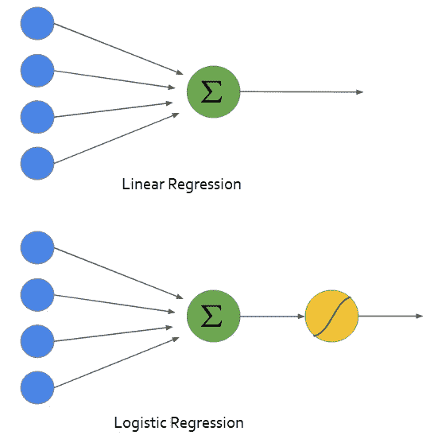

所使用的激活功能被称为**s 形**功能。sigmoid 函数的图形如下所示

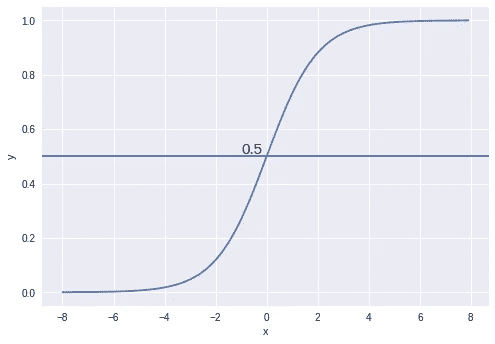

sigmoid function

我们可以看到，sigmoid 函数的值总是位于 0 和 1 之间。X=0 时，该值正好为 0.5。我们可以使用 0.5 作为概率阈值来确定类别。如果概率大于 0.5，我们将其归类为 **Class-1(Y=1)** 或者 **Class-0(Y=0)** 。

在我们建立模型之前，让我们看看逻辑回归的假设

*   因变量必须是分类变量
*   独立变量(特征)必须是独立的(以避免多重共线性)。

## 资料组

这篇博客中使用的数据取自吴恩达在 Coursera 上的[机器学习](https://www.coursera.org/learn/machine-learning)课程。数据可以从[这里](https://github.com/animesh-agarwal/Machine-Learning/blob/master/LogisticRegression/data/marks.txt)下载。数据由 100 名申请者的两次考试成绩组成。目标值采用二进制值 1，0。1 表示申请人被大学录取，而 0 表示申请人没有被录取。目标是建立一个分类器，可以预测申请是否会被大学录取。

让我们使用`read_csv`函数将数据加载到`pandas`数据帧中。我们还将把数据分成`admitted`和`non-admitted`来可视化数据。

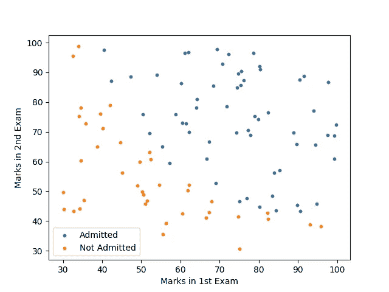

既然我们对问题和数据有了清晰的理解，让我们继续构建我们的模型。

## 假设和成本函数

到目前为止，我们已经了解了如何使用逻辑回归将实例分类到不同的类别中。在这一节中，我们将定义假设和成本函数。

线性回归模型可以用下面的等式来表示。

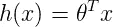

然后，我们将 sigmoid 函数应用于线性回归的输出

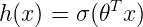

其中 sigmoid 函数由下式表示:

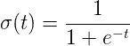

逻辑回归的假设就变成了，

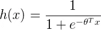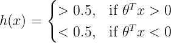

如果输入的加权和大于零，则预测类为 1，反之亦然。因此，通过将输入的加权和设置为 0，可以找到分隔两个类的决策边界。

## **成本函数**

像线性回归一样，我们将为我们的模型定义一个成本函数，目标是最小化成本。

单个训练示例的成本函数可以由下式给出:

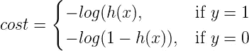

**成本函数直觉**

如果实际类是 1，而模型预测是 0，我们应该高度惩罚它，反之亦然。从下图中可以看出，对于图`-log(h(x))`来说，当 h(x)接近 1 时，成本为 0，当 h(x)接近 0 时，成本为无穷大(也就是说，我们对模型的惩罚很重)。类似地，对于图`-log(1-h(x))`，当实际值为 0 并且模型预测为 0 时，成本为 0，并且随着 h(x)接近 1，成本变得无穷大。

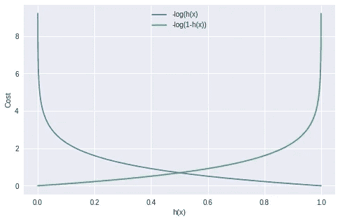

我们可以将这两个方程结合起来使用:

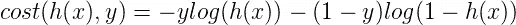

由 *J(θ)* 表示的所有训练样本的成本可以通过对所有训练样本的成本取平均值来计算


其中 ***m*** 为训练样本数。

我们将使用梯度下降来最小化成本函数。任何参数的梯度可由下式给出

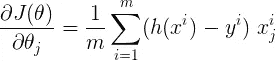

该方程类似于我们在线性回归中得到的结果，只有 h(x)在两种情况下是不同的。

## 训练模型

现在我们已经准备好了构建模型所需的一切。让我们用代码实现它。

让我们首先为我们的模型准备数据。

```
X = np.c_[np.ones((X.shape[0], 1)), X]
y = y[:, np.newaxis]
theta = np.zeros((X.shape[1], 1))
```

我们将定义一些用于计算成本的函数。

```
def sigmoid(x):
    # Activation function used to map any real value between 0 and 1
    return 1 / (1 + np.exp(-x))

def net_input(theta, x):
    # Computes the weighted sum of inputs
    return np.dot(x, theta)

def probability(theta, x):
    # Returns the probability after passing through sigmoid
    return sigmoid(net_input(theta, x))
```

接下来，我们定义`cost`和`gradient`函数。

```
def cost_function(self, theta, x, y):
    # Computes the cost function for all the training samples
    m = x.shape[0]
    total_cost = -(1 / m) * np.sum(
        y * np.log(probability(theta, x)) + (1 - y) * np.log(
            1 - probability(theta, x)))
    return total_cost

def gradient(self, theta, x, y):
    # Computes the gradient of the cost function at the point theta
    m = x.shape[0]
    return (1 / m) * np.dot(x.T, sigmoid(net_input(theta,   x)) - y)
```

让我们也定义一下`fit`函数，它将被用来寻找最小化成本函数的模型参数。在这篇博客中，我们编写了梯度下降法来计算模型参数。这里，我们将使用`scipy`库中的`fmin_tnc`函数。它可以用来计算任何函数的最小值。它将参数视为

*   func:最小化的函数
*   x0:我们要寻找的参数的初始值
*   fprime:由“func”定义的函数的梯度
*   args:需要传递给函数的参数。

```
def fit(self, x, y, theta):opt_weights = fmin_tnc(func=cost_function, x0=theta,
                  fprime=gradient,args=(x, y.flatten()))
    return opt_weights[0]parameters = fit(X, y, theta)
```

模型参数为`[-25.16131856 0.20623159 0.20147149]`

为了了解我们的模型表现有多好，我们将绘制决策边界。

## **绘制决策边界**

因为我们的数据集中有两个要素，所以线性方程可以表示为:

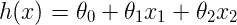

如前所述，可以通过将输入的加权和设置为 0 来找到决策边界。使 h(x)等于 0 得到我们，

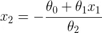

我们将在用于可视化数据集的图的顶部绘制决策边界。

```
x_values = [np.min(X[:, 1] - 5), np.max(X[:, 2] + 5)]
y_values = - (parameters[0] + np.dot(parameters[1], x_values)) / parameters[2]

plt.plot(x_values, y_values, label='Decision Boundary')
plt.xlabel('Marks in 1st Exam')
plt.ylabel('Marks in 2nd Exam')
plt.legend()
plt.show()
```

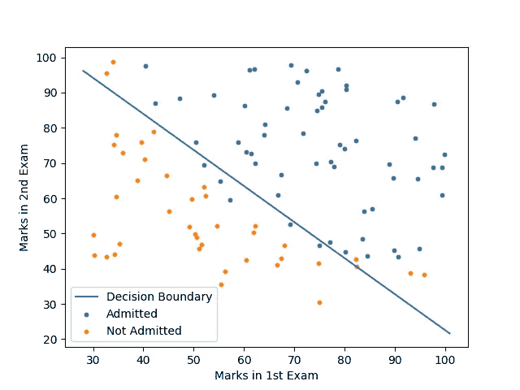

看起来我们的模型在预测课程方面做得不错。但是有多准确呢？让我们找出答案。

## 模型的准确性

```
def predict(self, x):theta = parameters[:, np.newaxis]
    return probability(theta, x)def accuracy(self, x, actual_classes, probab_threshold=0.5):
    predicted_classes = (predict(x) >= 
                         probab_threshold).astype(int)
    predicted_classes = predicted_classes.flatten()
    accuracy = np.mean(predicted_classes == actual_classes)
    return accuracy * 100accuracy(X, y.flatten())
```

模型的准确率为 89%。

让我们使用 scikit-learn 实现我们的分类器，并将其与我们从头构建的模型进行比较。

## scikit-learn 实现

```
from sklearn.linear_model import LogisticRegressionfrom sklearn.metrics import accuracy_score model = LogisticRegression()
model.fit(X, y)
predicted_classes = model.predict(X)
accuracy = accuracy_score(y.flatten(),predicted_classes)
parameters = model.coef_
```

模型参数为`[[-2.85831439, 0.05214733, 0.04531467]]`，准确率为 91%。

***为什么模型参数与我们从零开始实现的模型有显著差异？*** 如果你看一下 sk-learn 的逻辑回归实现的[文档](http://scikit-learn.org/stable/modules/generated/sklearn.linear_model.LogisticRegression.html)，它考虑到了正则化。基本上，正则化用于防止模型过度拟合数据。我不会在这篇博客中深入讨论正规化的细节。但是现在，就这样了。感谢阅读！！

这篇博客中使用的完整代码可以在这个 GitHub [repo](https://github.com/animesh-agarwal/Machine-Learning/tree/master/LogisticRegression) 中找到。

如果你被困在任何地方或有任何反馈，请给我留言。

## **下一步是什么？**

在下一篇博客中，我们将使用在这篇博客中学习到的概念，在来自 UCI 机器学习知识库的[成人数据](https://archive.ics.uci.edu/ml/datasets/adult)上构建一个分类器。该数据集包含近 49K 个样本，包括分类值、数值值和缺失值。这将是一个值得探索的有趣数据集。

请继续关注这个空间。