# 在 Python 中逐步构建逻辑回归

> 原文：<https://towardsdatascience.com/building-a-logistic-regression-in-python-step-by-step-becd4d56c9c8?source=collection_archive---------0----------------------->

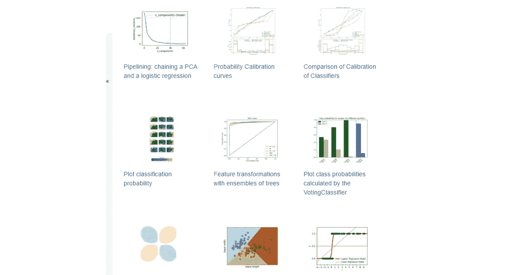

Photo Credit: Scikit-Learn

[**逻辑回归**](https://en.wikipedia.org/wiki/Logistic_regression) 是一种机器学习分类算法，用于预测分类因变量的概率。在逻辑回归中，因变量是一个二元变量，包含编码为 1 的数据(是，成功，等等)。)或 0(否，失败等。).换句话说，逻辑回归模型预测 P(Y=1)是 x 的函数。

# 逻辑回归假设

*   二元逻辑回归要求因变量是二元的。
*   对于二元回归，因变量的因子水平 1 应该代表期望的结果。
*   应该只包括有意义的变量。
*   自变量应该是相互独立的。也就是说，模型应该很少或没有多重共线性。
*   自变量与对数概率呈线性相关。
*   逻辑回归需要相当大的样本量。

记住上面的假设，让我们看看我们的数据集。

# 数据

数据集来自 [UCI 机器学习库](http://archive.ics.uci.edu/ml/index.php)，它与一家葡萄牙银行机构的直接营销活动(电话)有关。分类的目标是预测客户是否会订阅(1/0)定期存款(变量 y)。数据集可以从[这里](https://raw.githubusercontent.com/madmashup/targeted-marketing-predictive-engine/master/banking.csv)下载。

```
import pandas as pd
import numpy as np
from sklearn import preprocessing
import matplotlib.pyplot as plt 
plt.rc("font", size=14)
from sklearn.linear_model import LogisticRegression
from sklearn.model_selection import train_test_split
import seaborn as sns
sns.set(style="white")
sns.set(style="whitegrid", color_codes=True)
```

数据集提供了银行客户的信息。它包括 41，188 条记录和 21 个字段。

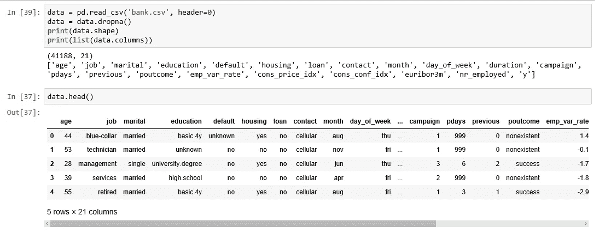

Figure 1

**输入变量**

1.  年龄(数字)
2.  工作:工作类型(分类:"行政人员"、"蓝领工人"、"企业家"、"女佣"、"管理人员"、"退休人员"、"自营职业者"、"服务人员"、"学生"、"技术人员"、"失业人员"、"未知人员")
3.  婚姻:婚姻状况(分类:“离婚”、“已婚”、“单身”、“未知”)
4.  教育(分类:"基础. 4y "、"基础. 6y "、"基础. 9y "、"高中"、"文盲"、"专业.课程"、"大学.学位"、"未知")
5.  违约:有信用违约？(分类:“否”、“是”、“未知”)
6.  住房:有住房贷款吗？(分类:“否”、“是”、“未知”)
7.  贷款:有个人贷款？(分类:“否”、“是”、“未知”)
8.  联系人:联系人通信类型(分类:“手机”、“电话”)
9.  月份:一年中的最后一个联系月份(分类:“一月”、“二月”、“三月”、“十一月”、“十二月”)
10.  星期几:一周的最后一个联系日(分类:“星期一”、“星期二”、“星期三”、“星期四”、“星期五”)
11.  duration:上次联系持续时间，以秒为单位(数字)。重要注意事项:该属性对输出目标有很大影响(例如，如果 duration=0，则 y='no ')。在执行呼叫之前，持续时间是未知的，同样，在呼叫结束之后，y 显然是已知的。因此，这种输入应该仅用于基准目的，如果目的是得到一个现实的预测模型，则应该丢弃
12.  活动:在此活动期间为此客户执行的联系次数(数字，包括最后一次联系)
13.  pdays:从上一个活动中最后一次联系客户后经过的天数(数字；999 表示之前没有联系过客户)
14.  上一次:在此活动之前为此客户执行的联系次数(数字)
15.  poutcome:先前营销活动的结果(分类:“失败”、“不存在”、“成功”)
16.  员工变动率:员工变动率—(数字)
17.  cons.price.idx:消费者价格指数—(数字)
18.  消费者信心指数—(数字)
19.  euribor 3m:3 个月 euribor 利率—(数字)
20.  受雇人数:雇员人数—(数字)

**预测变量(期望目标):**

y —客户是否认购了定期存款？(二进制:“1”表示“是”，“0”表示“否”)

数据集的教育列有许多类别，为了更好地建模，我们需要减少类别。“教育”栏有以下类别:

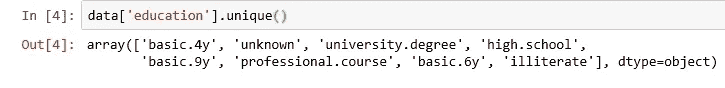

Figure 2

让我们把“基本. 4y”、“基本. 9y”、“基本. 6y”组合在一起，称之为“基本”。

```
data['education']=np.where(data['education'] =='basic.9y', 'Basic', data['education'])
data['education']=np.where(data['education'] =='basic.6y', 'Basic', data['education'])
data['education']=np.where(data['education'] =='basic.4y', 'Basic', data['education'])
```

分组后，这是列:

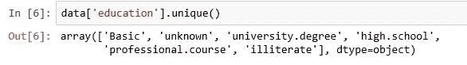

Figure 3

# 数据探索

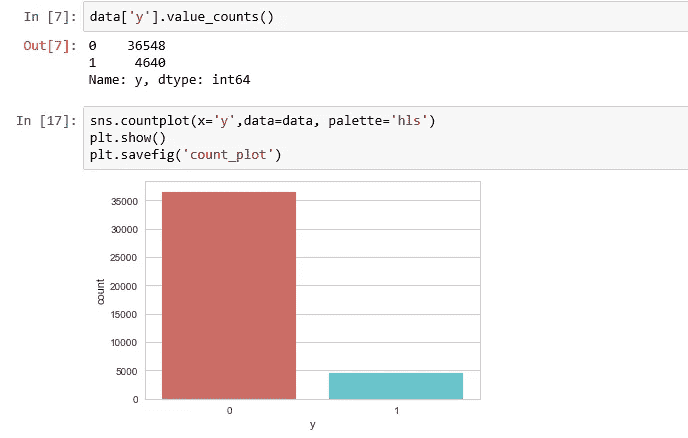

Figure 4

```
count_no_sub = len(data[data['y']==0])
count_sub = len(data[data['y']==1])
pct_of_no_sub = count_no_sub/(count_no_sub+count_sub)
print("percentage of no subscription is", pct_of_no_sub*100)
pct_of_sub = count_sub/(count_no_sub+count_sub)
print("percentage of subscription", pct_of_sub*100)
```

***无认购百分比为 88.73288821988***

***认购百分比 11.265417111780131***

我们的类是不平衡的，非订阅实例和订阅实例的比例是 89:11。在我们继续平衡这些类之前，让我们做一些更多的探索。

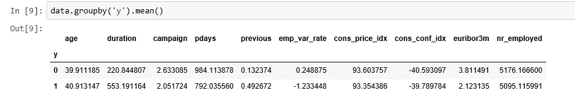

Figure 5

***观察值*** :

*   购买定期存款的客户的平均年龄高于没有购买的客户。
*   对于购买该产品的客户来说，pdays(自上次联系客户后的天数)更短是可以理解的。时间越短，对最后一次通话的记忆就越好，因此成交的机会就越大。
*   令人惊讶的是，对于购买定期存款的客户来说，营销活动(在当前营销活动中联系或致电的次数)更少。

我们可以计算其他分类变量(如教育和婚姻状况)的分类平均值，以获得更详细的数据。

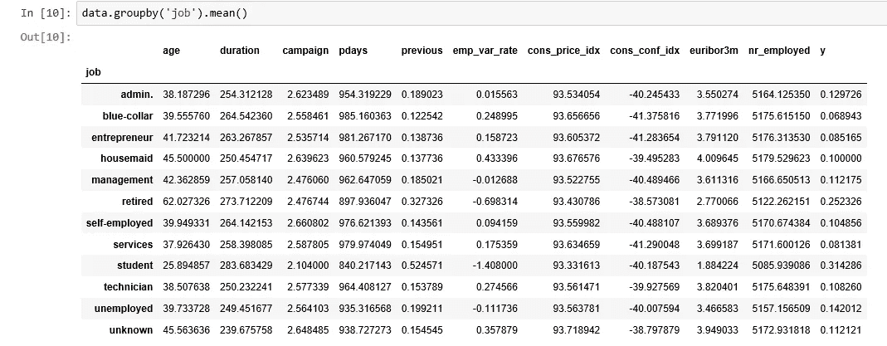

Figure 6

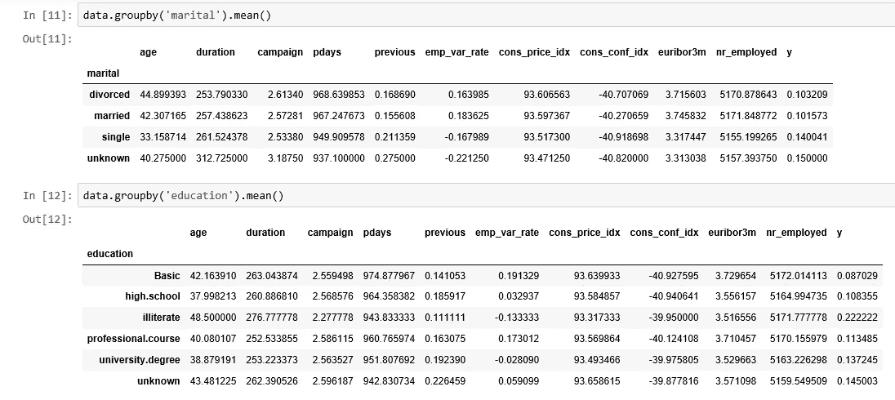

Figure 7

# 形象化

```
%matplotlib inline
pd.crosstab(data.job,data.y).plot(kind='bar')
plt.title('Purchase Frequency for Job Title')
plt.xlabel('Job')
plt.ylabel('Frequency of Purchase')
plt.savefig('purchase_fre_job')
```

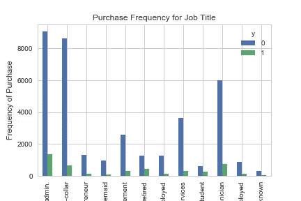

Figure 8

购买存款的频率在很大程度上取决于职位。因此，职称可以很好地预测结果变量。

```
table=pd.crosstab(data.marital,data.y)
table.div(table.sum(1).astype(float), axis=0).plot(kind='bar', stacked=True)
plt.title('Stacked Bar Chart of Marital Status vs Purchase')
plt.xlabel('Marital Status')
plt.ylabel('Proportion of Customers')
plt.savefig('mariral_vs_pur_stack')
```

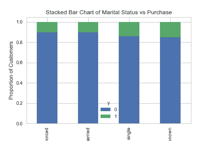

Figure 9

婚姻状况似乎不是结果变量的强有力的预测因素。

```
table=pd.crosstab(data.education,data.y)
table.div(table.sum(1).astype(float), axis=0).plot(kind='bar', stacked=True)
plt.title('Stacked Bar Chart of Education vs Purchase')
plt.xlabel('Education')
plt.ylabel('Proportion of Customers')
plt.savefig('edu_vs_pur_stack')
```

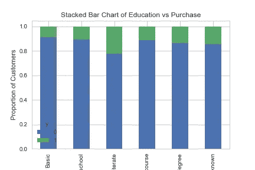

Figure 10

教育似乎是结果变量的一个很好的预测器。

```
pd.crosstab(data.day_of_week,data.y).plot(kind='bar')
plt.title('Purchase Frequency for Day of Week')
plt.xlabel('Day of Week')
plt.ylabel('Frequency of Purchase')
plt.savefig('pur_dayofweek_bar')
```

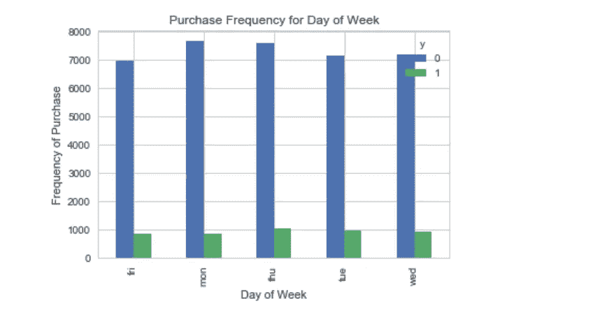

Figure 11

星期几可能不是预测结果的好方法。

```
pd.crosstab(data.month,data.y).plot(kind='bar')
plt.title('Purchase Frequency for Month')
plt.xlabel('Month')
plt.ylabel('Frequency of Purchase')
plt.savefig('pur_fre_month_bar')
```

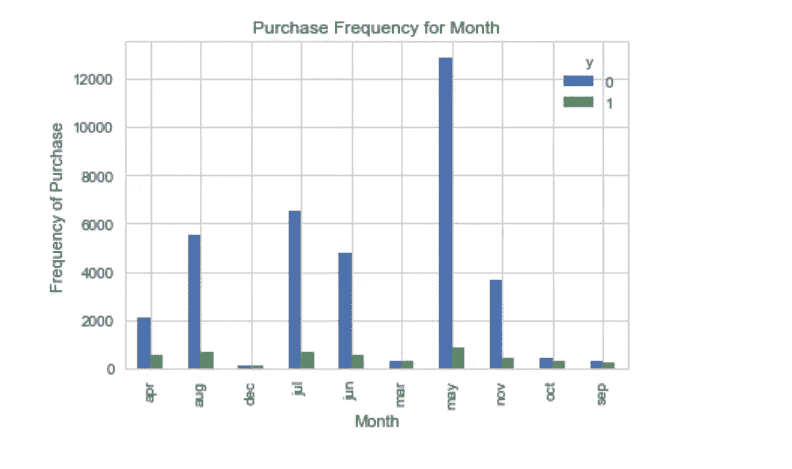

Figure 12

月份可能是结果变量的一个很好的预测因子。

```
data.age.hist()
plt.title('Histogram of Age')
plt.xlabel('Age')
plt.ylabel('Frequency')
plt.savefig('hist_age')
```

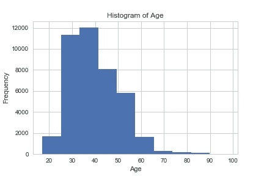

Figure 13

在这个数据集中，银行的大多数客户年龄在 30-40 岁之间。

```
pd.crosstab(data.poutcome,data.y).plot(kind='bar')
plt.title('Purchase Frequency for Poutcome')
plt.xlabel('Poutcome')
plt.ylabel('Frequency of Purchase')
plt.savefig('pur_fre_pout_bar')
```

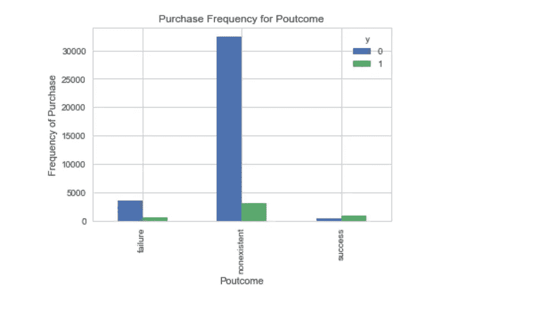

Figure 14

Poutcome 似乎是一个很好的预测结果变量。

# **创建虚拟变量**

也就是只有两个值的变量，0 和 1。

```
cat_vars=['job','marital','education','default','housing','loan','contact','month','day_of_week','poutcome']
for var in cat_vars:
    cat_list='var'+'_'+var
    cat_list = pd.get_dummies(data[var], prefix=var)
    data1=data.join(cat_list)
    data=data1cat_vars=['job','marital','education','default','housing','loan','contact','month','day_of_week','poutcome']
data_vars=data.columns.values.tolist()
to_keep=[i for i in data_vars if i not in cat_vars]
```

我们的最终数据列将是:

```
data_final=data[to_keep]
data_final.columns.values
```

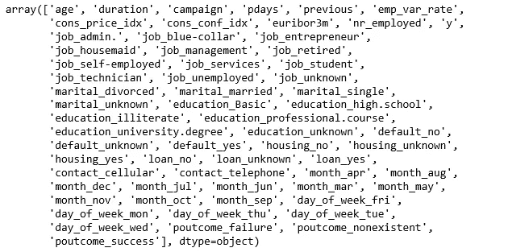

Figure 15

# **使用 SMOTE 进行过采样**

有了我们创建的训练数据，我将使用 [SMOTE 算法](https://arxiv.org/pdf/1106.1813.pdf)(合成少数过采样技术)对非订阅进行上采样。在高水平上，击打:

1.  通过从 minor 类(无订阅)创建合成样本而不是创建副本来工作。
2.  随机选择 k 个最近邻中的一个，并使用它来创建类似的、但随机调整的新观察值。

我们要用 Python 实现 [SMOTE。](http://imbalanced-learn.org/en/stable/over_sampling.html#smote-variants)

```
X = data_final.loc[:, data_final.columns != 'y']
y = data_final.loc[:, data_final.columns == 'y']from imblearn.over_sampling import SMOTEos = SMOTE(random_state=0)
X_train, X_test, y_train, y_test = train_test_split(X, y, test_size=0.3, random_state=0)
columns = X_train.columnsos_data_X,os_data_y=os.fit_sample(X_train, y_train)
os_data_X = pd.DataFrame(data=os_data_X,columns=columns )
os_data_y= pd.DataFrame(data=os_data_y,columns=['y'])
# we can Check the numbers of our data
print("length of oversampled data is ",len(os_data_X))
print("Number of no subscription in oversampled data",len(os_data_y[os_data_y['y']==0]))
print("Number of subscription",len(os_data_y[os_data_y['y']==1]))
print("Proportion of no subscription data in oversampled data is ",len(os_data_y[os_data_y['y']==0])/len(os_data_X))
print("Proportion of subscription data in oversampled data is ",len(os_data_y[os_data_y['y']==1])/len(os_data_X))
```

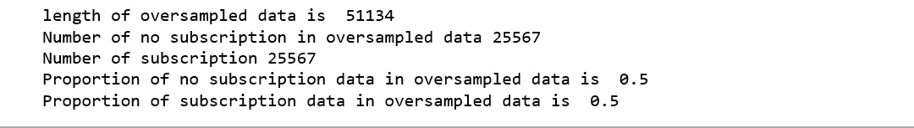

Figure 16

现在我们有了一个完美的平衡数据！您可能已经注意到，我只对训练数据进行了过采样，因为通过只对训练数据进行过采样，测试数据中的任何信息都不会用于创建合成观察，因此，没有任何信息会从测试数据流入模型训练。

# **递归特征消除**

[递归特征消除(RFE)](http://scikit-learn.org/stable/modules/generated/sklearn.feature_selection.RFE.html) 基于重复构建模型并选择最佳或最差性能特征的思想，将该特征放在一边，然后对其余特征重复该过程。此过程将一直应用到数据集中的所有要素都用完为止。RFE 的目标是通过递归地考虑越来越小的特征集来选择特征。

```
data_final_vars=data_final.columns.values.tolist()
y=['y']
X=[i for i in data_final_vars if i not in y]from sklearn.feature_selection import RFE
from sklearn.linear_model import LogisticRegressionlogreg = LogisticRegression()rfe = RFE(logreg, 20)
rfe = rfe.fit(os_data_X, os_data_y.values.ravel())
print(rfe.support_)
print(rfe.ranking_)
```

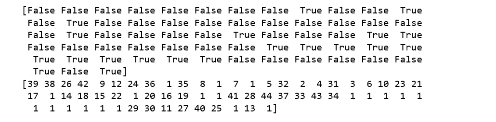

Figure 16

RFE 帮助我们选择了以下特征:“euribor3m”、“job _ 蓝领”、“job _ 女佣”、“婚姻 _ 未知”、“教育 _ 文盲”、“默认 _ 否”、“默认 _ 未知”、“联系人 _ 手机”、“联系人 _ 电话”、“month_apr”、“month_aug”、“month_dec”、“month_jul”、“month_jun”、“month_mar”、“month_may”、“month_nov”、“month_oct”、“poutcome_failure”、“poutcome_success”。

```
cols=['euribor3m', 'job_blue-collar', 'job_housemaid', 'marital_unknown', 'education_illiterate', 'default_no', 'default_unknown', 
      'contact_cellular', 'contact_telephone', 'month_apr', 'month_aug', 'month_dec', 'month_jul', 'month_jun', 'month_mar', 
      'month_may', 'month_nov', 'month_oct', "poutcome_failure", "poutcome_success"] 
X=os_data_X[cols]
y=os_data_y['y']
```

# 实施模型

```
import statsmodels.api as sm
logit_model=sm.Logit(y,X)
result=logit_model.fit()
print(result.summary2())
```

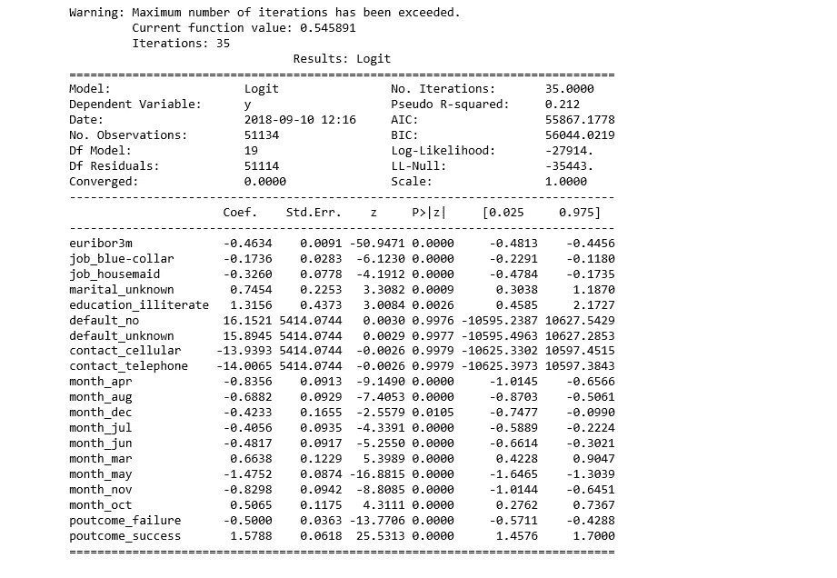

Figure 17

除了四个变量，大多数变量的 p 值都小于 0.05，因此，我们将删除它们。

```
cols=['euribor3m', 'job_blue-collar', 'job_housemaid', 'marital_unknown', 'education_illiterate', 
      'month_apr', 'month_aug', 'month_dec', 'month_jul', 'month_jun', 'month_mar', 
      'month_may', 'month_nov', 'month_oct', "poutcome_failure", "poutcome_success"] 
X=os_data_X[cols]
y=os_data_y['y']logit_model=sm.Logit(y,X)
result=logit_model.fit()
print(result.summary2())
```


Figure 18

# 逻辑回归模型拟合

```
from sklearn.linear_model import LogisticRegression
from sklearn import metricsX_train, X_test, y_train, y_test = train_test_split(X, y, test_size=0.3, random_state=0)
logreg = LogisticRegression()
logreg.fit(X_train, y_train)
```

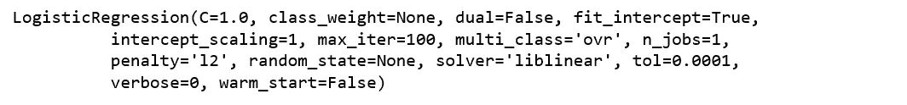

Figure 19

**预测测试集结果并计算准确度**

```
y_pred = logreg.predict(X_test)
print('Accuracy of logistic regression classifier on test set: {:.2f}'.format(logreg.score(X_test, y_test)))
```

***逻辑回归分类器在测试集上的准确率:0.74***

# 混淆矩阵

```
from sklearn.metrics import confusion_matrix
confusion_matrix = confusion_matrix(y_test, y_pred)
print(confusion_matrix)
```

***【6124 1542】***

***【2505 5170】]***

结果告诉我们，我们有 ***6124+5170*** 正确的预测和 ***2505+1542*** 不正确的预测。

# **计算精度、召回、F-测量和支持**

引用 [Scikit Learn](http://scikit-learn.org/stable/index.html) 的话:

精度是 tp / (tp + fp)的比值，其中 tp 是真阳性的数量，fp 是假阳性的数量。精确度直观上是分类器在样本为阴性时不将其标记为阳性的能力。

召回率是 tp / (tp + fn)的比值，其中 tp 是真阳性的数量，fn 是假阴性的数量。召回直观上是分类器找到所有肯定样本的能力。

F-beta 分数可以解释为精确度和召回率的加权调和平均值，其中 F-beta 分数在 1 时达到其最佳值，在 0 时达到最差分数。

F-beta 分数通过 beta 因子对召回率的加权大于对精确度的加权。beta = 1.0 意味着召回率和准确率同等重要。

支持度是 y_test 中每个类的出现次数。

```
from sklearn.metrics import classification_report
print(classification_report(y_test, y_pred))
```

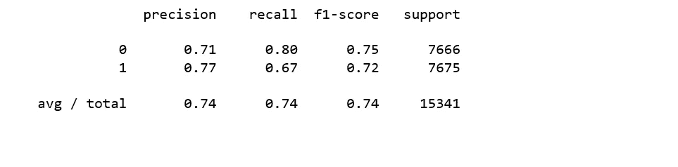

Figure 20

**解读**:在整个测试集中，74%的推广定期存款是客户喜欢的定期存款。在整个测试集中，74%的客户首选定期存款得到了推广。

# 受试者工作特征曲线

```
from sklearn.metrics import roc_auc_score
from sklearn.metrics import roc_curve
logit_roc_auc = roc_auc_score(y_test, logreg.predict(X_test))
fpr, tpr, thresholds = roc_curve(y_test, logreg.predict_proba(X_test)[:,1])
plt.figure()
plt.plot(fpr, tpr, label='Logistic Regression (area = %0.2f)' % logit_roc_auc)
plt.plot([0, 1], [0, 1],'r--')
plt.xlim([0.0, 1.0])
plt.ylim([0.0, 1.05])
plt.xlabel('False Positive Rate')
plt.ylabel('True Positive Rate')
plt.title('Receiver operating characteristic')
plt.legend(loc="lower right")
plt.savefig('Log_ROC')
plt.show()
```


Figure 21

[受试者工作特性(ROC)](https://en.wikipedia.org/wiki/Receiver_operating_characteristic) 曲线是二元分类器使用的另一个常用工具。虚线代表纯随机分类器的 ROC 曲线；一个好的分类器尽可能远离那条线(朝向左上角)。

用来写这篇文章的 Jupyter 笔记本可以在[这里](https://github.com/susanli2016/Machine-Learning-with-Python/blob/master/Logistic%20Regression%20balanced.ipynb)找到。我将很高兴收到关于上述任何反馈或问题。

参考:[使用 Python 书籍学习预测分析](https://books.google.com/books/about/Learning_Predictive_Analytics_with_Pytho.html?id=Ia5KDAAAQBAJ&printsec=frontcover&source=kp_read_button#v=onepage&q&f=false)