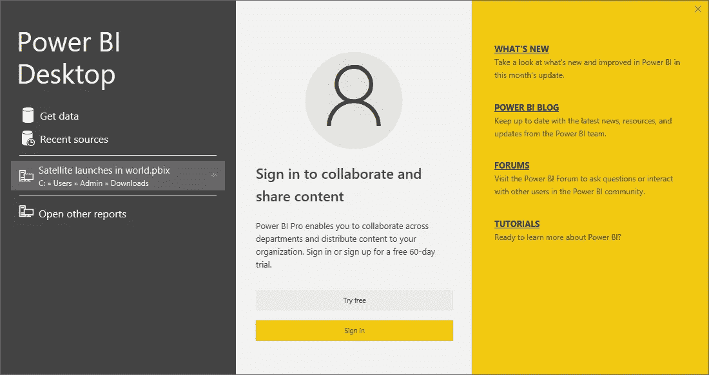
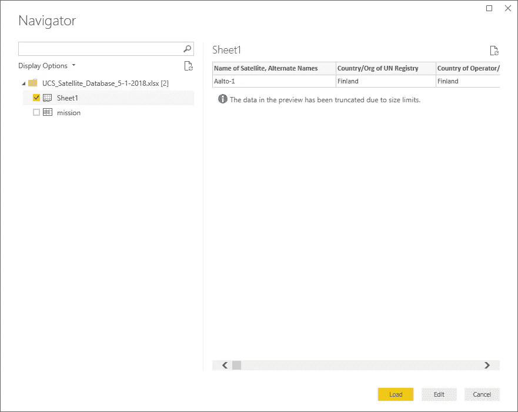
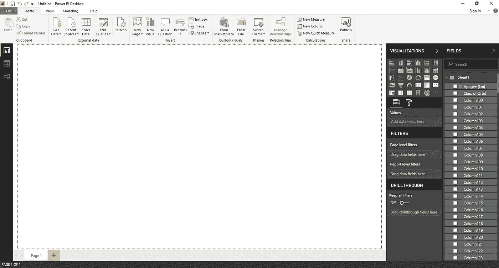
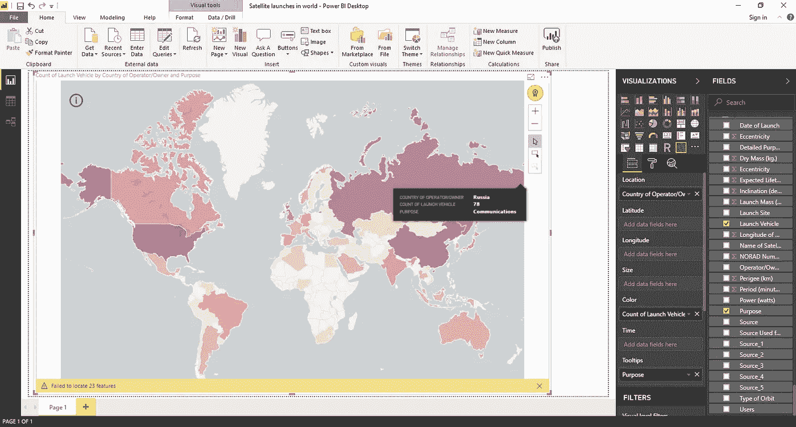
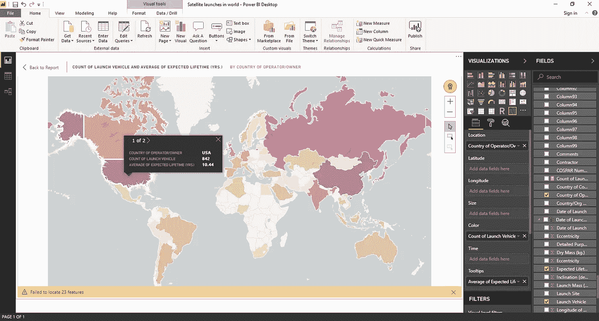
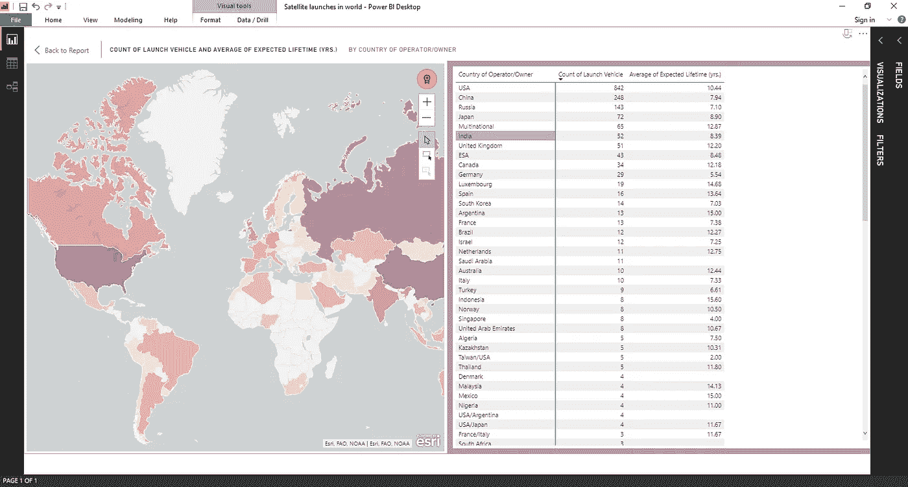
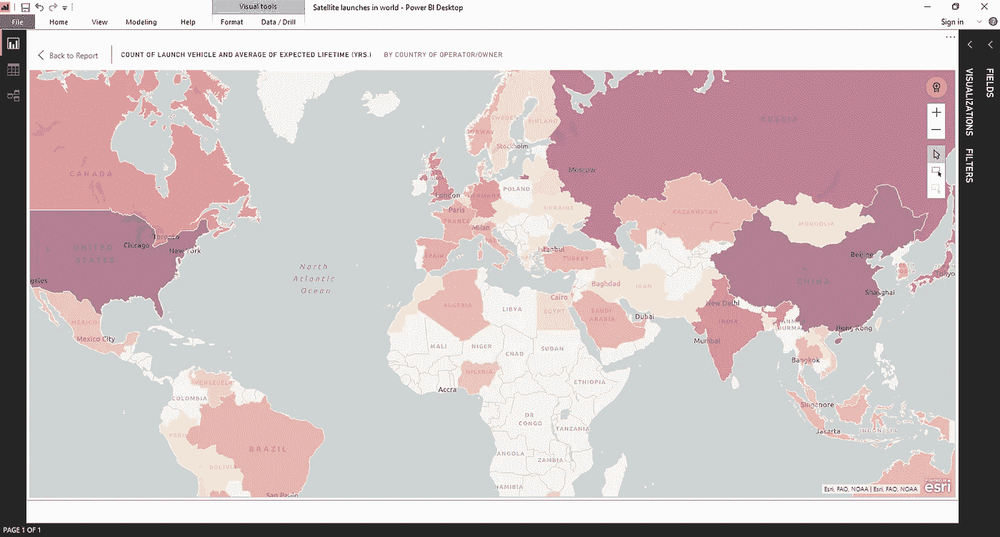
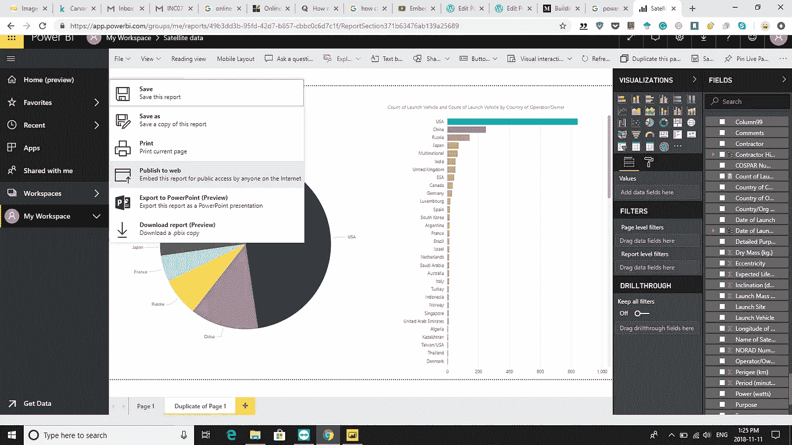

# 构建具有交互式可视化的 Microsoft Power BI web 应用程序

> 原文：<https://towardsdatascience.com/building-a-microsoft-power-bi-dashboard-with-an-interactive-map-visualization-of-a-dataset-e7edd6386fe2?source=collection_archive---------19----------------------->

我想为初学者提供一个简单、简洁的指南，让他们动手操作 MS Power BI，并使用 Power BI 中的可视化功能执行数据集。这是我今天想到的一个方法，使用简单的工具和方法。

对于 Windows 设备:转到 Microsoft 应用程序商店并获得 Power BI desktop

Power BI desktop from Microsoft Store (Instead of Launch, you should have a Get button)

下载并在您的系统中启动它

您可能会看到此对话框打开。我们需要在这里选择**获取数据**选项，并导航到下载的数据集。但是**在那之前，**我们需要**下载一个数据集**用 Power BI 探索。一旦我们下载了数据集，我们可以回到这一步。

我想在世界卫星数据集上测试。忧思科学家联盟为所有卫星发射提供了一个非常好和干净的所有格式的数据集:excel/csv/text 文件。于是我接着用下面的链接从他们的网站下载了一些数据集(提供了网站截图，以防万一)由此下载 **excel 格式的数据库**。

 [## UCS 卫星数据库

### 目前围绕地球运行的 1，886 颗卫星的详细信息，包括它们的来源国、用途和…

www.ucsusa.org](https://www.ucsusa.org/nuclear-weapons/space-weapons/satellite-database#.W-DqNpNKiM8) 

下载完成后，您可以进入 Power BI 窗口中的**获取数据步骤**并导航至下载的卫星 excel 数据集。

然后选择同一数据集的工作表 1，并单击 Load。

Windows 完成数据集加载后，您可能会看到以下内容:

所以右边是**可视化**和**字段**列。可视化栏有一个图标列表，对应于您可以获得的各种**图**，而字段栏显示 excel 数据表中的列列表，如发布日期、发布地点、目的、来源等。

为了从这些数据中得出一个简单而有力的故事，我列出了一些相关特征的重要列表，如**国家**、**运载火箭**和**预期寿命**。现在的挑战是选择正确的可视化，然后将这些选定的字段放置在选定的可视化下的相应位置。

因此，从各种基于地图的可视化中，我发现 ArcGIS 地图是展示该数据集的最酷的地图。因此，我们从可视化列中选择 ArcGIS graph 图标。

现在我们必须根据选择的可视化来排列字段。例如，从**字段**中，选择*国家*，然后将该特征拖放到可视化栏下的**位置**空间中。然后从字段列中选择*运载火箭*字段，并将其拖放到**颜色**空间中。

然后一旦放下，再次点击运载火箭选项卡并选择**计数**，这将设置每个国家运载火箭计数总数的使用。

然后，为了显示更多信息，我们可以添加每个国家卫星的平均预期寿命。我们通过从 fields 列中选择*Expected Lifetime***并将其放到 visualization 下的 Tooltips 空间中来实现这一点。点击预期寿命选项卡，并选择**平均值**作为与图的其余部分整合的操作值。**

**因此，在不到 10 分钟的时间里，我们已经将简单的卫星发射 excel 文件演变成了一个在世界地图上讲述的故事，讲述了世界上目前领先的国家作为航天大国的实力。我们可以显示各自国家的运载火箭总数，以及各自卫星在太空中的平均预期寿命。**

****

**Satellite launches in world with ArcGIS map visualization and proper Fields selected**

**最后，你会看到这个美丽的世界地图视图，当你将光标悬停在一个国家时，会弹出额外的信息——给出国家名称、运载火箭总数和预期寿命。虽然颜色的强度给出了该国运载火箭数量的概念，但我们不难想象，毫不奇怪，美国、中国和俄罗斯的卫星发射数量最多。**

**您可以使用焦点模式查看整个页面中的图表，而不查看任何其他图表:**

****

**用户也可以点击右上角，将数据导出为. csv 文件，或者在可视化或地图旁边查看数据[选择右上角**更多选项**按钮旁边的**水平布局**视图图标]以查看如下所示的屏幕。**

****

**人们可以在地图上摆弄不同的按钮和缩放级别，也许还能得到更吸引人的信息图。**

****

**我知道你会用它来创作更有创意和更有趣的东西，所以急切地等待你的惊人回应。**

**这是可视化的嵌入式代码。点击它打开一个新的网页，与我为卫星数据集创建的可视化交互。**

**你也可以这样做，进入文件->点击发布到网站->嵌入代码到你的博客或 html 网站**

****

**以下是基于我的报告中选择的图表和字段的数据集的网站可视化，当我在我的 Power BI 应用程序 dasahboard 上更改它们时，它也会实时更改。**

 **[## 电源 BI 报告

### 由 Power BI 支持的报告

app.powerbi.com](https://app.powerbi.com/view?r=eyJrIjoiYmJhYmM0ODItZWFjMC00ZGFjLWJjNGQtZDNjNjc1MGU4NWVkIiwidCI6IjlmZWE3NjAwLWE0YWYtNGZlZC05NTZlLTYxODk0ZjY0MWE3MCIsImMiOjN9)** 

**要了解更多关于商业智能/深度学习/机器学习的最新作品和教程，请访问:**

** [## 最热门的资源

### 这里有一些最好的人工智能或深度学习或数据科学链接和资源可以免费获得…

rajshekharmukherjee.wordpress.com](https://rajshekharmukherjee.wordpress.com/hottest-resources/) 

干杯！**