# 在纽约出租车数据上建立一个机器学习集成分类器，用 Python 和 Google BigQuery 预测没有小费和慷慨的小费

> 原文：<https://towardsdatascience.com/building-a-ml-classifier-on-ny-city-taxi-data-to-predict-no-tips-vs-generous-tips-with-python-92e21d5d9fd0?source=collection_archive---------3----------------------->

我通过构建一个分类器来展示 Google BigQuery 引擎的强大功能，该分类器将预测乘坐纽约市的出租车是会得到丰厚的小费还是根本没有小费。作为这项工作的一部分，我探索数据集并查看数据集中的关系。我还想象了城市周围的拾音器，结果是一个散点图，基本上画出了纽约的街道。

我主要介绍了 BigQuery UI、python API 和 pandas 库，这些库与直接从 Jupiter notebook 和 sklearn 执行 SQL 查询相关。我描述了在 BigQuery 中克服的挑战，包括通过 API 和 UI 执行的查询之间的一些语法差异。很多在线文档都过时了，因此我的示例代码应该是执行自己项目的有用资源。

最后，对于那些对构建分类器和元分类器感兴趣的人来说，我使用 simple 来理解标签和输入，这对那些希望实现自己的分类器的人来说应该是一个有用的参考。我还演示了如何处理缺失值。

**big query 背景**

BigQuery 是 Google 内部使用的查询服务 Dremel 的公共实现。

Dremel 可以在几十秒内扫描 350 亿行而不用索引。云驱动的大规模并行查询服务 Dremel 共享谷歌的基础设施，因此它可以并行化每个查询，并在数万台服务器上同时运行。

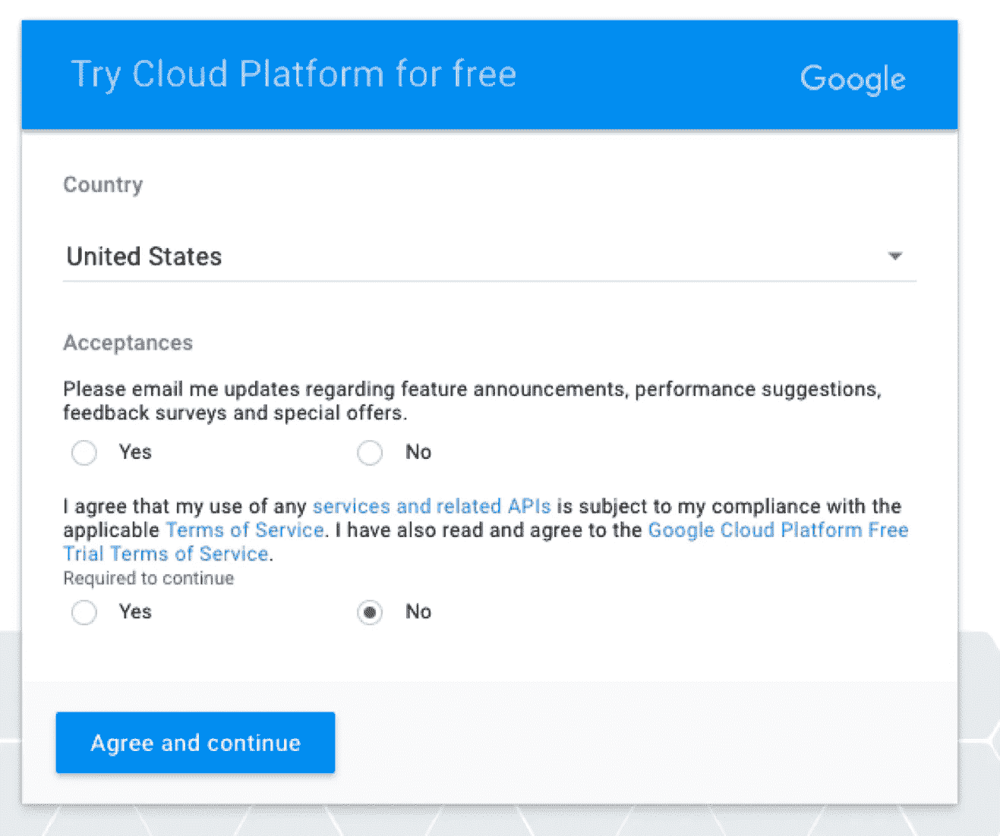

使用 BigQuery 的第一步是授权一个 google cloud 帐户。这是通过访问 https://console.cloud.google.com[并遵循授权协议来完成的。您还需要提供一张信用卡来支付账单。注册开始时，您将获得价值 300 美元的积分，这对于探索和运行示例查询来说绰绰有余。](https://console.cloud.google.com)

然后，您将登录到 google cloud dashboard，下一步是创建一个项目(您可以有多个项目)。

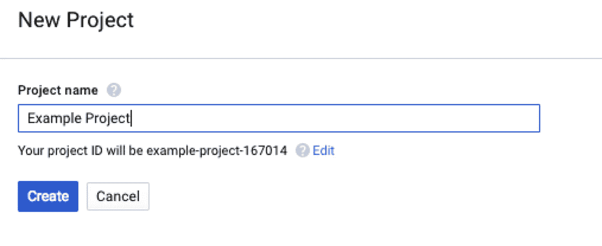

然后，您可以通过单击左侧的菜单并选择“bigquery”来访问 BigQuery

这将加载 BigQuery WebUI

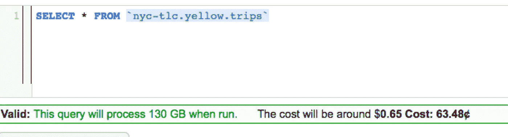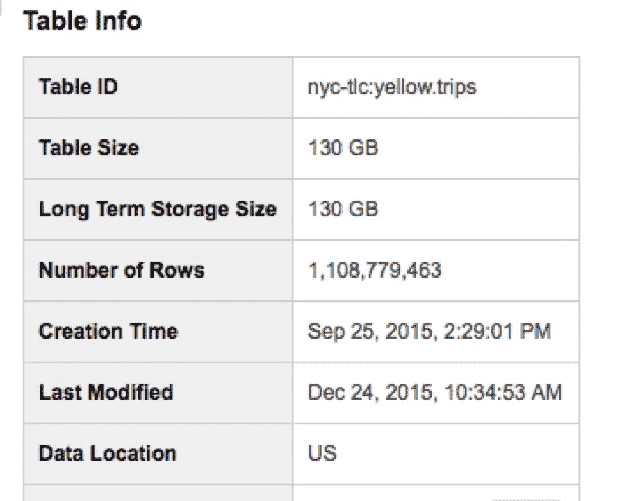

我们看到有 130GB 关于纽约出租车旅行的数据和 11 亿行。BigQuery 处理所有这些数据大约只需要 30 秒。

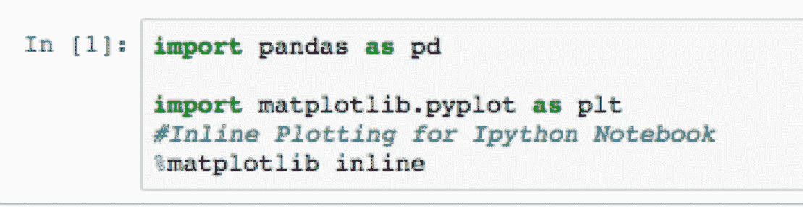

我首先导入 pandas，因为 pandas 中有一个专门设计的方法来查询 bigquery，并以 pandas dataframe 的形式返回结果。

我还导入 matplotlib 进行可视化。

我使用的数据已经存储在谷歌云中，所有人都可以使用——我使用它是为了演示，因为任何人都可以访问它并运行查询。

作为对数据的初步演示和探索，我展示了通过将 SQL 代码直接传递给 pandas 方法进行查询的能力，方法是按月查看数据中的出租车出行次数。

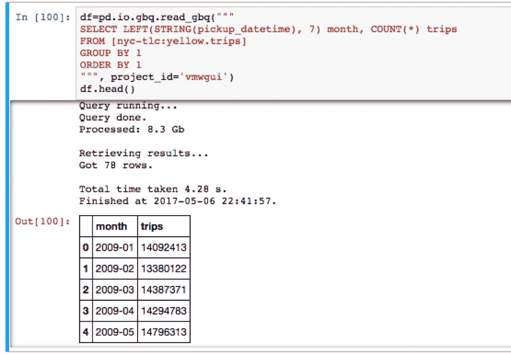

然后，我研究了这些数据，并分析了小费和不同特征之间的关系。

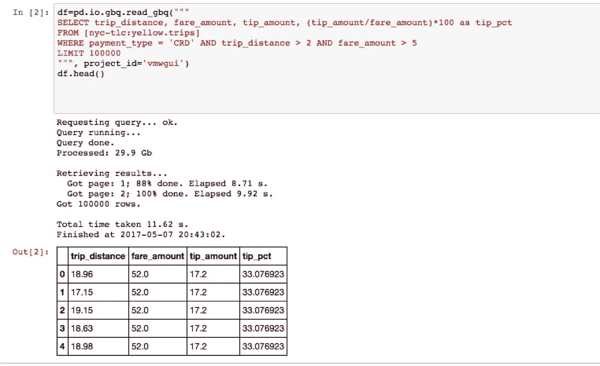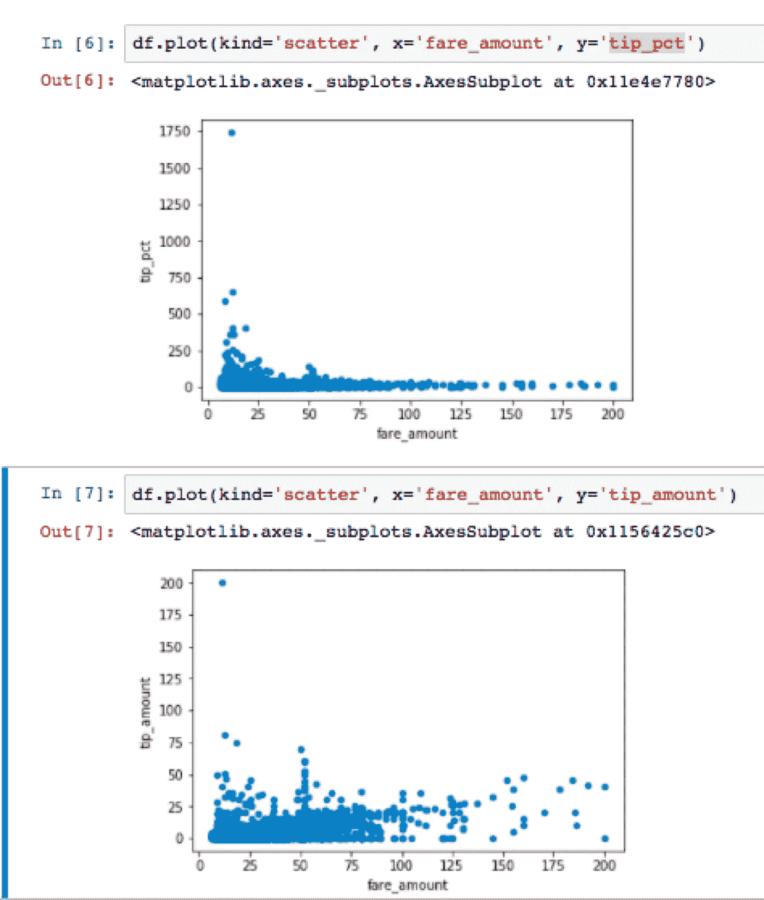

然后，我汇总了纽约每个经度和纬度坐标上的皮卡数量

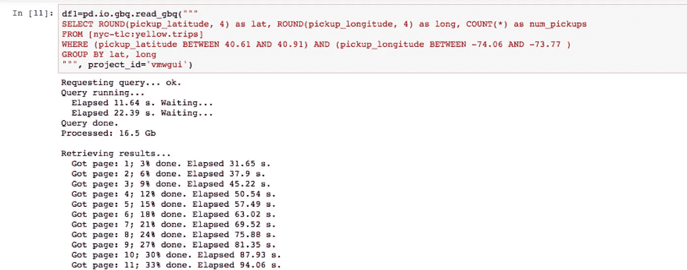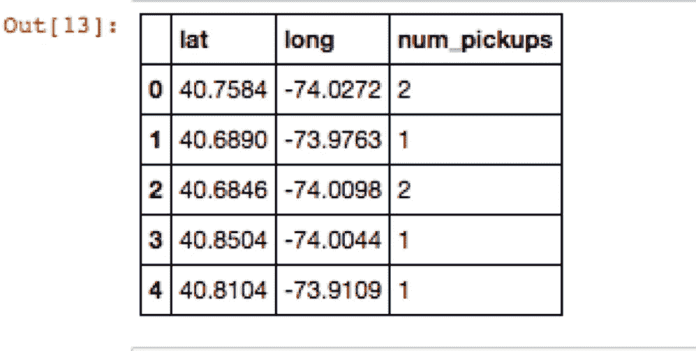

然后，我能够将这些数据输入散点图，根据出租车搭载乘客的地点，得出纽约相当清晰的轮廓。

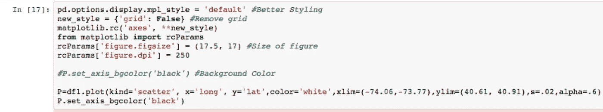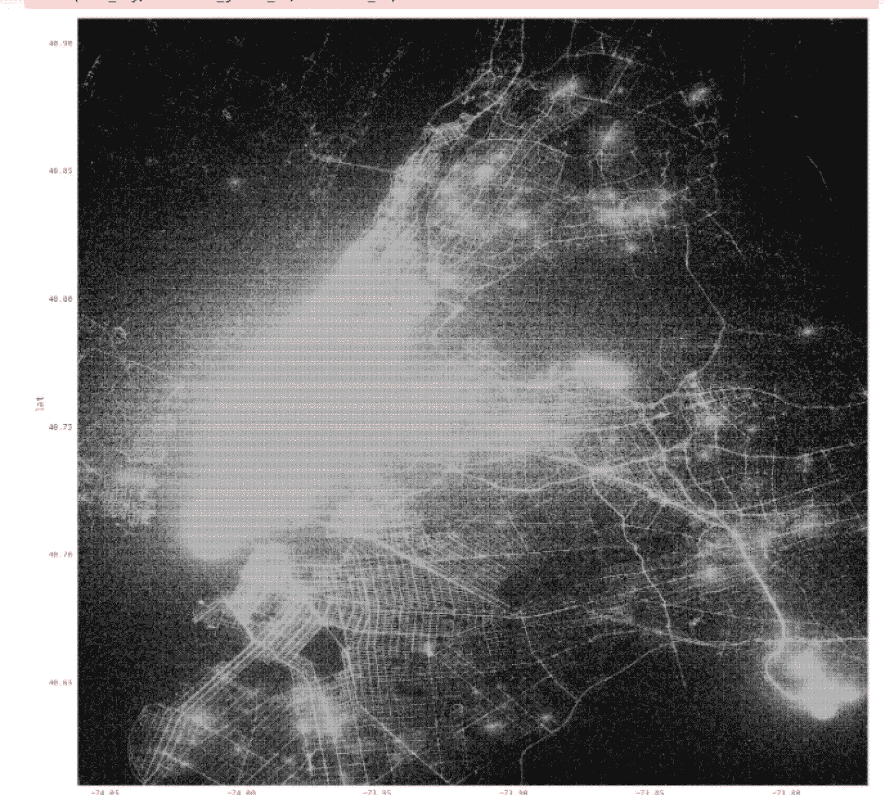

根据我对数据的研究，我发现只有 3%的用信用卡支付的旅行没有小费，所以我决定为了分类的目的，我们将尝试并预测两种极端情况，这两种情况需要人们在纽约出租车上手动取消——没有小费和非常慷慨的小费(“慷慨”是指超过车费的 30%)

然后，我着手提取相关信息，并给它们贴上标签。

我首先创建两个独立的数据集，在每个数据集上做标记，然后将它们合并。

我平衡数据，所以一半的数据将是慷慨的，另一半没有提示，所以我的分类器只需要做得比 50%更好就可以被认为是有用的。

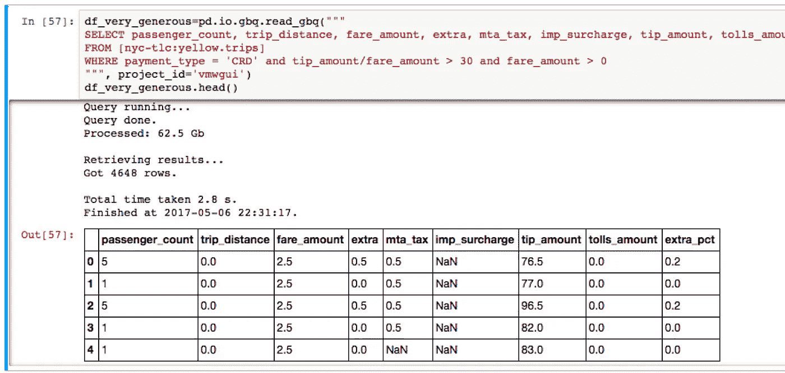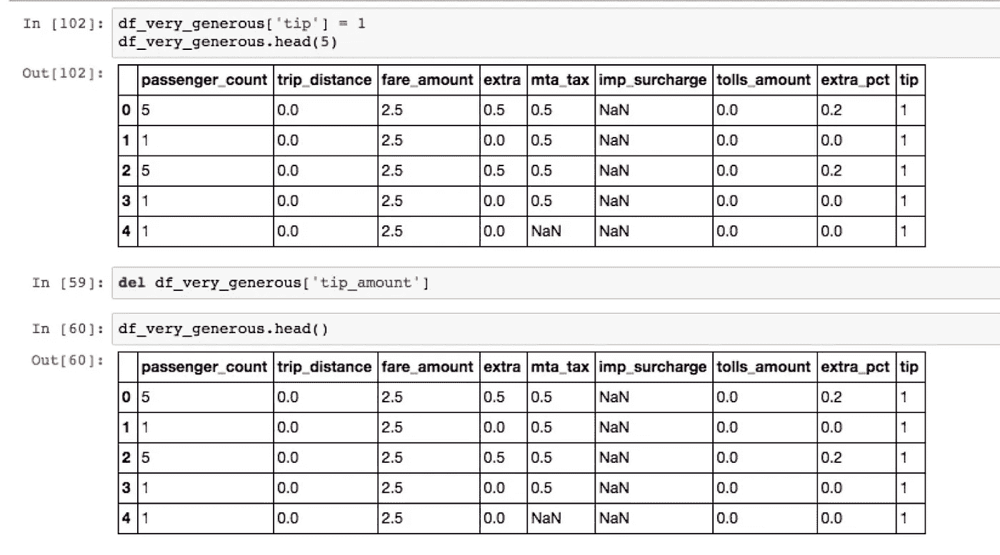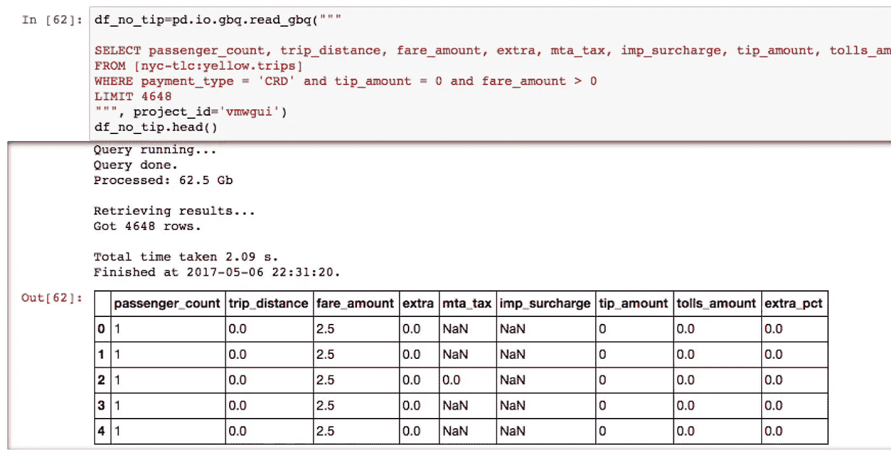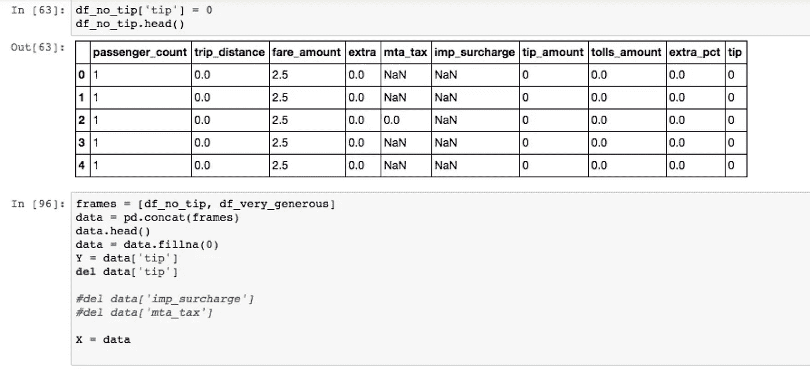

现在已经得到了我的标签(Y)和特征(X)，我建立分类器。我使用 sklearns 分类器 KNN，贝叶斯，逻辑回归和决策树，并使用它们的输出来输入一个集成或“元分类器”，然后给出结果。

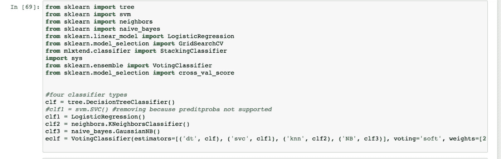

当我们运行培训和测试时，我们会看到以下结果:

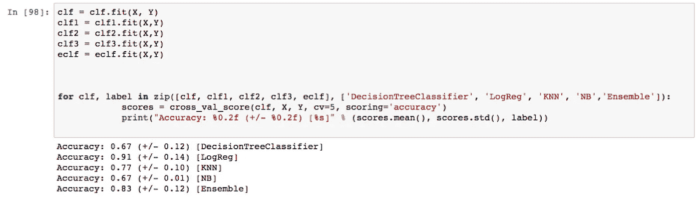

准确度:0.67(+/-0.12)[decision tree classifier]
准确度:0.91(+/-0.14)【LogReg】
准确度:0.77(+/-0.10)【KNN】
准确度:0.67(+/-0.01)【NB】
**准确度:0.83 (+/- 0.12)【系综】**

**结论:**

鉴于上述结果，我已经能够成功地建立一个元分类器，它将预测哪里的旅行更有可能导致司机没有小费或“慷慨”的小费。

诸如此类的分类器可能有助于捕捉欺诈。例如，该数据仅使用信用卡交易，因为所有小费信息都被捕获，但当使用现金时，由于税务后果，司机可能不会报告小费-像所构建的分类器这样的分类器可用于了解我们何时应该看到小费被记录，或不被记录，并识别异常。

github Repo:[https://github . com/cjflanagan/ny taxi _ Tips _ Classifier _ with _ big query-/blob/master/ny taxi . ipynb](https://github.com/cjflanagan/NYtaxi_Tips_Classifier_with_BigQuery-/blob/master/NYTaxi.ipynb)