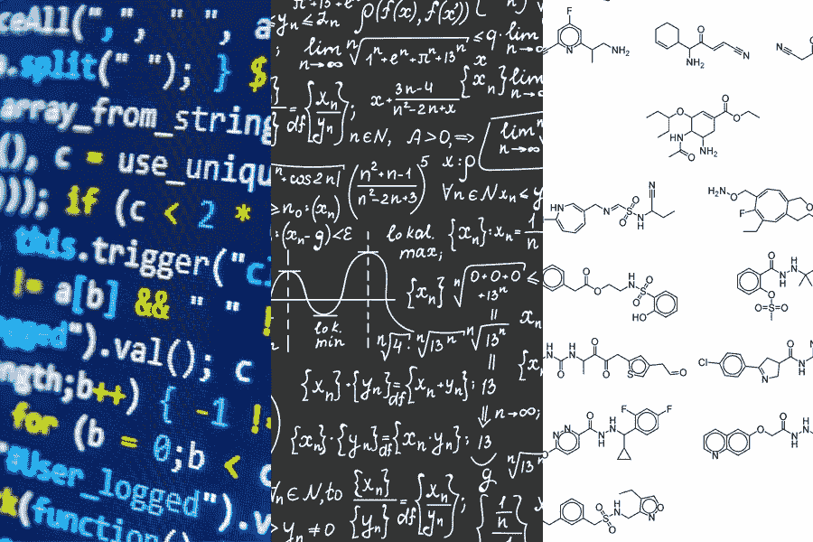
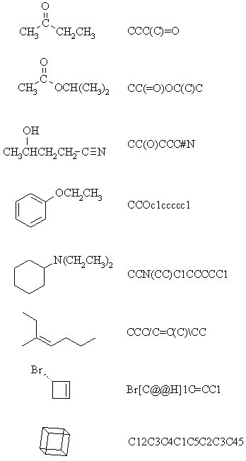
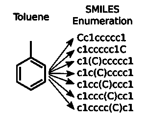

# 构建分子电荷分类器

> 原文：<https://towardsdatascience.com/building-a-molecular-charge-classifier-50204deebd6d?source=collection_archive---------9----------------------->

## 化学和人工智能的交集

A.在过去的几年里，我看到了前所未有的增长。尽管像神经网络(NN)这样的机器学习架构由于 Geoffrey Hinton 这样的顶级研究人员的突破而闻名已久，但直到最近*神经网络才成为人工智能专家工具箱中的强大工具。这主要归功于 21 世纪的到来带来的三个变化:*

1.  增强的计算能力
2.  增加可用数据
3.  对自动化越来越感兴趣

目前在互联网、政府系统和个人电脑上流动的大多数数据都是未标记的。**标记数据(即对应于另一个现有数据集的数据)更难获得。**数据类型包括数字、图像、音频和文本。

Code, Math, and Molecules; the trinity of difficult things to use in A.I

> **要克服的巨大挑战是离散分子数据是多么脆弱。**

考虑一下这个:

*   在数学方程式中，如果一个数字或运算被改变，则该方程式无效。
*   在代码块中，如果任何变量、方法、函数等。被更改，代码将以不同的方式执行。
*   在一个分子中，如果一个键、原子或电子被改变，这个分子就完全不同了。

神经网络有一个非常独特的过程，使它们不同于其他算法。输入的数据必然会在神经网络中被处理，也就是说，它会受到权重、偏差、激活函数以及一系列其他可调、可学习和特定参数的影响；

> 进入神经网络的数据将被改变。

**操纵脆弱的离散数据如履薄冰。**目前，有 4 种主要的方法来表示一种分子，按照损失的顺序列出:

1.  分子指纹
2.  字符串表示
3.  分子图
4.  模拟

每一种都有自己独特的过程，但我用来构建分子电荷分类器的是字符串表示和分子指纹。大多数化学信息数据和分子数据都是以 InChi 字符串的形式提供的，或者我更喜欢的格式，SMILES 字符串。大多数时候，微笑字符串看起来像一种化学胡言乱语:

Molecules with their respective SMILE strings

这些字符串是在语法的帮助下生成的。和英语一样，**单个分子可以有不同的微笑串**；就像一个词可以有很多定义，或者一个想法可以用不同的句子来表达。

The many faces of Toluene; all the strings represent the same molecule

图表由 Esben Bjerrum 博士提供，他是用人工智能征服化学之旅的领先专家和研究人员。要了解更多关于 canonical SMILES 枚举的信息，请查看他的[博客帖子](https://www.wildcardconsulting.dk/useful-information/smiles-enumeration-as-data-augmentation-for-molecular-neural-networks/)。

为了防止重复的微笑串，每个分子仅使用一个微笑串变体。值得注意的是，每个分子都有一个初级字符串表示，也称为规范微笑。有了 SMILES 格式的**干净的标记分子数据集**，我开始构建分子电荷分类器。

# 项目收费

我用微笑字符串和神经网络用 python 和 Keras 库构建了一个分子电荷分类器。每个分子都有特定的电荷 0、1、-1 和-2(还有更多，但我的数据集中的所有分子都有 4 种可能的电荷)。

该项目分为 4 个步骤:

1.  导入 SMILES 数据(带标签，即费用)
2.  将数据转换为 256 位二进制代码
3.  构建深层神经网络
4.  编译和拟合模型

对于这个项目，该模型用 250，000 个数据集的 1000 个微笑字符串进行训练。我将每个微笑字符串转换成 256 位二进制代码，这样我就可以用相同数量的输入神经元构建神经网络；256.该模型将每个前进层的神经元数量减半，从 256 → 128 → 64 → 34 → 16，最后到 4 个输出神经元，每个神经元对应数据集中的一个可能电荷(0，1，-1，-2)。

从训练集中抽取 10%的数据(100 个微笑字符串)用作验证数据。该模型使用 relu 作为其输入层激活函数，使用 sigmoid 作为隐藏层的激活函数，最后使用 softmax 函数以 0 到 1 之间的概率形式输出结果。因此，分类以概率小数的形式呈现，由神经网络根据其训练计算。

该模型用 10 个新分子进行了测试，并成功预测了所有 10 个分子的电荷，其中一些产生了较高的可能性百分比(80%^)，而另一些产生了较低的可能性百分比(40%^)

Charged 项目的所有代码和数据集都可以在我的 Github 上找到，在这个[库](https://github.com/flawnson/NN_Charge_Classifier-master)里。

化学数据面临的挑战是找到代表你正在研究的分子的方法。理想的表示考虑到了分子数据的脆弱性，同时仍然保持固有的特征和模式完整无缺。这种表示应该在准确性和计算效率之间取得适当的平衡。

# 关键要点

1.  像代码和数学一样，分子在被操纵时容易变得脆弱
2.  用计算术语表示分子有 4 种方法；指纹、字符串表示、分子图或模拟
3.  SMILES 是一种流行的字符串表示；一个分子可以有许多串，但只有一个规范的微笑
4.  将一个分子转换成二进制指纹，并将它们输入到神经网络中，这是在化学中利用人工智能的一种方法
5.  分子表示和化学信息学作为一个整体，是准确性和计算能力的平衡

**还在看这个？想要更多吗？不确定下一步该做什么？**

*   分享到 [LinkedIn](http://www.linkedin.com) 、[脸书](http://www.facebook.com)，或者 [Twitter](http://www.twitter.com) ！(顺便加我)
*   查看[我的作品集](http://www.flawnson.com)了解更多酷项目、内容和更新！
*   在任何平台上寻求问题、合作和想法！

# 向前！