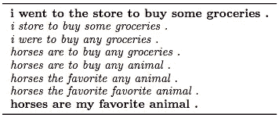
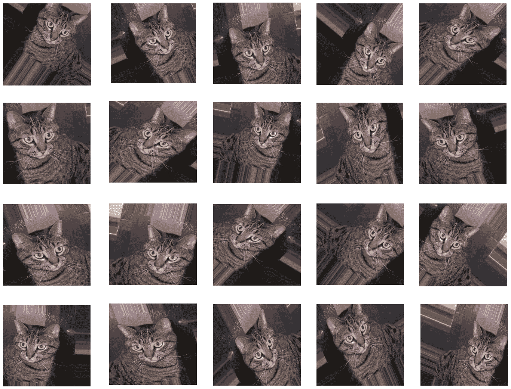
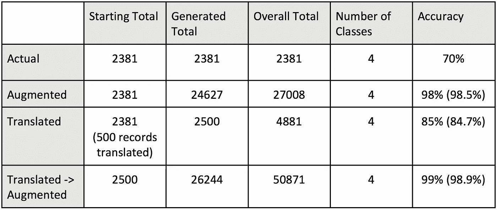

# 构建自然语言课程

> 原文：<https://towardsdatascience.com/building-a-natural-language-lesson-8cc01011a4c5?source=collection_archive---------16----------------------->

我是一名软件工程师，在[应用创新团队](https://medium.com/kainos-applied-innovation)的 [Kainos](https://www.kainos.com/) 工作，我们与客户一起使用和开发超越眼前视野的工具，以发现他们的商业价值。这包括研究新兴技术，如人工智能及其应用。

# 问题是

我们经常会发现自己的文本数据集从一开始就没有足够的数据，没有足够的变化，或者很可能有偏差。为了让我们的机器学习模型有效地提供准确的预测，需要大量的数据。对于图像，没有足够数据的解决方案是增加数据集(我将在后面展示一个例子)，从而在不增加方差的情况下创建我们正在寻找的额外数据量。

如果我的任务是对狗和猫进行分类，而我只有一只猫和 9 只狗来训练我的模型，那么这个模型就不擅长寻找猫。

所以……(鼓声 please)🥁

我们如何为我们的文本数据集做到这一点？

有没有一种方法可以自动化增加数据集大小的过程，这些数据集的数据足够多样，可以进行良好的训练？

# 基础

我的研究让我寻找可以在不损失质量或上下文的情况下扩展这些数据集的方法。我看了问题和答案的结构，因为那是我正在处理的数据；有趣的是，我们与技术互动的最常见方式基本上是通过提问和回答。因此，随着对机器学习的兴趣和发展，我们如何使用这项技术来使这些交互更加流畅？

Airbnb chatbot which organises accomodation for you via a natural conversation

我相信每个人都知道我们可以有许多不同的方式来“问或回答一个问题”；问自己这个问题让我开始关注一些技术，比如**文本生成**、**文本预测**、**文本变形**以及最后的**文本增强**。

An example of how essentially the same answer can have multiple questions

# 这项研究

## 文本生成

T ext generation 或[自然语言生成(NLG)](https://narrativescience.com/Resources/Resource-Library/Article-Detail-Page/what-is-natural-language-generation) 是机器学习的一种应用，将在未来几年在商业中大量出现。

高德纳公司对 NLG 做了如下预测:

“到 2018 年，20%的商业内容将由机器创作”

“到 2019 年，自然语言生成将成为 90%的现代商业智能和分析平台的标准功能。”

“到 2020 年，前 20 大网络内容管理(WCM)供应商将提供自然语言生成功能，作为其整体产品的一部分。”

自然语言是一个非常复杂的话题，我们已经到了机器能够理解[句子结构](https://ai.googleblog.com/2017/08/transformer-novel-neural-network.html)、[提取关键词](https://pypi.org/project/rake-nltk/)或短语、[总结文本](https://nlpforhackers.io/textrank-text-summarization/)和[将一种语言高精度地翻译成另一种语言](https://cloud.google.com/translate/docs/)的阶段。机器学习使 NLG 成为可能(看看[谷歌双工](https://ai.googleblog.com/2018/05/duplex-ai-system-for-natural-conversation.html))，它需要数据来学习；这里的问题是，我一开始没有多少数据，所以它违背了目的。任何模型都无法概括和产生我所寻找的问题的变体。

对于那些想了解模型一般化的人来说，我说的是训练模型的目的，这样它就能够理想地应对训练范围内的任何场景。在这种情况下，由于我要处理的数据量很小，这个模型不可能是一般化的，反而会[过度拟合](/overfitting-vs-underfitting-a-conceptual-explanation-d94ee20ca7f9)。

## 文本预测

由于 NLG 不适合我的需要，我简要研究了文本预测；这实质上提供了所谓的“种子文本”,并且该模型将预测下一组单词是什么。然而，这种技术和 NLG 遇到了同样的问题，它需要大量的数据；我看到的问题。

## 文本变形

接下来，我发现了一篇有趣的研究论文，题目是[“从连续空间生成句子”](https://arxiv.org/pdf/1511.06349.pdf)。这是我所能找到的文本变形的唯一证据，它在将两个不同的句子变形到一起后产生了新的句子。

不幸的是，我无法测试这个方法，我的时间是有限的，我在寻找能够让我这样做的工具；我不能花那么多时间重现一篇研究论文的结果。将来，我想测试文本变形，看看它是否可以单独扩展数据集，或者与另一种方法相结合。

Example taken from the [“Generating Sentences from a Continuous Space”](https://arxiv.org/pdf/1511.06349.pdf) paper

## 文本增补

在我的研究进行到一半时，我开始质疑是否值得研究与图像增强的常见实践更密切相关的技术。图像增强是一种扩大数据集中图像数量的技术，同时增加这些图像的变化，这将有助于我们概括我们的模型，并扩大数据暴露，以说明现实世界的细节。方法可以包括旋转、水平或垂直翻转以及缩放。虽然这些方法不能准确地翻译成文本，但它仍然是值得考虑的事情，以前我只关注涉及机器学习的方法。

An example of image augmenation using Keras

为了生成更多的文本，我测试了两种扩充文本的方法，同时努力保持数据集的高质量标准。

## 同义词替换

首先，我试图提取关键字，然后用它们的同义词替换它们，换句话说(没有双关语的意思),用同义词词典中找到的对应词替换单词。最初我只是用同义词替换名词，还没有测试过用同义词替换英语演讲的其他部分。从结果中可以立即看出，这种方法在增加数据集的规模方面是有效的，即使它无法找到某些句子的同义词。

尽管如此，像“我们”这样的词被提取出来，然后断章取义，因为机器不理解问题的意图，这是有问题的。它取了“我们”，换成了“美国”、“美国”等。用这些替换生成新问题意味着新问题没有意义，特别是对于以前没有见过原始问题的人来说。

您可以通过定义单词集合(语料库)来解决这个问题。语料库将类似于您不想找到同义词并替换的内容。我还建议你在进入替换阶段之前，尝试一下关键词提取的替代方法。对于这项研究，我使用了 [Rake](https://pypi.org/project/rake-nltk/) 库来提取关键词，甚至可以尝试不同的库。

## 语言翻译

第二种增强方法更像是一场赌博，从英语翻译成外语再翻译回英语。我在 fast.ai [论坛](https://forums.fast.ai/t/data-augmentation-for-nlp/229)上看到过这种技术被用于 [Kaggle 竞赛](https://www.kaggle.com/c/jigsaw-toxic-comment-classification-challenge)“有毒评论分类”。令人惊讶的是，这种方法非常有效，特别是对于离家更远的语言，如日语和阿拉伯语。我相信由于句子结构和单个单词意思的不同，这些语言工作得很好，这意味着它们翻译的句子与原始句子略有不同。我最后使用的语言是日语、乌克兰语、塞尔维亚语、阿拉伯语和保加利亚语。使用 Azure 的翻译服务，我随机选择了 500 个问题，并且能够产生 5 倍的数量，因为我只使用了 5 种语言。将来，我想增加翻译的问题数量，看看它对基准测试有多大影响。

下面是我的一些结果，[危险数据集](https://data.world/sya/200000-jeopardy-questions)的一个子集被用作基准数据，在使用各种方法后，逻辑回归模型在总体上进行训练。

Table describing the results from each mehod

在表格中，我标记了开始时的原始数据量、使用左侧的标记方法生成的生成量以及两者的总和。第四行以“Translated -> Augmented”开始，显示了将扩充(同义词替换)和翻译结合起来的结果。所有这些都给出了有价值的结果，并显示了应用每种方法的好处。值得在其他数据集上进一步测试这一点，并可能将其实现到聊天机器人中，看看问答系统是否可以处理更多不同的问题。

# 结论

通过进行这项研究，我意识到这是一个困难的问题，可以通过各种方法或方法的组合来解决，我很有兴趣看到机器学习的这个小而重要的领域如何扩展。

最近，在自然语言处理(NLP)方面取得了一些进展，这可能有助于这一领域，如 DecaNLP、transformer 模型以及最近谷歌对“强化学习的主动问题重构”的研究。如果你对自然语言和机器学习感兴趣，所有这些都值得一看。

# 联系✉️

如果您有兴趣了解更多我们在应用创新团队的工作，请随时联系我们 appliedinnovation@kainos.com 公司。

[Github](https://github.com/Jake-Young)//[@ jakeyoung 2410](https://twitter.com/JakeYoung2410)

