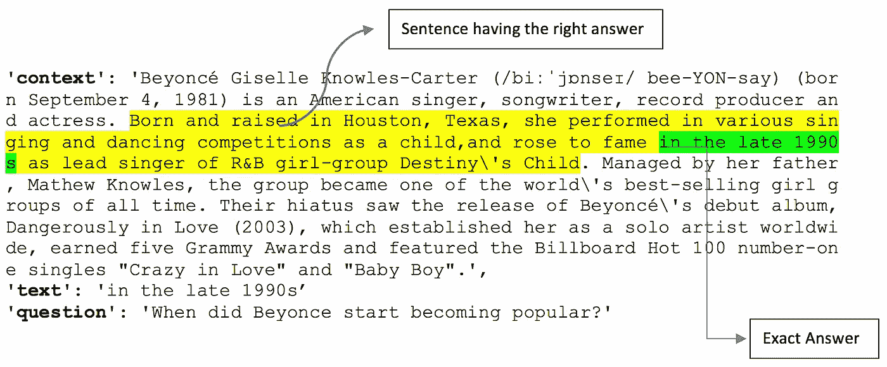
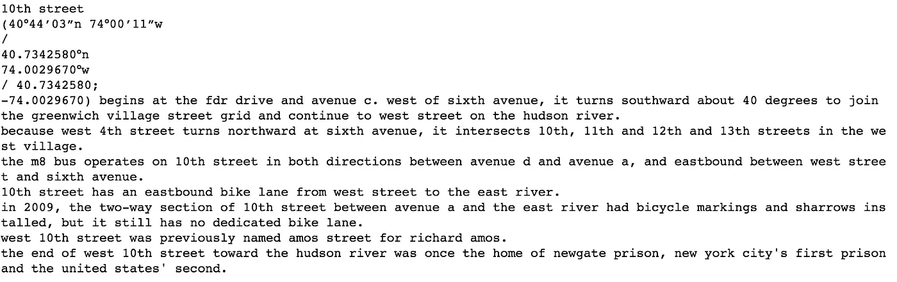
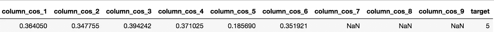
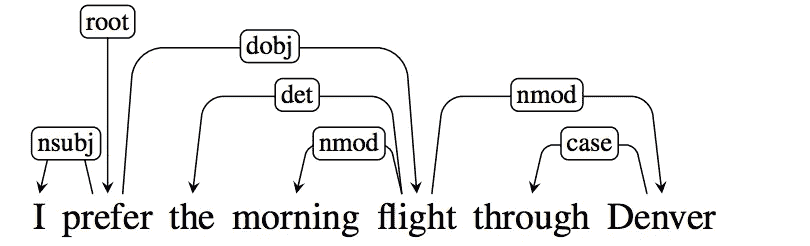
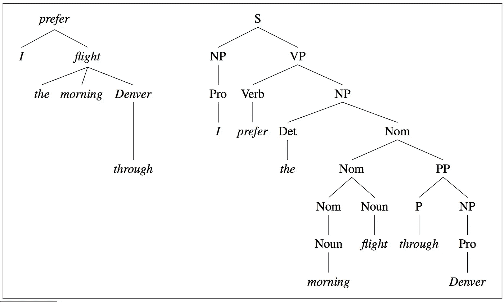
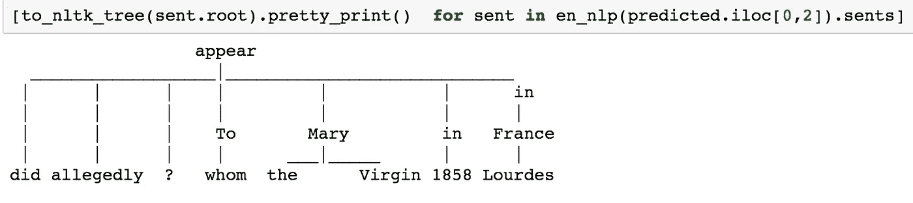
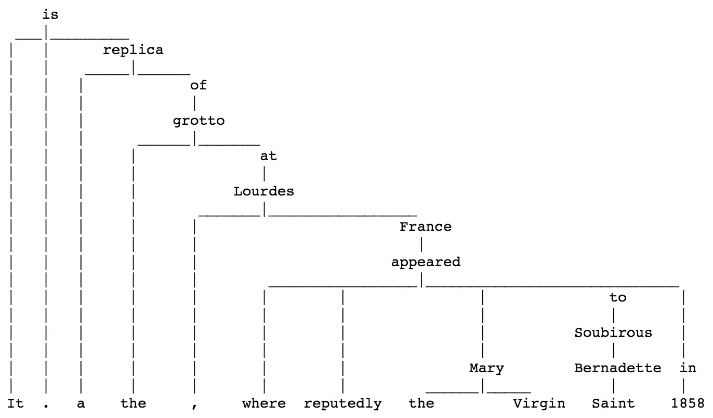
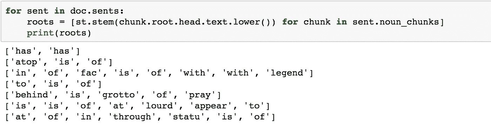
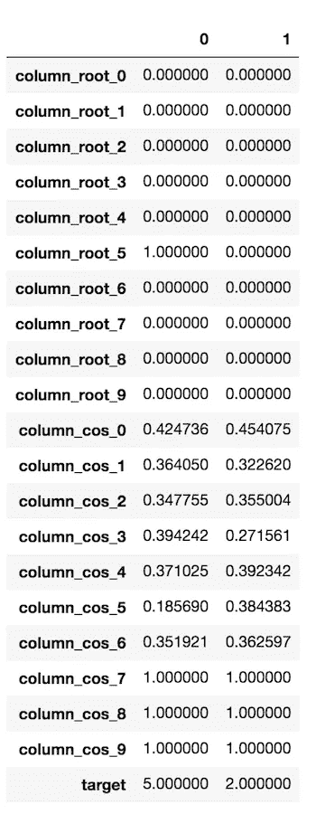

# 从头开始构建问答系统—第 1 部分

> 原文：<https://towardsdatascience.com/building-a-question-answering-system-part-1-9388aadff507?source=collection_archive---------0----------------------->

*系列文章的第一部分着重于脸书嵌入句*

随着我的硕士学位即将结束，我想从事一个有趣的 NLP 项目，在那里我可以使用我在 [USF](https://www.usfca.edu/arts-sciences/graduate-programs/data-science) 学到的所有技术(不完全是)。在我的教授的帮助下，通过与同学们的讨论，我决定从头开始建立一个问答模型。我使用的是[斯坦福问答数据集(SQuAD)](https://rajpurkar.github.io/SQuAD-explorer/) 。这个问题非常有名，所有的大公司都试图在排行榜上跳起来，并使用先进的技术，如基于注意力的 RNN 模型，以获得最佳的准确性。我发现的其他人做的与 SQuAD 相关的所有 GitHub 库也都使用了 RNNs。

然而，我的目标并不是达到最先进的准确性，而是学习不同的 NLP 概念，实现它们并探索更多的解决方案。我一直相信从基本模型开始了解基线，这也是我的方法。这一部分将重点介绍**脸书语句嵌入**以及如何将其用于构建问答系统。在未来的部分，我们将尝试实现深度学习技术，特别是针对这个问题的序列建模。所有代码都可以在这个 [Github 库](https://github.com/aswalin/SQuAD)上找到。

但是我们先来了解一下问题。我先简单概述一下，不过，对问题的详细了解可以在这里[找到](https://rajpurkar.github.io/mlx/qa-and-squad/)。

## **小队数据集**

S**S**tanford**Qu**estion**A**nswering**D**ataset(SQuAD)是一个新的阅读理解数据集，由一组维基百科文章上的众包工作者提出的问题组成，其中每个问题的答案都是相应阅读文章中的一段文字，或 *span* 。SQuAD 拥有 500+篇文章上的 100，000+问答对，比以前的阅读理解数据集大得多。

## 问题

对于训练集中的每个观察，我们都有一个**上下文、问题和文本。**这样一个观察的例子——

目标是为任何新问题和提供的上下文找到文本。这是一个封闭的数据集，意味着问题的答案总是上下文的一部分，也是上下文的一个连续跨度。我现在把这个问题分成两部分-

*   获得有正确答案的句子(突出显示黄色)
*   一旦句子最终确定，从句子中获得正确答案(突出显示为绿色)

# 引入阴差阳错，脸书句嵌入

这些天我们有各种类型的嵌入 [word2vec](https://deeplearning4j.org/word2vec.html) 、 [doc2vec](https://medium.com/scaleabout/a-gentle-introduction-to-doc2vec-db3e8c0cce5e) 、 [food2vec](https://jaan.io/food2vec-augmented-cooking-machine-intelligence/) 、 [node2vec](https://docs.google.com/presentation/d/1L-633fYUokbYqTC8R5FUfhlmWnpCO5ey6JMZ_kAnJlM/edit?usp=sharing) ，那么为什么没有 sentence2vec 呢？所有这些嵌入背后的基本思想是使用各种维度的向量来用数字表示实体，这使得计算机更容易理解它们以用于各种下游任务。解释这些概念的文章被链接以便你理解。

传统上，我们习惯于平均一个句子中所有单词的向量，称为单词袋方法。每个句子被标记为单词，这些单词的向量可以使用手套嵌入来找到，然后取所有这些向量的平均值。这种技术表现不错，但是这不是一种非常准确的方法，因为它没有考虑单词的顺序。

下面是 [**推断**](https://github.com/facebookresearch/InferSent) ，它是一个*句子嵌入*方法，提供语义句子表示。它在自然语言推理数据上进行训练，并很好地推广到许多不同的任务。

这个过程是这样的-

> 从训练数据创建词汇表，并使用该词汇表训练推理模型。一旦模型被训练，提供句子作为编码器函数的输入，该函数将返回 4096 维向量，而不管句子中的单词数。[ [演示](https://github.com/facebookresearch/InferSent/blob/master/encoder/demo.ipynb)

这些嵌入可以用于各种下游任务，如寻找两个句子之间的相似性。我已经为 Quora-问题对 kaggle 竞赛实现了同样的功能。你可以点击查看[。](https://github.com/aswalin/Kaggle/blob/master/Quora.ipynb)

说到团队问题，下面是我尝试使用句子嵌入来解决前一部分问题的第一部分的方法

*   将段落/上下文分成多个句子。我知道的处理文本数据的两个包是-[Spacy](https://spacy.io/usage/spacy-101)&[text blob](http://textblob.readthedocs.io/en/dev/)。我也使用了包 TextBlob。它进行智能拆分，不像 spacy 的句子检测可以根据周期给你随机的句子。下面提供了一个例子:

**Example: Paragraph**

**TextBlob is splitting it into 7 sentences which makes sense**

**Spacy is splitting it into 12 sentences**

*   使用推理模型获得每个句子和问题的向量表示
*   根据每个句子-问题对的余弦相似度和欧几里德距离，创建距离等特征

# 模型

我用两种主要方法进一步解决了这个问题-

*   不使用目标变量的无监督学习。这里，我从与给定问题距离最小的段落中返回句子
*   监督学习-训练集的创建对于这一部分来说非常棘手，原因是每个部分没有固定数量的句子，答案可以从一个单词到多个单词不等。我能找到的唯一一篇实现了逻辑回归的论文是由发起这个竞赛&数据集的斯坦福团队发表的。他们使用了这篇[论文](https://arxiv.org/pdf/1606.05250.pdf)中解释的多项式逻辑回归，并创建了**1.8 亿个特征(该模型的句子检测准确率为 79%)** ，但不清楚他们是如何定义目标变量的。如果任何人有任何想法，请在评论中澄清。稍后我会解释我的解决方案。

## 无监督学习模型

在这里，我首先尝试使用欧几里德距离来检测与问题距离最小的句子。这个模型的精确度大约为 45%。然后，我切换到余弦相似度，准确率从 **45%提高到 63%** 。这是有意义的，因为欧几里德距离不关心向量之间的对齐或角度，而余弦则负责这一点。在矢量表示的情况下，方向很重要。

但是这种方法没有利用提供给我们的带有目标标签的丰富数据。然而，考虑到解决方案的简单性质，这仍然是一个没有任何培训的好结果。我认为体面的表现归功于脸书句子嵌入。

## 监督学习模型

这里，我已经将目标变量从文本转换为包含该文本的句子索引。为了简单起见，我把我的段落长度限制在 10 句以内(大约 98%的段落只有 10 句或更少)。因此，在这个问题中，我有 10 个标签要预测。

对于每个句子，我都建立了一个基于余弦距离的特征。如果一个段落的句子数量较少，那么我将把它的特征值替换为 1(最大可能余弦距离),这样总共有 10 个句子。用一个例子来解释这个过程会比较容易。

我们来看看训练集的第一个观察/行。有答案的句子在上下文中被加粗。：

问题——“1858 年在法国卢尔德，圣母玛利亚据说是向谁显现的？”
**背景**——“从建筑上来说，这所学校具有天主教的特征。在主楼的金色圆顶上是一座金色的圣母玛利亚雕像。在主建筑的正前方，正对着它的是一尊铜制的基督雕像，双臂高举，上面写着“Venite Ad Me Omnes”的字样。主楼旁边是圣心大教堂。长方形会堂的后面是一个洞穴，一个祈祷和沉思的地方。这是一个法国卢尔德石窟的复制品，据说圣母玛利亚于 1858 年在这里出现在圣贝尔纳黛特·索比罗斯面前。在主车道的尽头(在一条直线上，连接着三座雕像和金色穹顶)，是一座简单、现代的玛丽石像。
**正文**——《圣贝尔纳黛特·索比罗斯》

在这种情况下，目标变量将变成 5，因为这是粗体句子的索引。我们将有 10 个特征，每个特征对应于段落中的一个句子。column_cos_7、column_cos_8 和 column_cos_9 的缺失值用 1 填充，因为这些句子在段落中不存在

**依赖解析** 我为这个问题使用的另一个特性是**“依赖解析树”**。这将模型的精确度略微提高了 5%。这里，我使用了空间树解析，因为它有丰富的 API 来导航树。

For more details: Please check out [Stanford Lecture](https://web.stanford.edu/~jurafsky/slp3/14.pdf)

> 单词之间的关系在句子上方用有向的、有标记的弧线从首字母到从属字母来表示。我们称之为类型依赖结构，因为标签是从固定的语法关系清单中提取的。它还包括一个根节点，该节点显式地标记了树的根，即整个结构的头部。

让我们使用空间树解析来可视化我们的数据。我使用的是上一节中提供的同一个例子。

**问题—“**1858 年在法国卢尔德，圣母玛利亚据称是向谁显现的？”

**有答案的句子—** “这是一个法国卢尔德石窟的复制品，据说圣母玛利亚于 1858 年在那里出现在圣贝尔纳黛特·索比罗斯面前”

段落中所有句子的词根

想法是将问题的词根匹配到句子的所有词根/子词根。由于一个句子中有多个动词，所以我们可以得到多个词根。如果问题的词根包含在句子的词根中，那么这个问题被那个句子回答的可能性就更大。考虑到这一点，我为每个值为 1 或 0 的句子创建了一个特征。这里，1 表示问句的词根包含在句根中，否则为 0。

> 注意:在比较句子的词根和问题词根之前，做词干分析是很重要的。在前面的例子中，问句的词根是**出现**，而句子中的词根是**出现**。如果不把**出现的** & **出现的**归结为一个共同术语，它们就不可能匹配。

下面的示例是转置的数据，带有来自已处理训练数据的 2 个观察值。因此，对于段落中的 10 个句子，结合余弦距离和根匹配，我们总共有 20 个特征。目标变量的范围从 0 到 9。

> 注意:对于逻辑回归，标准化数据中的所有列是非常重要的。

一旦创建了训练数据，我就使用了**多项式逻辑回归、随机森林&梯度推进技术**。

**多项逻辑回归**对验证集的准确率为 **65%** 。考虑到原始模型有很多特征，准确率为 **79%** ，这个模型非常简单。**随机森林**给出了 **67%** 的准确率，最后 **XGBoost** 在验证集上表现最好，准确率为 **69%** 。

我将增加更多的功能(NLP 相关)来改善这些模型。

非常欢迎与功能工程或其他改进相关的想法。这里提供了与上述概念相关的所有代码[。](https://github.com/aswalin/SQuAD)

在下一部分中，我们将重点关注从这一部分中入围的句子中提取文本(正确跨度)。同时，看看我的其他博客[这里](https://medium.com/@aswalin)！

关于我:[https://alviraswalin.wixsite.com/alvira](https://alviraswalin.wixsite.com/alvira)。有兴趣与跨职能部门合作，从数据中获得见解，并应用机器学习知识来解决复杂的数据科学问题。
**领英:**[**www.linkedin.com/in/alvira-swalin**](http://www.linkedin.com/in/alvira-swalin)

# 参考

1.  [带有代码的 Github 库](https://github.com/aswalin/SQuAD)
2.  [脸书回购延期](https://github.com/facebookresearch/InferSent)
3.  [解释逻辑回归的最佳资源论文](https://arxiv.org/pdf/1606.05250.pdf)
4.  [博客解释问题](https://rajpurkar.github.io/mlx/qa-and-squad/)
5.  [排行榜&数据集](https://rajpurkar.github.io/SQuAD-explorer/)