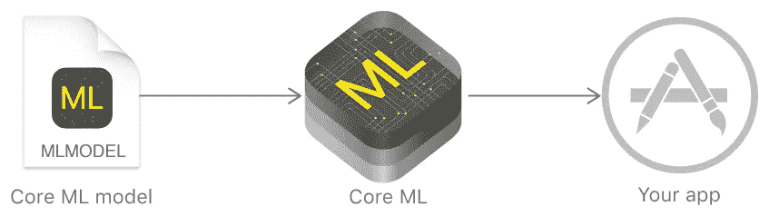
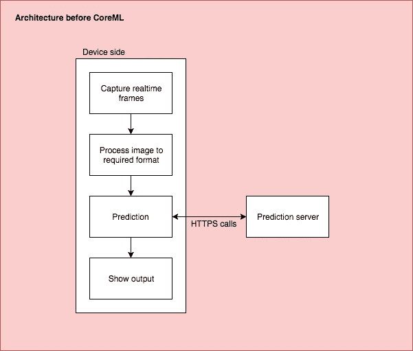
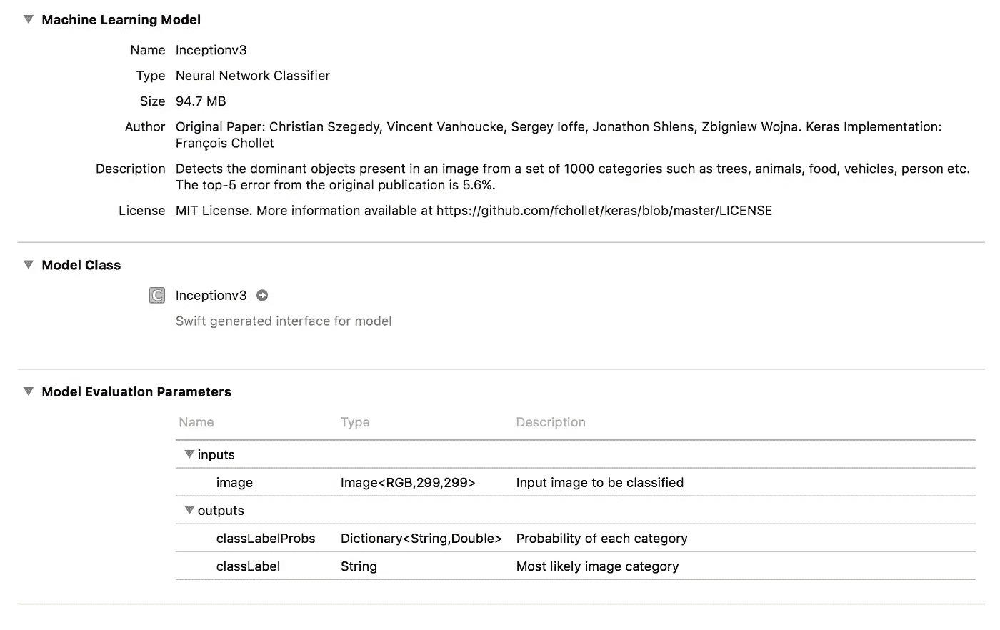
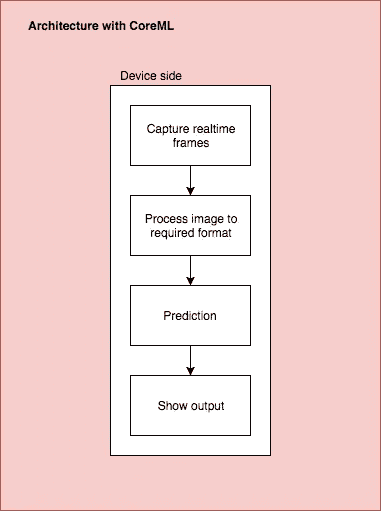
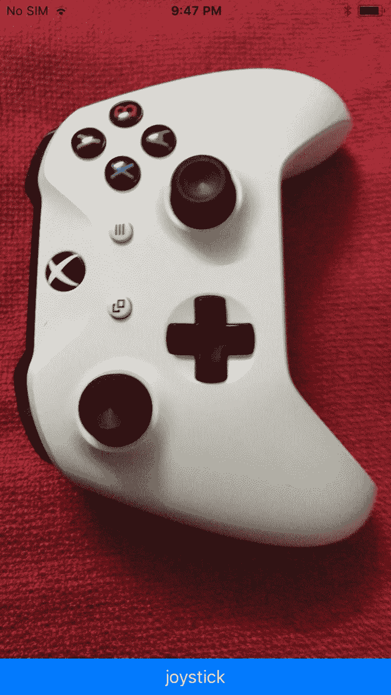
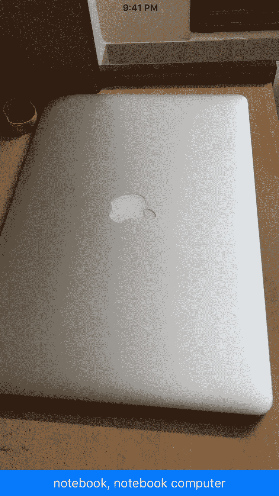
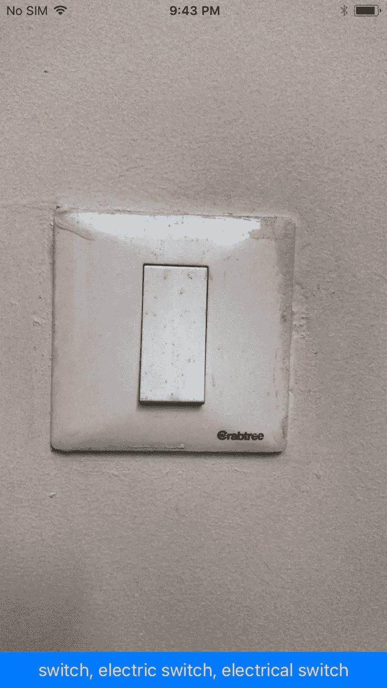

# 为 iOS 构建实时对象识别器

> 原文：<https://towardsdatascience.com/building-a-real-time-object-recognizer-for-ios-a678d2baf8f0?source=collection_archive---------3----------------------->

使用 CoreML 和 Swift

Credits — Apple ([https://developer.apple.com/documentation/coreml](https://developer.apple.com/documentation/coreml))

CoreML 是 WWDC 2017 上宣布的令人兴奋的功能之一。它是苹果的框架，可以用来将机器学习集成到你的应用程序中，全部离线😉。

> Core ML 允许您将各种各样的机器学习模型集成到您的应用程序中。除了支持超过 30 种层类型的广泛深度学习，它还支持标准模型，如树集成、支持向量机和广义线性模型。因为它建立在 Metal 和 Accelerate 等底层技术之上，所以 Core ML 无缝地利用 CPU 和 GPU 来提供最大的性能和效率。你可以在设备上运行机器学习模型，这样数据就不需要离开设备进行分析。—苹果关于机器学习的文档([https://developer.apple.com/machine-learning/](https://developer.apple.com/machine-learning/))

当你深入了解预测是如何发生的以及发生在哪里时，CoreML 的重要性就显现出来了。到目前为止，每个人都习惯于将机器学习集成到应用程序中，在托管服务器中进行预测。如果它是一个对象识别应用程序，您必须从设备中捕获帧，将这些数据发送到预测引擎，等到图像完全上传到服务器，并最终获得输出。这种方法主要有两个问题——网络延迟和用户隐私。现在，所有这些处理都可以在设备中进行，从而减少了这两个问题。

# 从头开始构建

我们可以尝试使用 CoreML 并为此实现一个简单的设备上解决方案。我将在不提及 iOS 或 Swift 基础知识的情况下讲述重要步骤。

我们要做的第一件事是获得一个 iOS 11 设备和 Xcode 9。

如果你不熟悉机器学习，看看这里的简介。或者你可以从这里得到一个很高层次的概述。

## 机器学习

这种技术赋予计算机学习的能力，而不需要明确地编码问题的解决方案。

这里基本上涉及两个过程——训练和预测。

**训练**是我们给模型不同组的输入(和相应的输出)来从模式中学习的过程。这个被训练的模型被给予一个它以前没有见过的输入，以便**根据它早先的观察来预测**。

## 选择模型

所以我们要做的第一件事就是为你的项目选择一个好的模型。有许多预先训练好的模型可用于图像识别。或者你甚至可以训练自己的模型来获得更好的体验。

从[苹果的机器学习门户](https://developer.apple.com/machine-learning/)有好的模型可以作为 CoreML 模型。或者如果你有自己的模型，你可以使用苹果公司的 [CoreML 工具](https://pypi.python.org/pypi/coremltools)将其转换成 CoreML 支持的模型。

我选择了苹果门户中可用的 Inception V3 库。

> **Inception v3** —从一组 1000 个类别中检测图像中存在的主要对象，例如树木、动物、食物、车辆、人等等。

## 创建 iOS 项目

您可以使用 swift 创建一个基本的 iOS 项目，并为此创建一个包含视频预览层和标签的视图控制器。

## 从视频预览中获取帧

像往常一样获取当前帧，这是我们已经知道的。这在这篇入侵代码[文章](https://www.invasivecode.com/weblog/AVFoundation-Swift-capture-video/)中有解释。

## 使用 Inception v3 进行预测

当一个输入图像给你一个它知道的类别集合中的一个的概率时，考虑我们的初始模型作为黑盒。

从 Apple 的门户网站下载模型，将其拖放到您的项目中。您可以从 Xcode 中看到模型描述。

Inceptionv2.mlmodel in model viewer of Xcode

您可以看到，该模型将 299x299 像素的图像作为输入，并给出输出:

*   图像最可能属于的类别
*   每个类别的概率列表

我们可以利用这些参数中的任何一个来确定类别。我用的第一个是字符串，直接打印在屏幕上。

您还可以看到，Xcode 直接从 mlmodel 对象创建了一个 swift 模型(Inceptionv3.swift)。你不必为此做任何额外的改动。

## 使用

我们可以利用 Xcode 生成的预测 API，如下所示:

预测很简单:

但是它需要一个 CVPixelBuffer 的对象而不是 UIImage 来进行预测，hackingwithswift.com 的家伙在“机器学习和视觉”一节中对此做了很好的解释。

我已经创建了 UIImage 类别，该类别与 resize API 一起对此进行了抽象。

# 最终建筑

# 结果

该应用程序能够正确识别几乎所有提供的输入。

从回购中获取完整代码—[https://github.com/m25lazi/inception](https://github.com/m25lazi/inception)。⭐️，如果你喜欢的话。