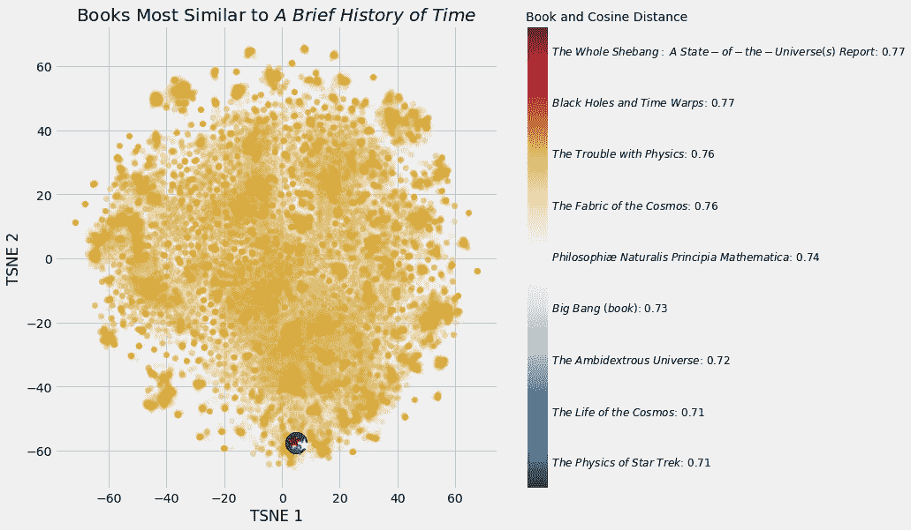
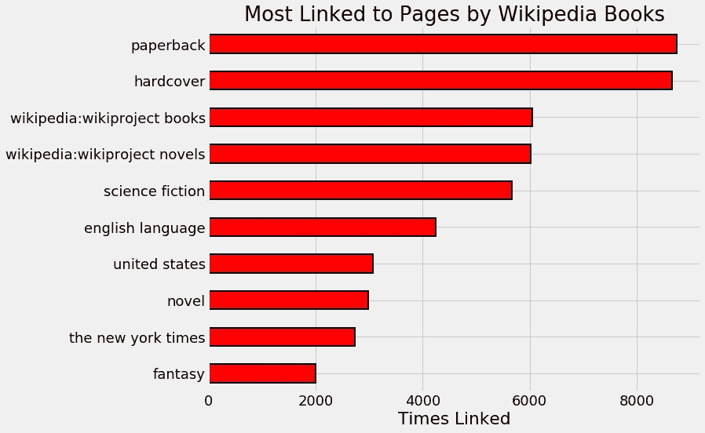
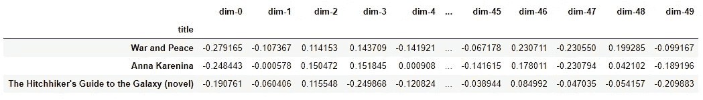
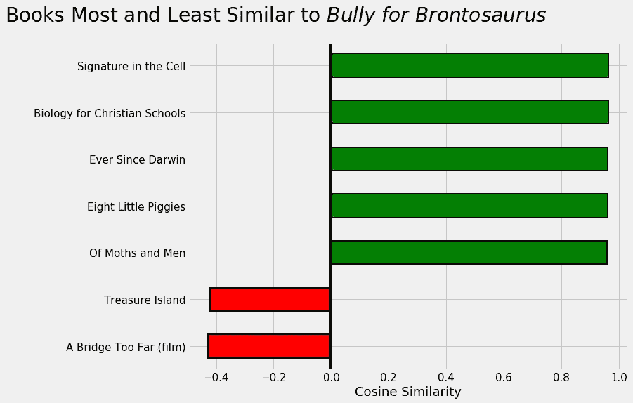
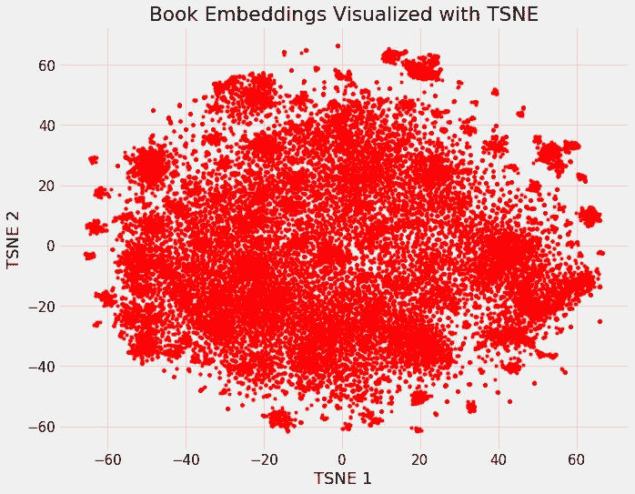
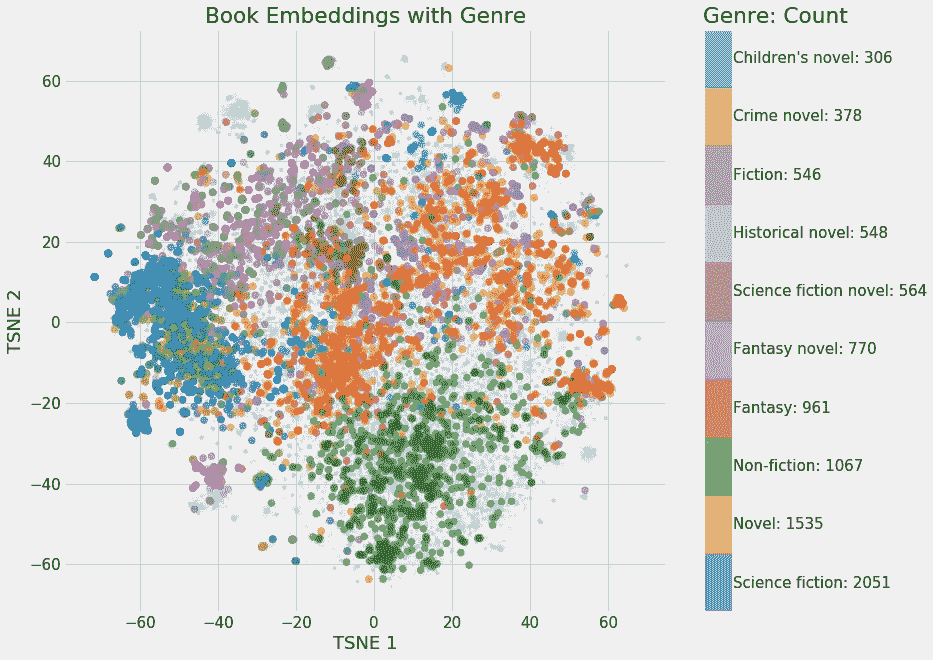
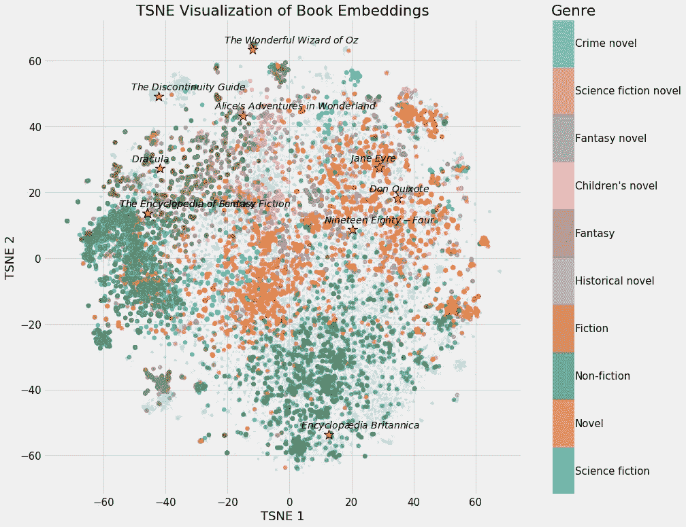
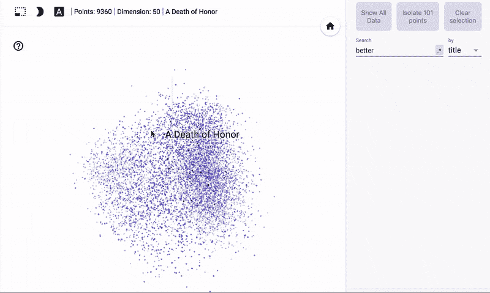

# 使用神经网络嵌入构建推荐系统

> 原文：<https://towardsdatascience.com/building-a-recommendation-system-using-neural-network-embeddings-1ef92e5c80c9?source=collection_archive---------2----------------------->


([Source](https://www.pexels.com/photo/body-of-water-during-golden-hour-1118945/))

## 如何利用深度学习和维基百科创建图书推荐系统

深度学习可以做一些[不可思议的事情](https://blog.statsbot.co/deep-learning-achievements-4c563e034257)，但其用途往往在学术论文中被[掩盖，或者需要](https://arxiv.org/abs/1301.3781)[只有大公司才能获得的计算资源](https://dawn.cs.stanford.edu/benchmark/ImageNet/train.html)。尽管如此，深度学习的应用可以在个人电脑上完成，不需要高级学位。在本文中，我们将看到如何使用神经网络嵌入来创建一个图书推荐系统，该系统使用所有关于图书的维基百科文章。

我们的推荐系统将建立在链接到相似维基百科页面的书籍彼此相似的理念之上。我们可以表现出这种相似性，从而通过使用神经网络学习书籍和维基百科链接的嵌入来提出建议。最终的结果是一个有效的推荐系统和深度学习的实际应用。



Most Similar Books to Stephen Hawking’s A Brief History of Time

这个项目的完整代码可以从 GitHub 上的 [Jupyter 笔记本中获得。如果你没有 GPU，你也可以在 Kaggle](https://github.com/WillKoehrsen/wikipedia-data-science/blob/master/notebooks/Book%20Recommendation%20System.ipynb) 上找到[笔记本，在那里你可以免费用一个 GPU 训练你的神经网络。本文将重点关注实现，神经网络嵌入的概念在之前的文章](https://www.kaggle.com/willkoehrsen/neural-network-embedding-recommendation-system)中有所涉及。(要了解如何检索我们将使用的数据——维基百科上的所有书籍文章——请看一下[这篇文章](https://medium.com/p/c08efbac5f5c?source=your_stories_page---------------------------)。)

这个项目改编自[深度学习食谱](http://shop.oreilly.com/product/0636920097471.do)，这是一本关于应用深度学习的[动手示例](https://github.com/DOsinga/deep_learning_cookbook)的优秀书籍。

# 神经网络嵌入

嵌入是一种将离散的分类变量表示为连续向量的方法。与一次性编码之类的编码方法相比，神经网络嵌入是*低维的和学习过的*，这意味着它们将相似的实体在嵌入空间中彼此放置得更近。

为了创建嵌入，我们需要一个神经网络嵌入模型和一个受监督的机器学习任务。我们网络的最终结果将是把每本书表示为 50 个连续数字的向量。

虽然嵌入本身并不有趣——它们只是向量——但它们可以用于三个主要目的:

1.  在嵌入空间中寻找最近的邻居
2.  作为机器学习模型的输入
3.  低维可视化

该项目主要涵盖第一个用例，但我们也将看到如何从嵌入创建可视化。神经网络嵌入的实际应用包括[机器翻译的单词嵌入](https://arxiv.org/abs/1705.03127)和[分类变量的实体嵌入](https://arxiv.org/abs/1604.06737)。

# 数据:维基百科上的所有书籍

像通常的数据科学项目一样，我们需要从高质量的数据集开始。[在这篇文章](https://medium.com/p/c08efbac5f5c?source=your_stories_page---------------------------)中，我们看到了如何下载和处理维基百科上的每一篇文章，搜索任何关于书籍的页面。我们保存了书名、基本信息、图书页面上指向其他维基百科页面的链接(wikilinks)以及外部站点的链接。为了创建推荐系统，我们需要的唯一信息是标题和 wikilinks。

```
**Book Title: 'The Better Angels of Our Nature'****Wikilinks:** **['Steven Pinker',
  'Nation state',
  'commerce',
  'literacy',
  'Influence of mass media',
  'Rationality',
  "Abraham Lincoln's first inaugural address",
  'nature versus nurture',
  'Leviathan']**
```

即使在处理神经网络时，探索和清理数据也很重要，在笔记本中，我对原始数据做了几处修改。例如，查看链接最多的页面:



Wikipedia pages most often linked to by books on Wikipedia.

我们看到前四页是一般性的，对推荐没有帮助。一本书的格式没有告诉我们关于内容的任何事情:知道一本书是`paperback`或`hardcover`并不允许我们——或神经网络——找出它相似的其他书。因此，我们可以去除这些链接，帮助神经网络区分书籍。

> 考虑最终目的可以在数据清理阶段有所帮助，并且这一行动本身就可以显著改进建议。

出于纯粹的好奇，我想在维基百科上找到与其他书链接最多的书。以下是 10 本“联系最紧密”的维基百科书籍:


Books on Wikipedia most often linked to by other books on Wikipedia.

这是参考书和经典书籍的混合体，很有意义。

经过数据清理，我们有了一套 **41758** 独有维基链接和 **37020** 独有书籍。希望每个人都有一本书！

一旦我们确信我们的数据是干净的，我们就需要开发一个有标签的训练样本的监督机器学习任务。

## 监督学习任务

为了*学习有意义的嵌入，*我们的神经网络必须被训练来完成一个目标。从项目的指导假设——相似的书籍链接到相似的维基百科页面——开始，我们可以将问题表述如下:给定一个(书名，维基链接)对，确定维基链接是否出现在该书的文章中。

我们实际上不需要把书的文章交给电视台。相反，我们将输入成千上万的训练样本，包括书名、维基链接和标签。我们给网络一些*真实的例子*——实际上存在于数据集中——和一些虚假的例子，最终它会学习嵌入来区分维基链接何时出现在一本书的页面上。

表达监督学习任务是这个项目最重要的部分。嵌入是为特定的*任务学习的，并且只与那个问题相关。如果我们的任务是确定哪些书是简·奥斯汀写的，那么嵌入将反映这一目标，在嵌入空间中将奥斯汀写的书放在一起。我们希望通过训练来判断一本书的页面上是否有某个维基链接，网络可以学习嵌入，将内容相似的书彼此放得更近。*

一旦我们概述了学习任务，我们需要用代码实现它。首先，因为神经网络只能接受整数输入，所以我们创建了从每个唯一书籍到整数的映射:

```
# Mapping of books to index and index to books
book_index = {book[0]: idx for idx, book in enumerate(books)}

book_index['Anna Karenina']**22494**
```

我们也对链接做同样的事情。在此之后，为了创建训练集，我们列出了数据中的所有(book，wikilink)对。这需要遍历每本书，并在页面上为每个 wikilink 记录一个例子:

```
pairs = []

*# Iterate through each book*
for book in books:

    title = book[0]
    book_links = book[2] # Iterate through wikilinks in book article
    for link in book_links: # Add index of book and index of link to pairs
        pairs.extend((book_index[title],                
                      link_index[link]))
```

这给了我们总共 **772798** 个真实的例子，我们可以从中取样来训练模型。为了生成错误的示例(稍后完成),我们将简单地随机选取一个链接索引和图书索引，确保它不在`pairs`中，然后将其用作负面观察。

**关于训练/测试集的说明**

虽然使用单独的验证和测试集是正常监督机器学习任务的**必须**，但在这种情况下，我们的主要目标是**而不是**制作最准确的模型，而是生成嵌入。预测任务只是我们为这些嵌入训练我们的网络的手段。在训练结束时，我们不会在新数据上测试我们的模型，所以我们不需要评估性能或使用验证集来防止过度拟合。为了获得最佳嵌入，我们将使用所有示例进行训练。

# 嵌入模型

虽然神经网络嵌入听起来在技术上很复杂，但使用 [Keras 深度学习框架](https://keras.io/)实现起来相对容易。(如果你是深度学习新手，我建议从 Keras 开始。TensorFlow 可能会给你更多的控制，但 Keras 在开发方面是无可匹敌的)。

嵌入模型有 5 层:

1.  **输入:**书本和链接的并行输入
2.  **嵌入:**平行长度 50 书籍和链接的嵌入
3.  **点:**通过计算点积合并嵌入
4.  **整形:**需要将点积整形为单个数字
5.  **密集:**一个具有乙状结肠激活的输出神经元

在[嵌入神经网络中，](https://keras.io/layers/embeddings/)嵌入是神经网络的参数——权重——在训练过程中调整，以最小化目标的损失。神经网络将一本书和一个链接作为整数，并输出一个介于 0 和 1 之间的预测，与真实值进行比较。该模型用`[Adam](https://machinelearningmastery.com/adam-optimization-algorithm-for-deep-learning/)` [优化器](https://machinelearningmastery.com/adam-optimization-algorithm-for-deep-learning/)(随机梯度下降的变体)编译，该优化器在训练期间改变嵌入以最小化该二元分类问题的`binary_crossentropy`。

下面是完整模型的代码:

这个框架可以用于许多嵌入模型。需要理解的重要一点是，嵌入是*模型参数(权重)*，也是我们想要的最终结果。我们不在乎模型是否准确，我们想要的是相关的嵌入。

> 我们习惯于将模型中的权重作为做出准确预测的手段，但是在嵌入模型中，权重是目标，而预测是学习嵌入的手段。

如模型摘要所示，有将近 400 万个权重:

通过这种方法，我们不仅可以获得书籍的嵌入，还可以获得链接，这意味着我们可以比较所有书籍链接的维基百科页面。

## 生成训练样本

神经网络是[批量学习器](https://en.wikipedia.org/wiki/Online_machine_learning#Batch_learning),因为它们是在一小组样本——观察值——上训练的，一次经过许多轮，称为历元。训练神经网络的常见方法是使用[生成器](https://wiki.python.org/moin/Generators)。这是一个`yields`(不是`returns`)批量处理样本的功能，因此整个结果不会保存在内存中。虽然在这个问题中这不是问题，但是生成器的好处是大型训练集不需要全部加载到内存中。

我们的生成器接受训练`pairs`，每批阳性样本数(`n_positive`，每批阴性:阳性样本比率(`negative_ratio`)。每次调用生成器时，它都会生成一批新的阳性和阴性样本。为了得到正面的例子，我们随机抽样真实的配对。对于反面的例子，我们随机抽取一本书和一个链接，确保这个配对不在正确的配对中，然后将它添加到批处理中。

下面的代码完整地展示了生成器。

每次我们调用生成器上的`next`，我们都会得到一个新的训练批次。

```
next(generate_batch(pairs, n_positive = 2, negative_ratio = 2))**({'book': array([ 6895., 29814., 22162.,  7206., 25757., 28410.]),
  'link': array([  260., 11452.,  5588., 34924., 22920., 33217.])}, 
  array([ 1., -1.,  1., -1., -1., -1.]))**
```

有了监督任务、训练生成器和嵌入模型，我们就可以学习书籍嵌入了。

## 培训模式

有几个训练参数可供选择。第一个是每批的正例数。一般来说，我试着从小批量开始，然后逐渐增加，直到性能开始下降。此外，我们需要为每个正例选择训练的负例数量。我建议尝试几个选项，看看什么效果最好。因为我们没有使用验证集来[实现提前停止](https://keras.io/callbacks/#earlystopping)，所以我选择了一些时期，超过这些时期，训练损失不会减少。

```
n_positive = 1024

gen = generate_batch(pairs, n_positive, negative_ratio = 2)

*# Train*
h = model.fit_generator(gen, epochs = 15, 
                        steps_per_epoch = len(pairs) // n_positive)
```

(如果训练参数似乎是任意的，从某种意义上来说，它们是任意的，但基于 [*深度学习*](https://www.deeplearningbook.org/) 中概述的最佳实践。像机器学习的大多数方面一样，训练神经网络在很大程度上是凭经验的。)

一旦网络完成训练，我们就可以提取嵌入。

```
*# Extract embeddings*
book_layer = model.get_layer('book_embedding')
book_weights = book_layer.get_weights()[0]
```

# 应用嵌入:提出建议

嵌入本身相当无趣:它们只是每本书和每个链接的 50 个数字的向量:



What War and Peace Looks Like as a Vector.

然而，我们可以将这些向量用于两个不同的目的，第一个目的是制作我们的图书推荐系统。为了在嵌入空间中找到与查询书最接近的书，我们获取该书的向量，并找到它与所有其他书的向量的点积。如果我们的嵌入是归一化的，那么向量之间的点积表示[余弦相似度](http://blog.christianperone.com/2013/09/machine-learning-cosine-similarity-for-vector-space-models-part-iii/)，范围从-1(最不相似)到+1(最相似)。

查询列夫·托尔斯泰的经典作品 [*《战争与和平》*](https://en.wikipedia.org/wiki/War_and_Peace)的嵌入结果:

```
**Books closest to War and Peace.

Book: Anna Karenina               Similarity: 0.92
Book: The Master and Margarita    Similarity: 0.92
Book: Demons (Dostoevsky novel)   Similarity: 0.91
Book: The Idiot                   Similarity: 0.9
Book: Crime and Punishment        Similarity: 0.9**
```

这些建议很有道理！这些都是[经典的俄罗斯小说](https://www.google.com/search?rlz=1C5CHFA_enUS805US805&ei=rR21W5iENcGIggf0lrCwAg&q=classic+russian+novels&oq=classic+russian+novels&gs_l=psy-ab.3..0j0i22i30.20451.23296..23425...0.0..0.207.2208.17j4j1......0....1..gws-wiz.......0i71j35i39j0i131j0i67j0i20i264j0i131i67j0i131i20i264.7Ft4zcztdIc)。当然，我们可以去 GoodReads 寻找这些相同的建议，但是为什么不自己建立这个系统呢？我鼓励你使用笔记本，自己探索嵌入的内容。

```
**Books closest to The Fellowship of the Ring.****Book: The Return of the King       Similarity: 0.96
Book: The Silmarillion             Similarity: 0.93
Book: Beren and Lúthien            Similarity: 0.91
Book: The Two Towers               Similarity: 0.91**
```

除了嵌入书籍，我们还嵌入了链接，这意味着我们可以找到与给定维基百科页面最相似的链接:

```
**Pages closest to steven pinker.

Page: the blank slate           Similarity: 0.83
Page: evolutionary psychology   Similarity: 0.83
Page: reductionism              Similarity: 0.81
Page: how the mind works        Similarity: 0.79**
```

目前，我正在读一本由史蒂芬·杰·古尔德写的精彩散文集，名为《雷龙的恶霸》。接下来该读什么？



Recommendations for my next book.

# 嵌入的可视化

嵌入最吸引人的一个方面是，它们可以用来可视化概念，比如相对于彼此的*小说*或*非小说*。这需要进一步的降维技术来使维数达到 2 或 3。最流行的约简技术是另一种嵌入方法: [t 分布随机邻居嵌入(TSNE)](https://distill.pub/2016/misread-tsne/) 。

从维基百科上所有书籍的 37000 维空间开始，我们使用嵌入将其映射到 50 维，然后使用 TSNE 将其映射到 2 维。这会产生以下图像:



Embeddings of all books on Wikipedia.

这张图片本身并不那么有启发性，但是一旦我们开始根据书籍的特点给它着色，我们就开始看到集群的出现:



非小说和科幻小说有一些明确的分类(只有前 10 种类型被突出显示),它们有不同的部分。鉴于小说内容的多样性，这些小说似乎无处不在。

我们也可以嵌入国家:


我有点惊讶这些国家是如此的与众不同！显然，澳大利亚的书籍是非常独特的。

此外，我们可以在维基百科地图上突出显示某些书籍:


The corner of Wikipedia with books about the entire Universe

笔记本里有更多的视觉化图像，你可以自己制作。我再给你一个展示 10 本“联系最紧密”的书的例子:



Book embeddings with 10 most linked to books and genres.

关于 [TSNE](https://lvdmaaten.github.io/tsne/) 需要注意的一点是，它试图保持原始空间中向量之间的距离，但因为它减少了维数，所以可能会扭曲原始分离。因此，在 50 维嵌入空间中彼此靠近的书籍在 2 维 TSNE 嵌入中可能不是最近的邻居。

## 交互式可视化

这些可视化非常有趣，但我们可以使用 TensorFlow 的[投影仪](https://projector.tensorflow.org/)工具制作令人惊叹的交互式图形，该工具专门为可视化神经网络嵌入而设计。我计划写一篇关于如何使用这个工具的文章，但是现在这里是一些结果:



Interactive visualizations made with projector

要以互动方式浏览书籍样本，请点击这里的。

## 潜在的其他项目

数据科学项目通常不是完全靠自己发明的。我从事的许多项目都是来自其他数据科学家的想法，我对这些想法进行了改编、改进和构建，以形成一个独特的项目。(这个项目的灵感来自于[深度学习食谱](https://github.com/DOsinga/deep_learning_cookbook)中一个类似的电影推荐项目。)

带着这种态度，这里有一些方法来继续这项工作:

1.  使用*外部链接*而不是 wikilinks 创建嵌入。这些是维基百科以外的网页，可能会产生不同的嵌入。
2.  使用嵌入来训练受监督的机器学习模型，以预测包括流派、作者和国家的书籍特征。
3.  在维基百科上选择一个主题类别，创建自己的推荐系统。你可以使用人物、地标，甚至历史事件。您可以使用[这个笔记本](https://github.com/WillKoehrsen/wikipedia-data-science/blob/master/notebooks/Downloading%20and%20Parsing%20Wikipedia%20Articles.ipynb)获取数据，使用[这个笔记本](https://github.com/WillKoehrsen/wikipedia-data-science/blob/master/notebooks/Book%20Recommendation%20System.ipynb)进行嵌入。

这绝不是一个家庭作业，只是一些项目想法，如果你想把你所读到的付诸实践。如果你决定接手一个项目，我很乐意听听你的想法。

# 结论

神经网络嵌入是一种将离散分类变量表示为连续向量的方法。作为一种*学习的低维*表示，它们对于寻找相似的类别、作为机器学习模型的输入或者可视化概念地图是有用的。在这个项目中，我们使用神经网络嵌入来创建一个有效的图书推荐系统，该系统基于链接到相似页面的图书彼此相似的思想。

创建神经网络嵌入的步骤如下:

1.  收集数据。神经网络需要许多训练示例。
2.  制定一个有监督的任务来学习反映问题的嵌入。
3.  建立和训练嵌入式神经网络模型。
4.  提取嵌入内容以进行推荐和可视化。

详细内容可以在[笔记本](https://github.com/WillKoehrsen/wikipedia-data-science/blob/master/notebooks/Book%20Recommendation%20System.ipynb)中找到，我鼓励任何人参与这个项目。虽然深度学习可能因为技术复杂性或计算资源而看起来势不可挡，但这是通过有限的学习就可以在个人电脑上完成的许多应用之一。深度学习是一个不断发展的领域，这个项目是通过构建一个有用的系统来开始的好方法。而且，当你不在研究深度学习的时候，现在你知道你应该读什么了！

一如既往，我欢迎反馈和建设性的批评。可以通过 Twitter [@koehrsen_will](http://twitter.com/@koehrsen_will) 或我的个人网站 [willk.online](https://willk.online) 找到我。