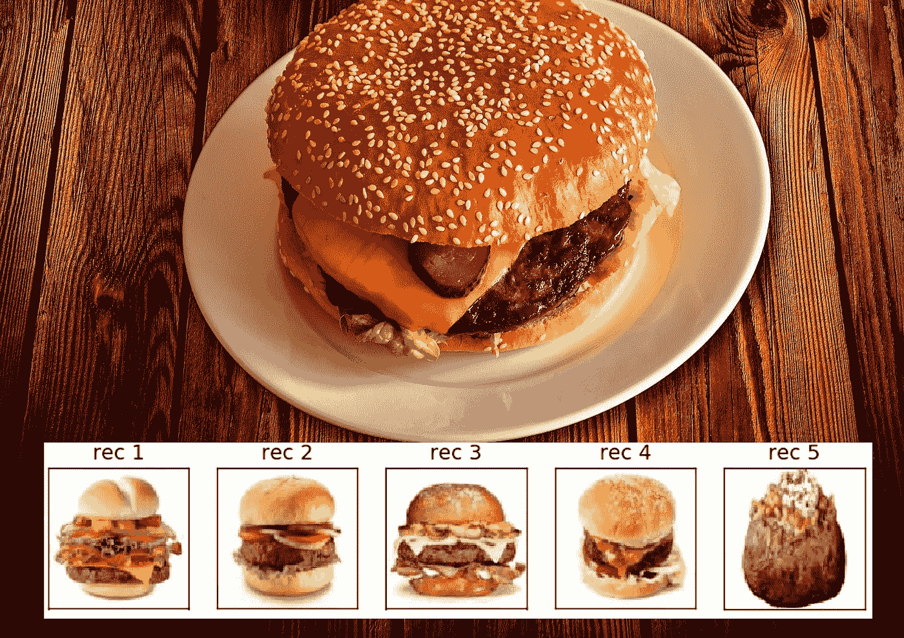
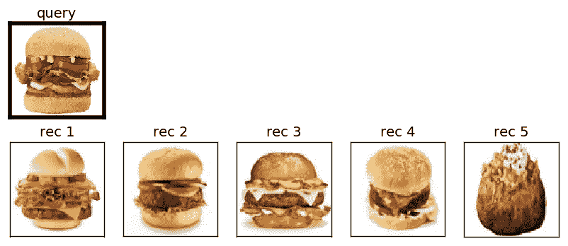
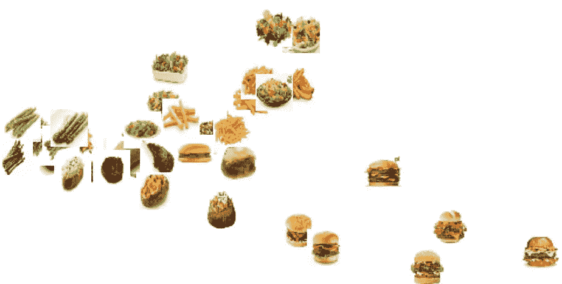
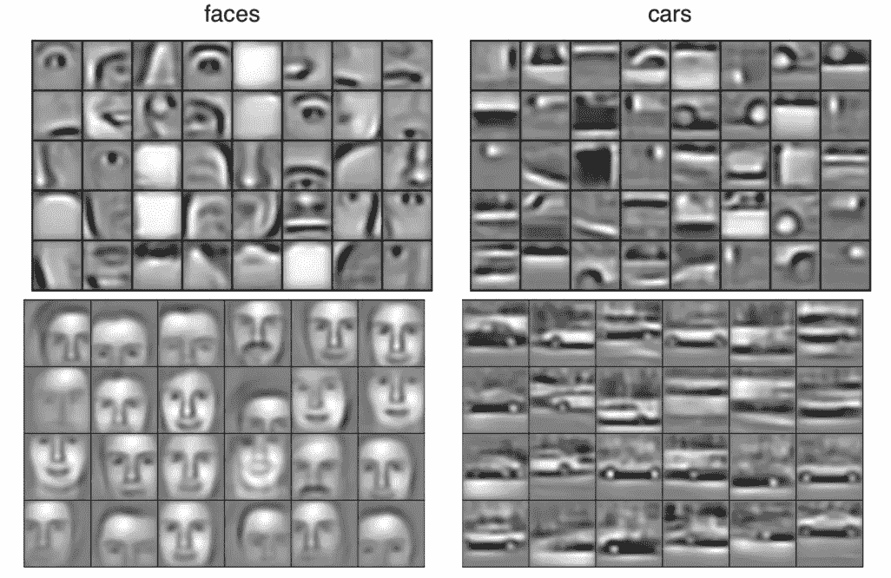
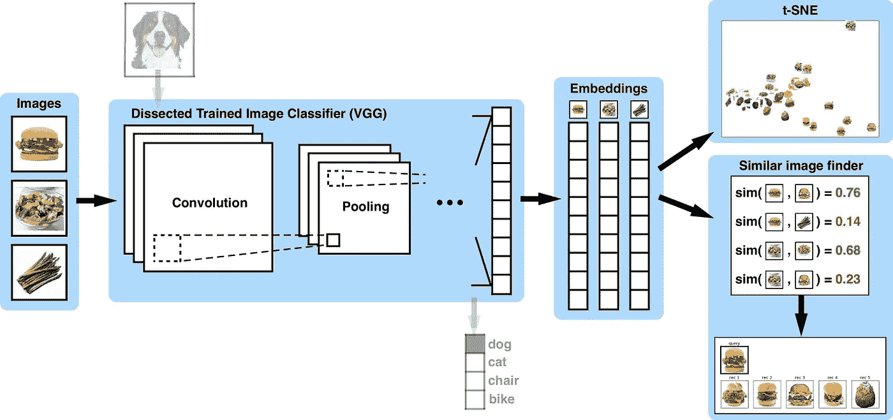

# 建立一个类似的图像查找没有任何培训！

> 原文：<https://towardsdatascience.com/building-a-similar-images-finder-without-any-training-f69c0db900b5?source=collection_archive---------1----------------------->

在本文中，我们将通过剖析[图像对象分类器 VGG](http://www.robots.ox.ac.uk/~vgg/research/very_deep/) 的训练权重来构建一个相似图像查找器，并使用它从图像数据库中提取特征向量，以查看哪些图像彼此“相似”。这种技术被称为[转移学习](http://cs231n.github.io/transfer-learning/)，在我们这边不需要任何训练——艰苦的工作在 VGG 实际接受训练的时候就已经完成了，我们只是重新使用训练过的权重来建立一个新的模型。

这个工具的一个很大的用途是对你想要的任何东西——食物、衣服、鞋子、动物、玩具，只要你能想到的，都可以做类似的图片推荐。例如，我们通过在普通牛排餐厅食物图像的小型数据库上查询测试汉堡图像来测试我们的推荐系统，它能够识别数据库中的其他汉堡:

Fig 1) Top 5 similar image recommendations from querying a burger image (left), t-SNE visualization of our image feature vectors for a small database of steakhouse foods (right)

在继续解释我们构建这个类似的图像查找工具的步骤之前，我们在 my Github 上分享我们的 Python 代码实现:

> **https://github . com/ankonzoid/artificio/tree/master/image _ retrieval**

在本文的剩余部分，我们将演练解剖 VGG 以构建相似图像查找器的步骤。更多我关于深度学习和强化学习的博客、教程、项目，请查看我的 [**Medium**](https://medium.com/@ankonzoid) 和我的 [**Github**](https://github.com/ankonzoid) **。**

# 解剖 VGG，建立一个类似的图像查找器

迁移学习是指利用从解决一个问题中获得的训练有素的知识来帮助解决另一个不同但相关的问题。然而，这并不像只是盲目地重新使用网络那么简单，因为只是在具有网络在训练期间未暴露的全新类别标签的图像上重新使用已训练的神经网络通常是没有希望的。例如，人们不会期望使用专门针对猫和狗图像训练的神经网络来正确地分类和区分鞋子品牌。那么如何才能恰当的迁移之前的学习来解决物体图像识别中的其他问题呢？

尽管神经网络不能准确地检测外来的高级特征(即，面部、身体、单词、标签)，但是低级特征(即，边缘、纹理、颜色)是可靠地可转移的，因为它们在典型的训练图像中非常丰富和多样。这些低级功能是更抽象对象的小构件，如图 2 所示:

Fig 2) A great example of how low-level features are combined to construct high-level features in neural networks (extracted from “Convolutional Deep Belief Networks for Scalable Unsupervised Learning of Hierarchical Representations” by Lee, Grosse, Ranganath, Ng)

利用我们的“低级特征是可转移的”启发，我们可以采用训练过的图像对象分类器，如 VGG，移除其最后的高级层，并使用分割的模型将我们的图像(高维像素空间中的点)转换为表示 VGG 学习的低级特征的低维特征向量。有了这些特征向量，我们可以通过一些内积，如余弦相似性或欧几里德距离，直接比较它们的“相似性”，从而对我们的图像进行聚类，以进行推荐。

图 3 显示了我们如何剖析 VGG 并将其用于构建我们的相似图像查找器的示意流程图:

Fig 3) Schematic flow chart for how to apply transfer learning by dissecting VGG to create feature embedding vectors from our image database to compute “similarities” between images

总结一下我们构建相似图像查找器的步骤:

1.  准备我们的图像数据库。
2.  下载训练好的 VGG 模型，并删除其最后几层。
3.  使用我们的解剖 VGG 模型将我们的图像数据库转换成特征向量。如果分割模型的输出层是卷积滤波器，则展平滤波器，并将它们附加成单个向量。
4.  使用内积计算我们的图像特征向量之间的相似性，例如余弦相似性或欧几里德距离
5.  对于每个图像，选择具有前 k 个相似性得分的图像来构建推荐
6.  (可选)获取特征向量并对其运行 t-SNE，以获得图像彼此相似程度的 2D 可视化