# 基于乳腺癌数据构建简单的机器学习模型

> 原文：<https://towardsdatascience.com/building-a-simple-machine-learning-model-on-breast-cancer-data-eca4b3b99fa3?source=collection_archive---------2----------------------->


Fig: Machine Learning Model

# **简介**

乳腺癌(BC)是全球女性中最常见的癌症之一，根据全球统计数据，其代表了大多数新癌症病例和癌症相关死亡，使其成为当今社会的重大公共健康问题。

BC 的早期诊断可以显著改善预后和生存机会，因为它可以促进对患者进行及时的临床治疗。良性肿瘤的进一步精确分类可以防止患者接受不必要的治疗。因此，BC 的正确诊断和患者的恶性或良性分类是许多研究的主题。由于其在从复杂 BC 数据集中检测关键特征方面的独特优势，机器学习(ML)被广泛认为是 BC 模式分类和预测建模的首选方法。

分类和数据挖掘方法是对数据进行分类的有效方法。尤其是在医学领域，这些方法被广泛用于诊断和分析以做出决策。

## 推荐的筛查指南:

**乳房 x 光检查。**乳腺癌最重要的筛查测试是乳房 x 光检查。乳房 x 光片是乳房的 x 光片。它可以在您或您的医生感觉到肿瘤之前两年内检测出乳腺癌。

**年龄在 40-45 岁或以上的女性**有患乳腺癌的平均风险，应该每年做一次乳房 x 光检查。

高危女性应该从 30 岁开始每年进行乳房 x 光检查和核磁共振检查。

## 乳腺癌的一些风险因素

以下是一些已知的乳腺癌风险因素。然而，大多数乳腺癌病例无法与特定原因联系起来。请向您的医生咨询您的具体风险。

**年龄。随着女性年龄的增长，患乳腺癌的几率也会增加。将近 80%的乳腺癌发生在 50 岁以上的女性身上。**

**乳腺癌个人史。**一个乳房患过乳腺癌的女性，另一个乳房患癌的风险更高。

**乳腺癌家族史。**如果母亲、姐妹或女儿患有乳腺癌，女性患乳腺癌的风险更高，尤其是在年轻时(40 岁之前)。有其他亲属患有乳腺癌也可能会增加风险。

**遗传因素。**具有某些基因突变(包括 BRCA1 和 BRCA2 基因的改变)的女性在其一生中患乳腺癌的风险更高。其他基因变化也可能增加患乳腺癌的风险。

**生育和月经史。生第一个孩子的女性年龄越大，患乳腺癌的风险就越大。风险较高的还有:**

*   年轻时(12 岁前)第一次来月经的妇女
*   绝经较晚的女性(55 岁以后)
*   从未生过孩子的女人

# 阶段 0 —数据准备

我们将使用 UCI 乳腺癌机器学习知识库[数据集](http://archive.ics.uci.edu/ml/datasets/breast+cancer+wisconsin+%28diagnostic%29)。

> [http://archive . ics . UCI . edu/ml/datasets/breast+cancer+Wisconsin+% 28 diagnostic % 29](http://archive.ics.uci.edu/ml/datasets/breast+cancer+wisconsin+%28diagnostic%29)

这个故事中使用的数据集是公开可用的，由美国威斯康星州麦迪逊市威斯康星大学医院的内科医生 William H. Wolberg 博士创建。为了创建数据集，Wolberg 博士使用了从实性乳腺肿块患者身上采集的液体样本，以及一种易于使用的图形计算机程序 Xcyt，该程序能够基于数字扫描进行细胞学特征分析。该程序使用曲线拟合算法来计算样本中每个细胞的 10 个特征，然后计算图像每个特征的平均值、极值和标准误差，返回 30 个实值向量

属性信息:

1.  ID 号 2)诊断(M =恶性，B =良性)3–32)

为每个细胞核计算十个实值特征:

1.  半径(从中心到周边各点的平均距离)
2.  纹理(灰度值的标准偏差)
3.  周长
4.  区域
5.  平滑度(半径长度的局部变化)
6.  紧凑性(周长/面积— 1.0)
7.  凹度(轮廓凹陷部分的严重程度)
8.  凹点(轮廓凹陷部分的数量)
9.  对称
10.  分形维数(“海岸线近似值”-1)

对每幅图像计算这些特征的平均值、标准误差和“最差”或最大值(三个最大值的平均值),得到 30 个特征。例如，字段 3 是平均半径，字段 13 是半径 SE，字段 23 是最差半径。

## 目标

该分析旨在观察哪些特征最有助于预测恶性或良性癌症，并了解可能有助于我们进行模型选择和超参数选择的总体趋势。目标是对乳腺癌是良性还是恶性进行分类。为了实现这一点，我使用了机器学习分类方法来拟合一个可以预测新输入的离散类的函数。

# 第 1 阶段—数据探索

我们将使用 ***Spyder*** 来处理这个数据集。我们将首先导入必要的库，并将数据集导入 Spyder:

```
#importing the libraries
import numpy as np
import matplotlib.pyplot as plt
import pandas as pd#importing our cancer dataset
dataset = pd.read_csv(‘cancer.csv')
X = dataset.iloc[:, 1:31].values
Y = dataset.iloc[:, 31].values
```

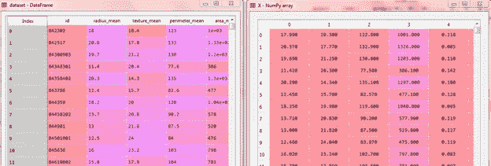

Fig : Dataset and X set after importing the dataset

我们可以使用 pandas 的 **head()** 方法来检查数据集。

```
dataset.head()
```

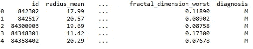

Fig : top 5 data of our dataset

我们可以使用 panda 数据集的“shape”属性找到数据集的维度。

```
print("Cancer data set dimensions : {}".format(dataset.shape))Cancer data set dimensions : (569, 32)
```

我们可以观察到数据集包含 569 行和 32 列。*诊断*是我们将要预测的列，它表示癌症是 M =恶性还是 B =良性。1 表示癌症是恶性的，0 表示良性的。我们可以确定，在 569 人中，357 人被标记为 B(良性)，212 人被标记为 M(恶性)。

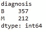

数据可视化是数据科学的一个重要方面。这有助于理解数据，也有助于向他人解释数据。Python 有几个有趣的可视化库，如 Matplotlib、Seaborn 等。

在本教程中，我们将使用构建在 matplotlib 之上的 pandas 可视化工具来查找要素的数据分布。

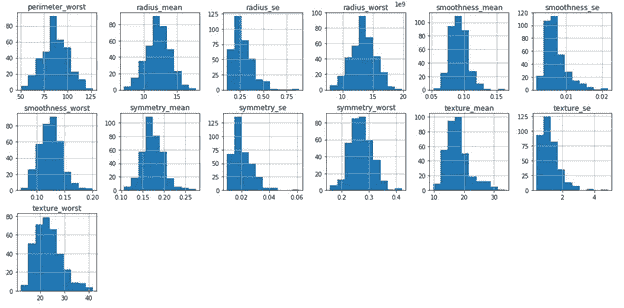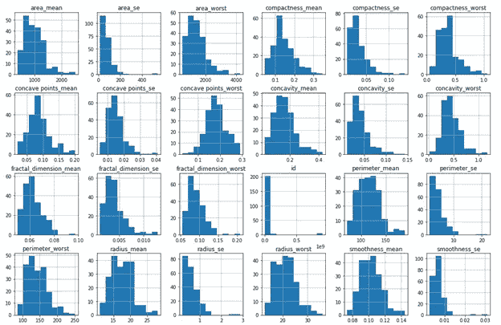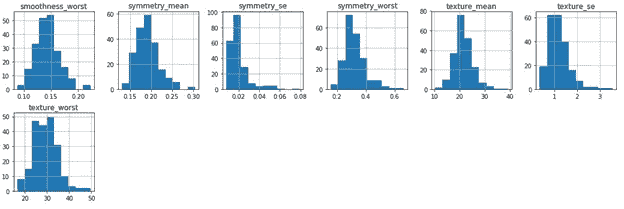

Fig : Visualization of Dataset

**缺失或空数据点**

我们可以使用下面的 pandas 函数找到数据集的任何缺失或空数据点(如果有的话)。

```
dataset.isnull().sum()
dataset.isna().sum()
```

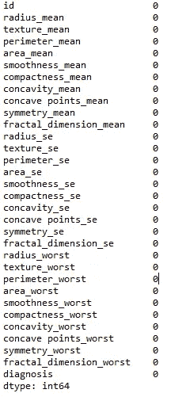

Fig : Observe missing data

# 阶段 2 —分类数据

分类数据是包含标签值而非数值的变量。可能值的数量通常限于一个固定的集合。

例如，通常按国家、性别、年龄组等来描述用户。

我们将使用标签编码器来标记分类数据。标签编码器是 Python 中 SciKit Learn 库的一部分，用于将分类数据或文本数据转换为数字，我们的预测模型可以更好地理解这些数字。

```
#Encoding categorical data values
from sklearn.preprocessing import LabelEncoder
labelencoder_Y = LabelEncoder()
Y = labelencoder_Y.fit_transform(Y)
```

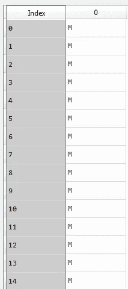

Fig: Diagnosis Data without Encoding

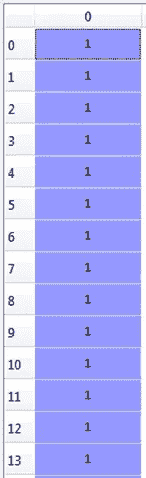

Fig: Diagnosis Data after Encoding

## **分割数据集**

我们使用的数据通常分为训练数据和测试数据。训练集包含一个已知的输出，模型学习这个数据，以便以后推广到其他数据。我们有测试数据集(或子集)来测试我们的模型对这个子集的预测。

我们将使用 Python 中的 SciKit-Learn 库通过 train_test_split 方法来实现这一点。

```
# Splitting the dataset into the Training set and Test setfrom sklearn.model_selection import train_test_split
X_train, X_test, Y_train, Y_test = train_test_split(X, Y, test_size = 0.25, random_state = 0)
```

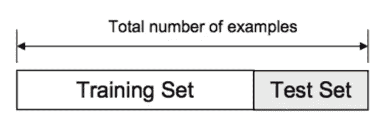

Fig: Training and test set

# 阶段 3 —特征缩放

大多数情况下，您的数据集将包含在量级、单位和范围方面差异很大的要素。但是因为，大多数机器学习算法在它们的计算中使用两个数据点之间的欧几里德距离。我们需要将所有的特征提升到相同的数量级。这可以通过缩放来实现。这意味着您正在转换数据，使其符合特定的范围，如 0–100 或 0–1。

我们将使用 SciKit-Learn 库中的 StandardScaler 方法。

```
#Feature Scalingfrom sklearn.preprocessing import StandardScaler
sc = StandardScaler()
X_train = sc.fit_transform(X_train)
X_test = sc.transform(X_test)
```

# 阶段 4 —型号选择

这是将机器学习应用于任何数据集的最令人兴奋的阶段。它也被称为预测最佳结果的算法选择。

通常数据科学家对大型数据集使用不同种类的机器学习算法。但是，在高层次上，所有这些不同的算法可以分为两组:监督学习和非监督学习。

为了不浪费太多时间，我将简单介绍一下这两种学习方式。

监督学习:监督学习是一种既提供输入数据又提供期望输出数据的系统。输入和输出数据被标记以便分类，从而为将来的数据处理提供学习基础。监督学习问题可以进一步分为**回归**和**分类**问题。

一个**回归**问题是当输出变量是一个实值或连续值时，比如“工资”或“体重”。

一个分类问题是当输出变量是一个类别时，如过滤邮件“垃圾邮件”或“非垃圾邮件”

无监督学习:无监督学习是[算法](https://whatis.techtarget.com/definition/algorithm)使用既未分类也未标记的信息，并允许算法在没有指导的情况下对该信息进行操作。

在我们的数据集中，我们有结果变量或因变量，即 Y 只有两组值，M(恶性)或 B(良性)。所以我们将使用监督学习的分类算法。

在机器学习中，我们有不同类型的分类算法

1.逻辑回归

2.最近邻

3.支持向量机

4.内核 SVM

5.朴素贝叶斯

6.决策树算法

7.随机森林分类

让我们开始应用算法:

我们将使用 sklearn 库导入分类算法的所有方法。

我们将使用 Logistic 回归方法进行模型选择，使用 Logistic 回归算法，

```
#Using Logistic Regression Algorithm to the Training Setfrom sklearn.linear_model import LogisticRegression
classifier = LogisticRegression(random_state = 0)
classifier.fit(X_train, Y_train)#Using KNeighborsClassifier Method of neighbors class to use Nearest Neighbor algorithm*from sklearn.neighbors import KNeighborsClassifier
classifier = KNeighborsClassifier(n_neighbors = 5, metric = 'minkowski', p = 2)
classifier.fit(X_train, Y_train)* #Using SVC method of svm class to use Support Vector Machine Algorithm *from sklearn.svm import SVC
classifier = SVC(kernel = 'linear', random_state = 0)
classifier.fit(X_train, Y_train)* #Using SVC method of svm class to use Kernel SVM Algorithm *from sklearn.svm import SVC
classifier = SVC(kernel = 'rbf', random_state = 0)
classifier.fit(X_train, Y_train)* #Using GaussianNB method of naïve_bayes class to use Naïve Bayes Algorithm *from sklearn.naive_bayes import GaussianNB
classifier = GaussianNB()
classifier.fit(X_train, Y_train)* #Using DecisionTreeClassifier of tree class to use Decision Tree Algorithm *from sklearn.tree import DecisionTreeClassifier
classifier = DecisionTreeClassifier(criterion = 'entropy', random_state = 0)
classifier.fit(X_train, Y_train)* #Using RandomForestClassifier method of ensemble class to use Random Forest Classification algorithm *from sklearn.ensemble import RandomForestClassifier
classifier = RandomForestClassifier(n_estimators = 10, criterion = 'entropy', random_state = 0)
classifier.fit(X_train, Y_train)*
```

现在，我们将预测测试集结果，并检查每个模型的准确性:

```
Y_pred = classifier.predict(X_test)
```

为了检查准确性，我们需要导入度量类的混淆矩阵方法。混淆矩阵是一种将错误分类的数量制成表格的方式，即，基于真实类别在错误的分类箱中结束的预测类别的数量。

```
from sklearn.metrics import confusion_matrix
cm = confusion_matrix(Y_test, Y_pred)
```

我们将使用分类准确性方法来确定我们的模型的准确性。当我们使用术语“准确性”时，分类准确性就是我们通常所指的。它是正确预测数与输入样本总数的比率。

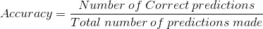

Fig: Accuracy

为了检查正确的预测，我们必须检查混淆矩阵对象并对角地添加预测结果，这将是正确预测的数量，然后除以预测的总数。


Fig: Confusion Matrix

在应用不同的分类模型后，我们得到了不同模型的以下准确度:

1.逻辑回归— 95.8%

2.最近邻— 95.1%

3.支持向量机— 97.2%

4.内核 SVM — 96.5%

5.朴素贝叶斯——91.6%

6.决策树算法— 95.8%

7.随机森林分类— 98.6%

最后，我们建立了分类模型，我们可以看到随机森林分类算法为我们的数据集提供了最佳结果。它并不总是适用于每一个数据集。为了选择我们的模型，我们总是需要分析我们的数据集，然后应用我们的机器学习模型。

这是机器学习模型对任何数据集的基本应用。如果你有任何疑问，请随时提问。给 vishabh1010@gmail.com 发邮件或者通过[链接](https://www.linkedin.com/in/vishabh-goel-27559aa6/)联系我。

你可以在 [github](https://github.com/vishabh123/vishabh) 上找到代码，在 Ipython 控制台上试试。

切记始终牢记[过度拟合和](https://medium.com/greyatom/what-is-underfitting-and-overfitting-in-machine-learning-and-how-to-deal-with-it-6803a989c76)欠拟合的问题。

希望你喜欢这篇文章…..