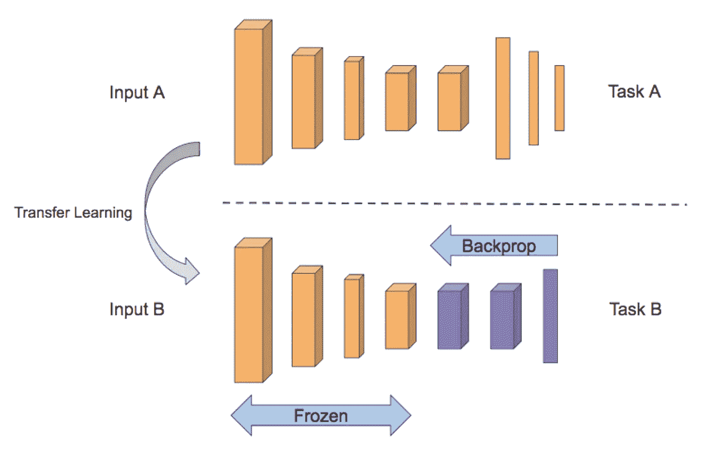
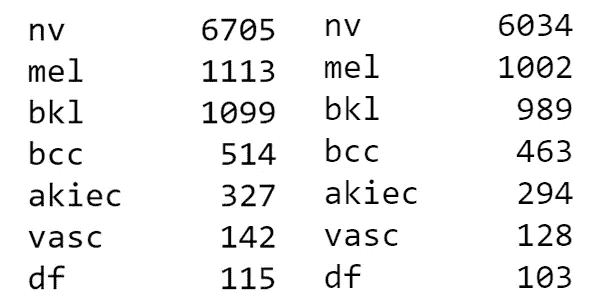
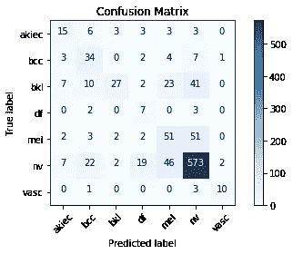

# 构建皮肤病变分类 Web 应用程序

> 原文：<https://towardsdatascience.com/building-a-skin-lesion-classification-web-app-16fd2c422b9d?source=collection_archive---------16----------------------->

## 使用 Keras 和 TensorFlow.js 对七种类型的皮肤病变进行分类

*对卷积神经网络进行研究后，我对开发一种端到端的机器学习解决方案产生了兴趣。我决定使用 HAM10000 数据集构建一个 web 应用程序来对皮肤病变进行分类。在本文中，我将提供一些背景信息，并解释我在这个项目中学习的一些重要概念，包括迁移学习、数据增强、Keras 回调和 TensorFlow.js.*

Photo by [rawpixel](https://unsplash.com/@rawpixel?utm_source=medium&utm_medium=referral) on [Unsplash](https://unsplash.com?utm_source=medium&utm_medium=referral)

人工智能正在塑造我们周围的世界。我们每天都与机器学习触及的事物互动。从我们的歌曲和视频推荐到手机里的智能助手。但是这些都是人工智能的消费者应用，那么更大规模的人工智能呢？

> “就像 100 年前电力改变了几乎所有事物一样，今天我真的很难想象一个我认为人工智能在未来几年内不会改变的行业。”——吴恩达

就我个人而言，我认为医疗保健是一个具有巨大深度学习潜力的领域。尽管我们的技术有了长足的进步，但今天仍然有一个问题仍然是一个重大问题。据报道，约 10%的死亡和 6%至 17%的医院并发症是由诊断问题引起的。想象一下，借助机器学习模型，帮助医疗专业人员诊断患者，将这一数字降至不到 5%。影响将是巨大的！

在我上一篇关于卷积神经网络的文章中，我谈到了计算机视觉是如何应用于各种行业的。我强烈建议您在这里查看[。](/how-to-teach-a-computer-to-see-with-convolutional-neural-networks-96c120827cd1)

# 关于皮肤癌的一些背景信息

*   美国每年被诊断出患有皮肤癌的人数高于其他所有癌症患者的总人数。
*   五分之一的美国人到 70 岁时会患上皮肤癌。
*   光化性角化病影响超过 5800 万美国人。

我想建立一个解决方案，利用回旋神经网络来帮助人们快速准确地分类不同类型的皮肤癌。我的主要目标是创建一个容易访问和有效的项目。我最终决定建立一个网络应用程序。

在这个项目中，我使用了公开的 HAM10000 数据集，其中包含了大约 10000 幅不同的皮肤病变图像。

**皮损类别包括:**

*   光化性角化病和上皮内癌(`akiec`):鳞状细胞癌的常见非侵袭性变体。它们有时被视为可能进展为浸润性鳞状细胞癌的前体。
*   基底细胞癌(`bcc`):一种常见的上皮性皮肤癌，很少转移，但如果不治疗就会生长。
*   良性角化病(`bkl`):分为三个亚组(脂溢性角化病、日光性雀斑样痣和扁平苔藓样角化病(LPLK))。这些组可能看起来不同，但在生物学上相似。
*   皮肤纤维瘤(`df`):一种良性皮肤病变，被视为良性增生或轻微创伤的炎性反应。
*   黑色素瘤(`mel`):一种可出现不同变体的恶性肿瘤。黑色素瘤通常(但不总是)呈混沌状态，某些标准取决于部位位置。
*   黑素细胞痣(`nv`):从皮肤镜角度看，这些变体可能存在显著差异，但通常在颜色和结构分布方面是对称的。
*   血管病变(`vasc`)

更多关于数据集或皮肤癌分类的信息请参考本文。

# 卷积神经网络模型的转移学习

Photo by [Mika Baumeister](https://unsplash.com/@mbaumi?utm_source=medium&utm_medium=referral) on [Unsplash](https://unsplash.com?utm_source=medium&utm_medium=referral)

如果您一直在处理任何类型的数据，当您开发深度学习模型时，您会知道**数据是最重要的东西**。但是，大多数时候，您的数据集可能不够大，无法获得最佳性能。总的来说，我们谈论的是至少 50，000 幅图像。拥有大量层的网络训练也非常昂贵。如果您没有一个(或几个)令人惊叹的图形处理器，这可能需要很长时间。😢

**迁移学习背后的整个理念是，您可以在一个大数据集上获取一个已经过预先训练的模型，对其进行修改，然后在您当前使用的数据集上对其进行重新训练。**

正如我在[上一篇文章](https://medium.com/p/16fd2c422b9d/edit)中所解释的，卷积神经网络在图像中寻找不同的特征，比如边缘和形状。我们可以采用一个具有数百万个连接的神经网络，该网络已经接受了识别不同特征的训练，并通过“冻结”前几层来重新训练其中的一部分。在添加了一个完全连通的图层之后，仅通过对最后几个图层进行训练，我们就可以获得一个模型，该模型可以有效地识别基本特征，但做出的预测会很好地利用相关数据进行推广。

A diagram depicting the use of transfer learning to retrain layers of a network. [Source](https://medium.com/@subodh.malgonde/transfer-learning-using-tensorflow-52a4f6bcde3e).

Keras 应用程序库包括几个深度学习模型，包括 VGG16、VGG19、ResNet50、MobileNet 和其他一些模型。**他们都在 ImageNet 数据集上进行了训练，该数据集包含大约 1400 万张图像。**与我们的 10，000 幅图像数据集相比，这是一个非常明显的差异。

对于这个项目，我选择使用 **MobileNet 架构**，它针对计算能力较低的移动应用进行了优化。这种架构利用了深度方向可分离的卷积，这实质上有助于减少训练参数的数量，使模型更加轻量级。有关 MobileNet 的更多信息，请查看本文。

以下是我们在 Keras 可以做到的。

# 皮肤病变图像的预处理

关于 HAM10000 数据集的一个好处是所有的图像都是相同的大小，600x450。然而，在查看了图像的分布后，我们看到大多数图像属于黑色素细胞痣类。

Left: total number of images in each class. Right: number of training images in each class.

## 扩充训练数据

当涉及到增加我们可以处理的训练样本数量时，数据扩充是非常有用的。我们可以扩充训练数据，为此，我们使用来自 **Keras 预处理库**的 **Keras ImageDataGenerator 类**，它通过批量循环数据来生成具有实时扩充的批量张量图像数据。我们传递的一些参数是:

*   `rotation_range`:随机旋转的度数范围
*   `width_shift_range`:表示图像可以移动的总宽度的一部分
*   `height_shift_range`:这表示图像可以移动的总高度的一部分
*   `zoom_range=0.1`:图像可以放大或缩小的部分
*   `horizontal_flip=True`:随机水平翻转输入
*   `vertical_flip=True`:随机垂直翻转输入
*   `fill_mode='nearest'`:输入边界外点的填充规范

我们可以通过运行下面的代码来声明一个扩充的数据生成器。我们的目标尺寸是 224x224，因为这是 MobileNet 输入层所需的尺寸。

# 编译模型

Keras 回调库提供了一系列有用的函数，可以在模型训练过程的几个阶段应用。这些函数可用于了解模型内部状态的更多信息。这个程序中使用的两个回调函数是`ReduceLROnPlateau`和`ModelCheckpoint`。

`ReduceLROnPlateau`用于在某个模型指标停止改进时降低学习率。已经表明，一旦模型在几次迭代后停止改进，当学习率降低 2-10 倍时，模型通常会受益。一些重要的参数是:

*   `monitor`:用于评估模型是否正在改进的指标
*   `factor=0.5`:学习率降低的因子
*   `patience=2`:具有相同精度的时期数，在此之后学习率降低
*   `mode='max'`:当模型停止改进时，降低学习率

`ModelCheckpoint`用于在每个历元后保存模型。`save_best_only=True`确保最佳模型不会被覆盖。

# 绘制预测的混淆矩阵

我们可以看到我们的模型具有可接受的性能，并且标签`nv`的大量测试示例被正确分类。该模型对`akiec`、`bcc`、`bkl`、`nv`和`vasc`的预测大多正确，但对`df`的预测困难。该模型有时会将黑色素瘤(`mel`)与黑色素细胞痣(`nv`)以及`nv`与良性角化病(`bkl`)混淆。该模型仍有很大的改进空间，超参数的微调可能会有所帮助。

# 保存模型并将其转换为 TensorFlow.js

训练完模型后，我们可以在本地目录中找到 Keras 模型为`model.h5`。我们可以通过运行以下代码将其转换为 TensorFlow.js 文件。

# 在浏览器中运行机器学习

TensorFlow.js 是 Google 流行的深度学习框架 TensorFlow 的 JavaScript 版本。它由一个低级核心 API 和一个高级层 API 组成。我认为 TensorFlow.js 非常酷的主要原因有两个。

1.  TensorFlow.js 和 WebGL 可以在任何种类的 GPU 上运行，包括 Nvidia、AMD 和 phone GPUs。
2.  您可以将现有模型转换为 TensorFlow.js 模型，并轻松地重新调整它们的用途。
3.  模型在浏览器中本地运行，这意味着用户的数据永远不会离开他们的计算机。

最后一点尤其重要，因为你显然可以想象，如果在线自我诊断变得普遍，这在未来将是多么重要。客户端的训练和推断有助于确保解决方案是隐私友好的！

你可以在这里找到我的项目[的代码，在这里](https://github.com/uyxela/Skin-Lesion-Classifier)找到模型[的现场版本。](https://alexyu.ca/projects/Skin-Lesion-Classifier)

# 关键要点:

*   当你不需要大量数据或计算能力时，迁移学习是有用的
*   数据扩充也是确保您有足够的训练数据来确保您的模型表现良好的另一种方法
*   TensorFlow.js 让您可以在浏览器中和客户端轻松运行机器学习模型

感谢阅读！如果您喜欢，请:

*   在 [LinkedIn](https://www.linkedin.com/in/alexjy/) 上添加我，关注我的媒体，了解我的旅程
*   留下一些反馈或者给我发邮件(alex@alexyu.ca)
*   与你的网络分享这篇文章