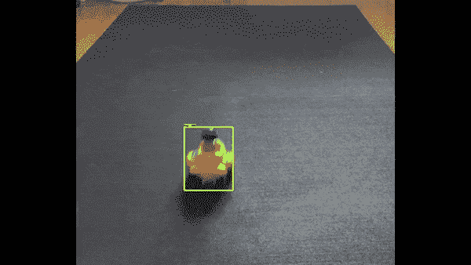
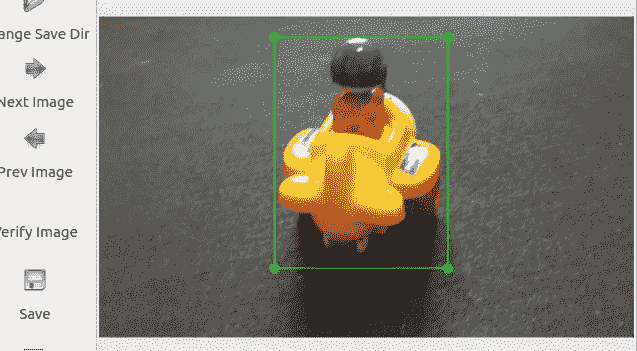
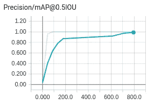
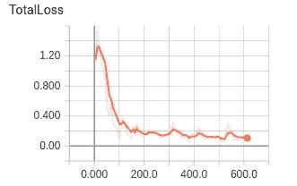
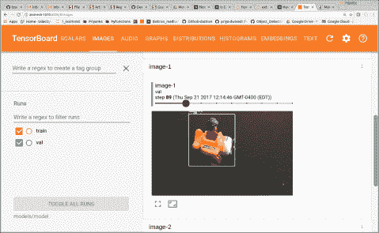

# 用 Tensorflow 对象检测 API 构建玩具检测器

> 原文：<https://towardsdatascience.com/building-a-toy-detector-with-tensorflow-object-detection-api-63c0fdf2ac95?source=collection_archive---------0----------------------->

*用数据做酷事！*

这个项目是我的热门项目的第二阶段-[Google tensor flow 物体检测 API 是实现图像识别最简单的方法吗](https://medium.com/towards-data-science/is-google-tensorflow-object-detection-api-the-easiest-way-to-implement-image-recognition-a8bd1f500ea0)？在最初的文章中，我使用 Tensorflow 提供的[模型](https://github.com/tensorflow/models/blob/master/research/object_detection/g3doc/detection_model_zoo.md)来检测 youtube 视频中的常见对象。这些模型在 [COCO](http://cocodataset.org/#home) 数据集上进行训练，并在该数据集中包含的 90 个常见对象上运行良好。

这里我扩展了 API 来训练一个不属于 COCO 数据集的新对象。在这种情况下，我选择了一个到处都是的玩具。见下图 gif。到目前为止，我对 API 的性能印象深刻。这里强调的步骤可以扩展到您想要构建的任何单个或多个对象检测器。



Tensorflow Toy Detector~

你可以在我的 [Github](https://github.com/priya-dwivedi/Deep-Learning/tree/master/tensorflow_toy_detector) repo 上找到代码

1.  **收集数据**

第一步是为您的项目收集图像。你可以从谷歌上下载它们，确保你在角度，亮度，比例等方面有很大的变化。在我的例子中，我创建了一个小飞机玩具的视频，并使用 [Opencv](https://stackoverflow.com/questions/33311153/python-extracting-and-saving-video-frames) 从视频中提取图像。这节省了我很多时间。我确保图像是从多个角度拍摄的。您还可以随机改变某些图像的亮度，以便探测器可以在不同的闪电条件下工作。总共 100-150 张照片就足够了。请看下面的一些样本图片:


Sample images

PS:由于视频是从我的 Iphone 上拍摄的，原始图像相当大——1920 x 1090。这将需要大量的内存，所以使用 [PIL 调整大小](http://pillow.readthedocs.io/en/3.1.x/reference/Image.html)来调整它们的大小到 500x300，保持纵横比。

2.**注释图像**

我用[标签](https://github.com/tzutalin/labelImg)给图像加了注释。这是一个非常方便的工具，注释是以 Pascal VOC 格式创建的，这对以后很有用。用 Python 写的，接口用 Qt。我用 Python3 + Qt5 都没问题。参见注释图像示例。本质上，我们识别对象的 xmin、ymin、xmax 和 ymax，并将其与用于训练的图像一起传递给模型



Annotating using labelimg

**3。创建 TFR 数据集**

Tensorflow API 希望数据集采用 [TFRecord 文件格式](https://www.tensorflow.org/api_guides/python/python_io#tfrecords_format_details)。这可能是最棘手的部分。然而 tensorflow 已经提供了几个方便的脚本让你开始使用——`[create_pascal_tf_record](https://github.com/tensorflow/models/blob/master/research/object_detection/create_pascal_tf_record.py).py`和`[create_pet_tf_record.py](https://github.com/tensorflow/models/blob/master/research/object_detection/create_pet_tf_record.py).` 我可以使用`[create_pet_tf_record.py](https://github.com/tensorflow/models/blob/master/research/object_detection/create_pet_tf_record.py)`进行最小的编辑，因为 labelimg 已经以正确的格式创建了注释。我还喜欢这个脚本随机抽取 30%的数据并创建一个验证 TFR 文件。

您还需要创建一个 label.pbtxt 文件，用于将标签名称转换为数字 id。对我来说，这很简单

```
item {
 id: 1
 name: ‘toy’
}
```

我在 github 上包含了 label_map.pbtxt 文件和 create_pet_tf_records.py 文件。如果你被困在某个地方，我强烈推荐 Tensorflow 提供的 [Oxfort Pets 漫游](https://github.com/tensorflow/models/blob/master/research/object_detection/g3doc/running_pets.md)。

**4。创建模型配置文件**

创建 TFR 数据集后，首先需要决定是使用现有模型并对其进行微调，还是从头构建。我强烈推荐使用现有模型，因为 CNN 学习的大多数特征通常是对象不可知的，并且微调现有模型通常是一个简单而准确的过程。请注意，如果你决定从头开始构建，你将需要远远超过 150 个图像和培训将需要几天时间。该 API 提供了 5 种不同的模型，这些模型在执行速度和放置边界框的准确性之间提供了一种平衡。请参见下表:


Tensorflow Detection Models

对于这个项目，我决定使用在 coco 数据集上训练的 faster _ rcnn _ resnet101。如果你想了解更多关于 RCNN 模型的知识，这是一个非常好的[链接](https://blog.athelas.com/a-brief-history-of-cnns-in-image-segmentation-from-r-cnn-to-mask-r-cnn-34ea83205de4)。

Tensorflow 提供了几个[示例配置文件](https://github.com/tensorflow/models/tree/master/research/object_detection/samples/configs)来开始使用。我决定使用 faster_rcnn_resnet101_coco 文件，并更新了文件中需要配置的任何路径。别忘了更新 num。班级也是。

**5。训练模型**

终于！所有困难(和无聊)的部分都完成了，我们可以开始训练模型了。由于我有一个合理的 GPU，我决定在当地培训。然而，你可以在云上训练。tensorflow 文档再次简化了这一过程，并提供了所有的[步骤](https://github.com/tensorflow/models/blob/master/research/object_detection/g3doc/running_on_cloud.md)。

您可以同时在两个独立的终端上启动培训作业和评估作业。启动 tensorboard 监控性能。经过 2-3 个小时的训练，我可以看到总损耗下降到 0.077，精度达到 0.99。通过查看 Tensorboard 中的图像，我们可以看到模型很快变得准确。



Model gets accurate pretty quickly

**6。测试模型**

为了测试模型，我们首先选择一个模型检查点(通常是最新的)并导出到一个冻结的推理图中。这个脚本也在我的 github 上。我在我的 Iphone 上录制的新视频中测试了这个模型。正如在我的[上一篇](https://medium.com/towards-data-science/is-google-tensorflow-object-detection-api-the-easiest-way-to-implement-image-recognition-a8bd1f500ea0)文章中，我使用 Python moviepy 库将视频解析成帧，然后在每一帧上运行 object detector，并将结果整理回视频中。

# 后续步骤

我注意到的几件事和对未来的额外探索

*   在测试过程中，我发现更快的 RCNN 模型有点慢。接下来，我将探索使用最快的模型——SSD mobilenet，看看准确性是否有明显下降
*   对于这个模型，我只是使用了 faster_rcnn_resnet101_coco 的模型配置文件中的默认参数。如果可以调整它们以获得更好的性能，这可能是值得探索的
*   稍加努力，这个过程可以扩展到其他类别

给我一个❤️，如果你喜欢这个职位:)希望你拉代码，并尝试自己。

我有自己的深度学习咨询公司，喜欢研究有趣的问题。我已经帮助许多初创公司部署了基于人工智能的创新解决方案。请到 http://deeplearninganalytics.org/来看看我们吧。

你也可以在 https://medium.com/@priya.dwivedi 的[看到我的其他作品](https://medium.com/@priya.dwivedi)

如果你有一个我们可以合作的项目，请通过我的网站或 info@deeplearninganalytics.org 联系我

**参考文献:**

*   [谷歌 Tensorflow 物体检测 Github](https://github.com/tensorflow/models/tree/master/research/object_detection)
*   关于媒体的精彩文章[给了我灵感和一些有用的提示](https://medium.com/towards-data-science/how-to-train-your-own-object-detector-with-tensorflows-object-detector-api-bec72ecfe1d9)