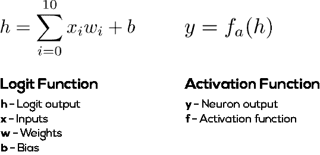
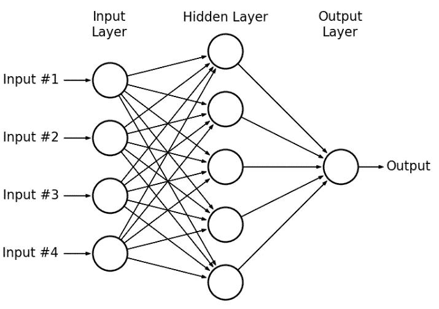
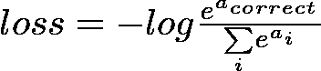
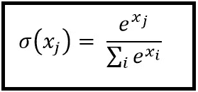
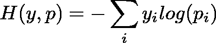
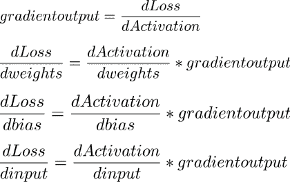
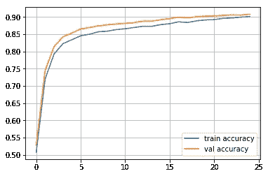

# 用纯数字构建人工神经网络

> 原文：<https://towardsdatascience.com/building-an-artificial-neural-network-using-pure-numpy-3fe21acc5815?source=collection_archive---------0----------------------->

神经网络因其在计算机视觉和自然语言处理等几个领域的出色表现而备受关注。它们不仅远远超过同类产品，而且用途极其广泛，几乎应用于所有可以想象的领域。

但是这两个词到底是什么意思呢？

在这篇简短的帖子中，我们将深入研究神经网络的概念，然后用 Python 编写我们自己的代码，使用 **pure NumPy** 对 MNIST 数字进行分类(我保证这很有趣)**。**我会尽量保持简短，主要是为了防止你因为我不专业的写作风格而关闭这个标签。所以让我们直入主题:

# 神经网络到底是什么

顾名思义，神经网络是一种受我们大脑中生物网络启发的计算系统。如果你没有像我一样在整个生物课上睡觉，你可能会记得我们大脑中的网络由大量的神经元组成。

出于我们的目的，我们可以将这个神经元建模为一个函数，它接受一组输入，使用一些*权重获得这些输入的加权和，添加一个 ***偏差*** ，并基于一些 ***激活*** 函数输出一个数字。有道理？*我也这么想 lol。**

**

*Mathematical working of a single neuron*

***权重**可以被认为是一串旋钮，我们可以调整它们来获得不同的输出。*

***偏置**是另一个旋钮，它决定神经元何时保持不活动，或者换句话说，它决定神经元需要多高的加权和才能有意义地活动。*

***激活**功能是将 logit 功能的任意输出映射到任何特定范围值的功能。它通常用于给我们的模型增加一些非线性。这允许网络以更复杂的方式组合输入，并且反过来在它们可以建模的功能中提供更丰富的能力。最常用的激活函数有 sigmoid、softmax、ReLU、tanh 等。*

## *网络的结构*

*现在我们知道了单个神经元是如何工作的，我们可以将它们连接起来，以层的形式形成一个网络。所以人工神经网络只是一个被高估的复合函数。*

**

*A simple neural network. Also called a multilayered perceptron*

*典型的神经网络由 3 种类型的层组成:*

1.  ***输入层:**给定的数据点馈入该层。只能有一个输入层。这一层中神经元的数量等于输入的数量。*
2.  ***隐层:**这是全网的肉。这些层试图在输入中找到模式，以获得我们需要的输出。网络可以有任意数量的隐藏层。*
3.  ***输出层**:这一层给我们网络的预测，即。给定当前参数(每个神经元的权重和偏差)，网络认为应该正确的输出。这一层神经元的数量等于我们需要预测的值的数量。因为我们的任务是分类 MNIST 数字，我们将有 10 个神经元，因为有 10 个数字来计算预测。*

*因此，基本网络层可以定义为:*

*该层处理输入，最终产生输出值。这称为层上的向前传递。*

*在我们的实现中，我们将使用两个层:*

1.  ***密集层**——其中一层中的每个神经元都与下一层中的每个神经元相连。*
2.  ***ReLU 激活层** —位于密集层之上的层，将 ReLU 激活功能应用于密集层的输出。我本来可以使用最常见的 *sigmoid* 函数，但是我有时会尝试使用 ReLU 函数。*

**

*ReLU activation function*

*这两层可以定义为:*

## *训练网络*

*既然我们已经定义了网络的架构，*我们究竟该如何训练它呢？是的，使用* ***参数，*** *即权重和偏差。**

*由于我们的网络有不止一个神经元，每个神经元都有一套独特的权重和偏好，这给了我们数千个旋钮来调整。如果你是一个小小的受虐狂，愿意手动调节这些成千上万的旋钮，以获得最佳的组合，那就继续吧。如果你是正常人，那么我们可以利用**梯度下降算法。***

**

*梯度下降是一种通用算法，可用于优化任何微分函数。它的工作方式是计算函数在当前点的*梯度*。这种梯度给我们的方向，将最大限度地发挥功能(梯度口音)。但是我们通常需要最小化一个函数，所以我们把计算出的梯度的方向反过来得到最小化函数的方向(梯度下降)。如果你和我一样有点慢，你可以把它想象成一个球滚下山坡，由于重力的原因，它最终到达最低点。*

*为了优化我们的网络，我们需要这样一个函数，所以我们定义了一个**损失**函数——我们使用的这个函数被称为 **log softmax 交叉熵损失**(再次变得尖锐)。*

**

*A scary-looking loss function*

*让我们一个字一个字地分解它:*

1.  ***Softmax***

*Softmax 函数获取一个 N 维实数向量，并将其转换为(0，1)范围内的实数向量，其总和为 1。因此，它输出一个概率分布，这使得它适合于分类任务中的概率解释。*

**

*Softmax function*

**

*Graph of Softmax function*

*2.**交叉熵损失***

*交叉熵表示模型认为的输出分布和原始分布之间的距离。*

**

*Cross-Entropy Loss*

*让我们用代码来写:*

*所以我们训练网络的方法如下:将网络的输出与预期输出进行比较，计算损耗。这种损失然后通过网络一次一层地传播回来，并且根据它们对误差的贡献量来更新权重和偏差。这种传播由**反向传播算法**执行。*

*这个算法相当复杂，需要一整篇文章来解释，所以我只告诉你几分钟，因为我很懒。*

*因此，对于每一层，为了计算该层参数对总损耗的影响，我们需要计算损耗对这些参数的导数。为了减轻我们的麻烦，我们可以利用链式法则。*

**

*Backpropagation Cheat Sheet*

*因此，对于每一层，我们可以添加一个后向通道，其中该层的梯度作为输入，用于计算所需的导数，最后，该层的梯度作为输出返回:*

# *运行代码*

*下面给出了带有精度图的完整代码*

**

*Accuracy Plot*

*谢谢你坚持到最后。写这篇文章确实帮助我在大脑中巩固了一些复杂的概念。这是我第一次尝试写技术文章，如果有人有什么指点，请在下面留下回应！*