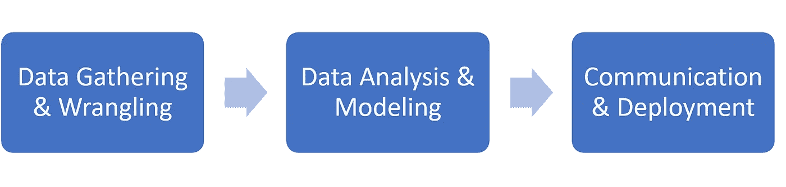
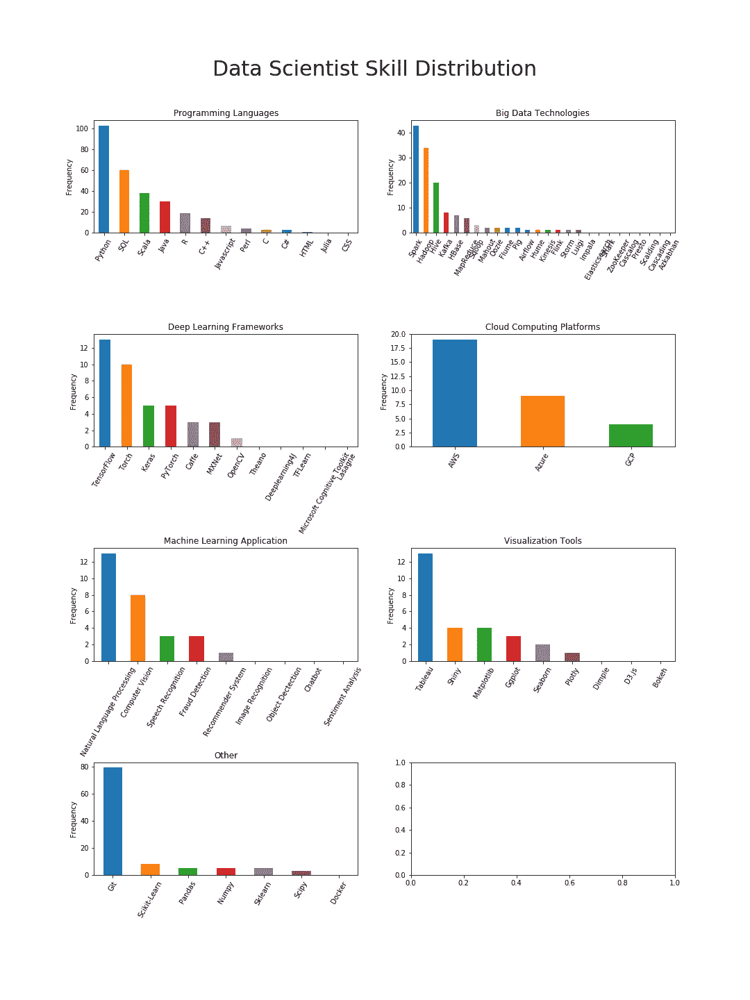

# 构建端到端数据科学项目

> 原文：<https://towardsdatascience.com/building-an-end-to-end-data-science-project-28e853c0cae3?source=collection_archive---------4----------------------->

## 从我的数据科学家理想概况项目中获得的经验


Photo by [Joseph Barrientos](https://unsplash.com/photos/Ji_G7Bu1MoM?utm_source=unsplash&utm_medium=referral&utm_content=creditCopyText) on [Unsplash](https://unsplash.com/?utm_source=unsplash&utm_medium=referral&utm_content=creditCopyText)

It 人们常说，数据科学家的大部分工作不是实际的分析和建模，而是数据争论和清理部分。因此，涉及这些阶段的全周期数据科学项目将更有价值，因为它们证明了作者独立处理真实数据的能力，而不是给定的清理数据集。

充分理解端到端数据科学项目的价值，我一直想建立一个，但直到现在还不能:)

我最近完成了我的[理想简介](/what-does-an-ideal-data-scientists-profile-look-like-7d7bd78ff7ab)项目。由于这是一个涉及许多活动部分的大项目，我想记录这个过程和学到的教训，这是一个进一步学习的机会(受[威廉·科尔森](https://medium.com/u/e2f299e30cb9?source=post_page-----28e853c0cae3--------------------------------)关于数据科学写作价值的伟大帖子的启发)。

# 阶段

在我看来，一个全周期的数据科学项目应该包括以下几个阶段:



从事 Kaggle 项目的最大反对理由通常是它只关注第二阶段。因此，在这个项目中，我确保涵盖了所有三个阶段。

在第一阶段，我做了网络搜集来获取数据，由于数据是脏的，我不得不努力让数据为分析做好准备。然后我做了各种数据可视化，并进行分析，作为第二阶段。最后，我写了一些帖子来交流我的发现，并将这个项目投入生产。

当然，我可以通过加入机器学习组件来使这个项目更加完整，例如，使用 NLP 根据内容对职位发布进行分类，但这将大大延迟项目完成时间，这将我们带到下一点:

# 迭代思维

潜在地，对于一个给定的项目，可能有无限的事情要做，但是实际上，我们只有有限的时间。为了协调这两个相互竞争的因素，我们需要自律。

对我来说，“迭代思维”真的很有帮助——瞧，罗马不是一天建成的，所以让我们先建造一些可以工作的东西，然后我们可以随时回来改进更多的功能。另一方面，这也意味着我们需要能够处理“不完美”,不要拘泥于细节。

有了这个理念，我可以推迟一些非常诱人的功能，把它们放在项目文档的[待办事项](https://github.com/georgeliu1998/ideal_profiles#to-dos)部分。其中之一是使用一个更大的数据集，从美国而不是加拿大的网站抓取数据。

# 模块化

鉴于项目的端到端性质，有许多不同的方面要做——网页抓取、数据预处理、绘图……如果我们将所有代码放在一个 Jupyter 笔记本中，管理起来会太长太复杂。然后我决定使用 Python 脚本结合中央 Jupyter 笔记本来解决这个问题。

我将支持功能分为三大类，并将它们放在三个相应的脚本中:

*   scrape_data.py —包含 web 抓取所需的函数，如“get_soup()”和“get_urls()”
*   process_text.py —包含文本处理和清理功能，如“tokenize_text()”和“check_freq()”
*   helper.py 包含文件 I/O 和绘图功能，例如“plot_skill()”

通过这种方式，我能够保持一个超级轻和有组织的中央笔记本。然后根据需要从笔记本中导入和调用函数，如下所示:

```
**from** **scrape_data** **import** *
**from** **process_text** **import** *
**from** **helper** **import** *
```

# 再现性

由于我在网上找到的许多抓取脚本都不起作用，我决心确保我的项目是可重复的。除了可靠的代码之外，强大的自述文件和完整的环境依赖文件也是解决方案的一部分。

*   [README.md](https://github.com/georgeliu1998/ideal_profiles/blob/master/README.md) —我付出了艰苦的努力，以确保所有相关的细节都被捕捉到，尤其是如何设置环境以及如何使用脚本。
*   [env _ ideal _ profiles . YAML](https://github.com/georgeliu1998/ideal_profiles/blob/master/env_ideal_profiles.yaml)—通过将所有依赖项冻结到这个文件中，我确保用户可以准确地重新创建我使用过的同一个 Anaconda Python 环境。更多信息请点击[这里](https://conda.io/docs/user-guide/tasks/manage-environments.html)。

# 编码最佳实践

良好的编码实践很重要！特别是，我发现以下实践在编写更大更复杂的项目时非常有用:

*   写清楚、简洁和信息丰富的评论
*   具有有意义的描述性变量/函数名
*   提供详细的和[结构化的文档字符串](https://stackoverflow.com/questions/3898572/what-is-the-standard-python-docstring-format)
*   确保使用 Python“try except”块进行异常处理

当您的项目是一个 30 行的 Jupyter 笔记本时，这些事情可能看起来微不足道，但在处理一个需要数百行代码的大型项目时，这些事情真的非常重要！

# Matplotlib 岩石

我过去习惯于只掌握基本的 Matplotlib 技能。然而，对于这个项目，我不仅需要将几个图合并成一个，而且还必须进行详细的定制，如旋转轴刻度标签…在这一点上，基本的 Matplotlib 技能根本不再足够。



事实证明这是一个学习 Matplotlib 的好机会。一旦我知道了它能做什么，我就发现不可能回头了，原因很简单，Matplotlib 真的很强大！它的面向对象的方法允许你修改几乎任何东西…查看下面的教程来找到答案:

*   [Matplotlib 教程:Python 绘图](https://www.datacamp.com/community/tutorials/matplotlib-tutorial-python)
*   [有效地使用 Matplotlib](http://pbpython.com/effective-matplotlib.html)
*   [用 Matplotlib (Guide)进行 Python 绘图](https://realpython.com/blog/python/python-matplotlib-guide/)

这就是我最近完成的关于[理想概要](https://github.com/georgeliu1998/ideal_profiles)项目的最后一篇博文。另外两篇文章[在这里](/what-does-an-ideal-data-scientists-profile-look-like-7d7bd78ff7ab)和[在这里](/scraping-job-posting-data-from-indeed-using-selenium-and-beautifulsoup-dfc86230baac)可以找到。

你有什么想法？我错过了什么或者我可以改进的吗？请在下面随意评论。我欢迎任何反馈。

感谢您的阅读！