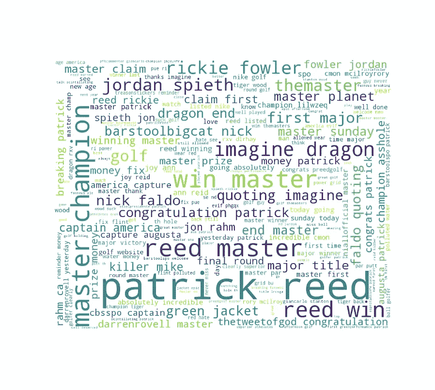
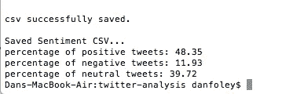

# 用 Python 构建 ETL 管道

> 原文：<https://towardsdatascience.com/building-an-etl-pipeline-in-python-f96845089635?source=collection_archive---------3----------------------->

# 介绍

在我的上一篇[帖子](/streaming-twitter-data-into-a-mysql-database-d62a02b050d6)中，我讨论了我们如何设置一个脚本来连接 Twitter API 并将数据直接传输到数据库中。今天，我将向大家展示我们如何访问这些数据并对其进行分析，实际上是从头到尾创建一个完整的数据管道。大体上，我计划从我们的数据库中提取原始数据，清理它，最后使用 word clouds 和 NLP Python 库做一些简单的分析。

让我们想想如何实现这样的东西。为了使分析尽可能全面，我将采用面向对象的方法，创建一个 **TweetObject** 类和该类的方法来执行上述任务。我们将使用几个重要的库，比如 NLTK(自然语言工具包)库，它有一系列用于自然语言处理的有用函数。我们将使用单词云库来创建一些我们推文的摘要可视化，并使用一个名为 TextBlob 的库来帮助我们计算情感。

让我们先来看看 python 代码。

首先，我们导入必要的库。像我以前的文章一样，我们需要导入 mysql-connector 库来连接我们的数据库。TweetObject 类将初始化一些允许我们连接到数据库的重要参数。 **MySQLConnect** 方法接收一个 SQL 查询，执行它并返回一个 pandas 数据帧。Pandas 对于任何数据分析任务来说都是一个非常棒的库，它让操作数据变得非常容易，所以我建议任何有抱负的数据分析师/科学家熟悉这个库。

# 自然语言处理:清理推文

现在我们有了一个查询数据库并返回数据的方法，我们该如何处理它呢？让我们花一点时间来谈谈自然语言处理(NLP)。一般来说，文本数据需要一些预处理，然后才能输入到机器学习算法中。我们需要把它转换成一种算法可以理解的格式。这通常涉及以下一些任务。

**自然语言处理中的预处理步骤:**

1.  正常化。
2.  删除停用词、标点符号和 HTML。
3.  象征化。
4.  引理满足
5.  TF-IDF。

这当然不是一个详尽的列表，但这些是适用于大多数 NLP 任务的技术。好，让我们解释一下这些概念是什么，以及为什么我们需要使用它们。将单词标准化为小写是 NLP 中的正常步骤，因为我们不希望我们的算法将 python 和 PYTHON 视为两个不同的单词。将所有单词转换成相同的大小写可以避免这些问题。我们想采取的另一个步骤是从我们的文本中删除任何不相关的材料。一种方法是删除标点符号，如逗号、句号和停用词，如“I”、“is”、“the”。NLTK 包中停用词的更详细列表可以在[这里](https://gist.github.com/sebleier/554280)看到。我们还应该考虑**记号化**，这是一个本质上把文本分割成有意义的块或记号的过程(TextBlob 自动为我们做这件事)。我们将使用的最后一个预处理技术是**引理满足**。这实质上是将一个词转换成它的“规范形式”。换句话说，巨蟒会变成巨蟒，而步行会变成步行。

一种非常有用的技术是术语频率-逆文档频率或 **TF-IDF，但我们在这里没有使用。这是一种信息检索技术，它允许我们识别文档中单词的相对重要性。一般来说，如果一个单词在一个文档中出现多次，它可能是重要的。但是，如果它在多个文档中频繁出现，那么它可能只是一个普通的单词，实际上没有多大意义。TF-IDF 试图说明这一点，并返回每个单词重要性的总得分。当试图量化文档是关于什么的时候，这是一种广泛使用的技术，并且倾向于与诸如**高斯混合模型(GMM)** 、 **K 均值**或**潜在狄利克雷分配(LDA)之类的算法一起使用。****

还有许多其他技术，我们可以利用，可能会改善我们的结果，如词干和 n 元语法，但我不会在这里进入这些。如果你想深入了解 NLP，网上有很多资源。

现在让我们回到我们的代码。下面的 **clean_tweets** 方法实现了上面提到的一些技术。特别是，它将所有的单词规范化为小写，拆分单词，词条，并且只保留不在停用词列表中的单词。它还去除了一些常见的 HTML，这些 HTML 往往出现在推文中，不会真正帮助我们的分析。

# 计算情绪

既然我们有了清理推文的方法，我们可以创建一个计算情绪的方法。TextBlob 库使 Python 中的情感分析变得非常简单。我们所需要做的就是将我们的文本传递到我们的 TextBlob 类中，在对象上调用**invision . polarity**方法，它返回 1、0 或-1，分别对应于积极、中立和消极的情绪。如果没有额外的参数传递给 TextBlob 类，那么默认情况下，text blob 类实现了许多文本处理函数，所以让我们快速浏览一下这些函数，以了解幕后发生了什么。

有四个参数，即**标记器**、 **np_extractor** 、 **pos_tagger** 和**分析器**，如果留空，则默认为某些方法。记号赋予器默认使用 **WordTokenizer** 方法，将文本分割成一个单词列表。如果我们将 np_extractor 留空，就会调用 **FastNPExtractor** 方法，根据[文档](https://textblob.readthedocs.io/en/dev/api_reference.html#textblob.en.np_extractors.FastNPExtractor)返回一个名词短语列表，这对于识别特定句子或推文是关于什么的非常有帮助。例如，如果我们将这篇博客的第一段传递到 TextBlob 类中，并打印出名词短语，我们将得到下面的列表:

['twitter api '，'流数据'，'完整数据管道'，'原始数据'，'简单分析'，'文字云'，' nlp python']

接下来，调用 NLTK_tagger 来识别词类(POS ),比如一个单词是名词、动词还是形容词。最后，分析器默认为模式分析器，它返回我们的极性得分。正如我们所看到的，这个情感计算的代码非常简洁。极性得分以从-1 到 1 的范围返回，我们根据其值将其转换为情绪得分。

我们还创建了将我们的结果保存到 CSV 并创建单词云的方法。我真的很喜欢使用单词云，因为它们是总结文本数据的有效方式。它们提供了文本中单词数量的直观形象，其中较大的单词对应于较高的数量(单词出现得更频繁)。这使得更容易了解人们在推特上谈论的事情。

# 主要方法

接下来，我们有我们的主方法，它创建我们的对象并调用适当的方法。我们首先创建一个 TweetObject 类的对象，并连接到我们的数据库，然后调用我们的 **clean_tweets** 方法，该方法执行我们所有的预处理步骤。最后一步是用我们的情绪创建 3 个列表，并使用它们来获得积极、消极和中立的推文的总百分比。在我们运行这个之前，我们需要确保我们的 **SQL 服务器在运行**。否则，我们将无法连接到数据库并检索我们的数据。

# 结果

好，让我们看看这段代码产生了什么。正如我在之前的帖子中所说，我是一个高尔夫球迷，所以我决定在 2018 年大师赛的最后一轮比赛中收集推文。正如我们从下面的单词云中看到的，帕特里克·里德是出现频率最高的名字，这可能并不奇怪，因为他赢得了比赛。我们还看到其他一些高尔夫球手的名字，如乔丹·斯佩思和里基·福勒，他们在排行榜上仅次于里德。虽然这不是世界上最有洞察力的图表，但我真的很喜欢使用文字云来尝试从数据中得出一些初步的见解。还不完全清楚这些推文对这个词云的总体看法，但这就是为什么我们有 TextBlob 库。下面是我们情感计算的结果。特别是，我们计算了属于上述三类的推文的百分比。

我们的情感评分结果表明，大多数推文是正面的，约为 48%。还有一大群人看起来相当中立，为 39%。总的来说，我们可以从中收集到，推文总体上是积极的，但不是很多。这种方法的一个缺点是，我们可能无意中抓取了与高尔夫锦标赛完全无关的推文，而只是包含了我们的一些关键词。这是做任何类似分析时需要警惕的一件事。

# 结论

关于使用 SQL 和 Python 制作 ETL 管道的两部分系列文章到此结束。尽管我们的分析有一些优点并且非常简单，但是这种方法也有一些缺点。像所有类型的分析一样，总是要进行权衡，以及使用特定技术优于其他技术的利弊。最终，这个选择将取决于分析师，这些权衡必须根据他们试图解决的问题类型来考虑。

我们采用的方法的一个缺点是我们使用了现成的算法。不能保证我们的结果是非常准确的，不幸的是，如果不仔细阅读我们收集的推文，就无从得知。我们可以处理这个问题的一种方法是使用专门针对推文训练的情感算法，这可能会给我们带来改进的结果。

我们还可以进一步分析，尝试一些无监督的学习方法，比如聚类。这将帮助我们找到相似的推文组，并让我们对数据集有更深入的了解。GMM 也是一个值得尝试的有趣技术。这种算法试图做与聚类相同的事情，但具有更灵活的额外优势，允许我们以一定的概率将推文分配给多个组。这很好，因为我们可以将一定程度的不确定性纳入我们的估计。然而，我将把这些技术留到以后的文章中。

*推荐课程:*[*GCP*上的数据工程、大数据、机器学习](http://Data Engineering, Big Data, and Machine Learning on GCP)

# 完整的 Python 代码

领英:[https://www.linkedin.com/in/daniel-foley-1ab904a2/](https://www.linkedin.com/in/daniel-foley-1ab904a2/)

*这篇文章中的一些链接是附属链接*