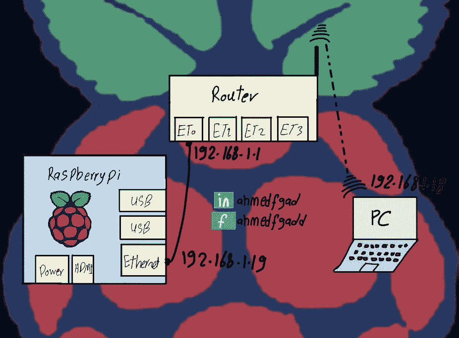
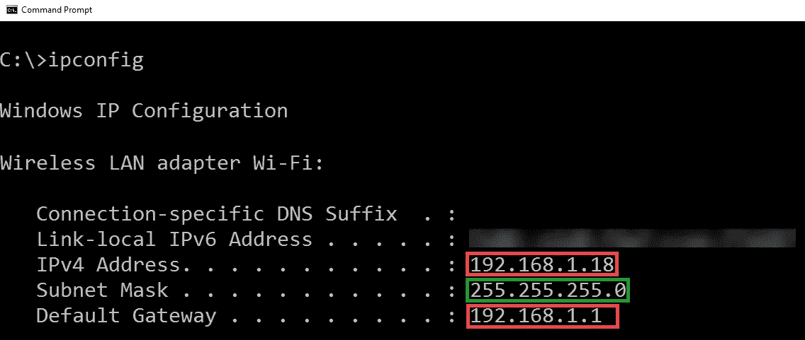
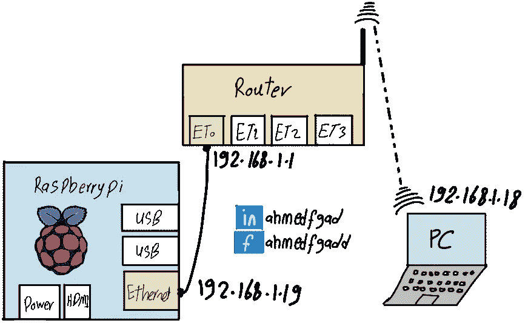
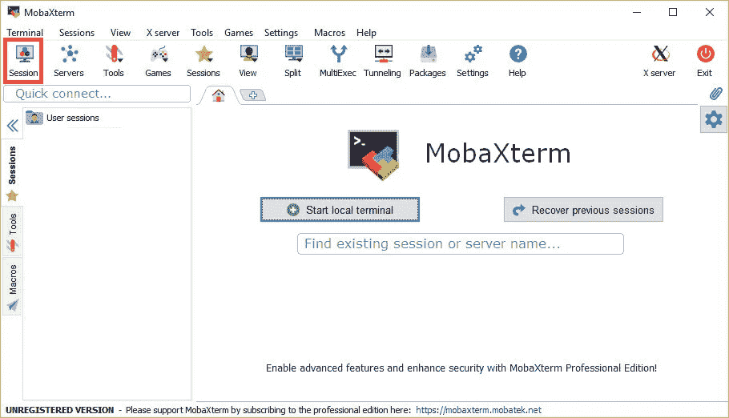
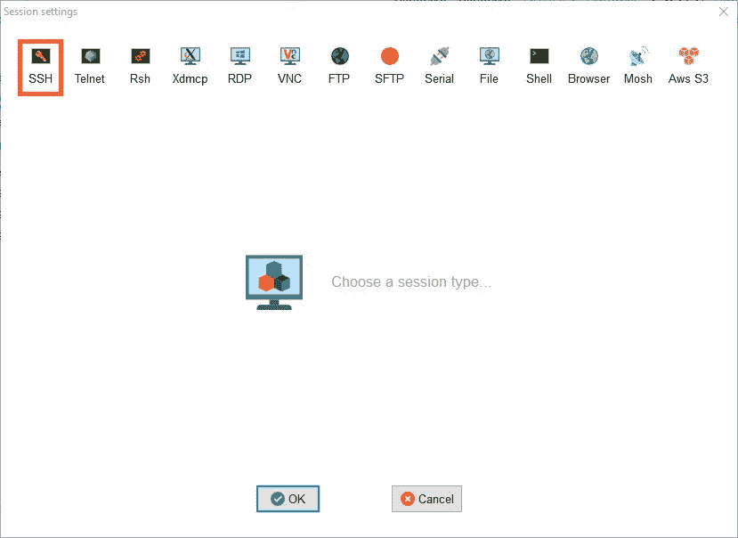
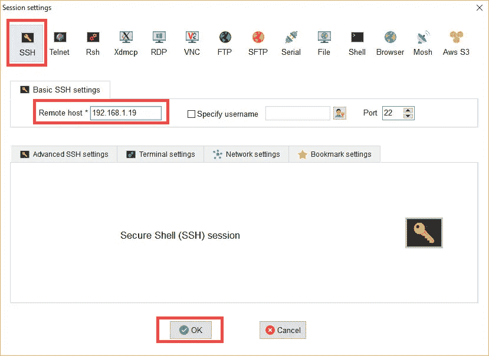
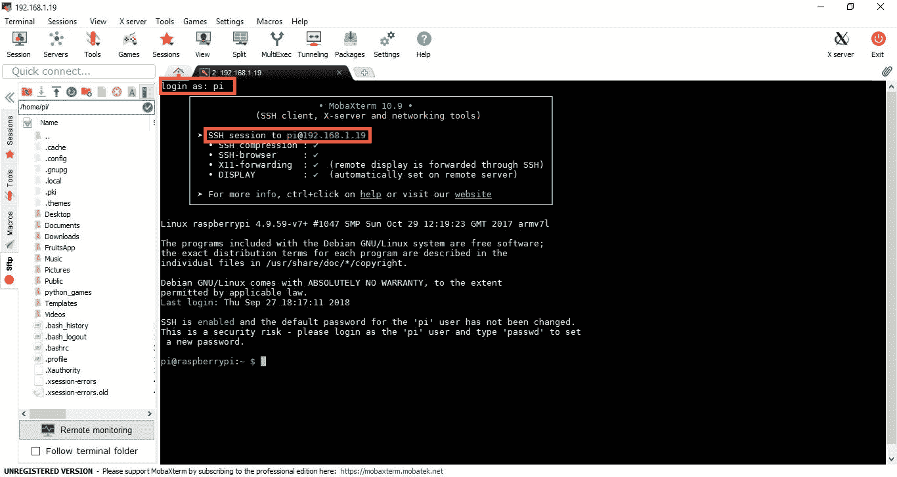
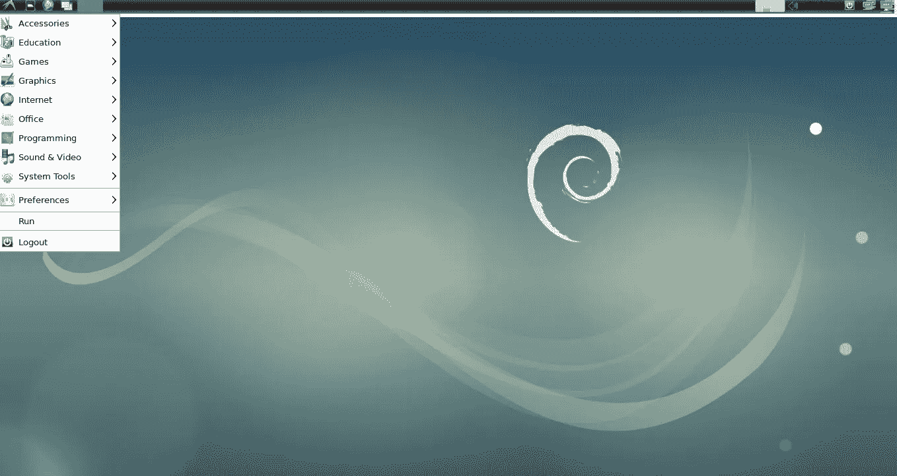
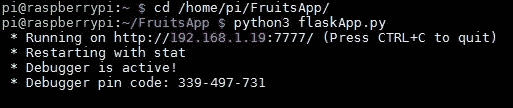
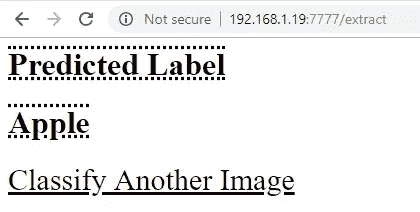

# 构建运行在 Raspberry Pi 上的图像分类器

> 原文：<https://towardsdatascience.com/building-an-image-classifier-running-on-raspberry-pi-a7a45153acc8?source=collection_archive---------6----------------------->

本教程讨论了如何使用 Raspberry Pi 接收对图像进行分类的 HTTP 请求，并使用分类标签进行响应。本教程首先构建物理网络，通过路由器将 Raspberry Pi 连接到 PC。准备好 IPv4 地址后，创建 SSH 会话，以便远程访问 Raspberry Pi。使用 FTP 上传分类项目后，客户可以使用 web 浏览器访问该项目以对图像进行分类。



# **树莓派**

Raspberry Pi 是一种单板计算机，设计价格低廉，发展中国家的学生也买得起。Raspberry Pi 支持用 Python 编码，这就是为什么术语“Pi”可用的原因。树莓 Pi 3 型号 B 是最新的可用版本。它有一个四核 1.2 GHz CPU，1 GB RAM，Wi-Fi，蓝牙，一个 HDMI 端口，4 个 USB 端口，以太网端口，摄像头等。

Raspberry Pi 没有安装操作系统。操作系统可以装在插入主板 SD 卡插槽的 SD 卡上。可以使用 NOOBS(新的开箱即用软件)([https://www.raspberrypi.org/downloads/noobs](https://www.raspberrypi.org/downloads/noobs))下载操作系统，这是一个操作系统管理器，可以轻松地将操作系统下载并安装到 Raspberry Pi。官方的 Raspberry Pi 操作系统被称为 Raspbian，这是专门为 Raspberry Pi 设计的 Linux 版本。它伴随着 NOOBS。NOOBS 也支持一系列操作系统供选择。

在 SD 卡中安装操作系统后，下一步是运行并访问它。访问 Raspberry Pi 的一种方式是使用以太网接口连接它。这种连接可以通过将其连接到 PC 的以太网接口来直接进行。有些电脑只有无线接口，根本不支持以太网。其他人可能在安装驱动程序时遇到问题。因此，我们可以避免将 Raspberry Pi 连接到 PC 的以太网接口，而是将其连接到路由器的一个以太网接口。PC 可以使用 Wi-Fi 连接到这样的路由器。

# **网络配置**

假设 Raspberry Pi 和 PC 所在的局域网(LAN)使用范围从 192.168.1.1 到 192.168.1.254 的互联网协议版本 4 (IPv4)地址。即网络地址是 192.168.1.0，子网掩码是 255.255.255.0。使用动态主机配置协议(DHCP)，IPv4 地址被动态分配给 PC 和 Raspberry Pi。我们可以在 Windows 中使用 **ipconfig** 命令(Linux 中使用 **ifconfig** 命令)轻松知道 PC 的 IP 地址。如下图所示，默认网关设置为 192.168.1.1，PC 的 IPv4 地址为 192.168.1.18。



为了知道分配给 Raspberry Pi 以太网接口的 IPv4 地址，将使用一个名为“高级 IP 扫描器”的程序。可以从这个页面下载[https://www.advanced-ip-scanner.com](https://www.advanced-ip-scanner.com)。该程序接收一系列 IPv4 地址，并搜索活动地址。对于范围内的每个 IPv4 地址，该程序返回其状态、主机名、制造商和媒体访问控制(MAC)地址。通常，Raspberry Pi 的主机名或制造商名称中会包含“Raspberry”一词。这有助于我们确定哪个 IP 属于树莓派。下图显示了分配给路由器网关接口、PC 和签名为 192.168.1.19 的 Raspberry Pi 以太网接口的 IPv4 地址。


总之，下图显示了除分配的 IPv4 地址之外的 3 台设备(Raspberry Pi、路由器和 PC)。路由器中的一个以太网接口使用简单的电缆连接到 Raspberry Pi 的以太网接口。路由器以无线方式连接到 PC。



# **安全壳**

建立物理连接后，我们需要从 PC 访问 Raspberry Pi。安全外壳(SSH)是一个很好的选择。SSH 会话可以使用不同的软件程序来创建，比如 XMing、Putty 和 MobaXterm。MobaXterm 是一款易于使用的软件，点击链接【https://mobaxterm.mobatek.net/download-home-edition.html】即可获得。下图是 MobaXterm 的主窗口。

**重要提示**:在建立 ssh 会话之前，必须在 SD 卡的根目录下添加一个没有扩展名的名为“SSH”的空文件。这是允许与 Raspberry Pi 建立 SSH 会话所必需的。这是通过将 SD 卡插入 PC 并添加此类文件来完成的。将 SD 卡插入 Raspberry Pi 后，我们就可以开始创建 SSH 会话了。



图标栏左上角的“会话”图标用于建立 SSH、Telnet 等会话。点击后，将显示如下图所示的窗口。



在点击最左边的 SSH 图标后，MobaXterm 会询问 Raspberry Pi 的远程主机名或 IPv4 地址，以便访问远程设备。我们可以使用 Raspberry Pi 的以太网接口的 IPv4 地址 192.168.1.19，如下图所示。



# **登录**

如果物理连接工作正常，单击“OK”按钮后，将要求您登录以成功访问远程设备。Raspberry Pi 的默认登录用户名和密码是:

*   **用户名** : pi
*   **密码**:树莓

正确输入这些详细信息后，会话将根据下图成功启动。只是有一个 Raspbian 终端用于与 Raspberry Pi OS 交互。请注意，MobaXterm 允许缓存以前会话中使用的密码，因此您不必每次登录时都输入密码。



您可能会注意到，SD 卡的内容显示在终端的左侧。这是因为 MobaXterm 支持使用文件传输协议(FTP)创建连接来上传和下载文件。这是一个非常有用的功能，可以节省很多时间。如果不使用 FTP，我们必须多次弹出和插入 SD 卡，以便向 Raspberry Pi 添加新文件。

# **X11 窗口系统**

为了使初学者更容易与这样的操作系统进行交互，MobaXterm 使用 X11 窗口系统，该系统提供了一个图形用户界面(GUI)来与操作系统进行交互，而不是使用命令行。X11 为 Linux 操作系统提供了一个类似于 Microsoft Windows 的 GUI 显示框架。我们可以使用“ **startlxde** ”命令打开访问 GUI，如下图所示。



此时，我们可以使用 SSH 访问 Raspberry Pi，并能够使用 GUI 与之交互。这太棒了。使用只需 50 美元的 Raspberry Pi，我们就有了一个和我们在电脑上看到的一样的界面。当然，由于内存、SD 卡存储和 CPU 速度有限，它不会支持我们机器中的所有东西。

# **图像分类**

接下来，我们可以开始构建图像分类器。完整的分类器是在本书中从零开始构建的“ **Ahmed Fawzy Gad，使用深度学习的实用计算机视觉应用与 CNN，Apress，2019，978–1484241660**”。

使用来自 Fruits 360 数据集的 4 个类来训练分类器。这个想法是使用 Flask 创建一个 web 应用程序，该应用程序存在于 Raspberry Pi 上的 web 服务器中，其中存在训练好的分类器。用户可以访问它上传和分类自己的图像。

在 FTP 的输出中有一个名为“ **FruitsApp** 的文件夹，它是先前上传到 Raspberry Pi 的。它包含项目文件。该项目有一个名为“ **flaskApp.py** 的主 Python 文件，用于实现 Flask 应用程序。还有其他补充的 HTML、CSS 和 JavaScript 文件用于构建应用程序的界面。为了运行应用程序，可以从终端执行 python " **flaskApp.py** "文件，如下图所示。



以下 Python 代码实现了 Flask 应用程序。根据代码的最后一行，可以使用 web 浏览器通过访问分配给 Raspberry Pi 的 IP 地址和端口 7777 来访问该应用程序。结果应用的首页是 [http://192.168.1.19/7777](http://192.168.1.19/7777) 。

```
**import** flask, werkzeug, PIL.Image, numpy
app = flask.Flask(import_name=**”FruitsApp”**)**def** extractFeatures():
    img = flask.request.files[**"img"**]
    img_name = img.filename
    img_secure_name = werkzeug.secure_filename(img_name)
    img.save(img_secure_name)
    print(**"Image Uploaded successfully."**)
    img_features = extract_features(image_path=img_secure_name)
    print(**"Features extracted successfully."**)
    weights_mat = numpy.load(**"weights.npy"**)
    predicted_label = predict_outputs(weights_mat, img_features, activation=**"sigmoid"**)
    class_labels = [**"Apple"**, **"Raspberry"**, **"Mango"**, **"Lemon"**]
    predicted_class = class_labels[predicted_label]
    **return** flask.render_template(template_name_or_list=**"result.html"**, predicted_class=predicted_class)app.add_url_rule(rule=**"/extract"**, view_func=extractFeatures, methods=[**"POST"**], endpoint=**"extract"**)**def** homepage():
    **return** flask.render_template(template_name_or_list=**"home.html"**)
app.add_url_rule(rule=**"/"**, view_func=homepage)app.run(host=**"192.168.1.19"**, port=7777, debug=**True**)
```

一旦用户访问主页，将显示一个 HTML 页面，要求上传图像。一旦上传了图像，将会调用“**extract features()”**函数。它提取特征，预测类标签，并根据下图在另一个 HTML 页面中呈现结果。上传的图片类标签是“苹果”。更多细节，请看[1]中的书。



# **了解更多详情**

[1]“**Ahmed faw zy Gad，使用深度学习与 CNN 的实际计算机视觉应用，Apress，2019，978–1484241660**”。可通过以下链接获得:

*   [https://www . Amazon . com/Practical-Computer-Vision-Applications-Learning/DP/1484241665](https://www.amazon.com/Practical-Computer-Vision-Applications-Learning/dp/1484241665)
*   [https://apress.com/us/book/9781484241660](https://apress.com/us/book/9781484241660)
*   [https://springer.com/us/book/9781484241660](https://springer.com/us/book/9781484241660)

# **联系作者**

*   电子邮件:[ahmed.f.gad@gmail.com](mailto:ahmed.f.gad@gmail.com)
*   领英:[https://linkedin.com/in/ahmedfgad/](https://linkedin.com/in/ahmedfgad/)
*   https://kdnuggets.com/author/ahmed-gad
*   YouTube:[http://youtube.com/AhmedGadFCIT](http://youtube.com/AhmedGadFCIT)
*   走向科学:[https://towardsdatascience.com/@ahmedfgad](https://towardsdatascience.com/@ahmedfgad)