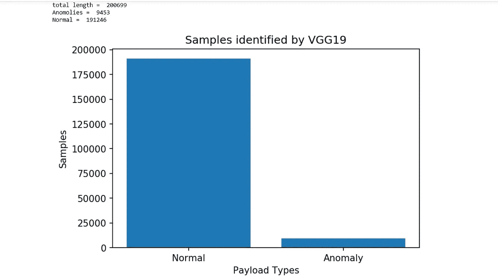
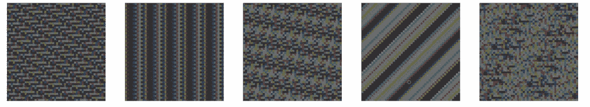
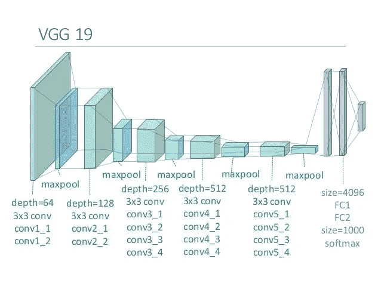
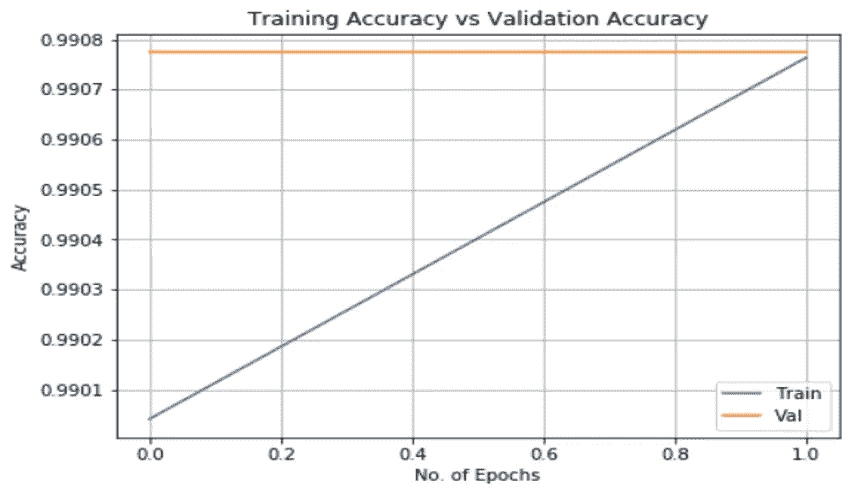
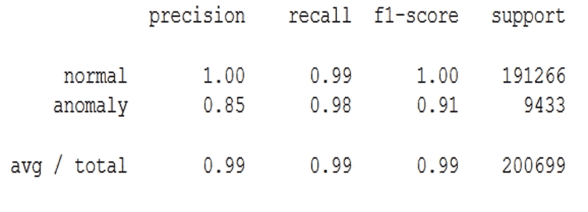

# 利用深度学习构建入侵检测系统

> 原文：<https://towardsdatascience.com/building-an-intrusion-detection-system-using-deep-learning-b9488332b321?source=collection_archive---------3----------------------->

这实际上是我和我的小组为我们的计算机科学学士学位实施和完成的最后一年项目。

已经对入侵检测系统进行了大量研究，但是最大的变化发生在收集的数据集中，该数据集中包含许多入侵技术的样本，例如暴力、拒绝服务或者甚至来自网络内部的渗透。

随着网络行为和模式的改变以及入侵的发展，从静态和一次性数据集转向更动态生成的数据集变得非常必要，这些数据集不仅反映当时的流量构成和入侵，而且是可修改、可扩展和可再现的。

为此，我们将训练一个深度学习模型，从给定的数据集中识别异常。

由于机器学习在系统中的应用，基于异常的检测在入侵检测系统中是最有效的，因为它们不需要搜索任何特定的异常模式，而是将任何不匹配简档的东西视为“异常”。

注意:我不会在这里分享代码，但我会在最后给出 GitHub 上代码的链接。目的是启发用于实现成功的准确性的思想和实现。

我们开始吧:)

# 数据集

为此，我们将利用加拿大网络安全研究所收集的 ISCX 2012 数据集。您可以在下面的链接中找到它:

 [## IDS 2012 |数据集|研究|加拿大网络安全研究所| UNB

### CIC 和 ISCX 的数据集在世界各地被用于安全测试和恶意软件防范。

www.unb.ca](http://www.unb.ca/cic/datasets/ids.html) 

在我们开始之前，通过使用 Matplotlib 库来检查每个类(正常和异常)包含了多少数据，来可视化实际数据集。

Image visualizing the anomaly data from the normal using Matplotlib library

我应该提到的是，在项目开始时，我们使用机器学习技术研究了许多关于入侵检测系统的论文，我们发现没有一篇论文利用了 ISCX 2012 数据集，这很可能是因为当时该数据集不可用。但是我们是第一批在入侵检测系统中使用数据集的公司之一。

# 环境

我已经创建了一个指南，非常详细地介绍了[如何为深度学习设置你的系统](https://blog.goodaudience.com/python-environment-setup-for-deep-learning-on-windows-10-c373786e36d1)

如果你碰巧正在使用 Keras API，但使用的是 Theano 或微软 CNTK 后端引擎，那么你也不错。否则，请遵循上述指南。

# 数据预处理

当被下载时，当 ISCX 数据集处于其原始状态时，对于深度学习模型是不可读的。PCAP 文件格式，因此，为了改变这一点，我们使用一个开源软件程序称为 ISCX 流量计来改变这一点。

[git hub 上的 ISCX 流量计](https://github.com/ISCX/ISCXFlowMeter)

这个流量计接收。PCAP 文件，并将它们转换成可读的。XML 文件格式，将每个数据部分堆叠为流，其中第一个数据包确定了向前(从源到目的地)和向后(从目的地到源)的方向。

以下是新转换的数据集的示例:

Part of the ISCX data in XML format

现在，我们只需要每个流中的两个数据:

1.  目的地有效负载为 UTF:这是用户接收到的传入数据包
2.  标记:这将上述有效载荷标记为正常或异常

因此，在数据集上运行流量计后，我们得到多个 XML 文件，从每个文件的每个树中提取两个主要数据值。然后，我们将有效载荷数据连接起来，使其长度为 7500，一旦完成，我们就将其重新整形为一个 50x50x3 维的 NumPy 数组。

当可视化时看起来像这样

Five data images from the ISCX data set

然后，我们垂直堆叠这些阵列，并添加一列，其中包括每个单独有效载荷的标签，即正常或异常。完成后，我们将数据保存到。NPY 文件，以便它可以用作深度学习模型的输入。

# 模型

我们尝试了不同模型的各种实验，但我们成功准确发现的一个实验是在 VGG-19 Keras 预训练模型上使用迁移学习技术。

VGG-19 Model Layout

我们没有使用预先训练的 VGG-19 的权重，因为我们的图像是定制图像，因此我们选择使用常规的异常检测技术在我们的图像集上训练模型，该技术包括两个阶段:

1.  **训练阶段:**创建正常有效载荷轮廓的阶段。通常情况下，不需要任何异常数据进行训练，因为在下一阶段，入侵检测系统会立即从配置文件中的数据中丢弃任何偏差最小的数据。
2.  **测试阶段:**将传入的有效载荷与配置文件中存储的数据进行比较的阶段。

在这样做的时候，我们在数据值上训练我们的模型，数据值的标签被标记为正常，反过来，它在第一个纪元就达到了 100%的精度。然而，随着异常数据值的引入，模型达到了 100%的不正确准确度，其结论是模型正确识别了正常数据，但是在异常情况下，模型只是绕过了正常数据而没有对其进行分类。

因此，我们在训练数据中同时使用了异常和正常数据，由于数据的性质，很明显这是一个异常检测问题。在测试阶段，我们获得了满意的结果，该模型能够以 100%的准确率识别正常数据，以 85%的准确率识别异常数据。考虑到我们的数据集，获得的结果是令人满意的

Accuracy graph of the model in 2 epochs

Scientific model evaluation of our model using Scikit-learn library

# 结论

通过对我们模型的成功识别，我们可以自信地宣称，我们的模型可以用作入侵检测系统应用程序的后端引擎，该应用程序可以安装在任何计算机网络的边界上

然而，明智的做法是进一步测试，如果需要的话，重新训练加拿大网络安全研究所发布的新数据集模型，即 IDS 2017 数据集。

 [## IDS 2017 |数据集|研究|加拿大网络安全研究所| UNB

### CIC 和 ISCX 的数据集在世界各地被用于安全测试和恶意软件防范。

www.unb.ca](http://www.unb.ca/cic/datasets/ids-2017.html) 

这一举措将进一步验证我们的模型在检测异常方面的准确性，因此如果您希望在入侵检测或入侵防御系统中使用这一点，我强烈建议首先这样做，因为这将使模型保持更新。

**GitHub 链接:**[https://GitHub . com/tamimmirza/Intrusion-Detection-System-using-Deep-Learning](https://github.com/tamimmirza/Intrusion-Detection-System-using-Deep-Learning)

我希望你喜欢这次旅行:)