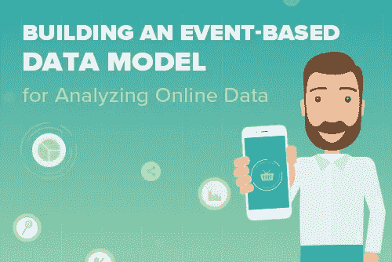
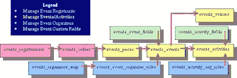
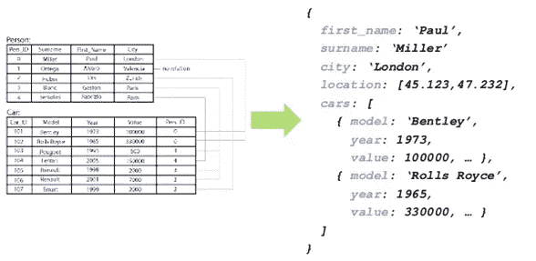
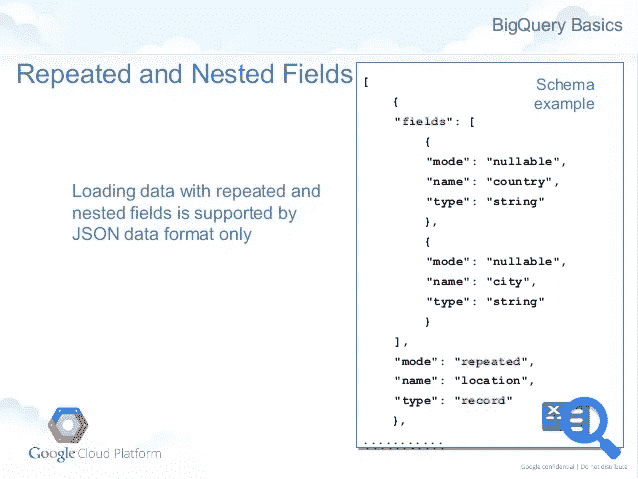
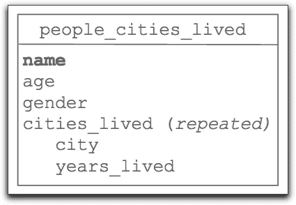

# 构建并利用基于事件的数据模型来分析在线数据

> 原文：<https://towardsdatascience.com/building-and-leveraging-an-event-based-data-model-for-analyzing-online-data-c166c523fe6a?source=collection_archive---------2----------------------->

2017 and beyond, you should only be using an event-based data model.. If you are not, your agility may be severely limited

如果您对这个主题足够感兴趣，您可能足够了解收集和分析事件是理解用户如何与应用程序交互的信息高速公路。但是让我们先退后一步，问一个这个想法所基于的问题:为什么我们首先要收集事件？

商业智能专家过去的迭代会从在购买过程的不同阶段收集的关于用户的人口统计和心理信息中推断出相当多的信息。很容易说，美国人比其他国家的人倾向于购买更多的东西，年轻人更倾向于网上购物。

但是人口统计学和心理统计学不会告诉你一切。研究表明，关于用户的行为数据在预测购买、升级和流失等方面非常有效。

在 Cooladata，我们遵循创始人 Tomer Ben Moshe 的格言:

“你是由你做的事情来定义的，而不是你是谁。”

这一理念不仅将我们公司凝聚在一起，而且渗透到我们的产品中，指导我们做出的每一个设计决策。Cooladata 是一个完整的系统，旨在实现对用户行为的快速分析和理解。

在这个用户行为的宇宙中，事件就是原子。当用户在您的网站、应用程序或数字资产中采取某种可衡量的行动时，该行动将被记录为一个事件。

# 一般定义

来自移动网络或 IOT 的在线数据基于事件，其中每个事件都有自己的属性，例如:

事件数据建模是使用业务逻辑存储事件级数据以产生“可分析的”数据的过程，这意味着更容易查询和理解用户行为。

事件数据模型通常包含 3 个主要的层次级别:

*   用户
*   会议
*   事件

# 用户

用户实体将包含关于用户的特定属性，例如:

*   电子邮件
*   邮政区码
*   手机号码
*   和其他属性

# 会议

会话实体将包含关于会话的特定属性，例如:

*   浏览器
*   设备
*   国家(IP)
*   推荐来源等。

事件

事件实体将包含每个事件类型的特定属性，例如:

*   登录事件:用户 ID、登录页面、推荐来源
*   添加项目事件:产品、价格、颜色、尺寸等。
*   结帐事件:总价、折扣、运送选项等。

# 挑战

传统的 BI 数据模型(如星型模式或雪花模式)包含具有固定结构的事实表和维度。

这对于分析数据来说是高效且易于使用的，但是它只适用于结构化的数据，并且模式变化不大。

基于事件的数据模型基于结构化和半结构化数据，例如:

*   URL:在一个字符串中包含许多属性(页面、标题、活动等)。)
*   DUA:设备用户代理包含许多关于会话的属性，如设备、浏览器、操作系统、位置等。
*   事件类型:每种事件类型都有不同的模式，因为它基于完全不同的属性，这使得使用传统的 BI 数据模型几乎不可能

事件数据结构也趋向于非常频繁地改变。这意味着您几乎每天都要添加字段和表。由于当今业务的快速发展，数据结构往往会快速变化(与 20 年前相比)。

对于新产品特性、新工具或新版本，您会发现自己需要一个基于事件的数据模型，该模型灵活、可伸缩，并且可以轻松地合并新事件。僵化的模式，如雪花或星型模式，根本不善于适应 21 世纪业务的快速变化的性质。

有几种方法可以构建基于事件的数据模型。下面，我们列出了 3 个最流行的，以及我们自己的版本。在我们开始之前，让我们看看基于事件的数据模型的一些最重要的考虑因素。

# 基于事件的数据模型的注意事项:

1.  **易用性** —使用 SQL 分析数据有多简单
2.  **性能** —最小化连接和全扫描
3.  **定价** —您可能希望使用更便宜的红移集群或降低 BigQuery 成本
4.  **易于填充** —将数据加载到模型中有多容易？完全加载、增量加载和更新数据

现在让我们仔细看看你的一些选择。

# 选项 1-每个事件类型的表+一个公共属性表

*   每种事件类型的事实表
*   每个事件类型表都包含事件属性的特定字段
*   所有事件类型的“所有事件”事实表，带有通用属性字段

## 赞成的意见

*   特定行为查询的良好性能。
    例如:漏斗分析将在事件类型表之间创建连接，这比使用每个事件类型的子查询在所有事件上创建连接要高效得多。
*   为分析特定事件类型而优化。
    例如:在 installs 表上分析“install”事件类型比在整个事件表上分析要有效得多。(即，分析“注册”事件将仅访问注册表。)
*   您仍然可以使用“所有事件”事实表来分析具有共同属性的所有事件。

## 骗局

*   难以管理，尤其是在动态环境中。每当添加事件类型时，都需要添加一个反映 ETL、元数据和监控的表。
*   每种事件类型都需要一个新表。即使这种事件类型很少使用，您也需要为每种事件类型维护一个表。当您有数百种事件类型时，这变得难以管理。
*   通过拥有“all_event”表和“event_type”表，您可以复制数据。这需要更多的工作，并且很容易失去同步，导致数据质量问题。

# 选项 2 —通用事件表+定制属性的 JSON 字段

*   单个事件表
*   该表包含作为字段的公共属性
*   定制属性存储在 JSON 字段中

## JSON

## 赞成的意见

*   比每个事件一个表格更容易管理。新的属性只是添加到 JSON 字段中，不需要管理许多 event_type 表。
*   易于分析常见事件属性。
    例如:事件时间戳、用户标识、会话标识等。
*   您可以在事件表中存储用户和会话数据。(这叫做涂抹，帮助你管理缓慢变化的维度。)

## 骗局

*   难以分析自定义属性。您需要为每个查询从 JSON 字段中提取定制属性，这会导致性能下降。
*   代价高昂的
    例如:在 Google BigQuery 中，从较大的 JSON 对象中选择少量数据的代价更高，因为 BigQuery 的定价是基于扫描大小(处理的字节数)的。
*   很难映射元数据并使用 BI 工具来定制属性，因为数据可能位于嵌套的 JSON 字符串中。

# 选项 3 —嵌套表数据模型

*   针对所有事件的单个事实表
*   同一层次结构中的公共属性
*   嵌套层次结构中的自定义属性
*   您可以为用户和会话数据创建层次结构

## 例子

## 赞成的意见

*   优雅且易于理解的数据存储方式。
*   每个层次的属性都很灵活。
*   对于某些查询，如 count distinct，性能良好。
*   某些查询(如 count distinct)将扫描更少的数据。
*   所有数据都包含在一个表中，减少了表之间的连接需求。

## 骗局

*   嵌套数据变得难以轻易查询。
*   难以将数据加载到表中，尤其是增量数据。
*   难以映射元数据和在嵌套数据模型上使用 BI 工具。包含嵌套数据的列需要相当复杂的已定义模式，以考虑这些列中可能发生的自描述 JSON 事件。
*   几乎不可能更新数据。

# 为了透明起见，我现在和 [Cooladata](http://www.cooladata.com) 在一起，我们是利用基于事件的数据模型来收集和分析所有数据系统和孤岛中的用户行为的领导者。

# 以下是 Cooladata 选项的视图:

*   单个事件表
*   可以选择将特定的事件类型存储到不同的表中。
    例如:流行的事件类型，比如“页面视图”，可以存储在一个单独的表中，其余的事件类型可以存储在一个单独的表中
*   该表包含作为字段的通用和自定义属性
*   该表包含每个事件行的用户和会话数据(涂抹)

## 赞成的意见

*   易于理解数据的存储方式。
*   通过将流行的事件类型存储在单独的表中，您可以获得最佳的性价比。
*   所有数据加载都由 Cooladata 处理。
*   你能够很容易地分析数据。
*   您可以轻松访问历史变化(缓慢变化的维度)。

## 骗局

*   为了获得最佳性能，您需要使用 CQL (Cooladata SQL)。
*   数据管理通过 Cooladata 进行。

# 附加 [Cooladata](https://www.cooladata.com/behavioral-analytics-platform/) 功能

## 物理模式

我们按照时间和属性对数据进行划分，例如事件类型、地理位置等。以获得最佳性能并优化数据访问。

我们将数据存储在一个稀疏的柱状分析数据库中，从而获得灵活性和性能。

## 语义层/元数据

我们从在线数据和传统数据中自动创建语义层和元数据。

## 优化的数据访问层(解析器)

我们的智能解析器翻译简单的 SQL 语句，以便能够访问相关的分区。

## 行为时间序列扩展(CQL)

我们扩展了 SQL，它是基于集合的，具有更多的功能，支持对粒度数据进行时间序列分析。

## 我们的技术提供了这些功能:

*   将事务性和基于在线的数据结合成一个连贯的流。
*   数据模型中基于文档的模式的灵活性。
*   在一个模式中进行全面的维度和时间序列分析。
*   能够在数据模型上使用常见的可视化工具。
*   临时统一在线和传统数据。
*   通过智能分区优化数据成本。
*   全面跟踪历史数据变化(渐变维度)。
*   按需提供数据分析师和数据科学家，帮助您构建数据模型和解释数据。

感谢阅读，希望你学到了一些东西。但