# 一步一步地建立和测试推荐系统

> 原文：<https://towardsdatascience.com/building-and-testing-recommender-systems-with-surprise-step-by-step-d4ba702ef80b?source=collection_archive---------1----------------------->


Photo credit: Pixabay

## 了解如何借助 Python 和惊喜库、协同过滤来构建自己的推荐引擎

[推荐系统](https://en.wikipedia.org/wiki/Recommender_system)是数据科学最常用和最容易理解的应用之一。关于这个主题已经做了很多工作，由于互联网的快速发展和信息过载问题，人们对这个领域的兴趣和需求仍然很高。帮助用户处理信息过载并向他们提供个性化的推荐、内容和服务已经成为在线企业的必要工作。

推荐系统最流行的两种方法是[协同过滤](https://en.wikipedia.org/wiki/Collaborative_filtering)和[基于内容的推荐](https://www.analyticsvidhya.com/blog/2015/08/beginners-guide-learn-content-based-recommender-systems/)。在本帖中，我们将重点介绍协同过滤方法，即:向用户推荐过去有相似品味和偏好的人喜欢的项目。换句话说，这种方法通过使用用户之间的相似性来预测未知的评级。

我们将与[图书交叉](http://www2.informatik.uni-freiburg.de/~cziegler/BX/)，一个图书评级数据集一起开发推荐系统算法，与[惊喜图书馆](http://surpriselib.com/)，它是由 [Nicolas Hug](http://nicolas-hug.com/) 建立的。我们开始吧！

# 数据

图书交叉数据由三个表组成，我们将使用其中的两个:用户表和图书评级表。

```
user = pd.read_csv('BX-Users.csv', sep=';', error_bad_lines=False, encoding="latin-1")
user.columns = ['userID', 'Location', 'Age']
rating = pd.read_csv('BX-Book-Ratings.csv', sep=';', error_bad_lines=False, encoding="latin-1")
rating.columns = ['userID', 'ISBN', 'bookRating']
df = pd.merge(user, rating, on='userID', how='inner')
df.drop(['Location', 'Age'], axis=1, inplace=True)
df.head()
```

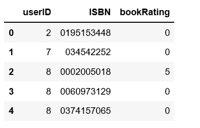

Figure 1

# 电子设计自动化(Electronic Design Automation)

## **收视率分布**

ratings_distribution.py

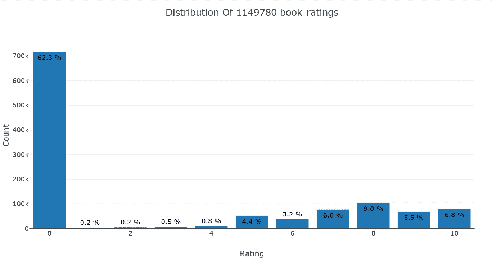

Figure 2

我们可以看到，数据中超过 62%的评级为 0，极少数评级为 1 或 2，或 3，低评级书意味着它们通常非常糟糕。

## **图书收视率分布**

ratings_distribution_by_book.py

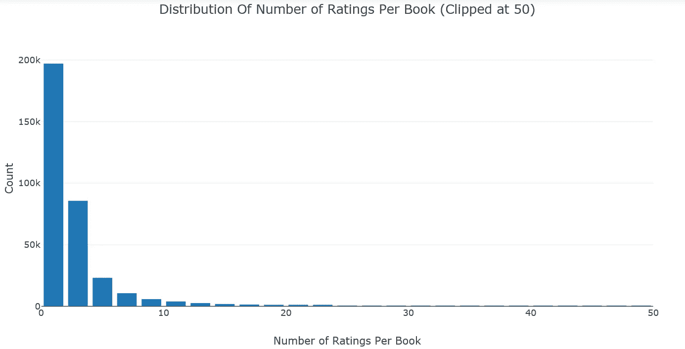

Figure 3

```
df.groupby('ISBN')['bookRating'].count().reset_index().sort_values('bookRating', ascending=False)[:10]
```

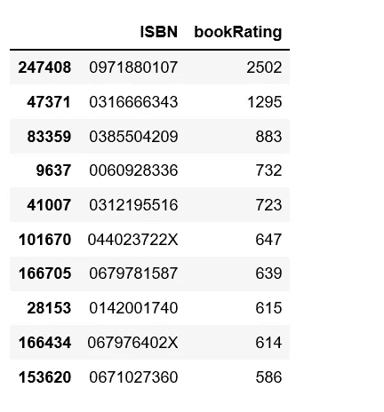

Figure 4

数据中的大部分书获得的评分都在 5 分以下，极少数书获得了很多评分，尽管评分最高的书获得了 2502 分。

## **用户评分分布**

ratings_distribution_by_user.py

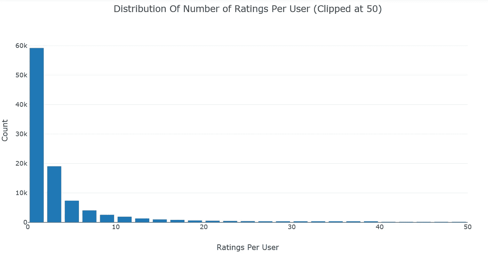

Figure 5

```
df.groupby('userID')['bookRating'].count().reset_index().sort_values('bookRating', ascending=False)[:10]
```

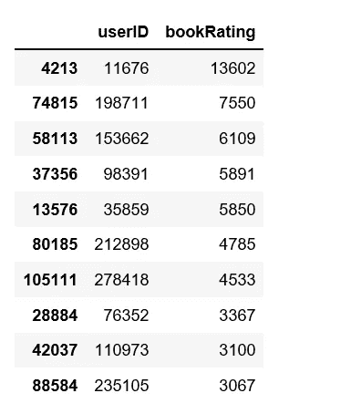

Figure 6

数据中的大多数用户给出的评分少于 5 分，给出很多评分的用户也不多，尽管最有生产力的用户给出了 13，602 个评分。

我相信你已经注意到了上面两个图有相同的分布。每本书的评分数和每个用户的评分数呈指数衰减。

为了降低数据集的维度，避免陷入“记忆错误”，我们将过滤掉很少评级的书籍和很少评级的用户。

filter_dataframe.py

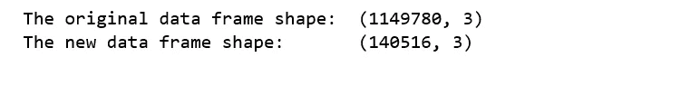

Figure 7

# 惊喜

为了从上面的 pandas 数据框加载一个数据集，我们将使用`load_from_df()`方法，我们还需要一个`Reader`对象，并且必须指定`rating_scale`参数。数据框必须有三列，依次对应于用户 id、项目 id 和等级。因此，每一行对应于一个给定的等级。

```
reader = Reader(rating_scale=(0, 9))
data = Dataset.load_from_df(df_new[['userID', 'ISBN', 'bookRating']], reader)
```

借助惊喜库，我们将对以下算法进行基准测试:

## 基本算法

**正常预测值**

*   `NormalPredictor`算法根据假设为正态的训练集分布预测随机评分。这是最基本的算法之一，不需要做很多工作。

**仅基线**

*   `BaselineOnly`算法预测给定用户和项目的基线估计值。

## k-NN 算法

**KNNBasic**

*   `KNNBasic`是一种基本的协同过滤算法。

**KNNWithMeans**

*   `KNNWithMeans`是基本的协同过滤算法，考虑了每个用户的平均评分。

**KNNWithZScore**

*   `KNNWithZScore`是一个基本的协同过滤算法，考虑到每个用户的 z-score 归一化。

**KNNBaseline**

*   `KNNBaseline`是一种考虑基线评级的基本协作过滤算法。

## 基于矩阵分解的算法

**奇异值分解**

*   `SVD`算法相当于[概率矩阵分解](http://papers.nips.cc/paper/3208-probabilistic-matrix-factorization.pdf)

**SVDpp**

*   `SVDpp`算法是 SVD 的扩展，它考虑了隐式评级。

**NMF**

*   `NMF`是一种基于非负矩阵分解的协同过滤算法。它与奇异值分解非常相似。

## 一号斜坡

*   `SlopeOne`是 [SlopeOne 算法](https://arxiv.org/abs/cs/0702144)的简单实现。

## 共聚类

*   `Coclustering`是基于[协同聚类](http://citeseerx.ist.psu.edu/viewdoc/download?doi=10.1.1.113.6458&rep=rep1&type=pdf)的协同过滤算法。

我们使用“rmse”作为预测的准确性指标。

benchmark.py

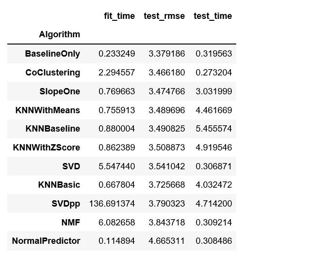

Figure 8

# 训练和预测

`BaselineOnly`算法给了我们最好的 rmse，因此，我们将使用`BaselineOnly`和交替最小二乘法(ALS)进行训练和预测。

```
print('Using ALS')
bsl_options = {'method': 'als',
               'n_epochs': 5,
               'reg_u': 12,
               'reg_i': 5
               }
algo = BaselineOnly(bsl_options=bsl_options)
cross_validate(algo, data, measures=['RMSE'], cv=3, verbose=False)
```

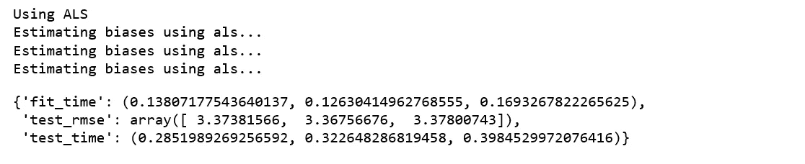

Figure 9

我们使用`train_test_split()`对给定大小的训练集和测试集进行采样，并使用 rmse 的精度度量。然后我们将使用`fit()`方法在训练集上训练算法，使用`test()`方法从测试集返回预测。

```
trainset, testset = train_test_split(data, test_size=0.25)
algo = BaselineOnly(bsl_options=bsl_options)
predictions = algo.fit(trainset).test(testset)
accuracy.rmse(predictions)
```

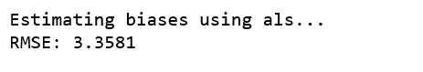

Figure 10

为了详细检查我们的预测，我们将建立一个包含所有预测的熊猫数据框。下面的代码大部分摘自这个[笔记本](http://nbviewer.jupyter.org/github/NicolasHug/Surprise/blob/master/examples/notebooks/KNNBasic_analysis.ipynb)。

predictions_details.py

**最佳预测**:

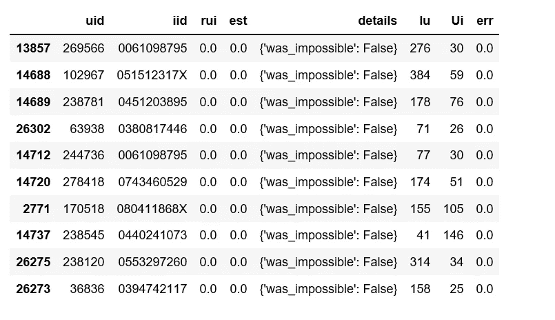

Figure 11

以上是最好的预测，不是侥幸的猜测。因为 Ui 介于 25 到 146 之间，所以它们并不小，这意味着大量用户对目标图书进行了评级。

**最坏的预测**:

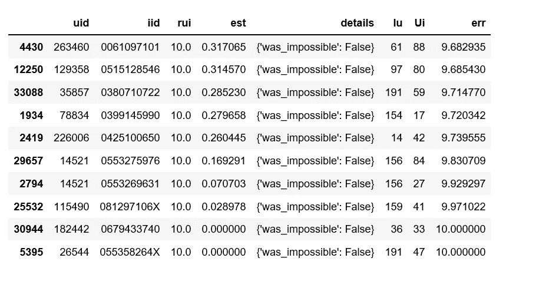

Figure 12

最糟糕的预测看起来相当令人惊讶。让我们看看最后一个 ISBN“055358264 x”的更多细节。这本书被 47 个用户评分，用户“26544”评分为 10，我们的 BaselineOnly 算法预测该用户评分为 0。

```
import matplotlib.pyplot as plt
%matplotlib notebookdf_new.loc[df_new['ISBN'] == '055358264X']['bookRating'].hist()
plt.xlabel('rating')
plt.ylabel('Number of ratings')
plt.title('Number of ratings book ISBN 055358264X has received')
plt.show();
```

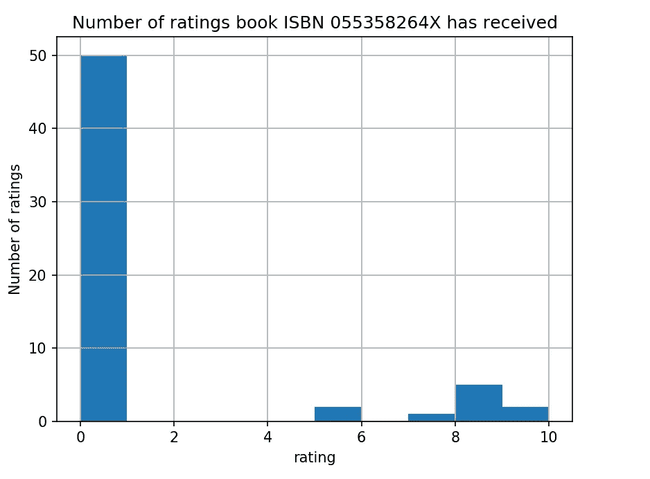

Figure 13

结果发现，这本书获得的大部分评分是 0，换句话说，数据中的大部分用户给这本书的评分是 0，只有极少数用户给了 10。与“最差预测”列表中的其他预测相同。似乎对于每一个预测，用户都是某种局外人。

就是这样！我希望你喜欢这个推荐(或者更确切地说，一个评级预测)之旅。 [Jupyter 笔记本](https://github.com/susanli2016/Machine-Learning-with-Python/blob/master/Building%20Recommender%20System%20with%20Surprise.ipynb)可以在 [Github](https://github.com/susanli2016/Machine-Learning-with-Python/blob/master/Building%20Recommender%20System%20with%20Surprise.ipynb) 上找到。节日快乐！

参考:[惊喜’文档](https://surprise.readthedocs.io/en/stable/index.html)