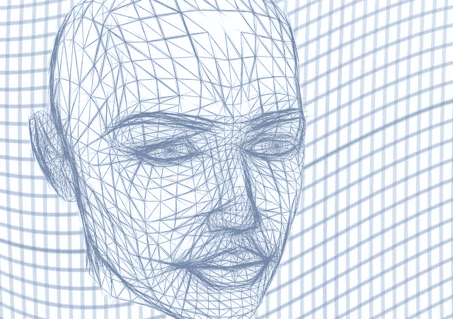

# 构建人工通用智能

> 原文：<https://towardsdatascience.com/building-artificial-general-intelligence-46b1380f1823?source=collection_archive---------5----------------------->

Building Artificial General Intelligence

从这个意义上来说，今年是一个不错的年份，我遇到了两个资源，它们帮助我更好地了解人工智能的当前状态，以及我们真正需要进入和建立一个“更高”级别的智能或俗称的人工通用智能(简称 AGI)。我希望向 AI 社区推荐这两个资源，并写下我的一些想法，希望能得到一个好的讨论。

# 论智力

所以第一个资源是我的朋友推荐给我的，这是一本名为《关于智力的书》，作者是[杰夫·霍金斯](https://en.wikipedia.org/wiki/Jeff_Hawkins)，他是 [Numenta](https://numenta.com/) 的创始人，正在进行[新大脑皮层](https://en.wikipedia.org/wiki/Neocortex)的逆向工程，研究大脑如何工作并创建一个通用计算模型。他们提出了这个被称为分级时间记忆的通用模型，简称 HTM。HTM 是一个结合了神经科学和机器智能的理论框架，我相信这是建设 AGI 的正确方向。

人工智能的当前状态已经看到了许多构建人工狭义智能的成功，这意味着所构建的智能体可以在特定的领域中非常成功，如围棋(来自谷歌 Deepmind 的 AlphaGo)、DOTA(特斯拉)、无人驾驶汽车甚至[汉堡烙牛肉饼机](https://www.bbc.com/news/av/technology-43292047/burger-flipping-robot-begins-first-shift)。这些代理拥有必要的工具，能够很好地完成他们的使命，但是如果你仔细研究他们，你会发现他们的前景已经非常明确了。这种情况需要人类智能来完成，例如，在强化学习中，人类智能来建立效用/延续功能，定义状态、奖励和可以采取的行动等。甚至在机器学习中，目前由监督学习组成，在机器学习之前，我们必须先记下标签/结果。(我将在下一篇参考资料中回到这一点)。

因此，在本书中，它谈到了模拟人类智力主要居住的新皮层，讨论了人类智力，我们如何学习和存储信息，我们的大脑不断地有一个时间/预测元素，不断地扫描环境，如果环境有一些不在预测范围内的东西，大脑的注意力就会被调用来进一步研究等等。如果你对建设 AGI 感兴趣，这是一本很有见地的书。如果你有兴趣了解更多，我推荐下面的 [YouTube 播放列表](https://www.youtube.com/playlist?list=PL3yXMgtrZmDqhsFQzwUC9V8MeeVOQ7eZ9)以便快速了解。

# 为什么之书

如果你要成为一名数据科学家或人工智能科学家，这是一本必读的书，[朱迪亚·珀尔](https://www.amazon.com/Book-Why-Science-Cause-Effect/dp/046509760X)的《为什么之书》。朱迪亚·珀尔支持人工智能的概率方法(这就是为什么你需要研究你的统计数据的原因)。通过《为什么》一书，他主张，如果我们要走向 AGI，我们需要在人工智能中建立“因果关系”。在书中，他提到了一种[演算](https://arxiv.org/abs/1305.5506)，我们需要这种演算来构建可以帮助机器理解因果关系的结构模型，称为[因果演算](https://en.wikipedia.org/wiki/Causality#Causal_calculus)。

在书中，他介绍了因果关系的[阶梯](https://www.etsy.com/listing/602191952/ladder-of-causation-illustration-art)，这是三级阶梯，最底层是“看”、“做”和“想象”。目前，如果我们仔细研究机器学习，我们仍然处于“看”的阶段，即第一级。如果我们要建设 AGI，我们需要开始帮助机器做更多的第二梯队，更重要的是，第三梯队。

在我研究这个领域的过程中，最困扰我的一个问题是，我们如何确定监督模型的标签/结果。目前，机器学习模型可以接受任何因变量，并告诉你它和自变量之间的关系。仍然需要人类的智慧来确定什么是因变量和自变量。仍然需要人类智能来查看数据是否可以输入到模型中(如果我们要实现机器学习模型的话)。机器学习模型在这个意义上是“愚蠢的”,因为它将接受我们定义的因变量和自变量。如果我们要建设一个 AGI，那么 AGI 也必须能够执行这样的任务。为了确定这一点，我们需要在整个结构中建立“因果关系”。

到目前为止，我已经读到了这本书的第三章，我觉得能够阅读这样的作品是值得的。我决定慢慢来，消化里面的大量知识。

# 最初的想法

到目前为止，我相信“因果关系”可以通过我们大脑不断进行的时间/预测建立到 HTM 模型中。这种想法肯定需要更多的研究和理解，以确定其可能性。我坚信，通过将这两种资源结合在一起，我们可以走上建设 AGI 的道路。

如果我们要继续当前的路线，我毫不怀疑我们可以通过调整当前的深度学习模型来建立出色的人工狭义智能(ANI)，即非常好地执行特定任务的代理，但我非常怀疑这条路线可以带我们走上人工通用智能的道路。此外，目前使用深度学习来构建 ANI 的路线在计算上是昂贵的，如果它发生在我们的大脑中，我们可能必须消耗大量的食物来支持它。

以上是我目前为止的想法，我愿意与读者进行讨论。:)

如果这篇博文对你来说很有趣和/或有用，请鼓掌。我也写关于数据科学的博客，所以请访问我的[其他博客文章](http://koopingshung.com/blog)和 [LinkedIn 个人资料](https://www.linkedin.com/in/koopingshung/)。