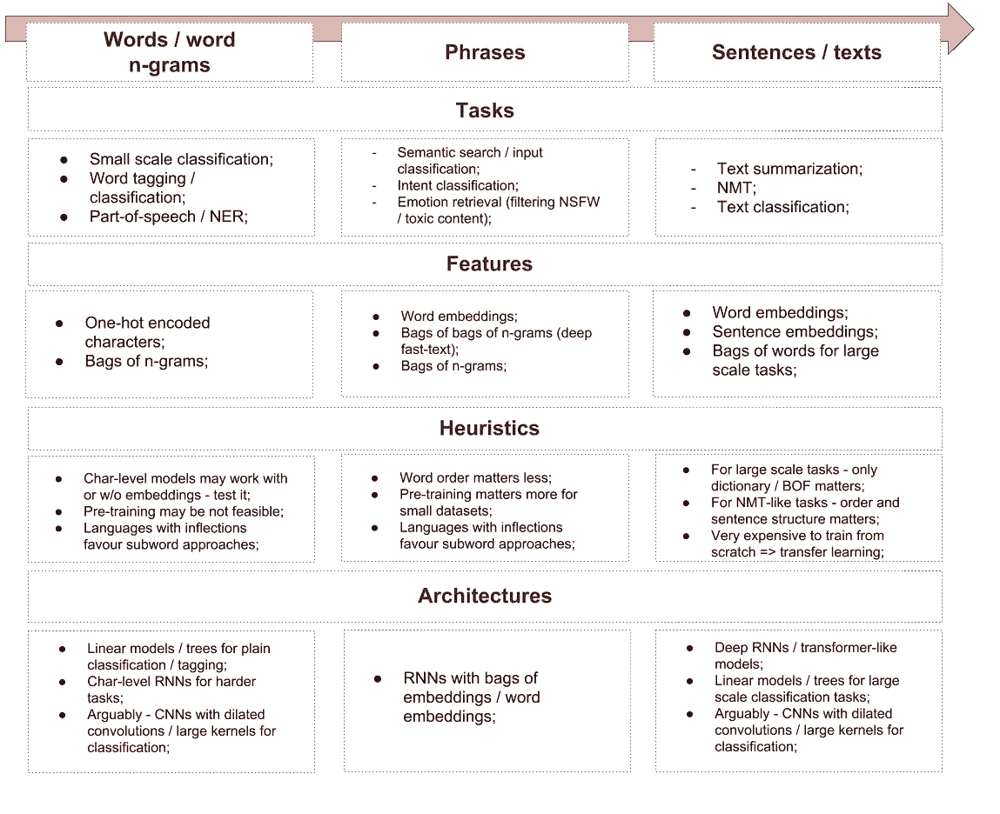
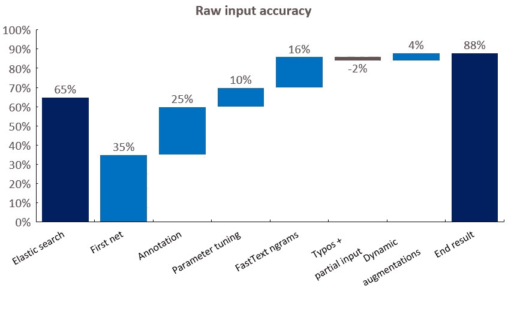
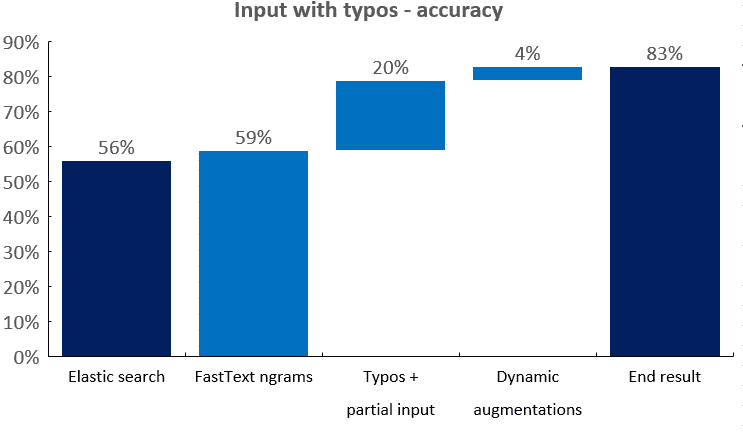
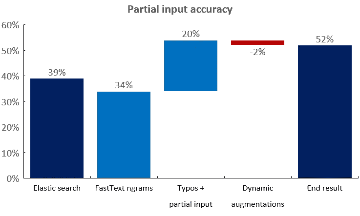
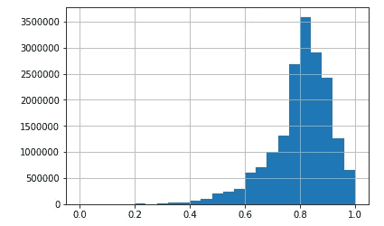
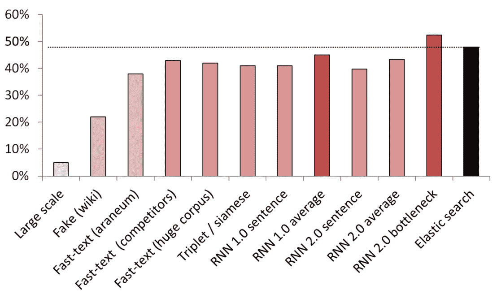
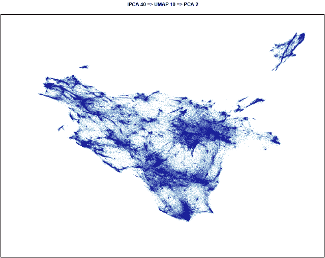
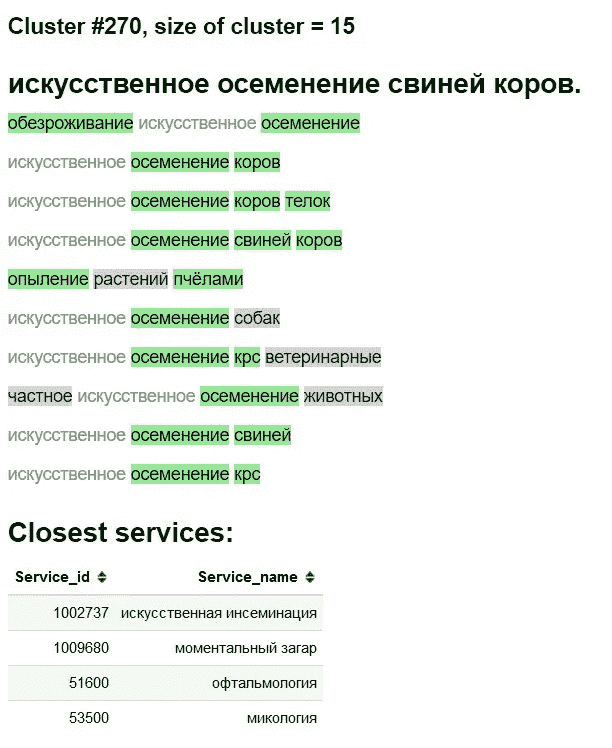

# 在野外构建客户端路由/语义搜索

> 原文：<https://towardsdatascience.com/building-client-routing-semantic-search-in-the-wild-14db04687c7e?source=collection_archive---------16----------------------->

**Main objective** — help our clients find what they want, ideally even **before** they type the whole query. Search also should generalize reasonably well (synonyms / forms of known words, Russian has rich morphology)

# TLDR

这是一份关于我们在语义工厂项目中的 [Profi.ru](http://profi.ru/) DS 部门(Profi.ru 是 CIS 地区领先的在线服务市场之一)在大约 2 个月的时间里所做工作的执行摘要。

这篇文章主要集中在比较新的 NLP 技术在应用商业环境中的适用性，如果你计划在你的公司/项目中做类似的事情，它可以作为一个指南。

**简而言之，我们有两个目标:**

*   使 Profi.ru 上主搜索栏内的搜索/路由更好(**监督任务**)；
*   这样做——开发无监督的方法，以有效地**在第三方数据中搜索新服务**(**无监督任务**)；

我们考虑了许多架构，但最终一个具有嵌入包层而不是普通嵌入的双 LSTM(或双 GRU)被证明是监督和非监督任务的最佳**(见下图)。值得注意的是，使模型对部分输入/有误差的输入具有鲁棒性**提高了其性能**。此外，添加第二个目标(假“服务”检测)也略微提高了准确性**。像 transformer 这样更复杂的模型在我们的领域中没有显示出真正的好处。****

# 现有数据

我们使用的**内部数据**来自几个主要来源:

*   **实际客户端搜索**(每 3-6 个月 30k 个唯一查询)+手动注释(这产生了我们的主开发集)；
*   内部**同义词库** (30k 唯一同义词)**；**
*   内部营销 **SEO 数据库**带注释(300k)；

在我们之前，公司里没有人建立 ML 模型，所以我们必须在获取数据和管理数据注释时随机应变。还应该注意的是，尽管查询的总数很大，但唯一的查询计数却非常低，这迫使我们在获取/扩充数据时要有创造性。此外，手头的数据集和注释的质量差异很大。正如所料，最好的监督数据集是人工注释的数据集和同义词数据库。我们还尝试探索转换管道(即查询—会话—顺序)并提取以前的分类器结果—预期性能不佳。

关于**外部数据**，我们使用了以下来源:

*   搜索引擎数据(Google 和 Yandex 的 SEO 小组及其统计服务提供的数据)( **11m** 查询)；
*   外部 SEO 服务( **3m** 查询)；
*   我们竞争对手的公开数据( **1.5m** 查询)；

# 实现的目标

**业务目标:**

1.  `88+%`(相对于具有弹性搜索的`60%`)在客户端路由/意图分类上的准确性(~ `5k`类)；
2.  搜索不知道输入质量(印刷错误/部分输入)；
3.  分类器一般化，语言的形态学结构被开发；
4.  为了安全起见——至少发现了`1,000`个新服务+至少`15,000`个同义词(相对于`5,000` + ~ `30,000`的当前状态)。我预计这个数字会翻一倍甚至三倍；

**“科学”目标:**

1.  我们使用下游分类任务+ KNN 和服务同义词数据库彻底比较了许多现代句子嵌入技术；
2.  我们使用**非监督**方法，在基准测试中成功击败了弱监督(本质上，他们的分类器是一袋 ngrams)弹性搜索(详见下文);
3.  我们开发了一种构建应用 NLP 模型的新方法(一个普通的双 LSTM +嵌入包，本质上是快速文本符合 RNN)——这考虑到了俄语的形态学，并且推广得很好；
4.  我们证明了我们的最终嵌入技术(来自最佳分类器的瓶颈层)结合最先进的无监督算法(UMAP + HDBSCAN)可以在外部数据上产生恒星簇；
5.  我们在实践中证明了以下方法的可能性、可行性和可用性:(1)知识提炼(2)文本数据扩充(原文如此！);
6.  与生成更大的静态数据集相比，使用动态增强来训练基于文本的分类器大大减少了收敛时间(10 倍)(即，CNN 学习概括错误，显示大大减少增强的句子)；

# 现在 NLP 里什么管用？

鸟瞰 NLP 景观:

此外，您可能知道 NLP 现在可能正在经历 [Imagenet 时刻](https://thegradient.pub/nlp-imagenet/)。

# 大规模 UMAP 黑客攻击

在构建集群时，我们偶然发现了一种方法/技巧，可以将 UMAP 应用于 1 亿多点(甚至 10 亿)大小的数据集。本质上是用 FAISS 构建一个 KNN 图，然后用你的 GPU 将主 UMAP 循环改写成 PyTorch。我们不需要这个，并放弃了这个概念(我们毕竟只有 1000-1500 万点)，但请按照这个[线程](https://github.com/lmcinnes/umap/issues/125)了解详情。

# 什么最有效

*   对于监督分类，快速文本满足 RNN(双 LSTM) +精心选择的 n 元文法集；
*   实现——普通 python 为 [n-grams](https://t.me/snakers4/2137) + PyTorch 嵌入包层；
*   对于集群——该模型的瓶颈层+UMAP+hdb scan；

# 最佳分类器基准

**手动注释开发集**

Performance of the best model (n-gram bag + biLSTM) on manually annotated dev-set

**手动注释开发集+每个查询 1-3 个错别字**

Performance of the best model (n-gram bag + biLSTM) on manually annotated dev-set, where we added 1 to 3 typos to each query

**手动注释开发集+部分输入**

Performance of the best model (n-gram bag + biLSTM) on manually annotated dev-set, where we randomly cut the input sequence to simulate partial input

# 大规模语料库/ n-gram 选择

我们收集了最大的俄语语料库:

*   我们用 [1TB 抓取](https://t.me/snakers4/2147)收集了一个`100m`单词字典；
*   也用这个[黑](https://t.me/snakers4/2148)更快下载这类文件(隔夜)；
*   我们为我们的分类器选择了一组最佳的`1m` n-grams，以进行最佳概括(来自俄语维基百科上训练的快速文本的`500k`最流行的 n-grams+`500k`我们领域数据上最流行的 n-grams)；

**我们的 100 万词汇上的 100 万 n-grams 的压力测试:**

Share of n-grams (3–7 grams) in a 100M word vocabulary covered by our n-gram selection

# 文本扩充

简而言之:

*   拿一本有错误的大字典(例如 10-100 万个独特的单词)；
*   产生一个错误(丢弃一个字母，使用计算的概率交换一个字母，插入一个随机的字母，可能使用键盘布局等)；
*   检查新单词是否在词典中；

我们对像[这个](https://tech.yandex.ru/speller/)这样的服务进行了大量的强制查询(试图从本质上对它们的数据集进行逆向工程)，它们内部有一个非常小的字典(这个服务也是由一个具有 n 元语法特征的树分类器支持的)。看到它们只覆盖了我们在一些语料库中的 30 %- 50%的单词有点好笑。

如果你有大量的领域词汇，我们的方法要优越得多。

# 最佳无监督/半监督结果

KNN 被用作比较不同嵌入方法的基准。这更多的是一个例子，但是显然我们使用这些方法来聚集/搜索新的服务。

(向量大小)**测试模型列表:**

*   (512)在 200 GB 普通爬行数据上训练的大规模假句子检测器；
*   (300)假句子检测器，被训练成从服务中辨别来自维基百科的随机句子；
*   (300)从这里获得的快速文本，在 araneum 语料库上进行预训练；
*   (200)在我们的领域数据上训练的快速文本；
*   (300)在 200GB 的普通爬行数据上训练的快速文本；
*   (300)用来自维基百科的服务/同义词/随机句子训练的三联体丢失的连体网络；
*   (200)嵌入包 RNN 的嵌入层的第一次迭代，句子被编码为整个嵌入包；
*   (200)相同，但首先将句子拆分成单词，然后嵌入每个单词，然后取普通平均值；
*   (300)同上，但用于最终模型；
*   (300)同上，但用于最终模型；
*   (250)最终模型的瓶颈层(250 个神经元)；
*   弱监督弹性搜索基线；

为了避免泄密，所有的随机句子都是随机抽样的。他们的单词长度与他们所比较的服务/同义词的长度相同。此外，还采取措施确保模型不只是通过分离词汇来学习(嵌入被冻结，维基百科被欠采样以确保每个维基百科句子中至少有一个领域词)。

# 集群可视化

最佳嵌入技术+ UMAP 如何在一个外部语料库上工作的例子。

**3D**

**2D**

# 集群探索“界面”

绿色—新单词/同义词。灰色背景-可能是新词。

灰色文本-现有同义词。

# 消融试验和哪些有效，我们尝试了哪些，哪些没有

1.  见以上图表；
2.  快速文本嵌入的普通平均值/tf-idf 平均值——一个**非常强大的基线**；
3.  俄语的 fast-text > word 2 vec；
4.  通过伪句子检测的句子嵌入类工作，但是与其他方法相比相形见绌；
5.  BPE(句子)显示没有改善我们的领域；
6.  尽管谷歌撤回了论文，但 Char 级模型很难推广；
7.  我们尝试了多头 transformer(带有分类器和语言建模头)，但是在手边可用的注释上，它的性能与普通的基于 LSTM 的模型大致相同。当我们迁移到嵌入 bad 方法时，我们放弃了这一研究方向，因为变压器的实用性较低，并且具有 LM 头和嵌入包层是不切实际的；
8.  伯特(BERT)——似乎有些夸张，也有人声称变形金刚实际上训练了几个星期；
9.  **ELMO**——在我看来，无论是在研究/生产还是教育环境中，使用像 AllenNLP 这样的库似乎都是适得其反的，原因我就不在这里说了；

# 部署

使用完成:

*   带有简单 web 服务的 Docker 容器；
*   CPU-仅用于推断就足够了；
*   ~ `2.5 ms`对于 CPU 上的每个查询，批处理并不是真正必要的；
*   ~ `1GB` RAM 内存占用量；
*   几乎没有依赖，除了`PyTorch`、`numpy`、`pandas`(还有 web 服务器 ofc)。
*   模仿像[这样的快速文本 n-gram 生成；](https://t.me/snakers4/2137)
*   嵌入刚刚存储在字典中的包层+索引；

# **结论**

我们已经表明，您可以应用相对简单/现成的工具来解决真实业务中语义搜索框架内的监督和非监督挑战。

# 进一步阅读

1.  更详细的俄语[演示文稿](http://resources.spark-in.me/profi_2018_11_search_prez.html)；
2.  解析[普通爬虫](https://spark-in.me/post/parsing-common-crawl-in-four-simple-commands)和[维基百科](https://spark-in.me/post/parsing-wikipedia-in-four-commands-for-nlp)；
3.  [如何](https://t.me/snakers4/2137)在一个函数中模拟嵌入的快速文本包；
4.  更多预处理[普通抓取](https://t.me/snakers4/2147)；
5.  快速文本单词[向量](https://fasttext.cc/docs/en/pretrained-vectors.html)在维基百科上预先训练；
6.  俄罗斯语言的快速文本和 Word2Vec [模型](http://rusvectores.org/ru/models/)；
7.  种子词嵌入论文: [Word2Vec](http://arxiv.org/abs/1607.04606) ，[快文](http://arxiv.org/abs/1712.09405)，进一步[调](http://arxiv.org/abs/1802.06893)；
8.  当前一些基于 SOTA CNN 的方法:[推断](http://arxiv.org/abs/1705.02364)/CNN 的生成[预训练](https://blog.openai.com/language-unsupervised/)/[ul mfit](http://arxiv.org/abs/1801.06146)/深度语境化单词[表示](http://arxiv.org/abs/1802.05365)(Elmo)；
9.  Imagenet 时刻在 [NLP](https://thegradient.pub/nlp-imagenet/) ？
10.  句子嵌入基线 [1](https://openreview.net/pdf?id=SyK00v5xx) 、 [2](http://nlp.town/blog/sentence-similarity/) 、 [3](https://arxiv.org/abs/1806.06259) 、[4](http://www.offconvex.org/2018/09/18/alacarte/)；
11.  假句子[检测](https://arxiv.org/abs/1808.03840)作为句子编码的训练任务；

*原载于 2018 年 11 月 2 日*[*spark-in . me*](https://spark-in.me/post/profi-ru-semantic-search-project)*。*