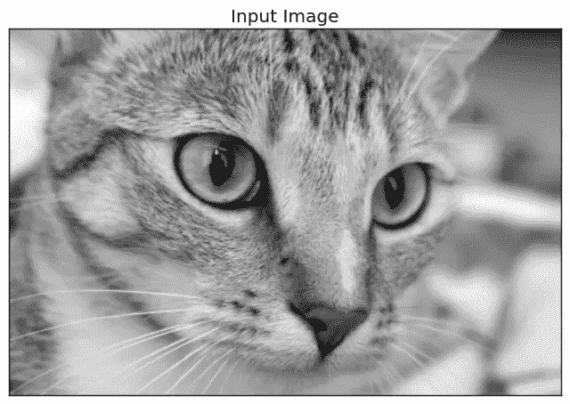
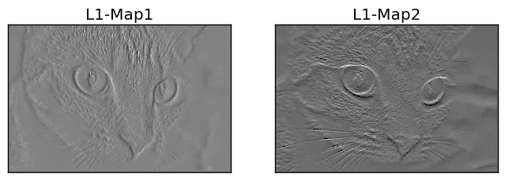
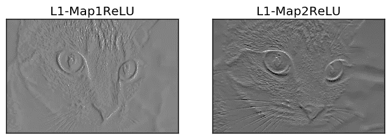
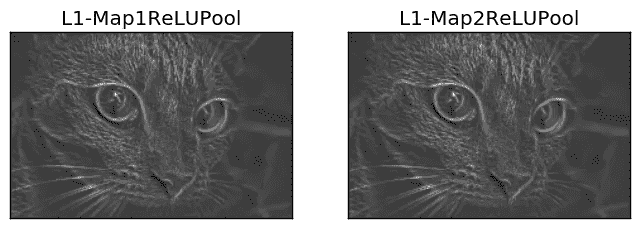
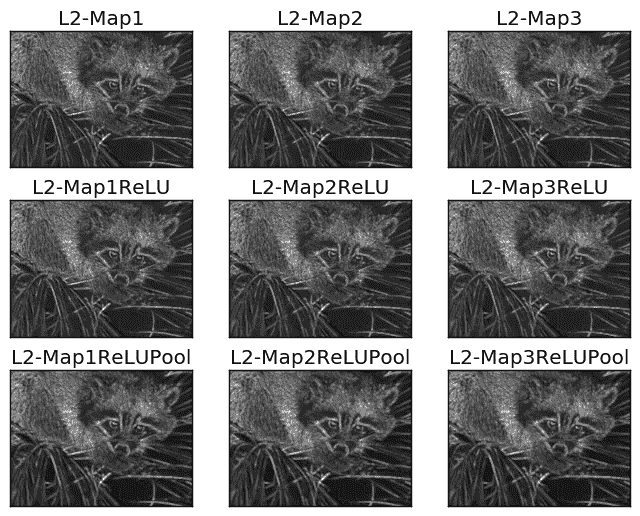
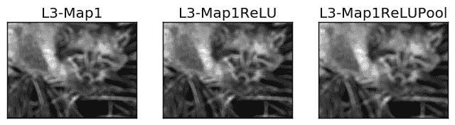

# 使用 NumPy 从头构建卷积神经网络

> 原文：<https://towardsdatascience.com/building-convolutional-neural-network-using-numpy-from-scratch-b30aac50e50a?source=collection_archive---------2----------------------->

在某些情况下，使用 ML/DL 库中已经存在的模型可能会有所帮助。但是要有更好的控制和理解，你应该试着自己实现它们。这篇文章展示了如何使用 NumPy 实现 CNN。

# 介绍

卷积神经网络(CNN)是用于分析图像等多维信号的最先进技术。已经有不同的库实现了 CNN，比如 TensorFlow 和 Keras。这种库将开发人员与一些细节隔离开来，只是给出一个抽象的 API，使生活变得更容易，并避免实现中的复杂性。但实际上，这些细节可能会有所不同。有时，数据科学家必须仔细检查这些细节以提高性能。在这种情况下，解决方法是构建你自己的模型的每一部分。这提供了对网络的最高级别的控制。此外，建议实现这样的模型，以便更好地理解它们。

在本文中，CNN 仅使用 NumPy 库创建。只创建了三层，分别是卷积(简称 conv)、ReLU 和最大池。涉及的主要步骤如下:

1.读取输入图像。

2.准备过滤器。

3.Conv 层:卷积每个滤波器与输入图像。

4.ReLU 图层:在特征地图上应用 ReLU 激活功能(conv 图层的输出)。

5.最大池层:在 ReLU 层的输出上应用池操作。

6.堆叠 conv、ReLU 和 max 池层。

# 1.读取输入图像

以下代码从 skimage Python 库中读取一个已经存在的图像，并将其转换为灰色。

```
**import** skimage.data# Reading the imageimg = skimage.data.chelsea()# Converting the image into gray.img = skimage.color.rgb2gray(img)
```

读取图像是第一步，因为后续步骤取决于输入尺寸。转换为灰色后的图像如下所示。



**Figure 1\. Original Gray Image. It is the Skimage image named Chelsea accessed via skimage.data.chelsea()**

# 2.准备过滤器

下面的代码为第一个 conv 图层准备了滤波器组(简称为 **l1** ):

```
l1_filter = numpy.zeros((2,3,3))
```

根据过滤器的数量和每个过滤器的大小创建零数组。创建大小为**3×3**的 **2** 个过滤器，这就是为什么零数组的大小为(**2**=数量 _ 过滤器，**3**=数量 _ 行 _ 过滤器，**3**=数量 _ 列 _ 过滤器)。滤波器的大小被选择为没有深度的 2D 阵列，因为输入图像是灰色的并且没有深度(即 2D)。如果图像是具有 3 个通道的 RGB，则滤镜大小必须为(3，3，**3**=深度)。

滤波器组的大小由上述零数组指定，而不是由滤波器的实际值指定。可以覆盖如下值来检测垂直和水平边缘。

```
l1_filter[0, :, :] = numpy.array([[[-1, 0, 1], [-1, 0, 1], [-1, 0, 1]]])l1_filter[1, :, :] = numpy.array([[[1,   1,  1], [0,   0,  0], [-1, -1, -1]]])
```

# 3.Conv 层

准备好滤波器后，下一步是用它们对输入图像进行卷积。下一行使用名为 **conv** 的函数将图像与滤波器组进行卷积:

```
l1_feature_map = conv(img, l1_filter)
```

该函数只接受两个参数，即图像和滤波器组，如下所示。

```
def conv(img, conv_filter):
    if len(img.shape) > 2 or len(conv_filter.shape) > 3: # Check if number of image channels matches the filter depth.
        if img.shape[-1] != conv_filter.shape[-1]:
            print("Error: Number of channels in both image and filter must match.")
            sys.exit()
    if conv_filter.shape[1] != conv_filter.shape[2]: # Check if filter dimensions are equal.
        print('Error: Filter must be a square matrix. I.e. number of rows and columns must match.')
        sys.exit()
    if conv_filter.shape[1]%2==0: # Check if filter diemnsions are odd.
        print('Error: Filter must have an odd size. I.e. number of rows and columns must be odd.')
        sys.exit()

    # An empty feature map to hold the output of convolving the filter(s) with the image.
    feature_maps = numpy.zeros((img.shape[0]-conv_filter.shape[1]+1, 
                                img.shape[1]-conv_filter.shape[1]+1, 
                                conv_filter.shape[0]))

    # Convolving the image by the filter(s).
    for filter_num in range(conv_filter.shape[0]):
        print("Filter ", filter_num + 1)
        curr_filter = conv_filter[filter_num, :] # getting a filter from the bank.
        """ 
        Checking if there are mutliple channels for the single filter.
        If so, then each channel will convolve the image.
        The result of all convolutions are summed to return a single feature map.
        """
        if len(curr_filter.shape) > 2:
            conv_map = conv_(img[:, :, 0], curr_filter[:, :, 0]) # Array holding the sum of all feature maps.
            for ch_num in range(1, curr_filter.shape[-1]): # Convolving each channel with the image and summing the results.
                conv_map = conv_map + conv_(img[:, :, ch_num], 
                                  curr_filter[:, :, ch_num])
        else: # There is just a single channel in the filter.
            conv_map = conv_(img, curr_filter)
        feature_maps[:, :, filter_num] = conv_map # Holding feature map with the current filter.
    return feature_maps # Returning all feature maps.
```

该功能首先确保每个滤镜的深度等于图像通道的数量。在下面的代码中，外部的 **if** 检查通道和过滤器是否有深度。如果深度已经存在，那么内部的 **if** 检查它们的不相等。如果不匹配，那么脚本将退出。

```
if len(img.shape) > 2 or len(conv_filter.shape) > 3: # Check if number of image channels matches the filter depth.
        if img.shape[-1] != conv_filter.shape[-1]:
            print("Error: Number of channels in both image and filter must match.")
            sys.exit()
```

此外，过滤器的大小应该是奇数，并且过滤器尺寸相等(即，行数和列数是奇数并且相等)。根据以下两个 **if** 块进行检查。如果不满足这些条件，脚本将退出。

```
if conv_filter.shape[1] != conv_filter.shape[2]: # Check if filter dimensions are equal.
        print('Error: Filter must be a square matrix. I.e. number of rows and columns must match.')
        sys.exit()
    if conv_filter.shape[1]%2==0: # Check if filter diemnsions are odd.
        print('Error: Filter must have an odd size. I.e. number of rows and columns must be odd.')
        sys.exit()
```

不满足上面的任何条件都证明滤波器深度适合图像，并且卷积准备好被应用。通过滤波器对图像进行卷积，首先初始化一个数组，通过根据以下代码指定其大小来保存卷积的输出(即特征图):

```
# An empty feature map to hold the output of convolving the filter(s) with the image.
    feature_maps = numpy.zeros((img.shape[0]-conv_filter.shape[1]+1, 
                                img.shape[1]-conv_filter.shape[1]+1, 
                                conv_filter.shape[0]))
```

因为既没有步幅也没有填充，所以特征映射的大小将等于(img_rows-filter_rows+1，image_columns-filter_columns+1，num_filters ),如上面代码中所示。注意，组中的每个滤波器都有一个输出特征映射。这就是为什么滤波器组中的滤波器数量(**conv _ 滤波器.形状[0]** )被用来指定大小作为第三个参数。

准备好卷积运算的输入和输出后，接下来是根据以下代码应用它:

```
# Convolving the image by the filter(s).
    for filter_num in range(conv_filter.shape[0]):
        print("Filter ", filter_num + 1)
        curr_filter = conv_filter[filter_num, :] # getting a filter from the bank.
        """ 
        Checking if there are mutliple channels for the single filter.
        If so, then each channel will convolve the image.
        The result of all convolutions are summed to return a single feature map.
        """
        if len(curr_filter.shape) > 2:
            conv_map = conv_(img[:, :, 0], curr_filter[:, :, 0]) # Array holding the sum of all feature maps.
            for ch_num in range(1, curr_filter.shape[-1]): # Convolving each channel with the image and summing the results.
                conv_map = conv_map + conv_(img[:, :, ch_num], 
                                  curr_filter[:, :, ch_num])
        else: # There is just a single channel in the filter.
            conv_map = conv_(img, curr_filter)
        feature_maps[:, :, filter_num] = conv_map # Holding feature map with the current filter.
    return feature_maps # Returning all feature maps.
```

外部循环对滤波器组中的每个滤波器进行迭代，并根据以下代码行返回它以进行进一步的步骤:

```
curr_filter = conv_filter[filter_num, :] # getting a filter from the bank.
```

如果要卷积的图像有不止一个通道，那么滤波器的深度必须等于这些通道的数量。在这种情况下，卷积是通过将每个图像通道与其在滤波器中的对应通道进行卷积来完成的。最后，结果的总和将是输出特征图。如果图像只有一个通道，那么卷积将是直接的。确定这样的行为是在这样的 **if-else** 块中完成的:

```
if len(curr_filter.shape) > 2:
            conv_map = conv_(img[:, :, 0], curr_filter[:, :, 0]) # Array holding the sum of all feature maps.
            for ch_num in range(1, curr_filter.shape[-1]): # Convolving each channel with the image and summing the results.
                conv_map = conv_map + conv_(img[:, :, ch_num], 
                                  curr_filter[:, :, ch_num])
        else: # There is just a single channel in the filter.
            conv_map = conv_(img, curr_filter)
```

你可能会注意到，卷积是由一个名为 **conv_** 的函数应用的，它不同于 **conv** 函数。函数 **conv** 只接受输入图像和滤波器组，但不应用自己的卷积。它只是将每组输入滤波器对传递给 **conv_** 函数进行卷积。这只是为了使代码更容易研究。下面是 **conv_** 函数的实现:

```
def conv_(img, conv_filter):
    filter_size = conv_filter.shape[1]
    result = numpy.zeros((img.shape))
    #Looping through the image to apply the convolution operation.
    for r in numpy.uint16(numpy.arange(filter_size/2.0, 
                          img.shape[0]-filter_size/2.0+1)):
        for c in numpy.uint16(numpy.arange(filter_size/2.0, 
                                           img.shape[1]-filter_size/2.0+1)):
            """
            Getting the current region to get multiplied with the filter.
            How to loop through the image and get the region based on 
            the image and filer sizes is the most tricky part of convolution.
            """
            curr_region = img[r-numpy.uint16(numpy.floor(filter_size/2.0)):r+numpy.uint16(numpy.ceil(filter_size/2.0)), 
                              c-numpy.uint16(numpy.floor(filter_size/2.0)):c+numpy.uint16(numpy.ceil(filter_size/2.0))]
            #Element-wise multipliplication between the current region and the filter.
            curr_result = curr_region * conv_filter
            conv_sum = numpy.sum(curr_result) #Summing the result of multiplication.
            result[r, c] = conv_sum #Saving the summation in the convolution layer feature map.

    #Clipping the outliers of the result matrix.
    final_result = result[numpy.uint16(filter_size/2.0):result.shape[0]-numpy.uint16(filter_size/2.0), 
                          numpy.uint16(filter_size/2.0):result.shape[1]-numpy.uint16(filter_size/2.0)]
    return final_result
```

它对图像进行迭代，并根据以下代码行提取与过滤器大小相等的区域:

```
curr_region = img[r-numpy.uint16(numpy.floor(filter_size/2.0)):r+numpy.uint16(numpy.ceil(filter_size/2.0)), 
                              c-numpy.uint16(numpy.floor(filter_size/2.0)):c+numpy.uint16(numpy.ceil(filter_size/2.0))]
```

然后，它在区域和过滤器之间应用元素级乘法，并对它们求和，以获得作为输出的单个值，如下所示:

```
#Element-wise multipliplication between the current region and the filter.
            curr_result = curr_region * conv_filter
            conv_sum = numpy.sum(curr_result) #Summing the result of multiplication.
            result[r, c] = conv_sum #Saving the summation in the convolution layer feature map.
```

在通过输入对每个滤波器进行卷积之后，特征图由 **conv** 函数返回。图 2 显示了此类 conv 图层返回的要素地图。



**Figure 2\. Output feature maps of the first conv layer.**

该层的输出将被应用到 ReLU 层。

# 4.ReLU 层

ReLU 图层对 conv 图层返回的每个要素地图应用 ReLU 激活函数。根据下面的代码行，使用 **relu** 函数调用它:

```
l1_feature_map_relu = relu(l1_feature_map)
```

**relu** 功能实现如下:

```
def relu(feature_map):
    #Preparing the output of the ReLU activation function.
    relu_out = numpy.zeros(feature_map.shape)
    for map_num in range(feature_map.shape[-1]):
        for r in numpy.arange(0,feature_map.shape[0]):
            for c in numpy.arange(0, feature_map.shape[1]):
                relu_out[r, c, map_num] = numpy.max([feature_map[r, c, map_num], 0])
    return relu_out
```

这很简单。只需遍历特征映射中的每个元素，如果大于 0，则返回特征映射中的原始值。否则，返回 0。ReLU 层的输出如图 3 所示。



**Figure 3\. ReLU layer output applied to the output of the first conv layer**

ReLU 层的输出被应用到 max pooling 层。

# 5.最大池层

最大池层接受 ReLU 层的输出，并根据以下代码行应用最大池操作:

```
l1_feature_map_relu_pool = pooling(l1_feature_map_relu, 2, 2)
```

它是使用**池**函数实现的，如下所示:

```
def pooling(feature_map, size=2, stride=2):
    #Preparing the output of the pooling operation.
    pool_out = numpy.zeros((numpy.uint16((feature_map.shape[0]-size+1)/stride),
                            numpy.uint16((feature_map.shape[1]-size+1)/stride),
                            feature_map.shape[-1]))
    for map_num in range(feature_map.shape[-1]):
        r2 = 0
        for r in numpy.arange(0,feature_map.shape[0]-size-1, stride):
            c2 = 0
            for c in numpy.arange(0, feature_map.shape[1]-size-1, stride):
                pool_out[r2, c2, map_num] = numpy.max([feature_map[r:r+size,  c:c+size, map_num]])
                c2 = c2 + 1
            r2 = r2 +1
    return pool_out
```

该函数接受三个输入，即 ReLU 层的输出、汇集遮罩大小和跨距。和前面一样，它只是创建一个空数组来保存该层的输出。此类数组的大小是根据 size 和 stride 参数指定的，如下所示:

```
pool_out = numpy.zeros((numpy.uint16((feature_map.shape[0]-size+1)/stride),
                            numpy.uint16((feature_map.shape[1]-size+1)/stride),
                            feature_map.shape[-1]))
```

然后，它根据使用循环变量 **map_num** 的外部循环，逐个通道地循环输入。对于输入中的每个通道，应用最大池操作。根据所使用的步幅和大小，该区域被剪裁，并且它的最大值根据以下行返回到输出数组中:

```
pool_out[r2, c2, map_num] = numpy.max([feature_map[r:r+size,  c:c+size, map_num]])
```

下图显示了这种池层的输出。请注意，池层输出的大小小于其输入，即使它们在图表中看起来相同。



**Figure 4\. Pooling layer output applied to the output of the first ReLU layer**

# 6.堆叠层

至此，具有 conv、ReLU 和 max 池层的 CNN 架构已经完成。除了前面的层之外，可能还有一些其他层需要堆叠，如下所示。

```
# Second conv layerl2_filter = numpy.random.rand(3, 5, 5, l1_feature_map_relu_pool.shape[-1])**print**("\n**Working with conv layer 2**")l2_feature_map = conv(l1_feature_map_relu_pool, l2_filter)**print**("\n**ReLU**")l2_feature_map_relu = relu(l2_feature_map)**print**("\n**Pooling**")l2_feature_map_relu_pool = pooling(l2_feature_map_relu, 2, 2)**print**("**End of conv layer 2**\n")
```

先前的 conv 层使用 3 个**过滤器，它们的值是随机生成的。这就是为什么会有 **3** 这样的 conv 图层生成的特征图。这对于连续的 ReLU 和 pooling 层也是一样的。这些层的输出如图 5 所示。**



**Figure 5\. Output of the second conv-ReLU-Pooling layers**

```
# Third conv layer
l3_filter = numpy.random.rand(1, 7, 7, l2_feature_map_relu_pool.shape[-1])
print("\n**Working with conv layer 3**")
l3_feature_map = numpycnn.conv(l2_feature_map_relu_pool, l3_filter)
print("\n**ReLU**")
l3_feature_map_relu = numpycnn.relu(l3_feature_map)
print("\n**Pooling**")
l3_feature_map_relu_pool = numpycnn.pooling(l3_feature_map_relu, 2, 2)
print("**End of conv layer 3**\n")
```

图 6 显示了前几层的输出。先前的 conv 层只接受一个过滤器。这就是为什么只有一个要素地图作为输出。



**Figure 6\. Outputs of the third conv-ReLU-Pooling layers**

但是要记住，每一层的输出都是下一层的输入。例如，这些行接受以前的输出作为它们的输入。

```
l2_feature_map = conv(l1_feature_map_relu_pool, l2_filter)l3_feature_map = conv(l2_feature_map_relu_pool, l3_filter)
```

# 7.完全码

完整代码在[**github**](https://github.com/ahmedfgad/NumPyCNN)(【https://github.com/ahmedfgad/NumPyCNN】)中。代码包含使用 **Matplotlib** 库的每层输出的可视化。

```
import skimage.data
import numpy
import matplotlib
import sysdef conv_(img, conv_filter):
    filter_size = conv_filter.shape[1]
    result = numpy.zeros((img.shape))
    #Looping through the image to apply the convolution operation.
    for r in numpy.uint16(numpy.arange(filter_size/2.0, 
                          img.shape[0]-filter_size/2.0+1)):
        for c in numpy.uint16(numpy.arange(filter_size/2.0, 
                                           img.shape[1]-filter_size/2.0+1)):
            """
            Getting the current region to get multiplied with the filter.
            How to loop through the image and get the region based on 
            the image and filer sizes is the most tricky part of convolution.
            """
            curr_region = img[r-numpy.uint16(numpy.floor(filter_size/2.0)):r+numpy.uint16(numpy.ceil(filter_size/2.0)), 
                              c-numpy.uint16(numpy.floor(filter_size/2.0)):c+numpy.uint16(numpy.ceil(filter_size/2.0))]
            #Element-wise multipliplication between the current region and the filter.
            curr_result = curr_region * conv_filter
            conv_sum = numpy.sum(curr_result) #Summing the result of multiplication.
            result[r, c] = conv_sum #Saving the summation in the convolution layer feature map.

    #Clipping the outliers of the result matrix.
    final_result = result[numpy.uint16(filter_size/2.0):result.shape[0]-numpy.uint16(filter_size/2.0), 
                          numpy.uint16(filter_size/2.0):result.shape[1]-numpy.uint16(filter_size/2.0)]
    return final_result
def conv(img, conv_filter):
    if len(img.shape) > 2 or len(conv_filter.shape) > 3: # Check if number of image channels matches the filter depth.
        if img.shape[-1] != conv_filter.shape[-1]:
            print("Error: Number of channels in both image and filter must match.")
            sys.exit()
    if conv_filter.shape[1] != conv_filter.shape[2]: # Check if filter dimensions are equal.
        print('Error: Filter must be a square matrix. I.e. number of rows and columns must match.')
        sys.exit()
    if conv_filter.shape[1]%2==0: # Check if filter diemnsions are odd.
        print('Error: Filter must have an odd size. I.e. number of rows and columns must be odd.')
        sys.exit()# An empty feature map to hold the output of convolving the filter(s) with the image.
    feature_maps = numpy.zeros((img.shape[0]-conv_filter.shape[1]+1, 
                                img.shape[1]-conv_filter.shape[1]+1, 
                                conv_filter.shape[0]))# Convolving the image by the filter(s).
    for filter_num in range(conv_filter.shape[0]):
        print("Filter ", filter_num + 1)
        curr_filter = conv_filter[filter_num, :] # getting a filter from the bank.
        """ 
        Checking if there are mutliple channels for the single filter.
        If so, then each channel will convolve the image.
        The result of all convolutions are summed to return a single feature map.
        """
        if len(curr_filter.shape) > 2:
            conv_map = conv_(img[:, :, 0], curr_filter[:, :, 0]) # Array holding the sum of all feature maps.
            for ch_num in range(1, curr_filter.shape[-1]): # Convolving each channel with the image and summing the results.
                conv_map = conv_map + conv_(img[:, :, ch_num], 
                                  curr_filter[:, :, ch_num])
        else: # There is just a single channel in the filter.
            conv_map = conv_(img, curr_filter)
        feature_maps[:, :, filter_num] = conv_map # Holding feature map with the current filter.
    return feature_maps # Returning all feature maps.def pooling(feature_map, size=2, stride=2):
    #Preparing the output of the pooling operation.
    pool_out = numpy.zeros((numpy.uint16((feature_map.shape[0]-size+1)/stride),
                            numpy.uint16((feature_map.shape[1]-size+1)/stride),
                            feature_map.shape[-1]))
    for map_num in range(feature_map.shape[-1]):
        r2 = 0
        for r in numpy.arange(0,feature_map.shape[0]-size-1, stride):
            c2 = 0
            for c in numpy.arange(0, feature_map.shape[1]-size-1, stride):
                pool_out[r2, c2, map_num] = numpy.max([feature_map[r:r+size,  c:c+size, map_num]])
                c2 = c2 + 1
            r2 = r2 +1
    return pool_outdef relu(feature_map):
    #Preparing the output of the ReLU activation function.
    relu_out = numpy.zeros(feature_map.shape)
    for map_num in range(feature_map.shape[-1]):
        for r in numpy.arange(0,feature_map.shape[0]):
            for c in numpy.arange(0, feature_map.shape[1]):
                relu_out[r, c, map_num] = numpy.max([feature_map[r, c, map_num], 0])
    return relu_out# Reading the image
#img = skimage.io.imread("fruits2.png")
img = skimage.data.chelsea()
# Converting the image into gray.
img = skimage.color.rgb2gray(img)# First conv layer
#l1_filter = numpy.random.rand(2,7,7)*20 # Preparing the filters randomly.
l1_filter = numpy.zeros((2,3,3))
l1_filter[0, :, :] = numpy.array([[[-1, 0, 1], 
                                   [-1, 0, 1], 
                                   [-1, 0, 1]]])
l1_filter[1, :, :] = numpy.array([[[1,   1,  1], 
                                   [0,   0,  0], 
                                   [-1, -1, -1]]])print("\n**Working with conv layer 1**")
l1_feature_map = conv(img, l1_filter)
print("\n**ReLU**")
l1_feature_map_relu = relu(l1_feature_map)
print("\n**Pooling**")
l1_feature_map_relu_pool = pooling(l1_feature_map_relu, 2, 2)
print("**End of conv layer 1**\n")# Second conv layer
l2_filter = numpy.random.rand(3, 5, 5, l1_feature_map_relu_pool.shape[-1])
print("\n**Working with conv layer 2**")
l2_feature_map = conv(l1_feature_map_relu_pool, l2_filter)
print("\n**ReLU**")
l2_feature_map_relu = relu(l2_feature_map)
print("\n**Pooling**")
l2_feature_map_relu_pool = pooling(l2_feature_map_relu, 2, 2)
print("**End of conv layer 2**\n")# Third conv layer
l3_filter = numpy.random.rand(1, 7, 7, l2_feature_map_relu_pool.shape[-1])
print("\n**Working with conv layer 3**")
l3_feature_map = conv(l2_feature_map_relu_pool, l3_filter)
print("\n**ReLU**")
l3_feature_map_relu = relu(l3_feature_map)
print("\n**Pooling**")
l3_feature_map_relu_pool = pooling(l3_feature_map_relu, 2, 2)
print("**End of conv layer 3**\n")# Graphing results
fig0, ax0 = matplotlib.pyplot.subplots(nrows=1, ncols=1)
ax0.imshow(img).set_cmap("gray")
ax0.set_title("Input Image")
ax0.get_xaxis().set_ticks([])
ax0.get_yaxis().set_ticks([])
matplotlib.pyplot.savefig("in_img.png", bbox_inches="tight")
matplotlib.pyplot.close(fig0)# Layer 1
fig1, ax1 = matplotlib.pyplot.subplots(nrows=3, ncols=2)
ax1[0, 0].imshow(l1_feature_map[:, :, 0]).set_cmap("gray")
ax1[0, 0].get_xaxis().set_ticks([])
ax1[0, 0].get_yaxis().set_ticks([])
ax1[0, 0].set_title("L1-Map1")ax1[0, 1].imshow(l1_feature_map[:, :, 1]).set_cmap("gray")
ax1[0, 1].get_xaxis().set_ticks([])
ax1[0, 1].get_yaxis().set_ticks([])
ax1[0, 1].set_title("L1-Map2")ax1[1, 0].imshow(l1_feature_map_relu[:, :, 0]).set_cmap("gray")
ax1[1, 0].get_xaxis().set_ticks([])
ax1[1, 0].get_yaxis().set_ticks([])
ax1[1, 0].set_title("L1-Map1ReLU")ax1[1, 1].imshow(l1_feature_map_relu[:, :, 1]).set_cmap("gray")
ax1[1, 1].get_xaxis().set_ticks([])
ax1[1, 1].get_yaxis().set_ticks([])
ax1[1, 1].set_title("L1-Map2ReLU")ax1[2, 0].imshow(l1_feature_map_relu_pool[:, :, 0]).set_cmap("gray")
ax1[2, 0].get_xaxis().set_ticks([])
ax1[2, 0].get_yaxis().set_ticks([])
ax1[2, 0].set_title("L1-Map1ReLUPool")ax1[2, 1].imshow(l1_feature_map_relu_pool[:, :, 1]).set_cmap("gray")
ax1[2, 0].get_xaxis().set_ticks([])
ax1[2, 0].get_yaxis().set_ticks([])
ax1[2, 1].set_title("L1-Map2ReLUPool")matplotlib.pyplot.savefig("L1.png", bbox_inches="tight")
matplotlib.pyplot.close(fig1)# Layer 2
fig2, ax2 = matplotlib.pyplot.subplots(nrows=3, ncols=3)
ax2[0, 0].imshow(l2_feature_map[:, :, 0]).set_cmap("gray")
ax2[0, 0].get_xaxis().set_ticks([])
ax2[0, 0].get_yaxis().set_ticks([])
ax2[0, 0].set_title("L2-Map1")ax2[0, 1].imshow(l2_feature_map[:, :, 1]).set_cmap("gray")
ax2[0, 1].get_xaxis().set_ticks([])
ax2[0, 1].get_yaxis().set_ticks([])
ax2[0, 1].set_title("L2-Map2")ax2[0, 2].imshow(l2_feature_map[:, :, 2]).set_cmap("gray")
ax2[0, 2].get_xaxis().set_ticks([])
ax2[0, 2].get_yaxis().set_ticks([])
ax2[0, 2].set_title("L2-Map3")ax2[1, 0].imshow(l2_feature_map_relu[:, :, 0]).set_cmap("gray")
ax2[1, 0].get_xaxis().set_ticks([])
ax2[1, 0].get_yaxis().set_ticks([])
ax2[1, 0].set_title("L2-Map1ReLU")ax2[1, 1].imshow(l2_feature_map_relu[:, :, 1]).set_cmap("gray")
ax2[1, 1].get_xaxis().set_ticks([])
ax2[1, 1].get_yaxis().set_ticks([])
ax2[1, 1].set_title("L2-Map2ReLU")ax2[1, 2].imshow(l2_feature_map_relu[:, :, 2]).set_cmap("gray")
ax2[1, 2].get_xaxis().set_ticks([])
ax2[1, 2].get_yaxis().set_ticks([])
ax2[1, 2].set_title("L2-Map3ReLU")ax2[2, 0].imshow(l2_feature_map_relu_pool[:, :, 0]).set_cmap("gray")
ax2[2, 0].get_xaxis().set_ticks([])
ax2[2, 0].get_yaxis().set_ticks([])
ax2[2, 0].set_title("L2-Map1ReLUPool")ax2[2, 1].imshow(l2_feature_map_relu_pool[:, :, 1]).set_cmap("gray")
ax2[2, 1].get_xaxis().set_ticks([])
ax2[2, 1].get_yaxis().set_ticks([])
ax2[2, 1].set_title("L2-Map2ReLUPool")ax2[2, 2].imshow(l2_feature_map_relu_pool[:, :, 2]).set_cmap("gray")
ax2[2, 2].get_xaxis().set_ticks([])
ax2[2, 2].get_yaxis().set_ticks([])
ax2[2, 2].set_title("L2-Map3ReLUPool")matplotlib.pyplot.savefig("L2.png", bbox_inches="tight")
matplotlib.pyplot.close(fig2)# Layer 3
fig3, ax3 = matplotlib.pyplot.subplots(nrows=1, ncols=3)
ax3[0].imshow(l3_feature_map[:, :, 0]).set_cmap("gray")
ax3[0].get_xaxis().set_ticks([])
ax3[0].get_yaxis().set_ticks([])
ax3[0].set_title("L3-Map1")ax3[1].imshow(l3_feature_map_relu[:, :, 0]).set_cmap("gray")
ax3[1].get_xaxis().set_ticks([])
ax3[1].get_yaxis().set_ticks([])
ax3[1].set_title("L3-Map1ReLU")ax3[2].imshow(l3_feature_map_relu_pool[:, :, 0]).set_cmap("gray")
ax3[2].get_xaxis().set_ticks([])
ax3[2].get_yaxis().set_ticks([])
ax3[2].set_title("L3-Map1ReLUPool")matplotlib.pyplot.savefig("L3.png", bbox_inches="tight")
matplotlib.pyplot.close(fig3)
```

原文可在 LinkedIn 上找到，链接如下:

[](https://www.linkedin.com/pulse/building-convolutional-neural-network-using-numpy-from-ahmed-gad/) [## 使用 NumPy 从头构建卷积神经网络

### 在某些情况下，使用 ML/DL 库中已经存在的模型可能会有所帮助。但是为了更好地控制和…

www.linkedin.com](https://www.linkedin.com/pulse/building-convolutional-neural-network-using-numpy-from-ahmed-gad/) 

# 联系作者

艾哈迈德·法齐·加德

LinkedIn:

[](https://linkedin.com/in/ahmedfgad) [## 艾哈迈德·加德-撰稿人-艾·论坛报| LinkedIn

### 查看 Ahmed Gad 在世界上最大的职业社区 LinkedIn 上的个人资料。艾哈迈德有 11 个工作列在他们的…

linkedin.com](https://linkedin.com/in/ahmedfgad) 

电子邮件:

ahmed.f.gad@gmail.com