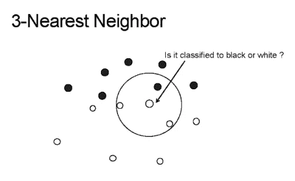
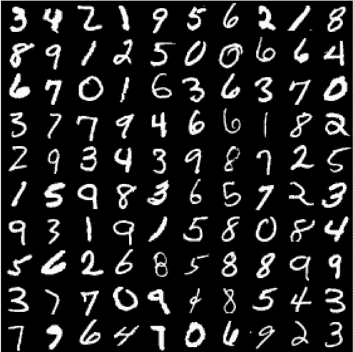

# Python 中 K 近邻算法的构建与改进

> 原文：<https://towardsdatascience.com/building-improving-a-k-nearest-neighbors-algorithm-in-python-3b6b5320d2f8?source=collection_archive---------3----------------------->

** **注意**:自从写了这篇文章，Medium 就不再允许在 Jupyter 笔记本上嵌入代码。要查看本文的配套笔记本和代码，请访问我的 GitHub 上的** [**此链接**](https://github.com/samueleverett01/K-Nearest-Neighbors-Image-Classifier/blob/master/Cosine-Similarity%20Model%20Analysis.ipynb) **。**

K 近邻算法(K-Nearest Neighbors algorithm，简称 K-NN)是一种经典的机器学习工作马算法，这种算法在深度学习的今天往往被忽视。在本教程中，我们将在 Scikit-Learn 中构建一个 K-NN 算法，并在 MNIST 数据集上运行它。从那里，我们将建立我们自己的 K-NN 算法，希望开发一个比 Scikit-Learn K-NN 具有更好的准确性和分类速度的分类器。在这篇文章的最后，我给好奇的读者列出了一个书单，希望了解更多关于这些方法的知识。

# k-最近邻分类模型

Lazy Programmer

K-最近邻算法是一种受监督的机器学习算法，它易于实现，并且具有进行稳健分类的能力。K-NN 最大的优势之一就是它是一个*懒学习者*。这意味着该模型不需要训练，可以直接对数据进行分类，不像它的其他 ML 兄弟，如 SVM，回归和多层感知。

## K-NN 如何工作

为了对某个给定的数据点 **p** 进行分类，K-NN 模型将首先使用某个*距离度量*将 **p** 与其数据库中可用的所有其他点进行比较。距离度量是类似于[欧几里德距离、](https://en.wikipedia.org/wiki/Euclidean_distance)一个简单的函数，它取两个点，并返回这两个点之间的距离。因此，可以假设它们之间距离较小的两个点比它们之间距离较大的两个点*更相似*。这是 K-NN 背后的中心思想。

这个过程将返回一个无序数组，其中数组中的每个条目保存了模型数据库中的 **p** 和 **n** 数据点之一之间的距离。所以返回的数组大小为 **n** 。这就是 K-最近邻的 K 部分的用武之地: **k** 是选择的某个任意值(通常在 3-11 之间)，它告诉模型*在对 **p** 分类时，它应该考虑多少个***与* **p** 最相似的点。然后，该模型将采用这些 **k** 最相似的值，并使用投票技术来决定如何对 **p** 进行分类，如下图所示。*

**

*Lazy Programmer*

*图像中的 K-NN 模型的 **k** 值为 3，中间箭头指向的点就是 **p** ，需要分类的点。如你所见，圆圈中的三点是最接近，或者说最类似于 **p** 的三点。因此，使用简单的投票技术， **p** 将被归类为“白色”，因为白色占了 **k** 最相似值的大多数。*

*相当酷！令人惊讶的是，这个简单的算法在某些情况下可以实现超人的结果，并且可以应用于各种各样的问题，正如我们接下来将看到的那样。*

# *在 Scikit-Learn 中实现 K-NN 算法对 MNIST 图像进行分类*

## *数据:*

*对于这个例子，我们将使用无处不在的 MNIST 数据集。MNIST 数据集是机器学习中最常用的数据集之一，因为它易于实现，但却是证明模型的可靠方法。*

**

*MNIST 是一个由 7 万个手写数字组成的数据集，数字从 0 到 9。没有两个手写数字是相同的，有些很难正确分类。对 MNIST 进行分类的人类基准是大约 97.5%的准确率，所以我们的目标是超过这个数字！*

## *算法:*

*我们将从 Scikit-Learn Python 库中的`KNeighborsClassifier()`开始。这个函数有很多参数，但是在这个例子中我们只需要关注其中的几个。具体来说，我们将只为`n_neighbors`参数传递一个值(这是 **k** 值)。`weights`参数给出了模型使用的投票系统的类型，其中缺省值是`uniform`，这意味着在分类 **p** 时，每个 **k** 点的权重相等。`algorithm`参数也将保留其默认值`auto`，因为我们希望 Scikit-Learn 找到用于分类 MNIST 数据本身的最佳算法。*

*下面，我嵌入了一个 Jupyter 笔记本，它用 Scikit-Learn 构建了 K-NN 分类器。开始了。*

*太棒了。我们使用 Scikit-Learn 建立了一个非常简单的 K 近邻模型，在 MNIST 数据集上取得了非凡的性能。*

*问题？对这些点进行分类花费了很长时间(对于两个数据集分别是 8 分钟和几乎 4 分钟)，讽刺的是 K-NN 仍然是最快的分类方法之一。一定有更快的方法…*

# *构建更快的模型*

*大多数 K-NN 模型使用欧几里德距离或曼哈顿距离作为到达距离度量。这些指标很简单，在各种情况下都表现良好。*

*一个很少使用的距离度量是[余弦相似度](http://blog.christianperone.com/2013/09/machine-learning-cosine-similarity-for-vector-space-models-part-iii/)。余弦相似性通常不是最佳距离度量，因为它违反了[三角形不等式](https://www.khanacademy.org/math/linear-algebra/vectors-and-spaces/dot-cross-products/v/linear-algebra-vector-triangle-inequality)，并且对负数据无效。然而，余弦相似性是完美的 MNIST。它快速、简单，并且比 MNIST 上的其他距离度量标准精度略高。但是，为了尽可能地获得最佳性能，我们必须编写自己的 K-NN 模型。在我们自己制作了一个 K-NN 模型之后，我们应该会得到比 Scikit-Learn 模型更好的性能，甚至更好的准确性。让我们看看下面的笔记本，在那里我们建立了自己的 K-NN 模型。*

*正如笔记本中所示，我们自己制作的 K-NN 模型在分类速度(相当大的差距)和准确性(在一个数据集上提高 1%)方面都优于 Scikit-Learn K-NN！现在，我们可以继续在实践中实现这个模型，因为我们已经开发了一个真正快速的算法。*

# *结论*

*这是很多，但我们学到了一些宝贵的经验。首先，我们学习了 K-NN 如何工作，以及如何轻松地实现它。但最重要的是，我们了解到，始终考虑你试图解决的问题和你可用于解决该问题的工具是很重要的。有时候，在解决问题时，最好花时间去试验——是的，建立你自己的模型。正如笔记本电脑所证明的那样，它可以带来巨大的回报:我们的第二个专有模型将使用速度提高了 1.5-2 倍，为使用该模型的实体节省了大量时间。*

*如果你想了解更多，我鼓励你去查看一下这个 GitHub 库，在那里你会发现这两个模型之间更彻底的分析，以及一些关于我们更快的 K-NN 模型的更有趣的特性！*

# *书单*

*以下是 K-NN、通用机器学习和深度学习的有用书籍列表，以及提供人工智能和数学讨论的伟大书籍(见哥德尔、埃舍尔、巴赫)*

1.  *[统计学习的要素](https://amzn.to/2IsNcPz)*
2.  *[深度学习](https://amzn.to/2VGDhO4)*
3.  *[动手机器学习](https://amzn.to/32KRb3f)*
4.  *[用于数据分析的 Python](https://amzn.to/2x797t3)*
5.  *[Python 机器学习简介](https://amzn.to/2VHJ2Lu)*
6.  *[最近邻法讲座](https://amzn.to/38jZlkb)*
7.  *[模式识别和机器学习](https://amzn.to/2vzJctx)*
8.  *[机器学习:概率视角](https://amzn.to/32KDSQ4)*
9.  *[哥德尔、埃舍尔、巴赫](https://amzn.to/2PL69AZ)*
10.  *[我是个奇怪的循环](https://amzn.to/2PJ3tDT)*
11.  *[生活 3.0](https://amzn.to/2Tj61dT)*

*请在评论中留下您的任何意见、批评或问题！*