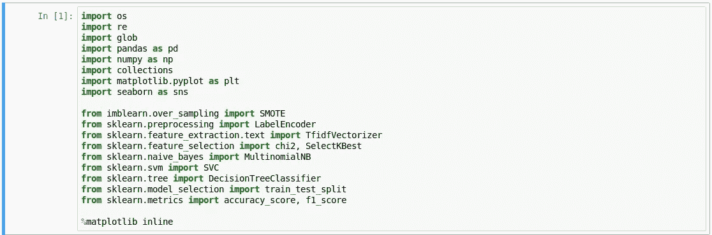
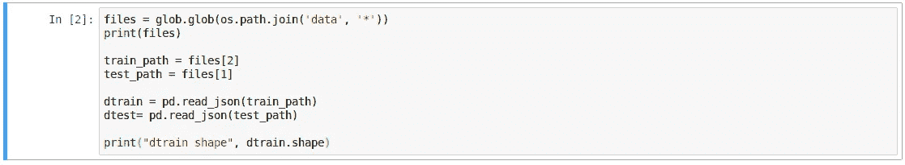
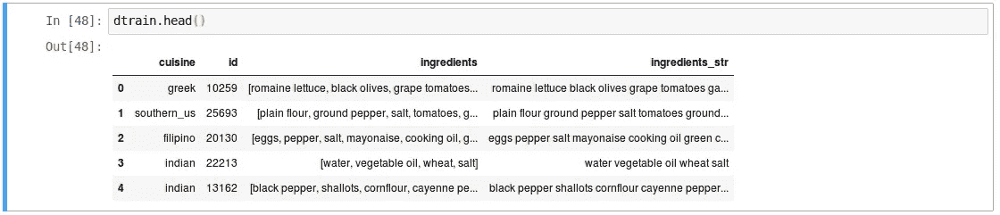
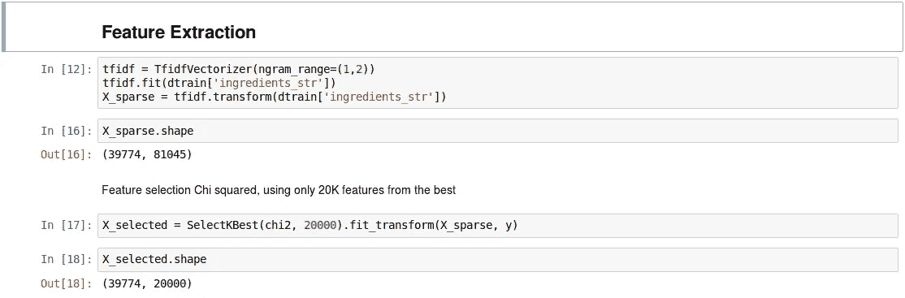
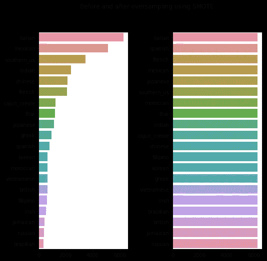
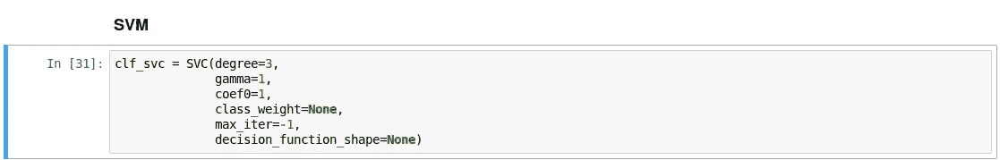
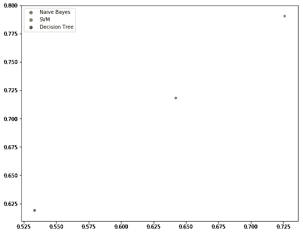

# 从非结构化数据构建机器学习模型

> 原文：<https://towardsdatascience.com/building-machine-learning-model-from-unstructured-data-dd2d0263f1db?source=collection_archive---------6----------------------->

你可能对结构化数据很熟悉，它无处不在。在这里，我想重点讨论我们如何将非结构化数据转换为数据机器可以处理的数据，然后进行推理。

## 从结构化数据到非结构化数据

我们可以在我们的数据库系统中找到容易结构化的数据，如个人资料记录、交易记录、项目记录。随着时间的推移，人们开始思考如何处理文本、图像、数据卫星、音频等非结构化数据。这可能会给你一些有用的东西，让你在你的业务决策。

在这种情况下，我从 [kaggle 竞赛](https://www.kaggle.com/c/whats-cooking-kernels-only)中选取了“正在烹饪什么”。竞赛要求你根据食物的成分对食物进行分类。我们将使用一些流行的库来帮助我们建立机器学习模型，Pandas，Numpy 和 Matplotlib 是你所熟悉的。

## 加载数据

## 数据清理

在这一部分中，为了 tf-idf 矢量化的目的，我将列表连接到 ingredients 中的字符串中。我假设所有的成分只有一克。

## 特征抽出

这里我使用 TF-IDF 矢量器和 ngram range unigram 和 bigram。拟合和转换训练数据集。在它完成了变身之后。我使用 chi2 进行特征选择，以减少维度空间。

## 建模

我将数据集分割成测试大小为 0.2 的训练测试分割，分割后，由于数据集存在不平衡问题，我使用 SMOTE 进行了过采样。我认为这部分非常重要，因为不平衡数据集是分类的问题，你的模型可能偏向干扰..

这次我用三个模型多项式朴素贝叶斯、支持向量机和决策树。朴素贝叶斯和决策树参数是默认值，但对于 SVM 使用

Hyperparameter SVM

## 估价

结果表明，SVM 最适合这一分类。

## 如果你喜欢这篇文章，请随意点击鼓掌按钮👏🏽如果你对接下来的帖子感兴趣，一定要在 medium 上关注我