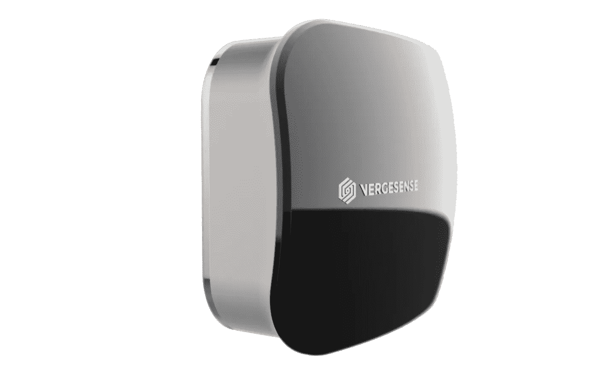

# 人工智能驱动的建筑管理

> 原文：<https://towardsdatascience.com/building-management-powered-with-artificial-intelligence-6398b4b30ef4?source=collection_archive---------11----------------------->

> 你工作的地方哪个区域最忙？如果你更好地利用你的办公室，你能节省多少钱？

据统计，办公空间产生的费用仅次于人事费。与此同时，大办公室的设施利用率通常包含很大比例的浪费，如果加以监控，这些浪费是可以很容易避免的。

在[无题王国](http://untitledkingdom.com)，我们相信技术是我们用来支持公益事业的工具，一点一点地改变世界，让世界变得更美好。设施管理可能不是人工智能技术最性感的应用，但考虑到它在经济和生态中的作用，它是当代企业最迫切的需求之一。

今天，我们自豪地向大家介绍我们的合作伙伴，[verge sense](http://www.vergesense.com/)——一家由 Y Combinator[Y Combinator](https://www.crunchbase.com/organization/y-combinator/)支持的创新公司。他们的“传感器系统”智能平台使用计算机视觉来测量办公空间的利用率和占用率。我正在和**丹·瑞安**，VergeSense 的**首席执行官兼联合创始人交谈。**

Dan Ryan, the CEO and Co-founder of VergeSense

## ***N*** *:丹，你是怎么想出这样一个用 AI 传感器赋能楼宇管理的创新概念的？这个想法是如何发展的，你打算用维杰森解决什么问题？*

我在大厦管理部门工作了大约 10 年，与许多物业经理、大厦业主或其他占用大厦的人谈过话。我们观察到的一贯问题是，建筑运营商和业主没有关于他们的建筑实际使用情况的数据。与此同时，建筑管理费用通常是这些公司的第二大成本，仅次于员工工资。

最常见的情况是资产的巨大支出，以及没有关于这些资产如何使用的信息。在这一点上，我们决定使用人工智能传感器**收集关于建筑如何运行的数据**，测量建筑中到底发生了什么，并且**提供分析**，这将帮助建筑专业人员**削减开支**和**更有效地运营他们的办公室**。

## n:是什么使维珍森独一无二？你最大的优势是什么？

**D:** 首先，VergeSense 比我们任何竞争对手的解决方案都便宜 10-100 倍，并且更易于安装和操作。虽然我们的大多数竞争对手使用非常昂贵的有线硬件，但 VergeSense 传感器是无线的，它们依靠电池供电运行多年。

另一个优势是，VergeSense 将传感器的数据传回云端，无需费力将系统集成到企业 IT 网络中。这很容易，而且是一个真正的金钱和能源节省。

## *N:让 VergeSense 基于人工智能技术的目的是什么？人工智能如何提高你的解决方案的价值？*

**D:** 我们在构建优化的神经网络方面做了大量工作，并且我们击中了靶心。VergeSense 传感器拥有 **99%的数据准确性**，同时，它运行在一个非常**便宜的硬件**上，我们不使用任何 GPU 或昂贵、复杂的机器。基于人工智能的 VergeSense 让我们创建一个高度精确的解决方案，**节省时间**(通常需要安装)和**金钱**，并提供**舒适的使用**。

我们还不断**提高传感器的数据收集能力。**我们目前在市场上销售的产品被认为是一种统计人数的产品，有一群客户对收集建筑中其他物体的信息感兴趣，例如，表示拿出 trush 或清理厨房的必要性。

**有了 VergeSense，我们可以使用相同的硬件，并多年来更新传感器，让它收集不同类型的数据。**

## 在解决方案的帮助下，我们能从分析数据中学到什么？

在无题王国团队的帮助下，我们花了很大力气将 VergeSense 收集的数据可视化。

该工具有两个组成部分:第一个是一个很好的，容易理解的数据可视化，允许用户比较不同类型的空间。第二个提供了一些可操作的见解，帮助用户理解正在发生的事情并采取行动。

例如，您分析数据并了解到您的一个会议室只有 10–15%被占用。在这一点上，VergeSense 会给你一些建议，比如放弃大尺寸房间，把它重新整理成几个小房间。

## N:如果让你说出 VergeSense 项目最大的挑战是什么？

经营公司的头 6 个月通常是最具挑战性的，因为你基本上没有信誉可言。你正从零开始，面临最大的挑战:**获得你的第一个客户。**

我们很快就造出了第一个产品——我可以说那是一个基本的原型，但它已经是我们能够销售的东西了。在与 VergeSense 合作四个月后，我们接触到了第一个客户。它提供了验证产品的可能性，并确保它真正解决了我们想要解决的问题。

现在，当我们有几十个客户时，我们的主要挑战是扩大规模，撬动市场，并为我们的客户提供足够的支持。

## n:数字化转型在工作环境中的重要性是什么？

**D:** 工作中的数字化转型是消除工作挫折感、提高生产力和增强工作舒适度的绝佳机会。使用 VergeSense 的传感器技术可以帮助人们更有效地工作。

在大型组织中，通常很难找到空闲的会议室或预订会议时段。缺少空闲空间可能是一个常见的问题，尤其是在远程工作的环境中——假设四个在线会议参与者中有一个不能出席会议。会发生什么？整个小组的会议可能会被取消。

此外，从空间中获得更高的效率有助于公司释放通常用于建筑运营的那部分资本。现在，他们获得了巨大的资本投资回报，并将这笔预算用于其他有助于业务发展的事情上。

## *N:你的客户对 VergeSense 有什么反馈？*

**D:** VergeSense 的用户喜欢它的简单性和无线功能。他们称赞 VergeSense 的第二点是我们产品的准确性和获得具体入住人数的机会，以衡量房间的利用率水平。

在软件方面，我们的客户喜欢高级分析中数据可视化的简单性。我们还收到了许多热情的客户对 VergeSense UX/UI 的反馈——这正是无题王国团队真正帮助我们的地方，因为你们的设计团队非常强大，富有创造力。

## 听到如此热情的反馈真是太好了。您能告诉我们您的客户是如何为新平台的创建做出贡献的吗？

我们真的很快就打造出了 VergeSense MVP。在我们把它推向市场后，我们获得了很多用户的反馈。根据我们用户的提示，我们利用他们的意见重新设计并与未命名的王国团队一起重新推出了 VergeSense。

即使在今天，在我们进行的几乎每一次客户演示或致电中，我们都在收集对额外功能的请求以及对可视化数据的见解。该产品的用户界面采用模块化设计，因此很容易根据用户的建议添加组件。

## *N:* *在 VergeSense 网站上，你提到了传感器可能带给办公室的 3 个主要价值。你能一个一个地描述他们吗？*

我已经谈了很多关于 VergeSense 帮助公司**更有效地管理他们的工作场所**的事情。除此之外，我们的解决方案还为**带来了发现节约的机会。**无论是将大房间分割成小房间，还是决定是否需要租用一间更大的办公室，VergeSense analysis 都能让建筑经理更有效地管理预算。

最后但同样重要的是，VergeSense 传感器数据可能会与公司的生产力工具集成在一起，以**增强团队的能力**。

> 会议室在哪里？书桌在哪里？
> 自助餐厅排队有多长？

VergeSense 可以为您提供所有这些问题的答案，节省时间，让人们保持专注，提高他们的生产力和工作满意度。

## 你能想出 VergeSense 如何在你的一些客户公司提高工作效率的具体统计数据吗？

**D:** 对于我们的第一个客户，我们已经做了一个初步的试点项目，因此我们在 6 个月的时间里部署了传感器。我们收集了关于办公室绩效的数据，我们发现办公室的利用率非常低。尽管该团队声称他们需要更多的空间，但我们的分析显示，许多桌面区域实际上根本没有流量。利用 VergeSense 的数据，我们的客户在同一栋建筑中重新设计了另一层楼，配有更小的办公室。在此之后，我们比较了重新设计的地板与原始地板的效率。事实证明，与旧设计相比，优化后的办公室容纳了 50%的员工。当我们看房地产价格时，优化一个楼层每年为公司节省 40 万美元。

## ***N:现在，让我们暂时跳过开发 VergeSense 的过程。在你看来，由无题王国开发者、UX/UI 设计师和产品负责人组成的团队跨职能运行你的项目有什么价值？***

**D:** 在跨职能团队中发展 VergeSense 是非常重要的。它给了我们一个非常严格的产品开发方法。我们没有马上开始建造东西。我们一直等到真正定义了产品的用途、用户、他们面临的问题，以及我们如何帮助他们解决这些问题。《无题王国》展示了强大的产品管理纪律，在探索会议后跑一周短跑给了我们“加油，加油，加油”的感觉。

在建立一个产品后，我们向用户展示 VergeSense，征求他们的反馈，并将他们的反馈纳入到进一步的开发中，以更好地满足我们客户的需求。

## 你提到了你和我们团队一起参加的主题探索会议。他们如何影响重新设计的方向？

**D:** 在深入了解和揭示我们正在努力解决的真正客户问题方面，发现会议非常有见地。在我们写一行代码之前提前做这件事给了项目超高效率，因为在会议之后，我们确切地知道我们应该朝什么方向前进。

## *N:你是怎么知道无题王国的，是什么让你选择我们作为你的合作伙伴？*

我想我第一次在 Y-Combinator 的论坛帖子上看到你，但也可能是 Quora 的帖子。我记不清了，但我知道我是在网上遇到你的。我已经知道波兰在技术专业和设计方面享有盛誉——之前，我曾与一些波兰开发人员和设计师合作过，波兰软件开发和 UX/UI 设计的水平给我留下了深刻的印象。

## 你能告诉我们一个获得风险投资的小故事吗？这条路很难走吗？

我们很早就申请了 Y-combinator，实际上甚至在我和我的联合创始人成立之前。Y-combinator 项目让我们真正接触到了硅谷的现实。在 YC 之后，我们得到了一家名为 Bolt 的风险投资公司的额外投资。从今天的角度来看，我真的为 VergeSense 的融资之旅感到自豪。但事实上，这一切都是有机发生的；背后没有秘方。老实说，当我们获得 Y- Combinator 的第一笔资金时，我感到非常震惊。

## N:你能给其他正在努力融资的公司一些建议吗？

我总是不太愿意给出建议，因为每个企业都不一样，所以没有放之四海而皆准的成功之道。这些建议永远不能从一家公司转到另一家公司。但如果让我告诉其他创业者一件事，我会说:这从来都不容易。确保你真的相信你正在做的事情，如果你真的相信，不要放弃。

影响我职业生涯最重要的是坚持。在创业的世界里，会有成千上万的事情出错，会有成千上万的挑战发生。你只需要保持冷静，坚持下去，保持灵活。我们在 VergeSense 制造的第一个产品与我们最终的产品完全不同。我们倾听客户的心声，重新定义他们的需求，并根据他们的需求调整我们的解决方案。

## 维杰森的下一步是什么？你短期和长期的主要挑战是什么？

在短期内，我们计划面对运营挑战:扩大业务规模、收集更多订单和运送更多产品。显然，这伴随着我们团队的成长，以支持 VergeSense 客户。此外，根据用户的反馈，我们可能会找出我们想要构建的下一个关键特性。

从长远来看，我们希望找出使用我们的平台可以解决的其他问题。目前，我们正忙于 VergeSense 在房地产市场的应用。但我确信，VergeSense 传感器和分析在未来也会给其他行业带来影响。敬请关注，看我们成长！