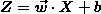
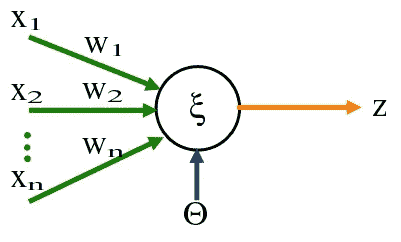
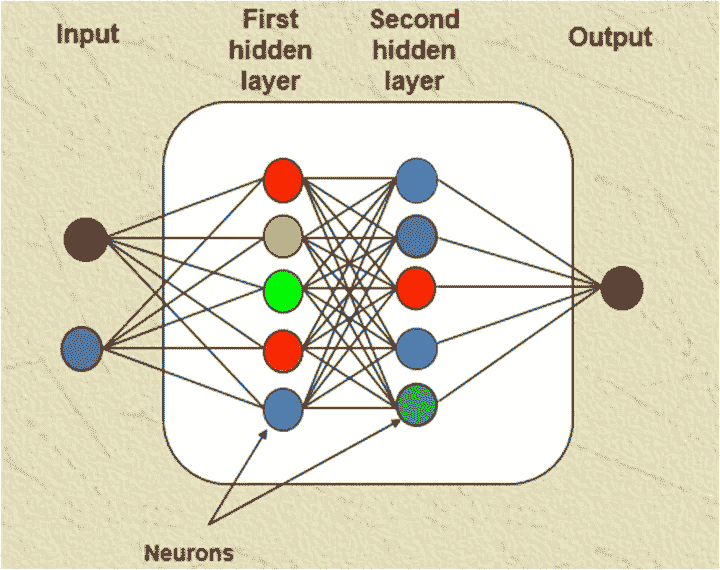
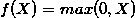
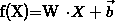
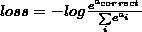
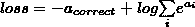
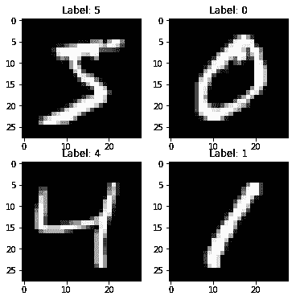
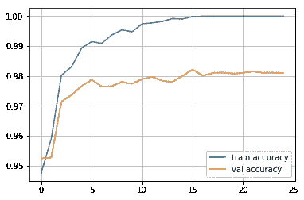

# 从头开始构建神经网络

> 原文：<https://towardsdatascience.com/building-neural-network-from-scratch-9c88535bf8e9?source=collection_archive---------0----------------------->

## 使用 Python 中的 Numpy 对多层感知器的简单介绍。

在这本笔记本中，我们将使用 numpy 构建一个神经网络(多层感知器)，并成功训练它识别图像中的数字。深度学习是一个庞大的主题，但我们必须从某个地方开始，所以让我们从多层感知器的神经网络的基础开始。你可以在笔记本版本[这里](https://github.com/aayushmnit/Deep_learning_explorations/tree/master/1_MLP_from_scratch)或者我的[网站](https://aayushmnit.github.io/posts/2018/06/Building_neural_network_from_scratch/)找到同样的博客。

# 什么是神经网络？

神经网络是一种机器学习模型，它受到我们大脑中神经元的启发，其中许多神经元与许多其他神经元相连，以将输入转化为输出(简单吧？).大多数情况下，我们可以看到任何机器学习模型，并将其视为一个接受输入并产生所需输出的函数；神经网络也是一样。

# 什么是多层感知器？

多层感知器是一种网络类型，其中一组感知器的多个层堆叠在一起形成一个模型。在我们进入一个层和多个感知器的概念之前，让我们从这个网络的构建模块开始，它是一个感知器。将感知器/神经元视为一个线性模型，它接受多个输入并产生一个输出。在我们的例子中，感知器是一个线性模型，它接受一组输入，将它们与权重相乘，并添加一个偏差项以生成一个输出。



Fig 1: Perceptron image

*Image credit = https://commons . wikimedia . org/wiki/File:perceptron . png/*

现在，如果我们将这些感知机堆叠在一起，它就变成了一个隐藏层，在现代深度学习术语中也称为密集层。
**密集层，**


*注意，偏差项现在是一个向量，W 是一个权重矩阵*


Fig 2: Single dense layer perceptron network

*Image credit = http://www . t example . net/tikz/examples/neural-network/*

现在我们了解了密集层，让我们把它们加起来，这个网络就变成了一个多层感知器网络。



Fig 3: Multi layer perceptron network

*Image credit = http://pubs . scie pub . com/ajmm/3/3/1/figure/2s*

如果你已经注意到我们的稠密层，只有线性函数，并且线性函数的任何组合只导致线性输出。由于我们希望我们的 MLP 具有灵活性并学习非线性决策边界，我们还需要将非线性引入网络。我们通过添加激活函数来实现引入非线性的任务。有各种各样的激活函数可以使用，但我们将实现整流线性单位(ReLu)，这是一个流行的激活函数。ReLU 函数是一个简单的函数，它对于任何小于零的输入值都是零，对于大于零的值也是相同的值。
**ReLU 功能**



现在，我们理解了密集层，也理解了激活函数的目的，剩下的唯一事情就是训练网络。为了训练神经网络，我们需要一个损失函数，每一层都应该有一个**前馈回路**和**反向传播回路**。前馈回路接收输入并产生输出以进行预测，反向传播回路通过调整层中的权重以降低输出损失来帮助训练模型。在反向传播中，权重更新通过使用链规则的反向传播梯度来完成，并使用优化算法来优化。在我们的例子中，我们将使用 SGD(随机梯度下降)。如果你不理解梯度权重更新和 SGD 的概念，我推荐你看 Andrew NG 讲座机器学习[第一周。](https://www.coursera.org/ml)

因此，总结一个神经网络需要几个构件

*   **致密层** —全连通层，



*   **ReLU layer** (或任何其他引入非线性的激活功能)
*   **损失函数**——(多类分类问题时的交叉熵)
*   **反向传播算法** —具有反向传播梯度的随机梯度下降

让我们一个一个地接近他们。

# 编码从这里开始:

让我们从导入创建神经网络所需的一些库开始。

```
from __future__ import print_function
import numpy as np ## For numerical python
np.random.seed(42)
```

每一层都有一个向前传递和向后传递的实现。让我们创建一个可以向前传递的主类层*。向前()*和向后传球*。向后()。*

```
class Layer:

    #A building block. Each layer is capable of performing two things: #- Process input to get output:           output = layer.forward(input)

    #- Propagate gradients through itself:    grad_input = layer.backward(input, grad_output)

    #Some layers also have learnable parameters which they update during layer.backward.

    def __init__(self):
        # Here we can initialize layer parameters (if any) and auxiliary stuff.
        # A dummy layer does nothing
        pass

    def forward(self, input):
        # Takes input data of shape [batch, input_units], returns output data [batch, output_units]

        # A dummy layer just returns whatever it gets as input.
        return input def backward(self, input, grad_output):
        # Performs a backpropagation step through the layer, with respect to the given input.

        # To compute loss gradients w.r.t input, we need to apply chain rule (backprop):

        # d loss / d x  = (d loss / d layer) * (d layer / d x)

        # Luckily, we already receive d loss / d layer as input, so you only need to multiply it by d layer / d x.

        # If our layer has parameters (e.g. dense layer), we also need to update them here using d loss / d layer

        # The gradient of a dummy layer is precisely grad_output, but we'll write it more explicitly
        num_units = input.shape[1]

        d_layer_d_input = np.eye(num_units)

        return np.dot(grad_output, d_layer_d_input) # chain rule
```

# 非线性关系层

这是你能得到的最简单的层:它简单地将非线性应用于你的网络的每个元素。

```
class ReLU(Layer):
    def __init__(self):
        # ReLU layer simply applies elementwise rectified linear unit to all inputs
        pass

    def forward(self, input):
        # Apply elementwise ReLU to [batch, input_units] matrix
        relu_forward = np.maximum(0,input)
        return relu_forward

    def backward(self, input, grad_output):
        # Compute gradient of loss w.r.t. ReLU input
        relu_grad = input > 0
        return grad_output*relu_grad
```

# 致密层

现在让我们构建一些更复杂的东西。与非线性不同，密集层实际上有东西要学。

密集层应用仿射变换。在矢量化形式中，它可以描述为:


在哪里

*   x 是形状[批量大小，数量特征]的对象特征矩阵，
*   w 是权重矩阵[特征数量，输出数量]
*   b 是 num_outputs 偏差的向量。

W 和 b 都在层创建期间初始化，并在每次调用 backward 时更新。请注意，我们正在使用 **Xavier 初始化**，这是一个训练我们的模型更快收敛的技巧[阅读更多](http://andyljones.tumblr.com/post/110998971763/an-explanation-of-xavier-initialization)。我们不是用随机分布的小数字初始化我们的权重，而是用平均值 0 和方差 2/(输入数+输出数)初始化我们的权重

```
class Dense(Layer):
    def __init__(self, input_units, output_units, learning_rate=0.1):
        # A dense layer is a layer which performs a learned affine transformation:
        # f(x) = <W*x> + b

        self.learning_rate = learning_rate
        self.weights = np.random.normal(loc=0.0, 
                                        scale = np.sqrt(2/(input_units+output_units)), 
                                        size = (input_units,output_units))
        self.biases = np.zeros(output_units)

    def forward(self,input):
        # Perform an affine transformation:
        # f(x) = <W*x> + b

        # input shape: [batch, input_units]
        # output shape: [batch, output units]

        return np.dot(input,self.weights) + self.biases

    def backward(self,input,grad_output):
        # compute d f / d x = d f / d dense * d dense / d x
        # where d dense/ d x = weights transposed
        grad_input = np.dot(grad_output, self.weights.T)

        # compute gradient w.r.t. weights and biases
        grad_weights = np.dot(input.T, grad_output)
        grad_biases = grad_output.mean(axis=0)*input.shape[0]

        assert grad_weights.shape == self.weights.shape and grad_biases.shape == self.biases.shape

        # Here we perform a stochastic gradient descent step. 
        self.weights = self.weights - self.learning_rate * grad_weights
        self.biases = self.biases - self.learning_rate * grad_biases

        return grad_input
```

# 损失函数

由于我们希望预测概率，因此在我们的网络上定义 softmax 非线性并计算给定预测概率的损失是合乎逻辑的。但是，有一种更好的方法可以做到这一点。

如果我们将交叉熵的表达式写为 softmax logits (a)的函数，您会看到:



如果我们仔细看看，我们会发现它可以重写为:



它被称为 Log-softmax，它在各个方面都优于 naive log(softmax(a)):

*   更好的数值稳定性
*   更容易得到正确的导数
*   计算速度略微加快

那么，为什么不在我们的计算中使用 log-softmax，而不去估算概率呢？

```
def softmax_crossentropy_with_logits(logits,reference_answers):
    # Compute crossentropy from logits[batch,n_classes] and ids of correct answers
    logits_for_answers = logits[np.arange(len(logits)),reference_answers]

    xentropy = - logits_for_answers + np.log(np.sum(np.exp(logits),axis=-1))

    return xentropydef grad_softmax_crossentropy_with_logits(logits,reference_answers):
    # Compute crossentropy gradient from logits[batch,n_classes] and ids of correct answers
    ones_for_answers = np.zeros_like(logits)
    ones_for_answers[np.arange(len(logits)),reference_answers] = 1

    softmax = np.exp(logits) / np.exp(logits).sum(axis=-1,keepdims=True)

    return (- ones_for_answers + softmax) / logits.shape[0]
```

# 全网络

现在，让我们将刚刚构建的内容结合到一个有效的神经网络中。正如我之前所说的，我们将使用手写数字的 MNIST 数据作为我们的例子。幸运的是，Keras 已经有了 numpy 数组格式的，所以让我们导入它吧！。

```
import keras
import matplotlib.pyplot as plt
%matplotlib inlinedef load_dataset(flatten=False):
    (X_train, y_train), (X_test, y_test) = keras.datasets.mnist.load_data() # normalize x
    X_train = X_train.astype(float) / 255.
    X_test = X_test.astype(float) / 255. # we reserve the last 10000 training examples for validation
    X_train, X_val = X_train[:-10000], X_train[-10000:]
    y_train, y_val = y_train[:-10000], y_train[-10000:] if flatten:
        X_train = X_train.reshape([X_train.shape[0], -1])
        X_val = X_val.reshape([X_val.shape[0], -1])
        X_test = X_test.reshape([X_test.shape[0], -1]) return X_train, y_train, X_val, y_val, X_test, y_testX_train, y_train, X_val, y_val, X_test, y_test = load_dataset(flatten=True)## Let's look at some example
plt.figure(figsize=[6,6])
for i in range(4):
    plt.subplot(2,2,i+1)
    plt.title("Label: %i"%y_train[i])
    plt.imshow(X_train[i].reshape([28,28]),cmap='gray');
```



我们将网络定义为一系列层，每一层都应用在前一层之上。在这种情况下，计算预测和训练变得微不足道。

```
network = []
network.append(Dense(X_train.shape[1],100))
network.append(ReLU())
network.append(Dense(100,200))
network.append(ReLU())
network.append(Dense(200,10))def forward(network, X):
    # Compute activations of all network layers by applying them sequentially.
    # Return a list of activations for each layer. 

    activations = []
    input = X # Looping through each layer
    for l in network:
        activations.append(l.forward(input))
        # Updating input to last layer output
        input = activations[-1]

    assert len(activations) == len(network)
    return activationsdef predict(network,X):
    # Compute network predictions. Returning indices of largest Logit probability logits = forward(network,X)[-1]
    return logits.argmax(axis=-1)def train(network,X,y):
    # Train our network on a given batch of X and y.
    # We first need to run forward to get all layer activations.
    # Then we can run layer.backward going from last to first layer.
    # After we have called backward for all layers, all Dense layers have already made one gradient step.

    # Get the layer activations
    layer_activations = forward(network,X)
    layer_inputs = [X]+layer_activations  #layer_input[i] is an input for network[i]
    logits = layer_activations[-1]

    # Compute the loss and the initial gradient
    loss = softmax_crossentropy_with_logits(logits,y)
    loss_grad = grad_softmax_crossentropy_with_logits(logits,y)

    # Propagate gradients through the network
    # Reverse propogation as this is backprop
    for layer_index in range(len(network))[::-1]:
        layer = network[layer_index]

        loss_grad = layer.backward(layer_inputs[layer_index],loss_grad) #grad w.r.t. input, also weight updates

    return np.mean(loss)
```

# 训练循环

我们将数据分成小批，将每个这样的小批输入网络并更新权重。这种训练方法被称为小批量随机梯度下降。

```
from tqdm import trange
def iterate_minibatches(inputs, targets, batchsize, shuffle=False):
    assert len(inputs) == len(targets)
    if shuffle:
        indices = np.random.permutation(len(inputs))
    for start_idx in trange(0, len(inputs) - batchsize + 1, batchsize):
        if shuffle:
            excerpt = indices[start_idx:start_idx + batchsize]
        else:
            excerpt = slice(start_idx, start_idx + batchsize)
        yield inputs[excerpt], targets[excerpt]from IPython.display import clear_output
train_log = []
val_log = []for epoch in range(25): for x_batch,y_batch in iterate_minibatches(X_train,y_train,batchsize=32,shuffle=True):
        train(network,x_batch,y_batch)

    train_log.append(np.mean(predict(network,X_train)==y_train))
    val_log.append(np.mean(predict(network,X_val)==y_val))

    clear_output()
    print("Epoch",epoch)
    print("Train accuracy:",train_log[-1])
    print("Val accuracy:",val_log[-1])
    plt.plot(train_log,label='train accuracy')
    plt.plot(val_log,label='val accuracy')
    plt.legend(loc='best')
    plt.grid()
    plt.show()Epoch 24
Train accuracy: 1.0
Val accuracy: 0.9809
```



正如我们所看到的，我们已经成功地训练了一个完全用 numpy 编写的 MLP，具有很高的验证准确性！