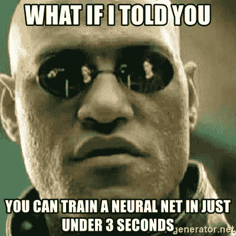
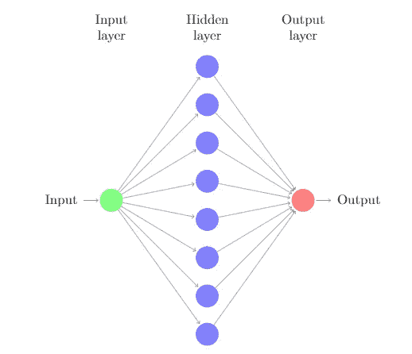
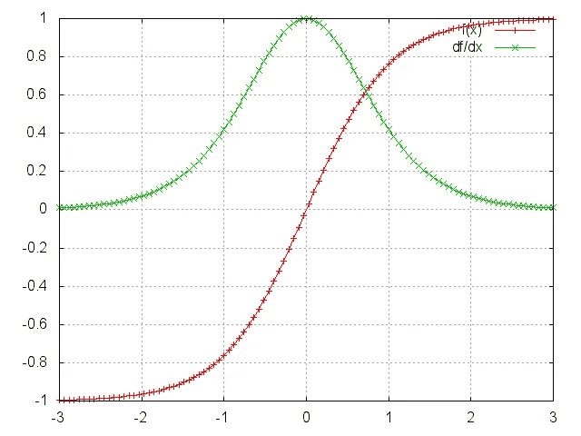
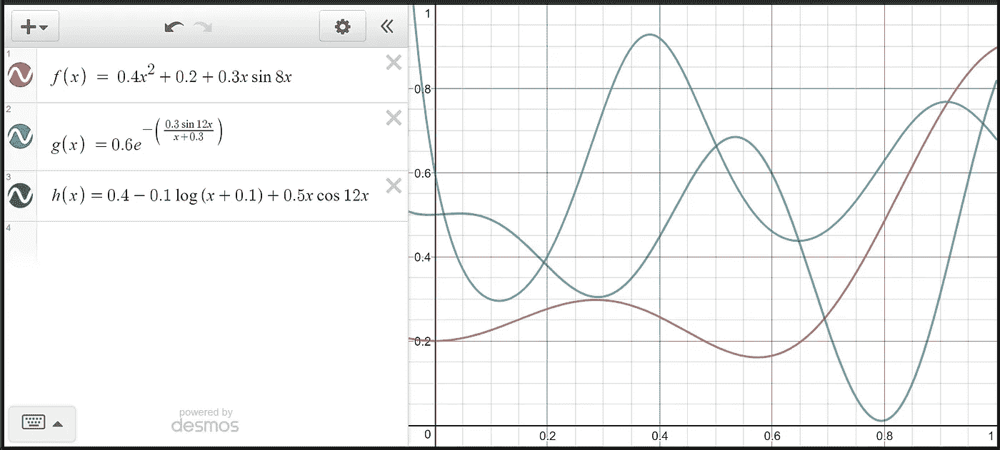
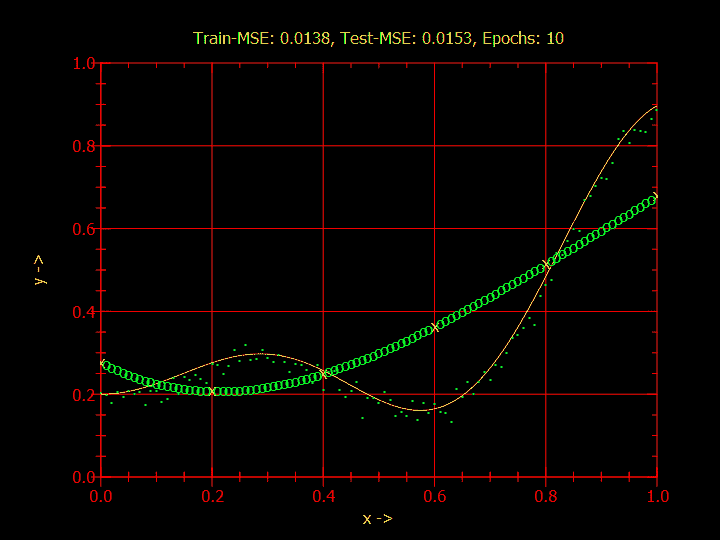
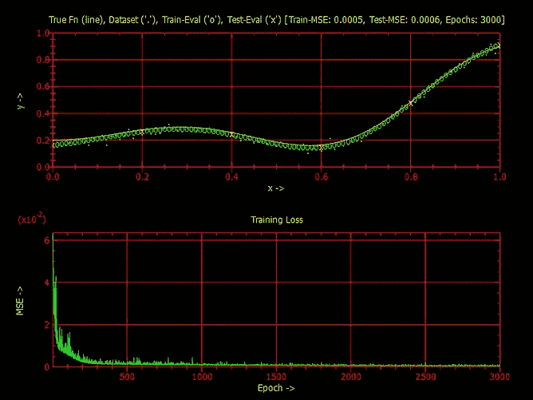
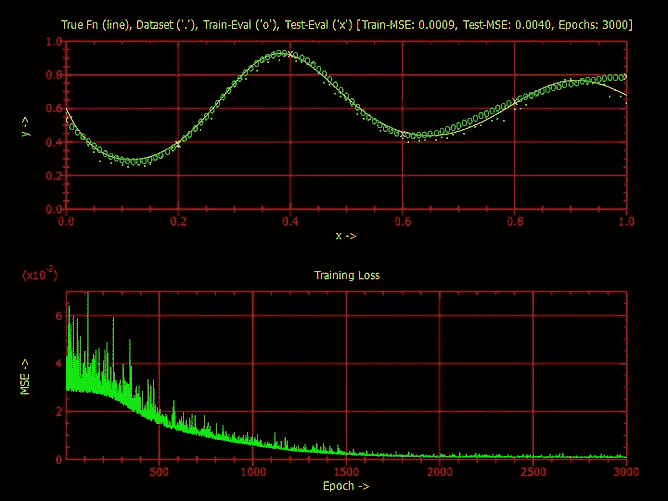
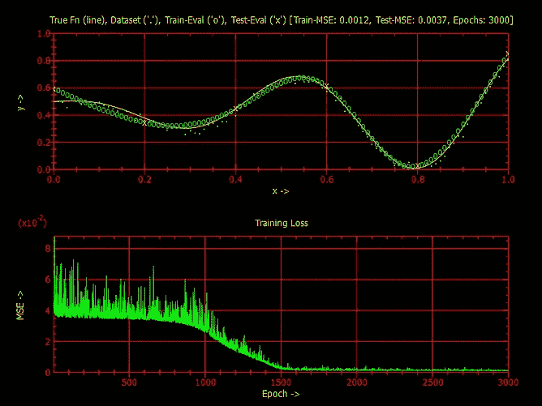

# 用 F#构建神经网络—第二部分

> 原文：<https://towardsdatascience.com/building-neural-networks-in-f-part-2-training-evaluation-5e3a68889da6?source=collection_archive---------12----------------------->

Well, you’ll need F# for this so better read on!

# 快速回顾一下

欢迎来到本系列的第二部分。在[第一部分](/building-neural-networks-in-f-part-1-a2832ae972e6)中，我经历了执行单一(随机)梯度更新所需的步骤。在这一部分中，我们扩展了这一功能，使网络能够从数据中学习任意关系。在我们开始之前，请确保您已经阅读并实现了我上一篇文章中的代码:

 [## 用 F#构建神经网络—第 1 部分

### 函数式编码神经网络优雅吗？

towardsdatascience.com](/building-neural-networks-in-f-part-1-a2832ae972e6) 

# 通用逼近定理

第一个[在 1989 年](http://citeseerx.ist.psu.edu/viewdoc/download?doi=10.1.1.441.7873&rep=rep1&type=pdf)被证明，神经网络可以被归类为通用函数逼近器。但是，*这样的近似器是什么？*

> *给定任意一个连续的 N 维函数* f(x) *，一个只有一个隐层和有限个神经元的神经网络有能力在固定的范围* x *和有限的误差* ε内逼近这样一个函数。

我们将利用这个定理，在多个非平凡函数上评估一个简单的架构，以证明我们的网络具有从数据中学习的能力。

# 一些助手功能

让我们定义这些额外的辅助函数，它们将帮助我们进行培训和评估:

*   `genDataSet1D` —仅使用开始、结束和步进信息，该函数生成向量元组的数组，每个元组对应于一个`(x, y)`对。注意，这可以是任何必要的维度，但是为了简单起见，本教程中的输入和输出都是一维的。
*   `yRealFn` —这是我们定义目标功能的地方。来自该函数的数据点将被采样并绘制在最终图上，以显示我们试图建模的实际底层函数。
*   `yRealFnAndNoise` —该功能只是在`yRealFn`的输出中增加一个概率项，模拟数据中存在的噪声。然而，如果该误差没有适当调整，与确定性项(yRealFn)相比，它将过大，导致网络试图学习噪声而不是实际函数。
*   `meanFeatureSqErr`&`evalAngEpochErr`—这些功能将在本教程的培训部分解释。

# 初始化网络

## 定义架构

Sometimes, a single hidden layer is all we need…

为了测试我们的网络，一个只有一个隐藏层的简单神经网络就足够了。我研究了学习任何合理的平滑函数所需的隐藏节点的数量，发现 8 个节点就足够了。

> 根据经验，选择太少的隐藏节点会导致欠拟合，反之太多会导致过拟合。

当谈到选择激活功能时，手边有许多流行的: *tanh* ， *sigmoid* ， *ReLU* 等。我决定用 **tanh** ，因为它非常适合学习*平滑函数*中存在的非线性，比如我们测试中会用到的那些。

A plot of tanh(x) (red) and its derivative (green) [[source](http://www.junlulocky.com/actfuncoverview)].

## 选择超参数

如果你一直在跟踪机器学习，甚至从一开始你就学会欣赏超参数搜索或多或少的试错。当然，你也可以查看几个时期的成本函数图，做出你认为的最佳价值的有根据的猜测。

> 训练次数为~ **3000** 时，学习率为 **0.03** 通常会给出足够好的结果。由于 F#中惊人的快速训练时间，我只能处理这么多的纪元！

## 目标函数

在我们开始训练之前，还有最后一步:选择合理复杂的函数，这些函数可以用来生成精确的数据集，同时在视觉上具有可比性。

您会注意到，对于位于相同范围内的所有输入，输出都受到闭合区间[0，1]的限制。这是一个深思熟虑的决定，以避免使用[均值归一化](https://en.wikipedia.org/wiki/Standard_score)，这有助于通过将所有特征保持在相似的范围内来防止过度加权。

A definition of our three test functions along with their plots

我们将使用步长为 0.01 的 x ∈ [0，1]来训练我们的网络。因此，在此范围内将产生 101 个等距样本，我们将保留其中的约 6%进行验证(统一选择)。

# 培训我们的网络

If only he was taught about under-fitting…

## 概述

让我们首先从顶层收集一下培训需要哪些功能:

*   对于每个时期，我们需要执行梯度下降，在我们的例子中，将随机地进行*(每个样本一次)。然后，我们将使用更新后的网络在下一个时期进行进一步的训练。*
*   *在此过程中，通过在每个时期结束时评估我们的网络并获得误差度量(例如，平方误差)来跟踪我们的训练误差将是有帮助的。*

## *使用地图折叠*

> *保持接近函数范式，而不是使用传统的 for 循环，我们将使用`List.mapFold for training`开发一个巧妙的技巧。*

*那么*地图折叠*是如何工作的呢？*

*简单来说就是`List.fold`和`List.map`的高效结合。它允许在给定当前列表元素和先前状态的情况下计算新的状态，同时使用我们选择的函数转换当前列表元素。该函数的最终输出是一个由**转换列表**和**最终状态**组成的元组。*

## *履行*

*在`trainEpoch`函数中，训练数组首先被随机打乱(就地)。这个新洗牌后的数组被送入`perfGradDesc`。该函数通过使用`Array.fold`传播网络更新，在整个训练数据集上一次执行一个样本的梯度下降(单遍)。*

*一旦我们训练了一遍网络，并从`trainEpoch`获得了最终网络，我们需要使用我们选择的成本函数来评估该时期的训练误差。每个样本的*误差*需要与`lastLayerDeriv`功能一致。因此，*平方误差*是由`meanFeatureSqErr`函数实现的误差度量的最合适选择。*

*注意:虽然我们的网络可以支持任何维度的输出，但当涉及到成本函数时，每个样本只有一个标量度量是有用的。因此，每个样本的*误差*将是每个输出特征的平方误差的*平均值。这不会影响一维输出的误差，如果所有输出维度的比例大致相同，这是一个合理的选择。**

*在对整个训练集的每个样本的*误差*进行平均后，我们获得了**均方误差**。该值由`evalAvgEpochErr`功能计算得出。*

*最后，在每个时期结束时，`(xAndyShuffArr,newNet)`是传播到下一个时期的新的*状态*，而`err`是替换原始列表中时期号的*映射对象*。*

*The code for training our network*

# *结果*

**

*The results for y = *0.4x² + 0.2 + 0.3x*sin8x,* spanning multiple epochs.*

*所以这里有一些视觉证明，网络实际上是在训练！为了绘制我们的数据，我们将使用我过去在 F#中用来绘制的`PLplot`库。绘制这些图形还需要一些额外的代码，但是可以在 Github 资源库中找到，这个资源库在文章的结尾有链接。*

## *神话；传奇*

*   ***粉色** **线**代表底层**真函数**无噪声。这仅用于绘图，但从不用于任何计算。*
*   ***青色** **点**是整个**数据集**，包括训练和测试数据点。所有误差都是参照这些点计算的*
*   *绿色****圆圈**代表在**训练** **数据**上评估的**最终假设**。随着训练时期数量的增加，您可以观察到这些曲线越来越接近真实的函数曲线***
*   ***最后，**粉色** **十字**代表基于**测试数据**评估的最终假设。如果你仔细观察，你会注意到他们很好地跟踪了训练数据点，并且这被训练与测试的 MSE 分数所证实***

## ***评估目标函数***

******************

***From left to right: f(x) = *0.4x² + 0.2 + 0.3x*sin8x*, g(x) = 0.6e^-(0.3sin12x/(0.3+x)), h(x) = 0.4 - 0.1log(x+0.1) + 0.5x*cos12x***

***这是我们三个测试函数的结果，你可以点击每一个来查看更多细节。只需快速浏览一下，很明显，网络通常在更平滑的函数上表现良好。随着每个函数的驻点附近的梯度增加，神经网络的训练也变得更加困难(观察损失曲线)。这可以与我们使用 tanh(x)作为激活函数的事实联系起来。***

***尽管如此，我们现在有了直观的证据，证明了普适近似定理是成立的！***

***任务已完成💪🏼***

# ***结论***

***现在，我们已经定义了基本架构，并且能够对任意数据进行训练，我们可以使用网络来训练和测试流行的数据集。这是留给你的任务…为什么不试试著名的[波士顿房价数据集](http://lib.stat.cmu.edu/datasets/boston)？***

***这段代码在机器学习的世界里还有很长的路要走。它们是许多扩展，甚至可以对最简单的神经网络进行扩展以改善收敛性:批量标准化、小批量梯度下降、自定义权重初始化等等。***

***嗯，不要担心，只是在 F#上训练 3000 个历元需要大约 **3 秒**的事实使它成为快速神经网络修补和评估的良好潜在候选对象。使用非常相似的设计原则和相似的参数选择，这个脚本的 python 版本需要大约 168 秒(在 Google Collab 上)！***

> ****正如承诺的，所有的源代码都可以在*[*Github*](https://github.com/hsed/funct-nn)*上获得。****

***我希望你能从过去的两个教程中获得一些新的东西，它们是一个漫长的过程，但我在这个过程中学到了很多。一如既往，请随时分享您的建议，反馈和对我的下一个教程的任何建议。如果你喜欢这篇文章，请留下👏🏼或者两个…下次见！👋🏼***