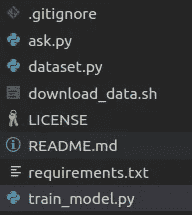
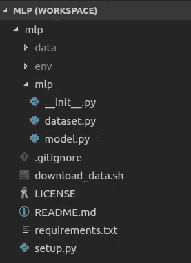
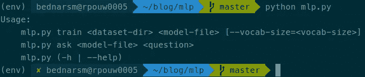
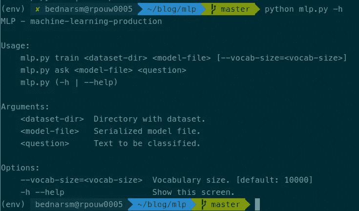
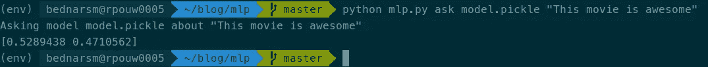
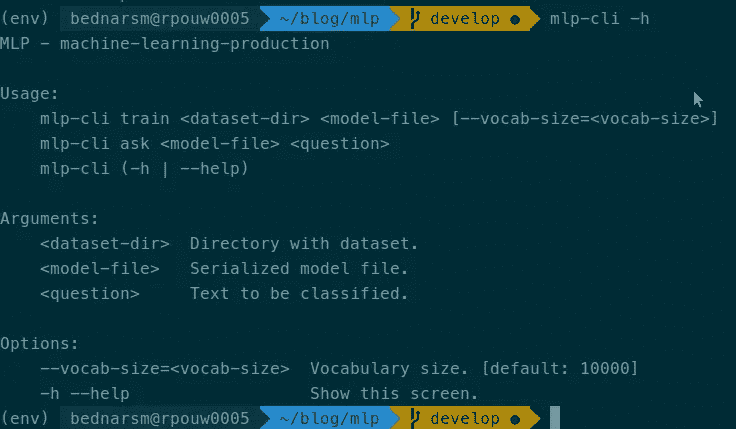
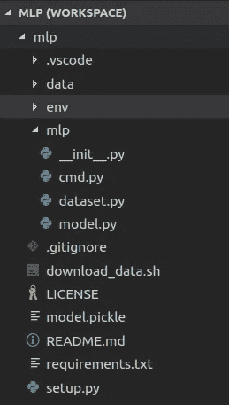

# 用 Python 构建机器学习项目包

> 原文：<https://towardsdatascience.com/building-package-for-machine-learning-project-in-python-3fc16f541693?source=collection_archive---------8----------------------->

我见过的大多数机器学习项目都处于永久的实验状态，从技术角度来看没有明确的成功计划。创建一个算法，实际上解决一个可行的问题，做好它本身是困难的。然而，以可靠的方式管理高度实验性的代码库并使您的项目准备好部署是另一个难题。尤其是如果你没有开发人员的背景。


We want to make rocket science in our projects. But we need to make sure our rocket will not explode 5 seconds after launch. “white space shuttle indoors” by [SpaceX](https://unsplash.com/@spacex?utm_source=medium&utm_medium=referral) on [Unsplash](https://unsplash.com?utm_source=medium&utm_medium=referral)

在我的下一个系列中，我将涉及一些我认为有用的主题，以便更容易地从实验过渡到生产。其中大部分还有助于保持代码的可靠性和结果的可重现性。

以下是清单:

*   构建 python 包
*   为其创建命令行界面
*   管理依赖关系(python 和非 python)
*   定义依赖图
*   创建自动化(单元)测试
*   将其作为 rest api
*   归档

今天，我将介绍如何创建 python 包和命令行界面。同样在开头，我将展示涉及第三和第四个要点的另外两个关键原则。

# 实验代码

我们从非常简单肮脏的“原型”开始。这甚至不是一个应用程序，只是一堆脚本。



Our “app” at time zero

我们有空的 readme、github 生成的许可文件和 gitignore、一些 bash 脚本和三个 python 文件。因为数据是数据科学家最宝贵的资源。

数据文件通常太大，无法存储在代码库中，需要托管在其他地方。在这个应用中，我们使用公共的 [aclImdb_v1 数据集](http://ai.stanford.edu/~amaas/data/sentiment/aclImdb_v1.tar.gz)进行情感分析。

**第一条规则永远要确保你能再次获得数据——并且你的团队知道如何去做。**

我们可怜的原型在这方面已经很不错了。让我们来看看`download_data.sh`

```
set -emkdir -p data/rawwget [http://ai.stanford.edu/~amaas/data/sentiment/aclImdb_v1.tar.gz](http://ai.stanford.edu/~amaas/data/sentiment/aclImdb_v1.tar.gz) -O data/raw/imdb.tar.gztar -xzf data/raw/imdb.tar.gz --directory data/rawrm data/raw/imdb.tar.gz
```

该脚本创建目录`data/raw`，下载数据集，解包并删除不再需要的归档。理想情况下，我更愿意将数据保存在我的 S3 账户中(以防链接过期)，但我们可以假设这已经足够好了。然而，实际上你的数据可能是一个数据库转储，一堆需要合并的 excel 文件等等。您应该为**所有**数据采集步骤创建脚本(例如:可以编写数据库转储脚本),以确保能够以自动化方式运行整个过程。

有些情况下是不可能的(因为各种原因:技术、法律、合规等)。在这种情况下，所需的步骤必须**明确记录**。新的团队成员应该能够获得数据，而不需要任何人的帮助。但是记住，最好的文档是可执行的文档；)

现在，让我们来看看 requirements.txt

```
numpy
pandas
scikit-learn
```

所需软件包的列表非常简单，但目前还不错。跟踪所有项目的依赖关系是非常重要的。稍后我们将会看到仅仅列出所需的包是不够的，但是如果你甚至没有使用这个简单的列表，请开始吧。

**规则#2 列出你所有的依赖项，并创建单独的环境**

为每个项目创建单独的 conda/虚拟环境，并列出所有依赖关系。如果您的项目需要一些额外的非 python 依赖项(如数据库驱动程序、系统范围的包),请明确列出它们，或者如果可能的话，为它们创建安装脚本。请记住，手动步骤的数量必须尽可能少。这也适用于“一次性活动”。我有时很惊讶那些*一次性*被执行的频率。

现在我们可以继续学习 python 代码了。

文件`dataset.py`包含简单的类数据集，用于读取数据集(惊喜)。代码很好，除了硬编码的路径(我们稍后会解决)

下一个文件，`train_model.py`是脚本文件中包含的一串语句。该脚本做了应该做的事情，但我们需要对它进行修改。初始版本的内容如下:

步骤非常简单，模型被训练和存储到文件以及使用矢量器。随后，根据测试数据对其进行评估，并打印出一份简单的报告。该脚本可以工作，但是正如您可能认为的那样，它与良好的实践没有任何共同之处。不幸的是，很多“只是实验”的代码并没有退出“代码质量”这个阶段。我们将打破这一障碍；)

> 所使用的模型非常简单，其准确性很差——但这不是问题。我让事情尽可能简单，因为这不是关于创建一个好的分类器的系列；)在现实中，这样的训练脚本更复杂，但在更简单的例子上更容易解释事情。

为了示例的完整性，还有一个脚本— `ask.py`。它的作用是提供一个对新数据进行预测的接口。

我们走过了“数据科学实验”的初始状态。现在，我们将把它转变成生产就绪的解决方案。

# 创建 Python 包

第一步是创建一个包。有许多基本上没有成本的好处。其中一些:

*   清除项目结构
*   能够为部署创建源代码/二进制分发
*   版本控制
*   自动相关性检查
*   轻松创建扩展
*   分离(例如，您可能不想包含预测环境的训练代码)
*   还有更多:)

**规则 3 打包你的代码**

创建一个包很容易。首先我们需要选择名字；)姑且称之为 mlp(机器学习-生产)。创建这样的目录，并将源文件移动到其中:

```
mkdir mlp
mv dataset.py train_model.py ask.py mlp/
```

接下来，我们需要做一些轻微的调整。包代码不应该是直接可执行的。因此，它必须包含在类或函数中。顺便说一下，我们将把硬编码的路径提取到参数中。对于数据集，我们只需要修改类构造函数:

另外两个文件共享相同的模型。这意味着，这部分应该被提取。大概是这样的:

数据集和模型是我们能够提取为可重用组件的两个部分。剩下的两个(ask 和培训脚本)更像是启动器。现在，让我们删除它们。我们将创造一个更好的版本；)

包装还有两件事要做。首先是在 mlp 目录中创建`__init__.py`,内容如下:

```
from mlp.dataset import Dataset
from mlp.model import DumbModel
```

`__init__.py`是在加载模块的瞬间执行的(你可以把它想成“包构造器”)。它不应该做太多的事情，但是导入被认为是包的公共部分的部分是一个非常常见的场景。这不是必需的，但允许我们写:

```
from mlp import Dataset, DumbModel
```

代替

```
from mlp.dataset import Dataset
from mlp.model import DumbModel
```

最后一件事是创建`setup.py in`项目根目录。这个文件包含了关于这个包的所有元信息。它可能非常大，但是对于我们的目的(此时)几行就足够了:

我们只需要定义名称(这是您在 pip install XXXX 中键入的内容)、包列表(这是您在 import 语句中使用的内容)和版本—参见 [PEP 440](https://www.python.org/dev/peps/pep-0440/) 。

该项目目前看起来是这样的:



最后要做的事情是安装我们的软件包。要执行此操作，请键入以下内容(在项目根目录中):

```
pip install -e .
```

没有魔法:我们提供了一个点来代替包名，意思是“安装当前目录”。`-e`开关使其安装在开发模式下。这基本上意味着软件包源代码中的每一个改变都会立即反映在已安装的版本中——在做出改变后就不需要重新安装了。您可以在执行 pip 列表后看到您的包:

```
$ pip list
Package         Version    Location                     
--------------- ---------- -----------------------------
cloudpickle     0.6.1      
cycler          0.10.0
...
mlp             0.0.1.dev1 $HOME/blog/mlp
....
```

为了确保一切正常，您可以执行 python repl 并尝试实例化数据集和模型。

```
$ python
>>> from mlp import Dataset, DumbModel
>>> d = Dataset()
>>> m = DumbModel()
```

**命令行界面**

我们到达了中点。今天的第二个主题是创建一个界面。最初，有两个肮脏的脚本。相反，我将向您展示如何创建一个漂亮的命令行界面。

为你的项目定义好界面。一堆脚本是不够的。

将有两个命令。一个用于训练模型，第二个用于请求预测。让我们从在项目根目录下创建名为`mlp.py`的文件开始。这将是我们的“发射器”。我们的命令非常简单，只需为它们创建两个简单的函数:

> 当然，当这样的函数很长时，将它包含在包中总是一个好主意，只需从启动器中调用它。

好吧，但是我们怎么调用它们呢？类似这样的东西可能有用:

```
python mlp.py train data/raw/aclImdb/ model.pickle --vocab-size=5000
```

或者用于预测:

```
python mlp.py ask model.pickle "This movie is awesome"
```

如何创建？有几种可能性，例如:argparse 或 click。但是我准备用 [docopt](http://docopt.org/) 。安装它，不要忘记将它包含在 requirements.txt 中

使用 docopt，我们通过编写帮助信息来定义界面。可能看起来很疯狂；)

在`mlp.py`的开头添加以下内容:

通过阅读这个 docstring，您已经知道了哪些命令是可用的，需要哪些参数等等。Docopt 将对此进行解析，并为我们创建参数解析器。我鼓励你看一下 docopt 的文档以获得更多信息。

执行我们的命令非常简单。在`mlp.py`的末尾增加以下内容:

我们只是检查选择了哪个命令，并传递它的参数。就这么简单。



## 可安装命令

今天我们只做一件小事。目前我们的发射器在包装之外。让我们更紧密地整合它。将我们的脚本移动到 mlp 目录，并将其重命名为 cli.py(命令行界面)。将 docopt 帮助消息与以下内容稍微对齐:

我们将由`mlp-cli`指挥执行我们的项目。我选择不使用普通 mlp，因为它会与 mlp 目录冲突。

下一次更新`setup.py`为:

我们在包中添加了一个入口点。它是一个控制台脚本，可执行名为`mlp-cli`。该可执行文件将从包`mlp.cmd`中启动 main 函数

当我们编辑安装脚本时，需要重新安装软件包:

```
pip install -e .
```

> 记住:当你改变包代码时，没有必要重新安装它(只要你使用了-e 开关)。如果您更改 setup.py 内容，您必须重新安装软件包。

现在我们可以在终端中键入`mlp-cli -h`来验证它是否工作；)



是的，我们有一个单一的入口来与我们的项目沟通；)再也没有乱七八糟的剧本了！

# 摘要

那是相当多的。我们学习了如何创建一个基本的 python 包，并为它创建一个命令行界面。此外，我们设法使它与 it 完全集成。不要忘记关于再现性的两条基本规则。现在项目结构应该是这样的:



这时你可以从项目库中下载代码；[https://github.com/artofai/mlp](https://github.com/artofai/mlp)。寻找标签`part1-finished`。

在下一篇文章中，我将解决引言中列出的另一个问题。

# 锻炼

如果你愿意，你可以做一个简单的练习:在我们的应用程序中添加一个期权限制。数据集已经准备好处理这样的参数；)

敬请期待，后会有期:)