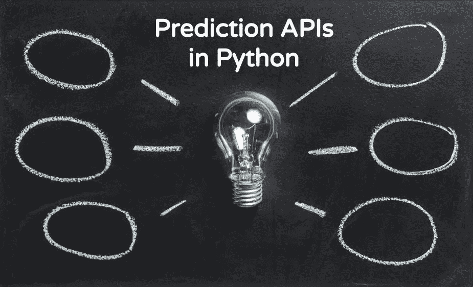
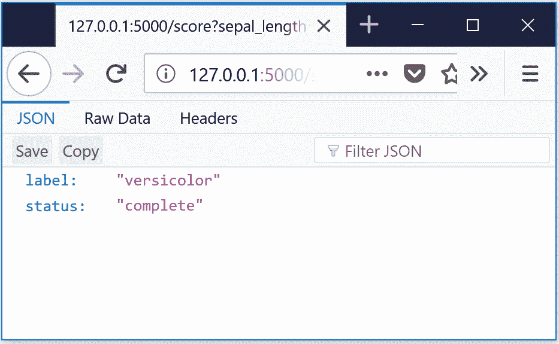

# 用 Python 构建预测 API(第 1 部分):系列介绍&基本示例

> 原文：<https://towardsdatascience.com/building-prediction-apis-in-python-part-1-series-introduction-basic-example-fe89e12ffbd3?source=collection_archive---------5----------------------->

好吧，你已经训练了一个模型，但是现在呢？如果没有人会使用，所有的工作都是没有意义的。在某些应用程序中，您可以简单地创建一个批处理作业来收集需要评分的记录、准备这些记录并运行模型。然而，其他应用程序需要或者至少高度受益于用于实时评分模型的过程。理想情况下，我们甚至希望通过 REST API 与他人共享使用模型的能力。虽然部署一个简单的模型相当容易，但是在这个起点上扩展和迭代是有挑战的。

在本系列中，我们将采用增量方法来构建预测 API。在这篇文章中，我们将构建尽可能简单的 API，允许我们对模型进行评分并返回预测。随后的每篇文章都将关注我们如何在已经实现的基础上进行改进。这个系列不会有固定的结局。随着新主题的出现，我会尝试扩展已经完成的内容——这取决于我有多少时间和读者的兴趣水平。

## 目标受众

在整个系列中，我们将主要关注构建模型评分平台的软件工程方面，并讨论工程和数据科学之间的灰色地带。我将在很大程度上假设读者有一个他们想要部署的模型，或者他们有能力生成这样一个模型。因此，我们通常不会讨论构建预测模型的过程。有很多很棒的教程和书籍涉及这个主题。

这个系列有两个主要的受众。第一类是全栈数据科学家，他们希望通过 API 部署他们的模型，但不确定如何有效地完成。第二类是没有在数据科学领域工作过的软件工程师或技术产品经理，他们可能会从理解模型部署与一般软件部署的不同中受益。

## 工具

我们将使用 Python 3 作为主要语言。特别是，我将主要使用 Python 3.6。烧瓶将用于初始原料药。所有模型都将使用 Scikit-Learn 构建。如果您不确定如何用这些包来设置开发环境，我推荐从 [Anaconda](https://www.anaconda.com/download/) 开始，因为它提供了您开始设置所需的一切。

虽然这个工具集的范围相当窄，但是我希望这些主题可以广泛地应用于其他编程语言和 API 框架。

# 基本示例

既然我们已经为本系列奠定了基础，那么让我们构建一个基本模型。我们将从建立在 iris 数据集上的随机森林分类器开始。

同样，我将跳过模型构建过程的讨论，所以我们不打算深入研究这个例子。要注意的主要事情是，一旦我们建立了模型，我们就使用`joblib`将它保存(`pickle`)到一个文件中。虽然这种方法可行，但是这种方法存在一些问题和限制。Scikit 有一篇关于这个的很棒的[文章，但是主要问题是:](http://scikit-learn.org/stable/modules/model_persistence.html)

1.  安全性:当您`load`一个腌泡对象时，您实际上是在执行存储在文件中的代码。仅加载您信任的持久化对象。
2.  可移植性:在构建环境和生产评分环境之间 scikit-learn 版本的任何变化(或潜在的依赖性)都会导致最低限度的警告和潜在的意外行为，例如失败或预测错误。

我们暂时将这些问题放在一边，但这些可能是我们在后续文章中探讨的主题。

## 构建我们的第一个 API

现在，我们将使用 Flask 构建尽可能简单的 API。我们将包含一个端点`/predict`，它将允许我们通过[查询参数](https://en.wikipedia.org/wiki/Query_string)传递特征值。

我们在全球加载我们的模型为`MODEL`。我们还有一个标签列表(`MODEL_LABELS`)，对应于`MODEL.predict()`将输出的整数值。我们使用`@app.route('/predict')`装饰器创建了 API 端点，并定义了`predict()`函数来处理发送到该端点的请求。对这个端点的调用应该包含 4 个参数，它们对应于我们的特性:`sepal_length`、`sepal_width`、`petal_length`和`petal_width`。例如，一个呼叫看起来像这样:

`[http://127.0.0.1:5000/predict?sepal_length=5&sepal_width=3.1&petal_length=2.5&petal_width=1.2](http://localhost:5000/score?sepal_length=5&sepal_width=3.1&petal_length=2.5&petal_width=1.2.)`

Flask 处理 URL 查询字符串的解析，并将参数添加到`request.args`中，它有一个类似于 python `dict`的 API。如果键存在，使用`get`将检索一个值，否则将返回一个默认值。因为我们没有指定默认值，所以将返回`None`。此外，默认情况下，`args`中的值将是字符串，但在评分过程中，模型会自动将这些转换为浮点数。

特征值然后被打包到一个嵌套列表(列表的列表)中。这是必要的，因为我们的模型需要一个记录列表，其中每个记录都是特性集的长度。我们一次只对一个记录进行评分，这就是为什么外部列表只包含一个内部列表(记录)的原因。

我们使用`MODEL.predict()`来获得预测的类，它将是 0、1 或 2。最后，我们可以通过使用类作为进入`MODEL_LABELS`的索引来获得标签。

## 运行我们的预测服务

现在，我们可以从命令行启动我们的 Flask 服务器。

在我们的浏览器中，我们可以使用上面的例子发出一个测试请求。

`Test URL: http://127.0.0.1:5000/predict?sepal_length=5&sepal_width=3.1&petal_length=2.5&petal_width=1.2`

我们也可以使用`requests`来做同样的事情。

# 前方是什么

在 20-30 行代码中，我们构建了一个简单的模型，并创建了一个接受请求并返回预测的 API。然而，有几个方面我们可以并且应该比我们在这里所做的做得更好。对这些主题的探索将在后面的文章中处理，但这里有一个快速预览:

1.  **错误处理**:目前，我们在给模型评分时不做任何错误处理。当我们收到坏数据或数据丢失时会发生什么(没有提供`sepal_length`)？如果失败了，打电话的人会收到什么样的反馈？
2.  自动化测试:我们的代码中有错误吗？除了手动运行几个请求，是否有可能自动化这个过程？
3.  **可扩展性**:这个 API 只处理一个单一的全局模型。我们应该为我们的下一个模型创建另一个一次性的 API 吗？如果我们创建一个现有模型的新版本会怎么样？每个版本应该有一个独立的 API 吗？
4.  **数据收集**:没有从这个 API 收集数据。我们如何跟踪我们的模型执行得有多好？我们知道什么时候会出错吗？处理一个请求需要多长时间？如果我们开始收集数据，我们应该把它存储在哪里？
5.  **部署**:这是在本地运行的，但是我们需要把它放在服务器上。我们如何扩展？我们应该没有服务器吗？我们如何处理负载测试？
6.  **特性工程**:这个 API 期望请求者已经准备好了任何特性，但是我们经常需要在数据准备好被模型使用之前对它们进行一些转换。我们应该如何以及在哪里做这件事？

在[第 2 部分](https://medium.com/@chris.moradi/building-prediction-apis-in-python-part-2-basic-error-handling-3ab87b7a93)中，我们将看看 API 的基本错误处理，并涵盖定义何时应该使用模型的重要性。

 [## 用 Python 构建预测 API(第 2 部分):基本错误处理

### 在最初的系列文章中，我们创建了一个简单的 API 来对建立在 iris 上的 Scikit-Learn 随机森林分类器进行评分…

medium.com](https://medium.com/@chris.moradi/building-prediction-apis-in-python-part-2-basic-error-handling-3ab87b7a93) 

*特别感谢 Geoff Svacha 为本系列提供反馈。*

# 脚注

1.  使用`datasets.load_iris().target_names`可以得到这些标签。
2.  类似于[1]，使用`datasets.load_iris().feature_names`并重新格式化这些。
3.  我们将在本系列的第 2 部分对此进行更深入的探讨。