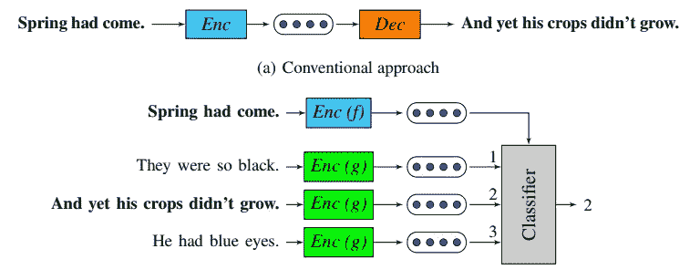
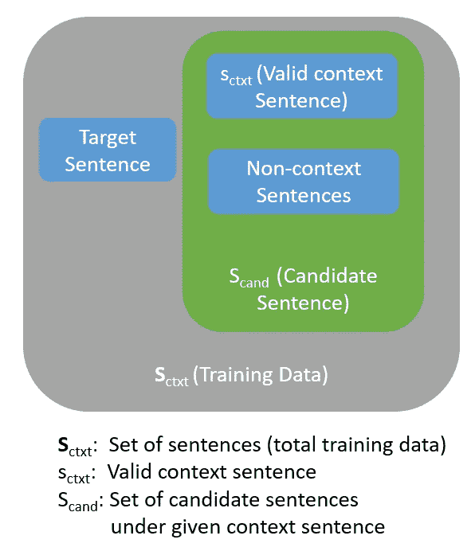
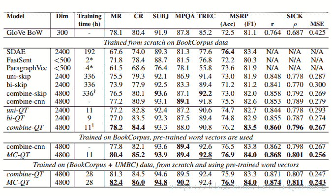
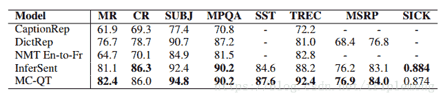
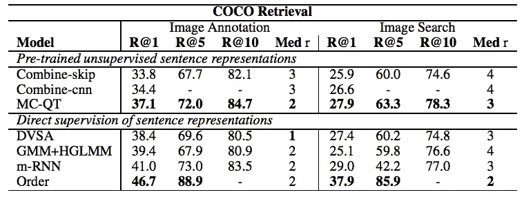

# 通过快速思考构建句子嵌入

> 原文：<https://towardsdatascience.com/building-sentence-embeddings-via-quick-thoughts-945484cae273?source=collection_archive---------18----------------------->

## 快速思考入门

Photo by [rawpixel](https://unsplash.com/@rawpixel?utm_source=medium&utm_medium=referral) on [Unsplash](https://unsplash.com?utm_source=medium&utm_medium=referral)

在之前的故事中，我分享了[skip-thinks](/transforming-text-to-sentence-embeddings-layer-via-some-thoughts-b77bed60822c)来计算句子嵌入。今天，我们有另一种无监督学习方法来计算句子嵌入，这就是快速思维。

Logeswaran 等人(2018)引入了快速思考方法来检索下游应用的句子嵌入。看完这篇文章，你会明白:

*   思维敏捷的设计
*   估价
*   实验
*   参考

# 快速思维设计

快速思维和跳过思维非常相似。目标是分类候选句子是否属于相邻句子，而不是生成单词来构造句子(跳过思想方法)。与 skip-gram 相同，快速思考和 skip-gram 构建都利用分类器来学习向量。

#a skip-thoughts, #b quick-thoughts (Logeswaran et al., 2018)

给出一个目标句子，并使用负采样方法(Mikolov 等人，2013 年)为二元分类器构建一个有效的上下文句子和非上下文句子。

通过将有效的上下文句子标记为目标(例如 1)，而将其他非上下文句子标记为非目标(例如 0)，它可以建立一个分类器来找出哪个句子与目标句子相关。

该架构与使用编码器和解码器方法的跳跃思维相同，但是快速思维使用分类器而不是语言模型。你可以在这里查看[来了解这个架构。](/transforming-text-to-sentence-embeddings-layer-via-some-thoughts-b77bed60822c)

# 实验

Unsupervised Representation Learning Comparison (Logeswaran et al. 2018)

从上面的结果，你可以注意到 QT(快速思维)在不同的任务中得到了很好的结果。单 QT 和双 QT 意味着使用单向和双向 RNN 模型。

Supervised Representation Learning Comparison (Logeswaran et al. 2018)

在监督表征学习比较中，MC-QT(多通道快速思维)几乎在所有任务中都胜出。MC-QT 被定义为两个双向 rnn 的级联。第一个双向 RNN 使用一个预训练的字向量，它是[手套](/3-silver-bullets-of-word-embedding-in-nlp-10fa8f50cc5a)。另一个双向 RNN 是可调字向量，这意味着从头开始训练向量。

Image Caption Retrieval (Logeswaran et al. 2018)

在图像到文本和文本到图像的下游任务中，MC-QT 也取得了不错的效果。

# 拿走

*   和跳跃思维一样，快速思维构建句子嵌入。
*   与 skip-gram 相同，Quick-thinks 利用分类器来学习嵌入。
*   MC-QT 展示了从多个 NLP 下游任务中学习句子嵌入的能力。

# 关于我

我是湾区的数据科学家。专注于数据科学、人工智能，尤其是 NLP 和平台相关领域的最新发展。你可以通过[媒体博客](http://medium.com/@makcedward/)、 [LinkedIn](https://www.linkedin.com/in/edwardma1026) 或 [Github](https://github.com/makcedward) 联系我。

# 参考

Logeswaran L .，Lee H .，2018，[学习句子表征的高效框架](https://arxiv.org/pdf/1803.02893.pdf)

[tensor flow 中的快速思考](https://github.com/lajanugen/S2V)(原创)

[跳跃式思维故事](/transforming-text-to-sentence-embeddings-layer-via-some-thoughts-b77bed60822c)

[文字嵌入故事](/3-silver-bullets-of-word-embedding-in-nlp-10fa8f50cc5a)