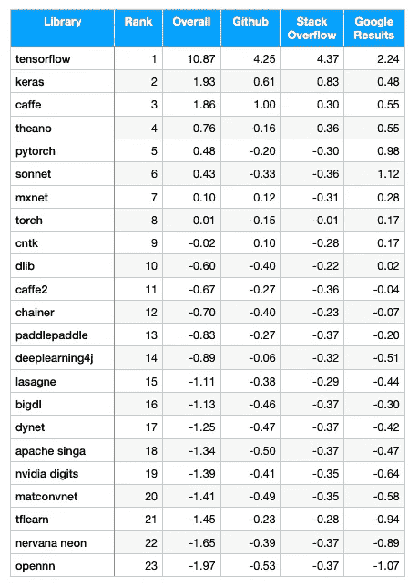
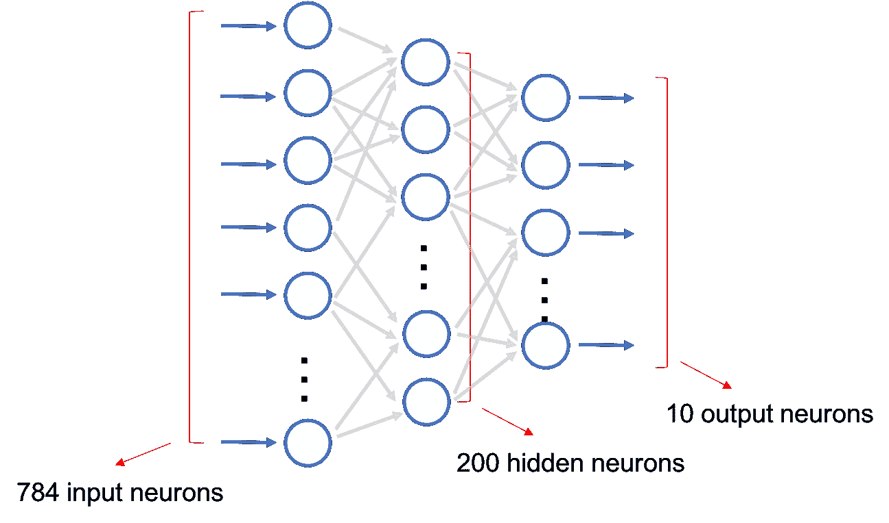
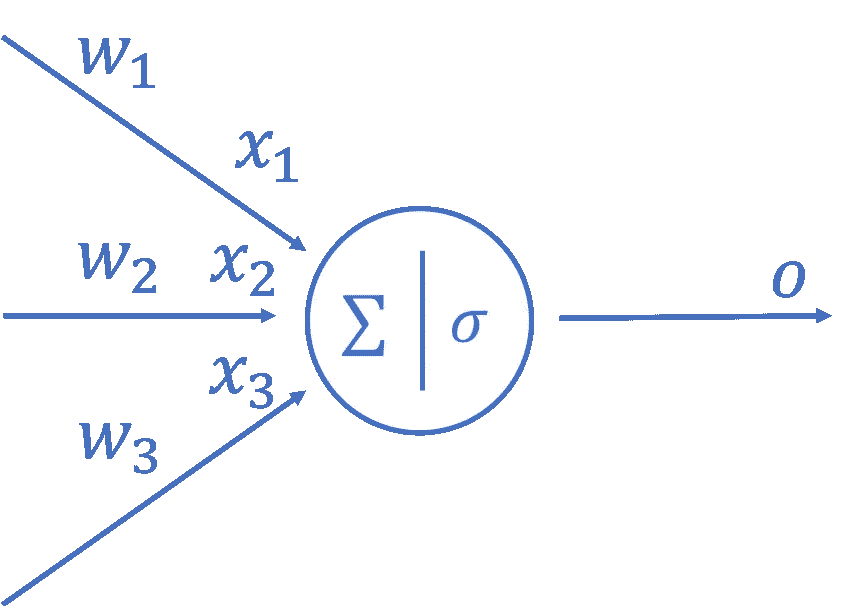
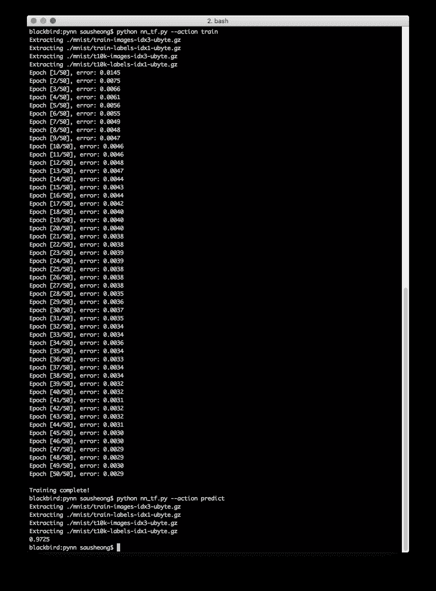
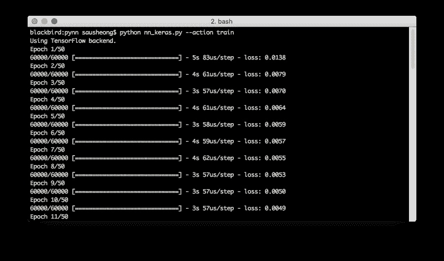
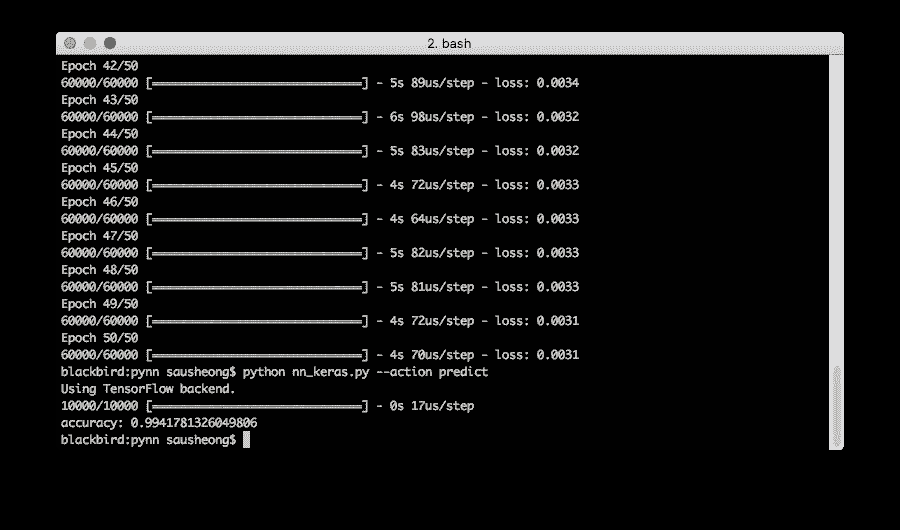
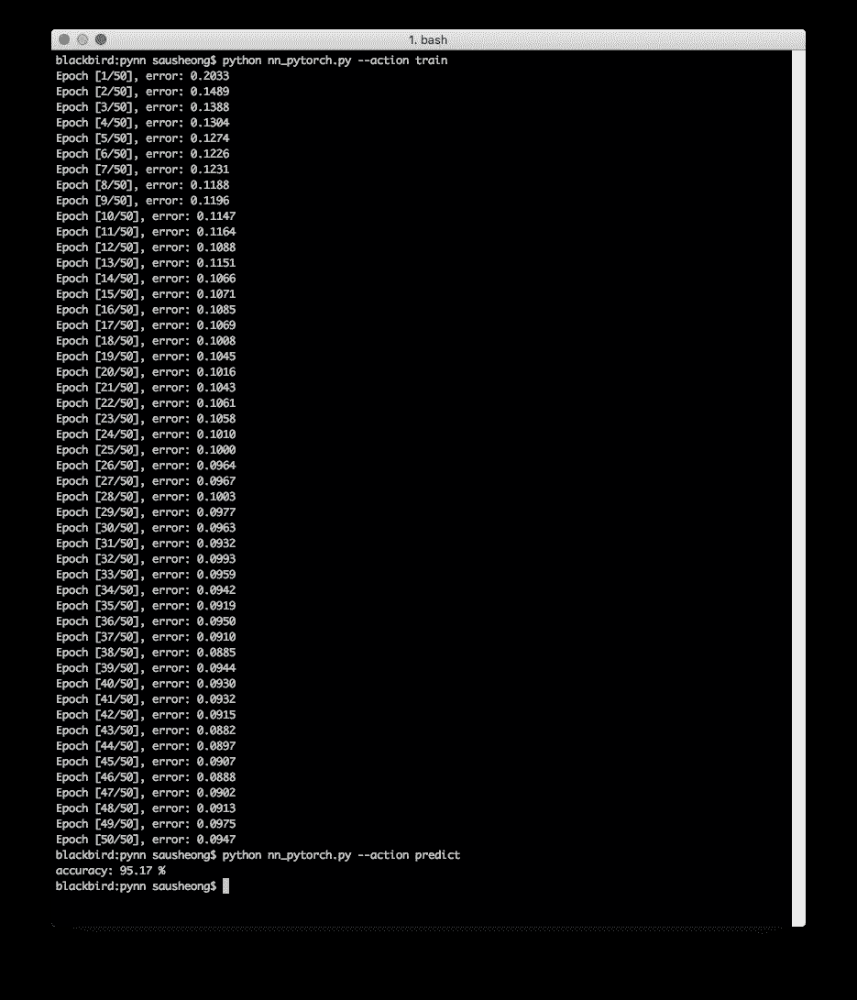
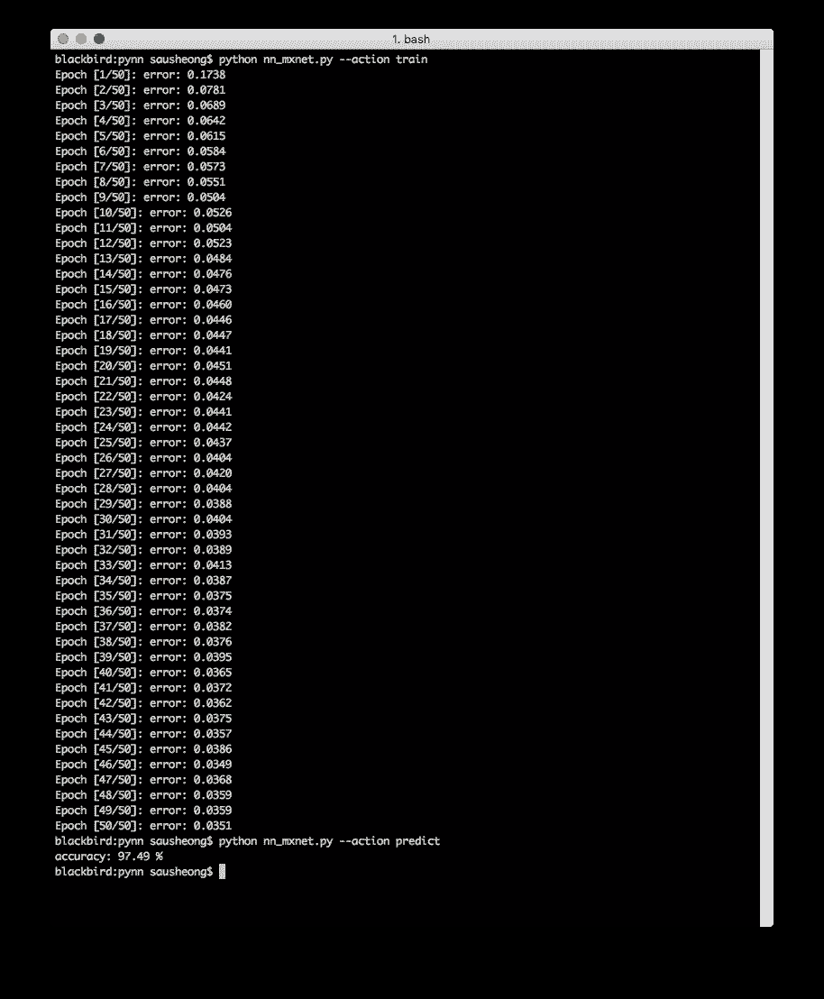

# 用流行的深度学习框架构建简单的人工神经网络

> 原文：<https://towardsdatascience.com/building-simple-artificial-neural-networks-with-tensorflow-keras-pytorch-and-mxnet-gluon-63a025ebb0b3?source=collection_archive---------13----------------------->

## 使用 TensorFlow、Keras、PyTorch 和 MXNet/Gluon

几周前，我[完成了构建一个非常简单的神经网络](/how-to-build-a-simple-artificial-neural-network-with-go-ac2e8c49ae37)的步骤，并在 go 中从头开始实现了它。然而，已经有许多深度学习框架可用，所以如果你想使用深度学习作为解决问题的工具，从头开始通常不是你要做的。

问题是，在众多深度学习框架中，我应该使用哪一个？比较深度学习框架的方法有很多。这是数据孵化器最近(2017 年 9 月)[的排名，根据他们的 Github、Stack Overflow 和 Google 搜索结果得分，给出了一个有趣的人气排名。](https://blog.thedataincubator.com/2017/10/ranking-popular-deep-learning-libraries-for-data-science/)



Deep learning frameworks popularity (data from [https://blog.thedataincubator.com/2017/10/ranking-popular-deep-learning-libraries-for-data-science/](https://blog.thedataincubator.com/2017/10/ranking-popular-deep-learning-libraries-for-data-science/))

从结果来看，很明显 TensorFlow 无疑是最受欢迎的框架，随着 Keras 现在成为 TensorFlow 本身的一部分，事情在不久的将来不会有太大变化。此外，几乎所有流行的深度学习框架都有 Python APIs，因此 TensorFlow/Keras 与 Python 的结合似乎是正确的选择。

尽管如此，我对其他一些框架很好奇，所以我开始了一段小小的旅程，编写与我在这些框架中所做的相同(或几乎相同)的简单人工神经网络进行比较。

作为快速复习，我创建的神经网络是一个简单的前馈神经网络，通常也称为多级感知器(MLP)。使用这个简单的 MLP，我获得了 MNIST 6 万个手写数字的数据集，并用它来训练神经网络。之后，我使用 10，000 个手写数字的测试数据集来测试神经网络的准确性。



Our simple artificial neural network

神经网络有 3 层，第一(输入)层有 784 个神经元(28×28 像素)，第二(隐藏)层有 200 个神经元，最后(输出)层有 10 个神经元。我用 sigmoid 函数作为激活函数，也用均方差作为损失函数。最后，我用 0.1 作为学习率，完全不使用任何偏向神经元。

以下所有实施都遵循相同的一般步骤:

1.  设置参数并加载数据集(大多数框架都有加载标准数据集的方法，如 MNIST)
2.  通过创建一个创建并返回神经网络的`mlp`函数来定义神经网络
3.  定义`train`功能
4.  定义`predict`功能
5.  创建一个 main，允许用户首先使用训练数据集(60，000 个图像)进行训练，然后使用测试数据集(10，000 个图像)进行预测

这种用 MNIST 数据集对数字进行的手写识别在深度学习教程中经常使用，它几乎是编写深度学习程序的“hello world”。不过，作为免责声明，您在下面看到的实现没有经过任何方式的优化，也不是最终的实现方式。事实上，还有许多其他更好的方法，这只是几个例子。

现在我们开始，先看看如何在 TensorFlow 中实现这个。

# 张量流

TensorFlow 最初由从事谷歌大脑项目的研究人员和工程师开发，供内部使用，并于 2015 年开源。这是迄今为止最受欢迎的深度学习框架。

在 TensorFlow 上运行的更著名的项目包括 [DeepMind](https://sausheong.github.io/posts/building-neural-networks-with-tensorflow-keras-pytorch-mxnet/%5BDeepMind%5D(https://deepmind.com/)) (开发 AlphaGo 的谷歌公司)，它在 2016 年从 Torch 转换为 TensorFlow。

这个实现使用 TensorFlow 1.6。我们开始吧。

## 设置参数并加载数据集

```
import TensorFlow as tf
import argparse
import numpy as np
from TensorFlow.examples.tutorials.mnist import input_data

# parameters
inputs, hiddens, outputs = 784, 200, 10
learning_rate = 0.01
epochs = 50
batch_size = 20

#loading the datasets
mnist = input_data.read_data_sets("./mnist/", one_hot=True)
```

相当简单，不言自明。请注意，我们将数据输出设置为[单次触发](https://sausheong.github.io/posts/building-neural-networks-with-tensorflow-keras-pytorch-mxnet/%5BOne-hot%20-%20Wikipedia%5D(https://en.wikipedia.org/wiki/One-hot))。这仅仅意味着具有最高值的 ndarray 元素的位置是正确的。

## 定义神经网络

```
# a random generator using uniform
def random(r, c, v):
    return tf.random_uniform([r,c], minval=-1/tf.sqrt(float(v)), maxval=1/tf.sqrt(float(v)))

# the neural network
def mlp(x, hidden_weights=None, output_weights=None):
    if hidden_weights == None:
        hidden_weights = tf.Variable(random(inputs, hiddens, inputs), name="hidden_weights")
    if output_weights == None:
        output_weights = tf.Variable(random(hiddens, outputs, hiddens), name="output_weights")
    hidden_outputs = tf.matmul(x, hidden_weights)
    hidden_outputs = tf.nn.sigmoid(hidden_outputs)  
    final_outputs = tf.matmul(hidden_outputs, output_weights)
    final_outputs = tf.nn.sigmoid(final_outputs)
    return final_outputs
```

这是我们定义神经网络的地方。相对来说比较直接。如果没有传入隐藏和输出权重，则使用`tf.random_uniform`函数随机生成权重。这发生在我们训练神经网络的时候。



How a neuron works

正如在[我之前创建的神经网络](https://sausheong.github.io/posts/how-to-build-a-simple-artificial-neural-network-with-go/)一样，我们首先将输入`x`与隐藏权重相乘(使用`tf.matmul`)以获得隐藏输出。请记住，我们正在处理矩阵，因此`tf.matmul`实际上是一个点积函数，隐藏权重和输入都是矩阵。

隐藏的输出然后通过一个激活函数，在这个例子中，是一个`sigmoid`函数。然后将输出乘以输出权重，得到最终输出。

最终输出在再次通过 sigmoid 激活函数后返回。

## 定义列车功能

```
# training with the train dataset
def train(x, y):
    final_outputs = mlp(x)
    errors = tf.reduce_mean(tf.squared_difference(final_outputs, y))
    optimiser = tf.train.AdamOptimizer(learning_rate=learning_rate).minimize(errors)
    init_op = tf.global_variables_initializer()
    saver = tf.train.Saver()
    with tf.Session() as sess:
        sess.run(init_op)
        total_batch = int(len(mnist.train.labels) / batch_size)
        for epoch in range(epochs):
            avg_error = 0
            for i in range(total_batch):
                batch_x, batch_y = mnist.train.next_batch(batch_size=batch_size)
                _, c = sess.run([optimiser, errors], feed_dict={x: batch_x, y: batch_y})
                avg_error += c / total_batch
            print("Epoch [%d/%d], error: %.4f" %(epoch+1, epochs, avg_error))
        print("\nTraining complete!")
        saver.save(sess, "./model")
```

让我们看看我们如何训练我们的神经网络模型。首先，我们使用`mlp`函数创建它，向它传递输入。我们还将我们的误差函数恰当地定义为目标和输出之间的平方差(均方误差)。

接下来，我们定义优化器，我们在这里使用 [Adam](https://sausheong.github.io/posts/building-neural-networks-with-tensorflow-keras-pytorch-mxnet/%5BEverything%20you%20need%20to%20know%20about%20Adam%20Optimizer%20%E2%80%93%20Nishant%20Nikhil%20%E2%80%93%20Medium%5D(https://medium.com/@nishantnikhil/adam-optimizer-notes-ddac4fd7218)) 优化器，向它传递学习率和我们的误差函数。当我第一次尝试这个的时候，我使用了梯度下降优化器，但是这些值需要很长时间才能收敛。当我切换到 Adam 优化器时，它收敛得很好，所以我改用 Adam 优化器。

现在我们有了优化器，我们初始化所有的变量并定义一个保护程序，这样我们就可以保存模型了。我们启动一个会话，并按时期运行小批量，将我们之前加载的训练数据集传递给它。

一旦我们完成训练，我们保存模型。张量流模型由两部分组成。第一个是元图，它保存了张量流图上的信息。这被保存到一个扩展名为`.meta`的文件中，在这种情况下，它将是`model.meta`。

第二个是一堆检查点文件。`model.index`存储变量名称和形状的列表，而`model.data-00000-of-00001`存储变量的实际值。

稍后，当我们想要加载模型进行预测时，我们将重用这些文件。

## 定义预测函数

```
# predicting with the test dataset
def predict(x):    
    saver = tf.train.import_meta_graph("./model.meta")
    with tf.Session() as sess:
        saver.restore(sess, tf.train.latest_checkpoint("./"))
        graph = tf.get_default_graph()
        hidden_weights = graph.get_tensor_by_name("hidden_weights:0")
        output_weights = graph.get_tensor_by_name("output_weights:0")
        final_outputs = mlp(x, hidden_weights, output_weights)       
        correct_prediction = tf.equal(tf.argmax(y, 1), tf.argmax(final_outputs, 1))
        accuracy = tf.reduce_mean(tf.cast(correct_prediction, tf.float32))
        tf.summary.scalar('accuracy', accuracy)          
        print(sess.run(accuracy, feed_dict={x: mnist.test.images, y: mnist.test.labels}))
```

在我们训练好模型之后，我们会想要一些可以用来预测值的东西。在这种情况下，我们实际上想要的是对测试数据集中的 10，000 张图像运行我们的`predict`函数，看看我们的训练模型正确地得到了多少张图像。

我们从导入来自`model.meta`文件的元图开始。接下来，我们恢复检查点，并使用默认的图来获得隐藏的权重和输出权重各自的名称。

最后，我们通过调用`mlp`函数并向其传递保存的权重来恢复训练好的模型。

有了训练好的模型，当我们通过测试数据集时，我们试图预测输出，并获得模型的准确性。`predict`功能打印出所有测试图像的预测精度。

## 训练然后预测

```
if __name__ == "__main__":
    x = tf.placeholder(tf.float32, [None, inputs])
    y = tf.placeholder(tf.float32, [None, outputs])       
    parser = argparse.ArgumentParser()
    parser.add_argument("--action", type=str, default="predict" )
    FLAGS, unparsed = parser.parse_known_args()
    if FLAGS.action == "predict":
        predict(x)
    if FLAGS.action == "train":
        train(x, y)
```

最后一点很简单，它只是一个主要的功能，允许用户进行预测或训练。这一部分在其他实现中实际上是相同的，所以我以后不会再展示这段代码了。

这是结果。



模型预测正确率为 97.25%，不算太好但还可以。现在我们接下来看看 Keras。

# Keras(在张量流上)

Keras 不是一个独立的框架，而是一个建立在 TensorFlow、Theano 和 CNTK 之上的接口。Keras 设计用于快速原型制作，易于使用和用户友好。

2017 年，TensorFlow 决定[在 TensorFlow 的核心库](https://sausheong.github.io/posts/building-neural-networks-with-tensorflow-keras-pytorch-mxnet/%5BBig%20deep%20learning%20news:%20Google%20TensorFlow%20chooses%20Keras%20%C2%B7%20fast.ai%5D(http://www.fast.ai/2017/01/03/keras/))中支持 Keras，尽管 Keras 本身没有任何变化。

让我们看看 Keras 的情况有什么不同。

## 设置参数并加载数据集

```
import argparse
from keras.models import Sequential
from keras.datasets import mnist
from keras.layers import Dense
from keras.models import load_model
from keras import optimizers
from keras import utils

# parameters
inputs, hiddens, outputs = 784, 100, 10
learning_rate = 0.01
epochs = 50
batch_size = 20

# loading datasets
(train_images, train_labels), (test_images, test_labels) = mnist.load_data()
train_images = train_images.reshape(60000, 784).astype('float32')/255
train_labels = utils.to_categorical(train_labels, outputs)
test_images = test_images.reshape(10000, 784).astype('float32')/255
test_labels = utils.to_categorical(test_labels, outputs)
```

设置数据集似乎比以前更加复杂，但这没什么大不了的，事实上，更清楚的是，我们正在将训练和测试数据集重塑为正确的形状和大小。

## 定义列车功能

```
# training with the train dataset
def train():
    model = Sequential()
    model.add(Dense(hiddens, activation='sigmoid', input_shape=(inputs,)))
    model.add(Dense(outputs, activation='sigmoid'))
    sgd = optimizers.Adam(lr=learning_rate)
    model.compile(optimizer=sgd, loss='mean_squared_error')
    model.fit(train_images, train_labels, batch_size=batch_size, epochs=epochs)
    model.save('mlp_model.h5')
```

你可能会注意到，我没有在这里定义神经网络。我本来可以创建一个单独的`mlp`函数来完成这项工作，但这并不是真正必要的，因为我使用了一个内置的 Keras 模型，名为`Sequential`，并简单地在它上面堆叠层来构建网络。

前两行添加了隐藏层和输出层(根据给定的隐藏层的输入形状，默认情况下会采用后面的输入)。这包括激活功能`sigmoid`。

接下来，我们使用内置的 Adam 优化器`optimizers.Adam`来定义优化器。

该模型由优化器编译，并被赋予一个误差(或损失)函数`mean_squared_error`，该函数也是内置的。

最后，我们使用`fit`方法，使用图像和标签训练模型，具有给定的批量大小和时期数。

和以前一样，我们在训练模型之后保存它。

## 定义预测函数

```
# predicting the test dataset
def predict():
    model = load_model("mlp_model.h5")
    error = model.evaluate(test_images, test_labels)
    print("accuracy:", 1 - error)
```

如果您认为训练函数相当简单，请查看预测函数！您只需要加载模型，然后用它来评估测试图像和标签！

## 训练然后预测

以下是你训练时看到的。



这是预测的结果。



这里的准确性要好得多，我们在检测正确的图像时有 99.42%的准确性。

# PyTorch

[PyTorch](https://sausheong.github.io/posts/building-neural-networks-with-tensorflow-keras-pytorch-mxnet/%5BPyTorch%5D(http://pytorch.org/)) 顾名思义，就是 Torch 框架的 Python 版本。Torch 最初是用 C 开发的，有一个使用 Lua 编程语言的包装器。PyTorch 主要是由脸书的人工智能研究小组开发的，而是用 Python 包装了 Torch 二进制文件。

PyTorch 的一个关键特性是能够使用动态计算图修改现有的神经网络，而不必从头开始重建。PyTorch 将其描述为使用和重放录音机，它的灵感来自其他作品，如[亲笔签名](https://sausheong.github.io/posts/building-neural-networks-with-tensorflow-keras-pytorch-mxnet/%5BGitHub%20-%20HIPS/autograd:%20Efficiently%20computes%20derivatives%20of%20numpy%20code.%5D(https://github.com/HIPS/autograd))和 [Chainer](https://sausheong.github.io/posts/building-neural-networks-with-tensorflow-keras-pytorch-mxnet/%5BChainer:%20A%20flexible%20framework%20for%20neural%20networks%5D(https://chainer.org/)) 。

在实现简单的神经网络的过程中，我没有机会正确地使用这个特性，但这似乎是一个建立神经网络的有趣方法，我想在以后进行更多的探索。

让我们看看 PyTorch 如何为我们的简单神经网络工作。

## 设置参数并加载数据集

```
import torch
import argparse
import torch.nn as nn
import torch.optim as optim
from torchvision import datasets, transforms
from torch.autograd import Variable

# parameters
inputs, hiddens, outputs = 784, 200, 10
learning_rate = 0.01
epochs = 50
batch_size = 20

transformation = transforms.Compose([transforms.ToTensor(),transforms.Normalize((0.1307,), (0.3081,))])
train_dataset = datasets.MNIST('mnist/',train=True,transform=transformation, download=False)
train_loader = torch.utils.data.DataLoader(dataset=train_dataset, batch_size=batch_size, shuffle=True)
test_dataset = datasets.MNIST('mnist/',train=False,transform=transformation, download=False)
test_loader = torch.utils.data.DataLoader(dataset=test_dataset, batch_size=batch_size, shuffle=False)
```

加载数据集需要几个步骤，但它们相当简单。值得注意的是，变换的平均值为 0.1307，标准差为 0.3081，这是 MNIST 数据集的平均值和标准差。

## 定义神经网络

```
class mlp(nn.Module):
    def __init__(self):
        super(MLP, self).__init__()
        self.sigmoid = nn.Sigmoid()
        self.hidden_layer = nn.Linear(inputs, hiddens)
        self.output_layer = nn.Linear(hiddens, outputs)

    def forward(self, x):
        out = self.sigmoid(self.hidden_layer(x))
        out = self.sigmoid(self.output_layer(out))
        return out

    def name(self):
        return "mlp"
```

定义神经网络很简单。我们在类中定义了一些方法，`sigmoid`是`nn.Sigmoid`，`hidden_layer`和`output_layer`是适当大小的线性层。

然后，`forward`方法将输入`x`传递给隐藏层，然后传递给`sigmoid`激活函数。之后，它进入输出层，并在返回输出之前再次调用`sigmoid`激活函数。

## 定义列车功能

```
def train():
    model = mlp()
    loss = nn.MSELoss(size_average=False)
    optimizer = torch.optim.Adam(model.parameters(), lr=learning_rate)
    for epoch in range(epochs):
        avg_error = 0
        for i, (images, labels) in enumerate(train_loader):
            images = Variable(images.view(-1, inputs))
            # Convert class label to one hot vector 
            one_hot = torch.FloatTensor(labels.size(0), 10).zero_()
            target = one_hot.scatter_(1, labels.view((labels.size(0),1)), 1)            
            target = Variable(target)
            # Compute loss and gradient
            optimizer.zero_grad()
            out = model(images)
            error = loss(out, target)
            error.backward()
            # Apply gradient
            optimizer.step()
            avg_error += error.data[0]

        avg_error /= train_loader.dataset.train_data.shape[0]
        print ('Epoch [%d/%d], error: %.4f' %(epoch+1, epochs, avg_error))
    # Save model to file
    torch.save(model.state_dict(), 'model.pkl')
```

与其他实现一样，我们首先创建神经网络模型、误差函数`loss`(我们将其定义为均方误差损失函数)以及 Adam 优化器。

我们照常运行 50 个时期的训练。因为训练标签的格式不正确，所以我们需要将其转换为一个热点向量，`target`。然后，我们使用`loss`函数计算误差，将实际输出值和目标值传递给它，然后对其应用反向传播。

最后，我们在结束训练之前保存模型。有几种方法可以保存 PyTorch 模型。更通用的 Python 方式是将其保存为 pickle 文件，扩展名为`.pkl`。这是我在这个实现中使用的。另一种方法是使用 PyTorch 自己的序列化机制，它保存到一个扩展名为`.pth`的文件中。

## 定义预测函数

```
def predict():
    model = mlp()
    model.load_state_dict(torch.load('model.pkl'))
    correct, total = 0, 0
    for images, labels in test_loader:
        images = Variable(images.view(-1, inputs))
        out = model(images)
        _, predicted = torch.max(out.data, 1)
        total += labels.size(0)
        correct += (predicted == labels).sum()
    print('accuracy: %0.2f %%' % (100.0 * correct / total))
```

预测比训练简单。这里我们需要首先创建一个神经网络，并用保存的状态加载它，以重现训练好的模型。然后使用训练好的模型预测输出，然后使用标签检查它是否正确。最后，我们将所有正确预测的值加起来，并得到准确率的百分比。

## 训练然后预测

这是结果。



正如你所看到的，网络不能以相同的学习速率在 50 个时期内完全收敛。这里的预测准确率相当差，只有 95.17%。另一方面，当我切换到使用 SGD 优化器时，准确率提高到了 98.29%。

# 带有胶子的 MXNet

[MXNet](https://sausheong.github.io/posts/building-neural-networks-with-tensorflow-keras-pytorch-mxnet/%5BMXNet:%20A%20Scalable%20Deep%20Learning%20Framework%5D(https://mxnet.incubator.apache.org/)) 是 Apache 基金会的一个项目，目前正在 Apache 中孵化。它支持多种语言，并得到了许多大型行业参与者的支持，主要包括亚马逊和微软。

[亚马逊选择 MXNet 作为深度学习框架的首选](https://sausheong.github.io/posts/building-neural-networks-with-tensorflow-keras-pytorch-mxnet/%5BWhy%20Amazon%20picked%20MXNet%20for%20deep%20learning%20%7C%20InfoWorld%5D(https://www.infoworld.com/article/3144025/cloud-computing/why-amazon-picked-mxnet-for-deep-learning.html))，因为它声称 MXNet 比其他框架更好地扩展和运行。MXNet 模型是可移植的，也可以部署在设备上。2017 年 10 月，亚马逊和微软为 MXNet 推出了一个名为 Gluon 的新界面，以使深度学习更容易。

胶子相对容易使用，从我的角度来看，建立我们简单的神经网络看起来也差不多。诚然，我可能还没有使用它的最佳能力。

让我们看看它是如何工作的。

## 设置参数并加载数据集

```
import argparse
import numpy as np
import mxnet as mx
from mxnet import nd, autograd, gluon
from mxnet.gluon import nn
from mxnet.gluon.data import vision

# parameters
inputs, hiddens, outputs = 784, 200, 10
learning_rate = 0.01
epochs = 50
batch_size = 20

ctx = mx.cpu()

def transform(data, label):
    return data.astype(np.float32)/255, label.astype(np.float32)

train_data = mx.gluon.data.DataLoader(vision.MNIST(train=True, transform=transform), batch_size, shuffle=True)
test_data = mx.gluon.data.DataLoader(vision.MNIST(train=False, transform=transform), batch_size, shuffle=False)
```

与其他框架不同，您必须更加明确您希望操作的上下文在哪里运行。在这种情况下，我只在 CPU 上运行，所以我创建了一个基于 CPU 的上下文`ctx`。

加载数据集与其他框架没有太大区别。

## 定义神经网络

```
def mlp():
    model = nn.Sequential()
    with model.name_scope():
        model.add(nn.Dense(hiddens, activation="sigmoid"))
        model.add(nn.Dense(outputs, activation="sigmoid"))
        dist = mx.init.Uniform(1/np.sqrt(float(inputs)))
        model.collect_params().initialize(dist, ctx=ctx) 
    return model
```

定义神经网络相对简单，与 Keras 非常相似。我们简单地使用一个内置的模型，用适当的激活函数在它上面添加层，然后用从均匀分布中采样的随机值的上下文和权重初始化它。我在这里使用均匀分布是为了与早期的实现保持一致。我尝试了其他的发行版，但是结果有些相同，所以至少在这篇文章中我坚持使用这个发行版。

## 定义列车功能

```
def train():
    model = mlp()   
    loss = gluon.loss.L2Loss()
    optimizer = gluon.Trainer(model.collect_params(), "adam", {"learning_rate": learning_rate})

    for e in range(epochs):
        cumulative_error = 0
        for i, (data, labels) in enumerate(train_data):
            data = data.as_in_context(ctx).reshape((-1, inputs))
            labels = nd.one_hot(labels, 10, 1, 0).as_in_context(ctx)
            with autograd.record():
                output = model(data)
                error = loss(output, labels)
            error.backward()
            optimizer.step(data.shape[0])
            cumulative_error += nd.sum(error).asscalar()
        print("Epoch [%d/%d]: error: %.4f" % (e+1, epochs, cumulative_error/len(train_data)))    
    model.save_params("mxnet.model")
```

为了训练模型，我们首先用我们的`mlp`函数创建它。我们使用`L2Loss`定义一个误差函数`loss`，它本质上是一个均方误差函数。

我们还定义了一个优化器(在 MXNet 中称为`Trainer`),它使用 Adam 优化器算法。

接下来，我们枚举训练数据集，并将其整形为一个独热 n 数组。我们将训练数据集传递给经过训练的模型，以获得输出。输出和标签被传递给错误函数。

训练结束后，我们保存网络模型。MXNet 允许我们用简单的`save_params`方法保存参数。对文件名没有太大的要求，所以我们可以使用任何我们喜欢的名字。

## 定义预测函数

```
def predict():
    model = mlp()
    model.load_params("mxnet.model", ctx)
    acc = mx.metric.Accuracy()
    for i, (data, label) in enumerate(test_data):
        data = data.as_in_context(ctx).reshape((-1, inputs))
        label = label.as_in_context(ctx)
        output = model(data)
        predictions = nd.argmax(output, axis=1)
        acc.update(preds=predictions, labels=label)
    print("accuracy: %.2f %%" % (acc.get()[1] * 100))
```

`predict`函数通过从我们之前保存的文件中加载它来重新创建我们的训练模型。我们重塑测试数据集中的数据，并将其传递给已加载的训练模型，然后我们将预测作为输出。然后使用标签，我们发现预测的准确性。

## 训练然后预测

下面是使用 MXNet 框架和 Gluon 进行预测的结果。



准确率为 97.49%，与其他框架相当。

# 一些想法

显然这个帖子没有所有的深度学习框架。这更像是在我探索各种框架时，漫无边际地浏览了几个激发我想象力的选定框架。我错过了很多流行的，包括 Caffe 和 Caffe2，CNTK，Theano，Torch，Sonnet 等等。

我也没有做任何比较——这不是我的目的，任何比较都需要对这些框架有更深入的理解，也需要更多的时间。从某种意义上说，由于所有这些框架都在增长(当我在过去几周写这篇文章时，TensorFlow 连续发布了 1.7 和 1.8！)并且改变任何比较将会很快变得不准确。相反，我的目的是弄清楚实际编写深度学习软件有多容易，以及这些框架能在多大程度上帮助我做到这一点。

当我使用这些框架时，我意识到就目标而言，它们基本上是相同的。在每个框架中，目标总是有一个简单的方法来加载数据集，定义模型，训练模型，然后使用它来预测结果。实现的方式可能因框架而异，潜在的哲学可能不同，但目标是相同的。

从某种意义上说，它非常类似于我过去 20 年一直使用的所有 web 框架。虽然这些年来已经创建了令人惊叹的 web 应用程序，但是 web 框架基本上以相同的方式工作，具有相同的视图、控制器和服务，并且使用 HTTP。

毫无疑问，我把一切都过于简单化了，但在某种意义上，我同时也感到安慰。

# 源代码

您可以在这里找到所有源代码:

[https://github.com/sausheong/pynn](https://github.com/sausheong/pynn)