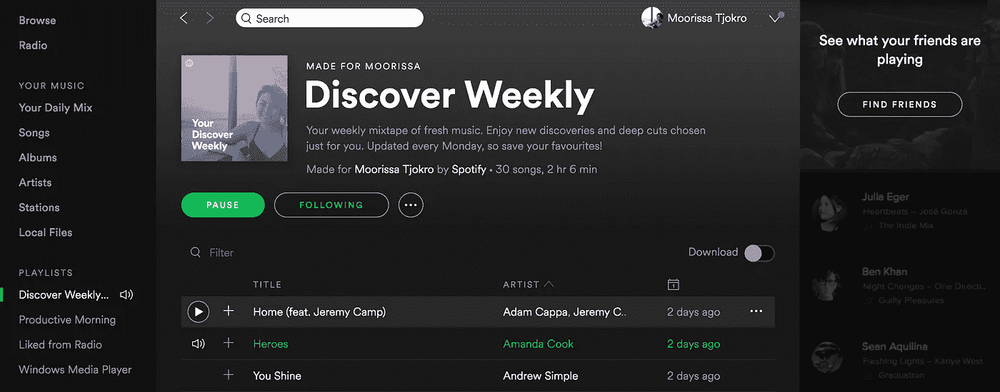
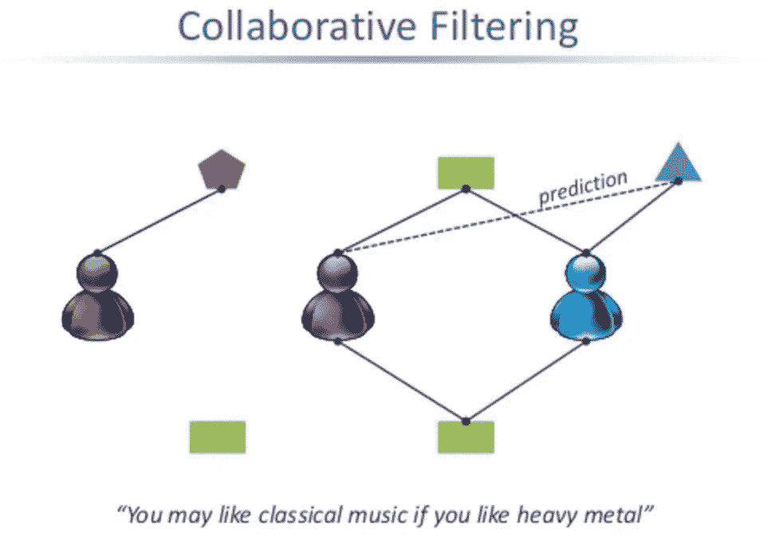
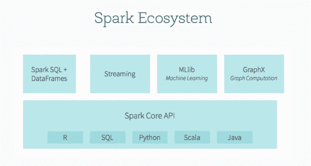
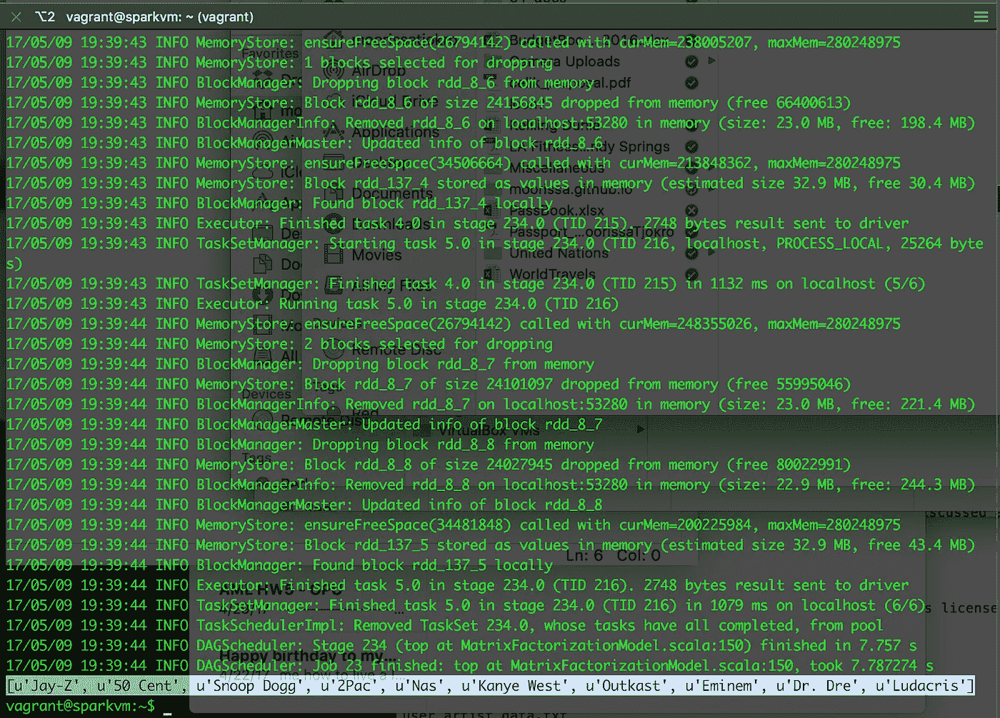

# 用 Spark 打造 Spotify 的“发现周刊”

> 原文：<https://towardsdatascience.com/building-spotifys-discover-weekly-with-spark-4370d5d0df2f?source=collection_archive---------1----------------------->



## 基于协同过滤算法的音频推荐系统的 MLlib & PySpark 实现

今天是我在 [NBC Universal](https://en.wikipedia.org/wiki/NBCUniversal) 实习的第三天，我受到鼓舞要实现一个新的目标:在今年夏天离开[30 Rock](https://en.wikipedia.org/wiki/30_Rockefeller_Plaza)&[1221 Campus](https://en.wikipedia.org/wiki/1221_Avenue_of_the_Americas)(我将在那里工作大部分时间)之前掌握 [Spark](https://spark.apache.org/) 。

作为领先的媒体和娱乐行业，我们公司拥有数百 Pb 来自全国各地和通过国际有线电视的电视广播数据。虽然这听起来令人惊讶和不知所措，但毫无疑问，现在越来越多的公司依靠推荐系统的力量来满足各种个人品味和需求，从而提高客户的满意度和忠诚度。

在娱乐行业，Spotify 等音乐科技巨头将推荐引擎作为其产品的重要组成部分。涉及用户兴趣的模式检测和分析在提供个性化推荐方面发挥了关键作用。这是因为给用户体验添加另一个维度有助于推荐系统在识别我们不知道自己会喜欢的曲目方面做得非常出色。

# 用什么算法？

让我从我们可以用来构建音频推荐系统的两种主要方法开始。第一个是 ***内容过滤*** ，利用产品和用户的已知信息进行推荐。使用这种方法，我们根据*产品*(例如电影信息、价格信息和产品描述)和*用户*(例如人口统计和问卷信息)创建档案。

实施内容过滤的一个广为人知的例子是在线电台 Pandora 的音乐基因组计划。在这里，一个专家根据上百个特征给一首歌打分。用户还提供关于他/她的音乐偏好的信息。基于这两个源的配对提出建议。



潘多拉使用内容过滤，Spotify 使用 ***协同过滤*** 用于他们的[发现周刊](https://www.spotify.com/us/discoverweekly/)推荐系统。后一种技术使用先前用户的输入/行为来做出未来的推荐。我们忽略任何先验的用户或对象信息。我们使用相似用户的评分来预测评分。

进一步理解 Spotify 技术的一种方式是通过一种基于*邻居的*方法，在这种方法中，你(1)首先根据我们的重叠评分的一致程度来定义你和其他用户之间的相似性评分，然后(2)让其他人根据这些评分来投票决定你喜欢什么。

> 与内容过滤相比，协作过滤的一个主要吸引力在于其不受领域限制的方法，这意味着它不需要知道什么被评级，只需要知道谁对什么进行了评级，以及评级是什么。

注意两种方法并不互相排斥。*内容信息*也可以内置到*协同过滤*系统中，提高性能。现在我们已经了解了算法是如何工作的，让我们来了解一下我们将用来构建推荐系统的技术— *Spark。*

# 为什么是火花？

Apache Spark 是一个快速通用的集群计算系统。随着行业开发出更具创意、基于客户的产品和服务，对机器学习算法的需求变得更加重要，以帮助开发个性化、推荐和预测性见解。

像 R 和 Python 这样的工具长期以来被用来执行各种机器学习活动。然而，随着信息的大量增长，计算效率对于帮助解决高时间和空间复杂性变得非常关键。

此外，Spark 为数据工程师和数据科学家提供了一个强大的统一引擎，它不仅速度快([比 Hadoop 快 100 倍，用于大规模数据处理](https://databricks.com/blog/2014/11/05/spark-officially-sets-a-new-record-in-large-scale-sorting.html))且易于使用，而且简单、高度可扩展，并可与其他工具有效集成，如 R、SQL、Python、Scala 和 Java。



Source: *Infoworld Analytics*

我最喜欢 Spark 的一点是，它能够帮助我们数据科学家解决高度复杂的机器学习问题，涉及图形计算、流和以互动方式在更大规模上进行实时互动查询处理。

# 使用 PySpark 的逐步实现

我们现在将使用 *AudioScribbler 数据集*实现协同过滤算法来构建音频推荐系统(在这里下载压缩档案[)。](http://www-etud.iro.umontreal.ca/~bergstrj/audioscrobbler_data.html)

## 导入库和数据集

一旦数据集中有了三个文件，就可以启动`spark-shell`。构建模型的第一步是理解您的数据，并将其解析成对 Spark 中的分析有用的形式。让我们从导入库和初始化您的`SparkContext`开始用 PySpark 编码。

```
import findspark
import pyspark
from pyspark import SparkContext
from pyspark import SparkConf
from pyspark.mllib import recommendation
from pyspark.mllib.recommendation import ***'''initialize spark in VM'''**findspark.init('/usr/local/bin/spark-1.3.1-bin-hadoop2.6/')
try:
    sc=SparkContext()
except:
    None
```

接下来，将每个文件存储到一个变量中。 *user_artist_data.txt* 表示一个播放列表数据集，其中文件的每一行都包含一个用户 ID、一个艺术家 ID 和一个播放次数，用空格分隔。 *artist_data.txt* 包含与艺术家姓名相关联的不透明数字 id。 *artist_alias.txt* 将可能拼写错误或不标准的艺术家 ID 映射到艺术家规范名称的 ID。它每行包含两个 id，用制表符分隔。

```
**'''define variables'''**rawUserArtistData = sc.textFile("vagrant/user_artist_data.txt")
rawArtistData = sc.textFile("vagrant/artist_data.txt")
rawArtistAlias = sc.textFile("vagrant/artist_alias.txt")
```

## 预处理数据

我们希望获得原始艺术家数据的列表，每个 ID 和名称都存储在元组中。让我们使用 *artist_data.txt* 来创建这个列表。

```
def pairsplit(singlePair):
    splitPair = singlePair.rsplit('\t')
    if len(splitPair) != 2:
        return []
    else:
        try:
            return [(int(splitPair[0]), splitPair[1])]
        except:
            return []
artistByID = dict(rawArtistData.flatMap(lambda x: pairsplit(x)).collect())
```

我们还使用 *artist_alias.txt* 将“坏的”艺术家 id 映射到“好的”艺术家 id，而不仅仅是将其用作艺术家 id 的原始数据对。我们使用下面的代码将坏的 id 转换成好的 id。例如，第一个条目将 ID 6803336 映射到 1000010，这意味着它将“Aerosmith(不插电)”映射到“Aerosmith”。

```
def aliaslookup(alias):
    splitPair = alias.rsplit('\t')
    if len(splitPair) != 2:
        return []
    else:
        try:
            return [(int(splitPair[0]), int(splitPair[1]))]
        except:
            return []
artistAlias = rawArtistAlias.flatMap(lambda x: aliaslookup(x)).collectAsMap()
```

## 建立一个模型

然后，我们创建一个查找函数，将数据转换成评级对象。请注意，任何潜在的 *MLlib* 模型都需要产品作为客观的衡量标准。在我们的模型中，产品是艺术家。因此，我们将使用 *user_artist_data.txt* 来实现我们的火车数据。

```
def ratinglookup(x):
    userID, artistID, count = map(lambda line: int(line), x.split())
    finalArtistID = bArtistAlias.value.get(artistID)
    if finalArtistID is None:
        finalArtistID = artistID
    return Rating(userID, finalArtistID, count)trainData = rawUserArtistData.map(lambda x: ratinglookup(x))
trainData.cache()
```

我们还为`artistAlias`创建了一个名为`bArtistAlias`的广播变量。这使得 Spark 只为集群中的每个执行器发送并在内存中保存一个副本。当有数千个任务，并且许多任务在每个执行器上并行执行时，这可以节省大量的网络流量和内存。

```
bArtistAlias = sc.broadcast(artistAlias)
```

最后，我们使用*协同过滤*算法建立我们的模型，如下所示。该操作可能需要几分钟或更长时间，具体取决于您的群集。我花了大约 15 分钟来运行这个模型。

```
**'''build model'''**model = ALS.trainImplicit(trainData, 10, 5)
```

我们应该首先通过检查一个用户、他或她的戏剧以及对该用户的推荐，来看看艺术家的推荐是否有任何直观的意义。以用户`2093760`为例。提取这个用户听过的艺术家的 id 并打印他们的名字。这意味着在输入中搜索该用户的艺术家 id，然后根据这些 id 过滤艺术家集，以便您可以按顺序收集和打印姓名:

```
**'''test artist'''**spotcheckingID = 2093760
bArtistByID = sc.broadcast(artistByID)rawArtistsForUser = (trainData
                  .filter(lambda x: x.user == spotcheckingID)
                  .map(lambda x: bArtistByID.value.get(x.product))
                  .collect())
print(rawArtistsForUser)
```

## 获得您的推荐

我想根据我的数据模型选出前 10 首歌曲:

```
**'''output recommendations'''**recommendations = map(lambda x: artistByID.get(x.product), model.call("recommendProducts", spotcheckingID, **10**))
print(recommendations)
```

在我的 *Spark VM* 集群上运行这个程序，我得到了以下输出:

*   *Jay Z、50 Cent、Snoop Dogg、2Pac、Nas、Kanye West、Outkast、Eminem、德瑞医生和卢达克里斯。*



A screenshot of my model output. Note that your top 10 listed songs can be in random order.

是的，这些艺术家看起来像说唱歌手的混合体！请记住，这组艺术家在 2005 年非常受欢迎，这是这个数据集被提取的年份。

**可能的下一步？**我们可以使用另一组可用的歌曲数据提取一组推荐的歌曲，并根据我们的顶级艺术家对它们进行查询。

希望你喜欢和快乐的黑客！

# 编码参考

你可以在这里找到我的原始代码:[https://github.com/moorissa/audiorecommender](https://github.com/moorissa/audiorecommender)

Moorissa 是一名研究生，目前在哥伦比亚大学学习机器学习，希望有一天她可以利用这些技能让世界变得更好，一次一天。