# 使用 USB 摄像头和无线连接的 Raspberry Pi 构建监控系统

> 原文：<https://towardsdatascience.com/building-surveillance-system-using-usb-camera-and-wireless-connected-raspberry-pi-1038e41f8a56?source=collection_archive---------9----------------------->

本教程讨论使用插入 Raspberry Pi (RPi)的 USB 摄像头构建监控系统，该摄像头通过无线接口连接到 PC。PyGame 用于访问摄像机和捕捉存储在 RPisd 卡中的图像。为场景创建背景模型，以发现默认状态的变化。一个连接到 GPIO 引脚的简单电路点亮一个 led 来指示这种状态。

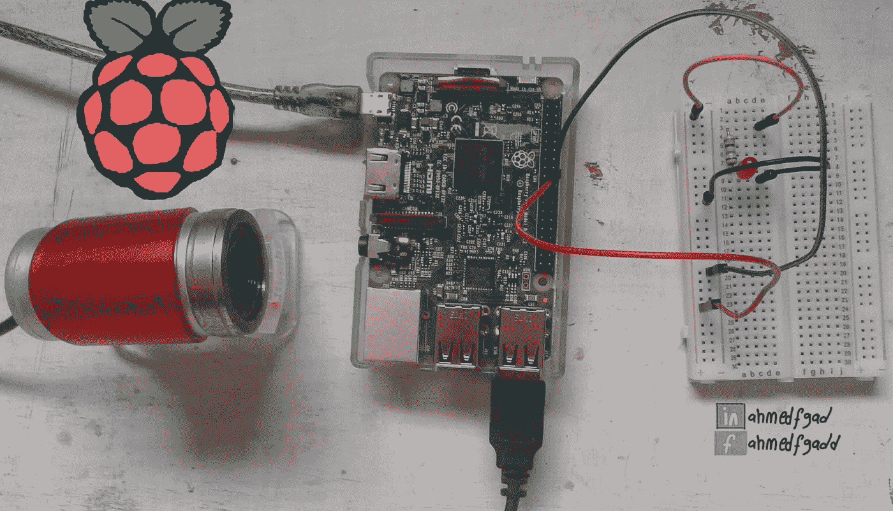

Cover image by Ahmed Fawzy Gad. Building Surveillance System using USB Camera and Wireless-Connected Raspberry Pi

该教程包含以下步骤:

1.  使用无线接口将 RPi 连接到 PC。
2.  将 USB 摄像头连接到 RPi。
3.  使用 **PyGame** 捕捉图像。
4.  建立背景模型。
5.  检测背景模型的变化。
6.  构建一个简单的电路，当发生变化时点亮 led。

本教程假设读者有一台连接到无线网络的 PC 和一台使用以太网接口连接到交换机的 RPi。要做这样的工作，请阅读题为“**构建一个运行在 Raspberry Pi** 上的图像分类器”的教程，该教程可从以下链接获得:

[https://www . LinkedIn . com/pulse/building-image-classifier-running-raspberry-pi-Ahmed-gad](https://www.linkedin.com/pulse/building-image-classifier-running-raspberry-pi-ahmed-gad)

您应该能够使用“Advanced IP Scanner”等软件知道设备的 IP 地址，并熟悉使用 MobaXterm 软件建立 SSH 连接。之后，我们就可以开始讨论上面的每一个步骤了。

# 1.使用无线接口将 RPi 连接到 PC

在之前的教程“**构建运行在 Raspberry Pi** 上的图像分类器”中，我们构建了一个连接了三个设备的网络，这三个设备分别是 RPi、交换机和 PC。RPI 使用以太网接口连接到交换机，但 PC 使用无线接口连接到交换机。在本教程中，我们将通过使用 RPi 的无线接口连接到交换机来修改此类网络。这使得网络完全无线连接，避免了有线的限制。

RPi 的无线接口需要配置才能使用。因此，我们仍将使用通过以太网接口建立的连接来配置无线接口。通过在交换机中使用 DHCP，RPi 以太网接口将获得一个 IPv4 地址。这样的地址可以用于建立安全外壳(SSH)连接。关于建立连接的更多细节，可以参考前面的教程。

在使用 MobaXterm 创建的 SSH 会话中，我们可以使用终端命令或 Raspbian 操作系统的 GUI 开始配置无线接口。两种方法都很简单。

使用终端命令，我们将首先扫描可用的无线网络，找到它们的服务集标识符(SSIDs)。这是使用以下命令完成的:

```
**pi@raspberrypi:~ $ sudo iwlist wlan0 scan**
```

下图给出了该命令输出的前几行。目标无线网络的 SSID 为“ **TEData_864A** ”。请注意，您不必使用交换机将 PC 连接到 RPi。使用智能手机，我们可以创建一个接入点来连接它们。

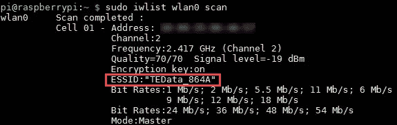

知道目标网络的 SSID 后，我们可以使用它来配置无线接口。这种配置存在于一个文件中，可以使用以下命令访问该文件:

```
**pi@raspberrypi:~ $ sudo nano /etc/wpa_supplicant/wpa_supplicant.conf**
```

文件将在终端中打开。使用向下箭头，返回到文件的末尾，写入网络配置。这是通过按如下方式写入网络的 SSID 和密码实现的:

```
**network={
ssid=”TEData_864A”
psk=”YOUR_NETWOK_PASSWORD”
}**
```

之后，按 CTRL+X 退出文件，然后按 Y 保存更改。对于我的例子，我配置了两个网络，因此文件内容有两个配置的网络，如下图所示。

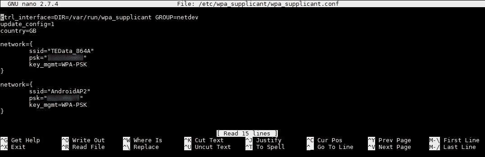

您可能需要将无线接口的状态从“打开”更改为“关闭”,然后再次将其更改为“打开”,以应用此类配置。这是使用这两个命令完成的:

```
**pi@raspberry:~ $ sudo ifdown wlan0
pi@raspberry:~ $ sudo ifup wlan0**
```

要检查无线接口配置是否正确，输入“ **ifconfig** 命令检索接口的配置。

```
**pi@raspberry:~ $ ifconfig**
```

根据此命令的输出，无线接口的 IPv4 地址为 192.168.1.8。这就是如何使用终端命令配置无线连接。

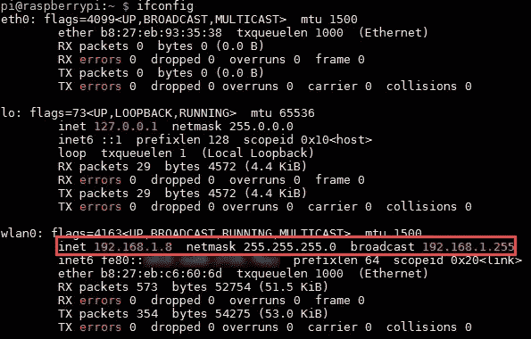

我们可以使用操作系统的 GUI 做同样的事情，可以使用 **startlxde** 终端命令访问该 GUI。GUI 打开后，在操作系统栏的右侧会出现一个网络连接图标。点击它将打开一个可用无线网络的菜单，如下图所示。单击任何一项都会打开一个窗口，允许您输入密码。通过输入 SSID 为" **TEData_864A** 的网络密码，并输入" **ifconfig** "命令，结果将与上图所示相同。

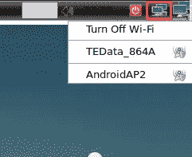

此时，我们已经将 PC 和 RPi 无线连接到交换机。当前网络如下图所示。我们现在可以删除以太网连接，只使用 RPi 和交换机之间的无线连接。

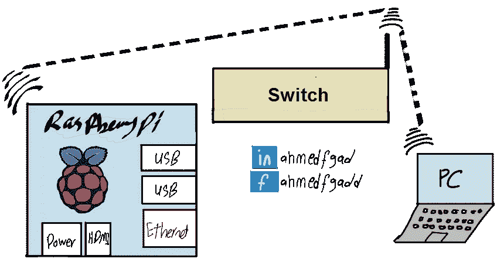

# 2.将 USB 摄像头连接到 RPi

RPi 有自己的摄像头模块可以使用。与其买这个模块，对很多人来说可能很贵，我们可以只使用一个 USB 摄像头，它可能在任何地方都可以以更低的成本买到。这种相机的配置非常简单。只需将 USB 摄像头连接到 RPi 的一个 USB 端口。之后，我们可以通过使用“fswebcam”包捕捉图像来检查相机是否工作正常。首先，我们需要使用以下命令安装该软件包:

```
**pi@raspberry:~ $ sudo apt-get install fswebcam**
```

之后，我们可以用它来捕捉图像。一个非常基本的方法如下:

```
**pi@raspberry:~ $ sudo fswebcam test_image.jpg**
```

这将访问相机，捕捉图像，并以“test_image.jpg”的名称将其保存到 SD 卡的当前目录中。执行命令后的输出如下图所示。

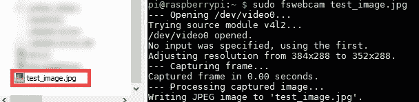

以下是捕捉到的图像:


# 3.使用 PyGame 捕捉图像

“ **fswebcam** ”包对于快速测试相机是否工作正常很有用。在确保它运行良好之后，我们可以开始构建一个 Python 脚本，使用 PyGame 库访问相机以连续捕捉图像。下面的代码使用 PyGame 来捕捉一个图像，打开一个窗口来显示这个图像，最后保存这个图像。

```
**import** pygame
 **import** pygame.camera

 *# Captured image dimensions. It should be less than or equal to the maximum dimensions acceptable by the camera.* width = 320
 height = 240

 *# Initializing PyGame and the camera.* pygame.init()
 pygame.camera.init()

 *# Specifying the camera to be used for capturing images. If there is a single camera, then it have the index 0.* cam = pygame.camera.Camera(**"/dev/video0"**,(width,height))

 *# Preparing a resizable window of the specified size for displaying the captured images.* window = pygame.display.set_mode((width,height),pygame.RESIZABLE)

 *# Starting the camera for capturing images.* cam.start()

 *# Capturing an image.* image = cam.get_image()

 *# Stopping the camera.* cam.stop()

 *# Displaying the image on the window starting from the top-left corner.* window.blit(image,(0,0))

 *# Refreshing the window.* pygame.display.update()

 *# Saving the captured image.* pygame.image.save(window,**'PyGame_image.jpg'**)
```

假设上面的代码保存在一个名为“ **im_cap.py** ”的 Python 文件中。要执行这样的代码，我们可以从终端发出以下命令:

```
**pi@raspberry:~ $ python3 im_cam.py**
```

这是执行该文件后显示的窗口。


我们可以修改前面的代码来捕获多个图像。例如，我们可以使用一个循环的**来捕捉一些先前指定的图像。我们也可以使用一个 **while** 循环，它并不局限于一些图像。下面是使用 **for** 循环捕获 2000 张图像的修改代码。**

```
**import** pygame

**import** pygame.camera

*# Captured image dimensions. It should be less than or equal to the maximum dimensions acceptable by the camera.* width = 320

height = 240

*# Initializing PyGame and the camera.* pygame.init()

pygame.camera.init()

*# Specifying the camera to be used for capturing images. If there is a single camera, then it has the index 0.* cam = pygame.camera.Camera(**"/dev/video0"**, (width, height))

*# Preparing a resizable window of the specified size for displaying the captured images.* window = pygame.display.set_mode((width, height), pygame.RESIZABLE)

*# Starting the camera for capturing images.* cam.start()

**for** im_num **in** range(0, 2000):

    **print**(**"Image : "**, im_num)

    *# Capturing an image.* image = cam.get_image()

    *# Displaying the image on the window starting from the top-left corner.* window.blit(image, (0, 0))

    *# Refreshing the window.* pygame.display.update()

    *# Saving the captured image.* pygame.image.save(window, **'./pygame_images/image_'** + str(im_num) + **'.jpg'**)

*# Stopping the camera.* cam.stop()
```

这里有 8 张捕捉到的图像。请注意，相机的位置发生了一点变化。

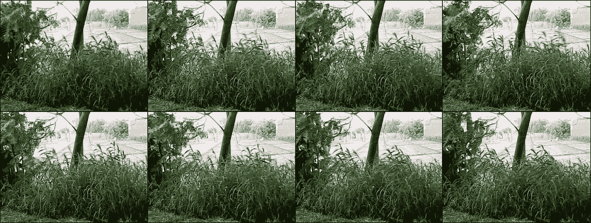

# 4.构建背景模型

到目前为止，我们成功地构建了一个简单的监控系统，在该系统中，摄像机捕获图像并保存在 RPi 的 SD 卡中。我们可以扩展它来自动检测场景的变化。这是通过为场景建立背景模型来实现的。对这种模型的任何改变都将表明一种改变。例如，如果有人正在穿过场景，将导致背景发生变化。

背景模型可以简单地通过将多个捕获的图像平均到其中没有任何对象的场景背景来创建。因为我们对颜色信息感兴趣，所以图像将被转换成二进制。下面是用于构建背景模型的 Python 代码。

```
**import** skimage.io

**import** os

**import** numpy

dir_files = os.listdir(**'./pygame_images/'**)bg_image = skimage.io.imread(fname=dir_files[0], as_grey=True)

**for** k **in** range(1, len(dir_files)):

    fname = dir_files[k]

    im = skimage.io.imread(fname=fname, as_grey=True)

    bg_image = bg_image + im

bg_image = bg_image/(len(dir_files))

bg_image_bin = bg_image > 0.5

skimage.io.imsave(fname=**'bg_model.jpg'**, arr=bg_image)

skimage.io.imsave(fname=**'bg_model_bin.jpg'**, arr=bg_image_bin*255)
```

这是平均 500 张图像后的背景模型，既有灰度也有二值。

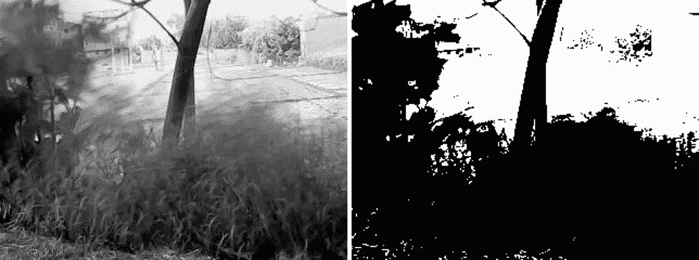

# 5.检测背景模型的变化

在建立背景模型之后，我们可以测试一张新的图像来检查背景是否有变化。只需将新图像转换成二进制即可。然后比较两幅图像中白色像素的数量。如果该数字超过给定的阈值，这表明背景发生了变化。阈值随着场景的不同而变化。下面是用于测试新图像的代码。

```
bg_num_ones = numpy.sum(bg_image_bin)test = skimage.io.imread(fname=**"./pygame_images/image_800.jpg"**, 

                         as_grey=True)

test_bin = test > 0.5

test_num_ones = numpy.sum(test_bin)

**print**(**"Num 1s in BG   :"**, bg_num_ones)

**print**(**"Num 1s in Test :"**, test_num_ones)

**if**(abs(test_num_ones-bg_num_ones) < 5000):

    **print**(**"Change."**)
```

这是一个彩色、灰度和二进制的测试图像，由于场景中出现了一个物体(人),因此背景发生了变化。


# 6.构建一个简单的电路，当发生变化时点亮 Led

作为对背景模型变化的指示，我们可以建立一个简单的电路，当发生变化时，led 就会发光。该电路将连接到 RPi 的 GPIO(通用输入输出)箱。该电路需要以下元件:

*   一块试验板。
*   一个 led。
*   一个电阻器(大于或等于 100 欧姆)。我使用 178.8 欧姆的电阻。
*   两根公/公跳线。
*   两根公/母跳线。

建议在将电路连接到 GPIO 引脚之前对其进行测试。这是因为如果电阻值选择不当，不仅会烧坏 led，还会损坏 GPIO 引脚。为了进行测试，我们需要一个电池为试验板供电。这是正确连接所有组件后的电路。

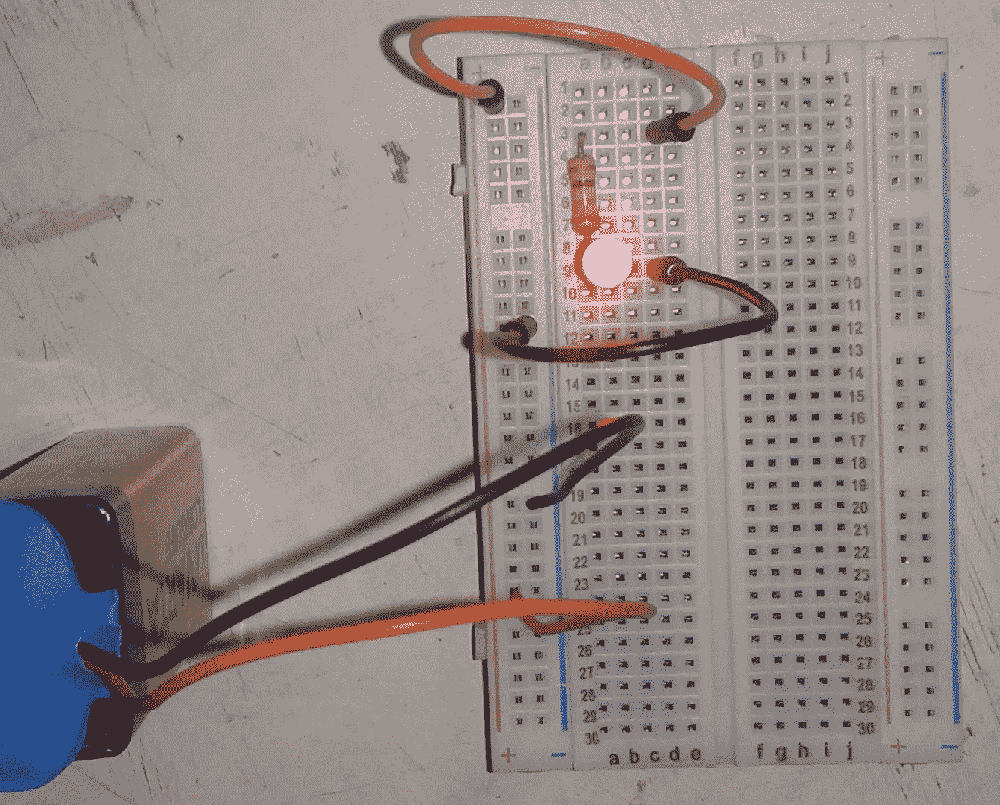

之后，我们可以取下电池，将试验板连接到 RPi 的 GPIO 引脚。根据 GPIO 引脚的试验板编号，接地连接到 20 号箱，高压连接到 22 号输出箱。下图说明了试验板和 RPi 之间的连接。RPi 还连接到充电器和 USB 摄像头。

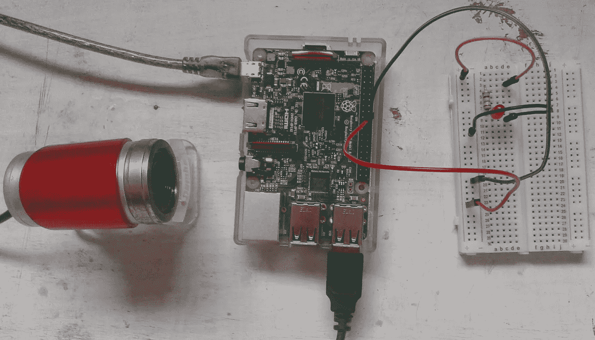

使用下面给出的 Python 脚本控制输出 GPIO bin。其默认状态为低电平，表示 led 关闭。当背景发生变化时，状态将变为 HIGH，表示 led 打开。led 保持亮起 0.1 秒，然后其状态恢复为熄灭。当另一个输入图像不同于背景时，led 将重新打开 0.1 秒。

```
**import** time
 **import** RPi.GPIO
 **import** skimage.io
 **import** numpy
 **import** os
 **import** pygame.camera
 **import** pygame

 *#####GPIO#####
 # Initializing the GPIO pins. The numbering using is board.* RPi.GPIO.setmode(RPi.GPIO.BOARD)

 *# Configuring the GPIO bin number 22 to be an output bin.* RPi.GPIO.setup(22, RPi.GPIO.OUT)

 *#####PyGame#####
 # Initializing PyGame and the camera.* pygame.init()
 pygame.camera.init()

 *# Captured image dimensions. It should be less than or equal to the maximum dimensions acceptable by the camera.* width = 320
 height = 240

 *# Preparing a resizable window of the specified size for displaying the captured images.* window = pygame.display.set_mode((width, height), pygame.RESIZABLE)

 *# Specifying the camera source and the image dimensions.* cam = pygame.camera.Camera(**"/dev/video0"**,(width,height))
 cam.start()

 *#####Background Model#####
 # Reading the background model.* bg_image = skimage.io.imread(fname=**'bg_model_bin.jpg'**, as_grey=True)
 bg_image_bin = bg_image > 0.5
 bg_num_ones = numpy.sum(bg_image_bin)

 im_dir = **'/home/pi/pygame_images/'

 for** im_num **in** range(0, 2000):
     **print**(**"Image : "**, im_num)

     im = cam.get_image()

     *# Displaying the image on the window starting from the top-left corner.* window.blit(im, (0, 0))

     *# Refreshing the window.* pygame.display.update()

     pygame.image.save(window, im_dir+**'image'**+str(im_num)+**'.jpg'**)
     im = pygame.surfarray.array3d(window)

     test_bin = im > 0.5
     test_num_ones = numpy.sum(test_bin)

     *# Checking if there is a change in the test image.* **if** (abs(test_num_ones - bg_num_ones) < 5000):
         **print**(**"Change."**)
         **try**:
             RPi.GPIO.output(22, RPi.GPIO.HIGH)
             time.sleep(0.1)
             RPi.GPIO.output(22, RPi.GPIO.LOW)
         **except** KeyboardInterrupt:  *# CTRL+C* **print**(**"Keyboard Interrupt."**)
         **except**:
             **print**(**"Error occurred."**)

 *# Stopping the camera.* cam.stop()

 *# cleanup all GPIO pins.* **print**(**"Clean Up GPIO."**)
 RPi.GPIO.cleanup()
```

下图显示了由于人的存在而不同于背景图像的一个输入图像。因此，led 将打开 0.1 秒。

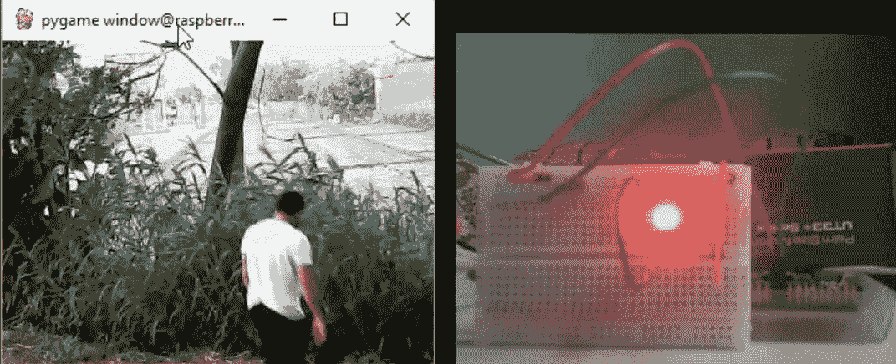

以下视频([https://youtu.be/WOUG-vjg3A4](https://youtu.be/WOUG-vjg3A4))显示了使用相机拍摄的多帧的 led 状态。根据所使用的阈值，当输入图像不同于背景模型时，led 被打开。

# 了解更多详情

**Ahmed Fawzy Gad，《构建运行在 Raspberry Pi 上的图像分类器》，2018 年 9 月，**[https://www . LinkedIn . com/pulse/Building-Image-Classifier-Running-Raspberry-Pi-Ahmed-Gad](https://www.linkedin.com/pulse/building-image-classifier-running-raspberry-pi-ahmed-gad)

# 联系作者

*   电子邮件:【ahmed.f.gad@gmail.com 
*   领英:[https://linkedin.com/in/ahmedfgad/](https://linkedin.com/in/ahmedfgad/)
*   https://kdnuggets.com/author/ahmed-gad
*   YouTube:[http://youtube.com/AhmedGadFCIT](http://youtube.com/AhmedGadFCIT)
*   走向科学:[https://towardsdatascience.com/@ahmedfgad](https://towardsdatascience.com/@ahmedfgad)