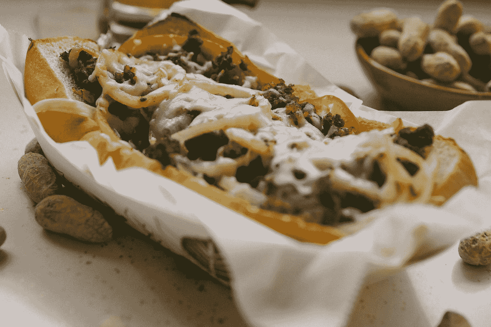
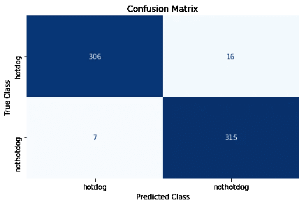

# 从 HBO 的硅谷建立热狗/非热狗分类器

> 原文：<https://towardsdatascience.com/building-the-hotdog-not-hotdog-classifier-from-hbos-silicon-valley-c0cb2317711f?source=collection_archive---------4----------------------->

Photo by [Fancycrave](https://unsplash.com/@fancycrave?utm_source=medium&utm_medium=referral) on [Unsplash](https://unsplash.com?utm_source=medium&utm_medium=referral)

自从我在 HBO 的硅谷看了由[百搭应用开发者](https://www.hbo.com/silicon-valley/cast-and-crew/jian-yang) Jian-Yang 创建的[热狗/非热狗应用](https://youtu.be/ACmydtFDTGs)，我就想创建它。现在终于，我有了！但由于我缺乏应用程序开发技能，我只创建了应用程序将使用的机器学习分类器。尽管如此，创造这个应用程序的大脑还是很酷的。此外，这是一个非常酷的数据科学项目。所以，下面是我的经验。

**注:** *找到朱庇特笔记本* [*这里*](https://github.com/J-Yash/Hotdog-Not-Hotdog) *。*

> “这不是魔法。是天赋和汗水。”吉尔福伊尔

# 没有数据学不了

任何数据科学或机器学习或深度学习或人工智能项目的第一步都是获取数据。你可以创建最复杂的算法，并在最疯狂的 GPU 或 TPU 上运行你的 ML 模型，但如果你的数据不够好，那么你将无法在 ML 任务上取得任何进展。所以，首先是获取数据。

> ImageNet 来拯救我们了！

我用了 [ImageNet](http://image-net.org/) 网站来获取数据。至于热狗，我搜索了“热狗”、“法兰克福香肠”和“辣热狗”。至于“不是热狗”部分，我搜索了“宠物”、“家具”、“人”和“食物”。选择这些照片的原因是，这些是人们在使用这种应用程序时最有可能拍摄的照片。

我使用了一个小脚本从 ImageNet 下载所有这些图像，并删除无效/损坏的图像。然后，我翻遍了所有的图片，手动删除了破碎的和不相关的图片。最后，我有 1822 张热狗的图片和 1822 张“不是热狗”的图片。

**注意:** *我有超过 3000 张“不是热狗”的图片，但我随机选择了其中的 1822 张，以平衡这两个类别。*

现在，我有了创建这个分类器所需的所有数据。

# 让数据更好

下一步是让数据更好。首先，我编写了一个小脚本，将所有图像的大小调整为 299x299 分辨率，这样所有图像的大小都相同，我在加载这些图像时就不会遇到各种不兼容问题。

在目录中正确组织数据也很重要。我按照以下方式组织数据:

**数据集— > (train — > (hotdog，nothotdog)，测试— > (hotdog，nothotdog)，有效— > (hotdog，nothotdog))**

以这种方式构建数据集的原因是，当我们在 Keras 中加载数据时，Keras 要求数据是这种方式。

# 第一次迭代——创建一个基本的 ConV 模型

在第一次迭代中，我创建了一个简单的卷积模型，有两个 ConV 层和三个全连接层。我没有将整个图像数据集加载到内存(numpy 数组)中，而是使用 Keras 生成器在运行时批量加载图像。我还在 keras 中使用了`ImageDataGenerator`类来批量扩充运行时的数据。

该模型用 50 个历元训练约 50 分钟，在测试集上给出了 71.09%的准确率。

对于如此简单的任务来说，这是相当低的精确度。我的意思是，人类完成这项任务的准确率必须达到 100%。

这引起了我的思考，我决定在迭代#2 中更进一步。

# 第二次迭代——迁移学习

我决定用迁移学习让这个分类器更好更快的训练。现在，我无法实时扩充数据，因为迁移学习在 Keras 中不支持。因此，我编写了一个脚本来扩充数据并创建一个更好的数据集。我应用了以下转换:

1.  水平翻转
2.  垂直翻转
3.  以一定角度旋转图像
4.  剪切和缩放图像

这种数据扩充导致了数据集版本 2.0，其具有 7822 个热狗图像和 7822 个“非热狗”图像。这是一个大得多的数据集，所以我预计分类器的准确性会有所提高。现在，实际上**获得新数据**比**应用数据增强**要好得多，正如[*deep learning . ai*](https://www.deeplearning.ai/)课程中*吴恩达*所教导的那样，但由于前者不是一个选择，数据增强至少可以使**在分类器方面有所改进**。

现在我有了一个相对更大更好的数据集，是时候开始 ***了！***

不，不是克里斯托弗·诺兰写的那本。

我决定使用 InceptionNet V3，因为它提供了比 VGGNet 和 ResNet50 更好的结果。Keras 提供了一个`Application`模块，可以很容易地使用这些预先训练好的架构。于是，我下载了预先训练好的 InceptionV3 模型和权重，然后在这个模型上训练数据集，得到数据集的瓶颈特征。这基本上是通过从 InceptionNet 中移除完全连接的层并仅在 ConV 层上训练数据来实现的。这个过程将我们的原始图像转换成矢量。

现在我们创建一个简单的 ConV 模型(与迭代#1 中的相同),并在这些瓶颈特性上训练它。该模型训练时间约为 5 分钟，在测试集上的准确率为 96.42%。对于如此少的数据来说，这是一个相当好的精度。由于准确性并不总是衡量模型性能的最佳指标，我创建了一个混淆矩阵。

Confusion Plot

看那些被错误分类的图片，很多被分类器错误分类为“不是热狗”的图片并没有很好的看到热狗。或者吃的不仅仅是热狗。虽然，为什么它把一群人归类为热狗是一个谜，我希望有一天能解决！

## 等等，我们刚刚做了什么？

1.  我们从一个电视节目中获得了一个想法，并决定使用这个想法来完成整个 ML 流程。
2.  首先，我们收集数据，因为这是我们 ML 模型的动力。在这种情况下，我们得到了热狗和其他一些不是热狗的东西的图像。
3.  我们做了一些数据预处理，删除了破损/无用的图像，并将所有图像调整到相同的大小。
4.  我们创建了一个简单的 ConV 模型，并使用实时数据增强。我们得到的结果并没有给我们留下太多印象。因此，为了追求快乐和更好的准确性，我们决定更进一步。
5.  我们使用迁移学习来获得更好的结果。从预先训练好的网络花名册中，我们选择了 InceptionV3 网络，得到了瓶颈特征。
6.  我们在这些瓶颈特征上训练了一个类似于第一个网络的网络，并且获得了更好的准确性。
7.  我们绘制了一些指标，如损失、准确性和混淆矩阵，因为图表很酷，也很有用。
8.  我们坐下来，对我们最近的成就微笑，并开始思考下一步要做什么。

原来如此。我创造了一个很好的分类器来告诉我某样东西是不是热狗。正如杨健认为的那样，这是下一个价值 10 亿美元的想法！

> “真令人陶醉。别装得一点都不神奇。确实是！”—贾里德

*这个项目是我正在进行的#100DaysofMLCode 挑战的一部分。关注我在* [*推特*](http://twitter.com/iamjyash) *上的更新。*