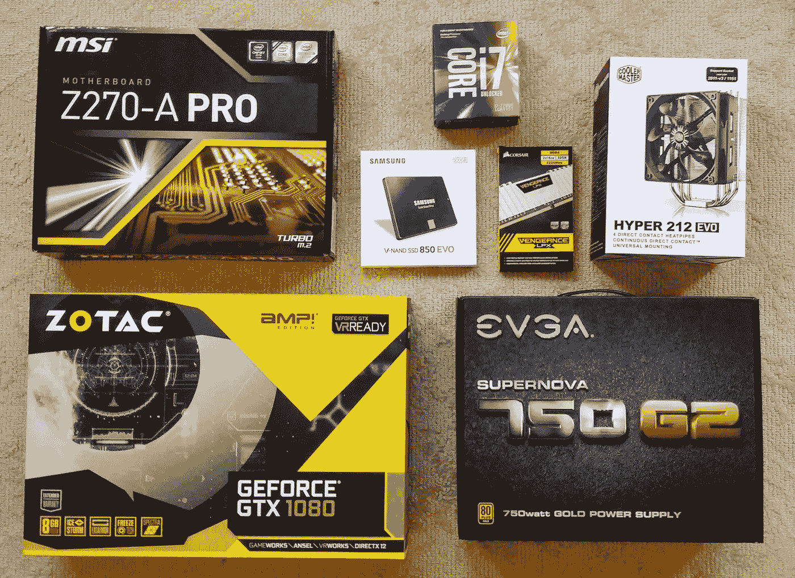
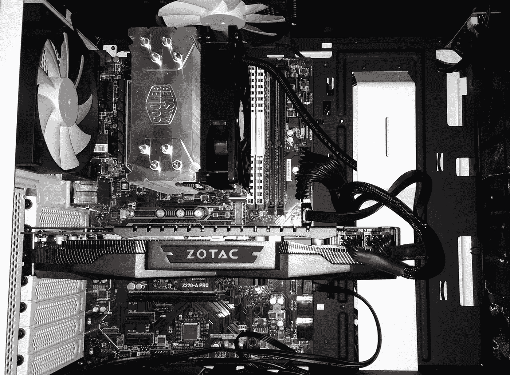
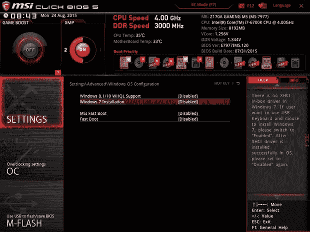
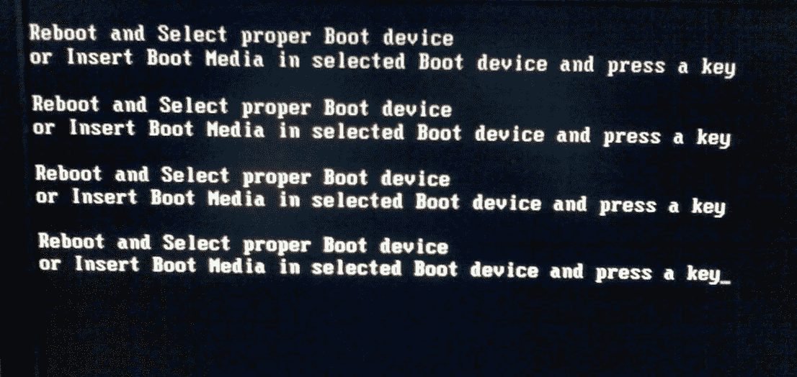
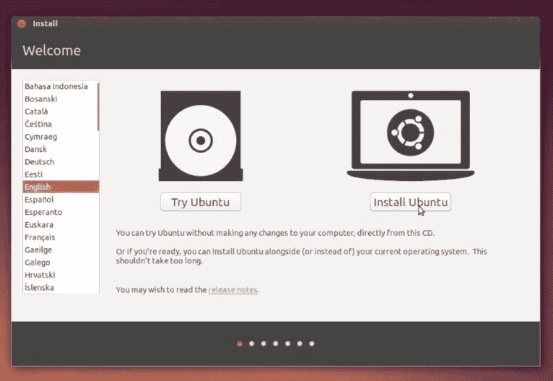
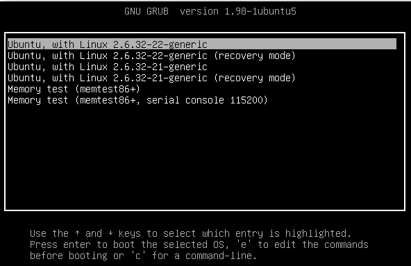
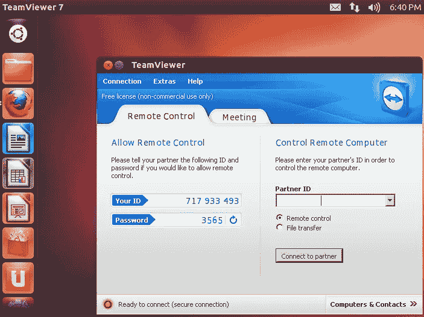

# 打造自己的深度学习盒子

> 原文：<https://towardsdatascience.com/building-your-own-deep-learning-box-47b918aea1eb?source=collection_archive---------0----------------------->

## 通往我的第一个深度学习平台的崎岖之路



Primary parts for building a deep learning machine

在完成杰瑞米·霍华德令人敬畏的深度学习课程的第一部分后，我看了看我的 AWS 账单，发现我每月花费近 200 美元运行 GPU。没必要花那么多钱来完成他的课程，但我开始平行研究一些课外数据集，我渴望得到结果。

在与同学交谈并阅读了一些博客帖子后，我决定尝试构建自己的盒子。技术和硬件变化如此之快，我担心 post 的大部分内容很快就会过时，但我希望我的一般方法至少在一段时间内仍然有用。

## 构建盒子的 6 个步骤

1.选择零件
2。组装五金件
3。安装操作系统
4。安装驱动器
5。安装库
6。设置远程访问

# 1.选择零件


我首先阅读了一些博客，以获得当前关于购买哪些部件的共识。由于硬件变化如此之快，到时候我会让你研究具体的部件，但一般来说你需要找到以下组件:主板，CPU，内存(RAM)，硬盘(SSD)，显卡(GPU)，CPU 冷却器，电源和外壳。

我强烈建议在购买前在 pcpartpicker.com 上创建一个零件清单。它们有一个“兼容性检查”功能，可以告诉你你的组件是否不兼容。你可以在这里找到我的列表。

## 零件目录表

> ***CPU****—***英特尔 i7 7700k 4.2GHz 四核****RAM****—海盗船复仇**LPX 32GB(2x 16)DDR 4–3200**276*版****主板*** *—微星 Z270-A PRO ATX LGA 1151
> ***酷派*** *—酷派大师 Hyper 212 EVO 82.9 CFM****

*我决定从一个显卡(单个 GPU)开始，但我确保 MSI 板有一个额外的 PCIe 插槽，以便我可以在未来添加另一个卡。**更新(2017 年 5 月)**:原来微星 Z270-A PRO 有 1 个 x16e PCIe 插槽，不是 2 个。它可以在 x4e 插槽中容纳一个额外的 GPU，但性能会受到限制。如果你打算使用多个 GPU，就不要买这个！*

*一般来说，我会选择顾客评论最多的零件，即使这些评论并不完美。零件越受欢迎，用户生成操作指南和提示的可能性就越大。这将为您在接下来的两步中省去许多痛苦。*

## *有用的帖子*

*[打造个人深度学习钻机](http://guanghan.info/blog/en/my-works/building-our-personal-deep-learning-rig-gtx-1080-ubuntu-16-04-cuda-8-0rc-cudnn-7-tensorflowmxnetcaffedarknet/)
优化入门 CUDA 打造
[打造深度学习梦想机器](http://graphific.github.io/posts/building-a-deep-learning-dream-machine/)
[深度学习硬件指南](http://timdettmers.com/2015/03/09/deep-learning-hardware-guide/)*

# *2.组装硬件*

*现在是有趣的部分。我能够找到大多数部件的教学视频，但有几个我不得不根据类似安装的视频进行修改。MSI 板、CoolMaster 和 NZXT 外壳的说明手册很不错，但我必须用其他材料补充它们。以下是一些我觉得有用的视频:*

## ***学习***

*   *买一把好的螺丝刀——我有一把不好的螺丝刀，它很快让我陷入困境。帮你自己一个忙，买一个长颈的，这样你就可以伸进狭小的空间。*
*   ***再用力点** —免责声明:如果你弄坏了什么东西，不要怪我，但至少在两个场合(CPU 和内存)我浪费了时间，因为我对部件太温柔了。我害怕太用力，所以如果零件不容易到位，我就放弃了。在内存方面，我几乎在亚马逊上购买了一套全新的芯片。两种情况下的解决方法都是更用力。*
*   ***了解您的 BIOS—**BIOS 是预装在主板上的一个小软件，在您第一次启动机器时弹出。它基本上是一个控制面板，用于配置硬件和启动操作系统。了解您的主板在哪里寻找“引导驱动器”(保存您的操作系统的 USB 或 SSD)以及它如何选择要使用的显卡非常重要。令人遗憾的是，MSI 手册在这些问题上含糊不清，但有一些很好的[视频](https://www.youtube.com/watch?v=C6mQqlmL5Sc)深入到了细节中。*
*   ***你的显示器没坏—** 我花了一段时间才想出如何让显示器与我的新盒子配合使用。我在某处读到过，最初你需要将显示器连接到主板上，因为没有 Nvidia 驱动程序，显卡就无法工作。当我终于启动，但是我看不到任何东西在显示器上。我试着连接显卡，只是为了好玩，但也不起作用。最后，我尝试完全移除显卡，连接回主板并重启。成功了！问题是，微星主板默认使用自己的显卡，只有当它在 PCIe 插槽中找不到任何外部卡时。因为我第一次尝试启动时连接了显卡，所以主板尝试使用我的新卡。我没有看到任何东西，因为 Nvidia 驱动程序没有安装！*

*终于，我的杰作完成了！*

****

# *3.安装操作系统*

*在您让显示器工作之后，您应该会看到类似这样的内容。这是你的简历。为了让一切正常运行，我需要做两个配置更改:更改引导优先级和交换默认显卡。*

**

*Pre-installed BIOS on MSI motherboards*

*我打算把我的机器主要用于编程和机器学习，所以我决定安装 Ubuntu 作为我的操作系统。我还希望从我的 Mac 电脑上远程工作，所以我不认为有必要安装 Windows，但你可以同时安装这两个系统。*

## ***创建可启动的 USB 驱动器***

*我按照这些用于 Mac 的指令下载了一个名为 UNetBootin 的客户端。*

## ***引导进入 Ubuntu***

*在一个完美的世界里，我应该能够插上我的 USB 驱动器，重新启动，回答几个问题，并且已经安装了一个完全可用的 Ubuntu 版本。相反，我得到了以下错误消息:*

**

*I pressed ESC a few times. Then DEL. Then F1, F10, and F12\. Then #%^ and $\&]&&&#^. Nothing worked.*

*问题在于 MSI 选择的默认“启动优先级”。再次登录 BIOS(开机后立即按 F11)，我看到 BIOS 被配置为首先尝试从我的硬盘(三星 SSD)启动，硬盘是空的，但可能有足够的垃圾来混淆 BIOS。解决方案是将 USB 选项拖到优先级列表的顶部，然后重新启动。终于看到了友好的 Ubuntu 设置画面！*

**

*安装 Ubuntu 并重启后，我很自然地沮丧地发现我无法通过 Ubuntu 加载屏幕。它只是停滞不前，并最终超时。WTF！？！*

*问题原来是微星主板上的内置显卡(GTX 1080 还在我的茶几上)。它与 Ubuntu 图形用户界面不兼容！这是典型的先有鸡还是先有蛋。没有 Ubuntu 我不能安装 Nvidia 驱动，但是没有驱动我不能启动 Ubuntu！进入 [GRUB](https://help.ubuntu.com/community/Grub2) 。*

**

*Ubuntu boot menu. You can get here by holding down ESC or Left Shift after powering on.*

*我最终找到了两个很棒的帖子[在这里](http://askubuntu.com/questions/162075/my-computer-boots-to-a-black-screen-what-options-do-i-have-to-fix-it)和[在这里](http://askubuntu.com/questions/716957/what-do-the-nomodeset-quiet-and-splash-kernel-parameters-mean)，它们帮助我摆脱了困境。解决方案是在引导命令中添加 *nomodeset* 参数。这帮助我启动了一个相当普通的 Ubuntu 版本，并继续我的道路。*

# *4.安装驱动程序*

*NVIDIA 驱动程序是出了名的难相处，这个也不例外。在其他用户的带领下，我去了 NVIDIA 网站，下载了 GeForce 驱动程序，并开始使用 Ubuntu GUI 安装它。这是一个会给我带来巨大痛苦的错误。*

> ***检测不到兼容的 NVIDIA 卡***

*又一个鸡和蛋。我没有重新安装 GTX 1080，因为没有驱动程序它就无法工作。如果我重新连接它，MSI 板将再次开始使用它，我将回到我开始的地方。解决方案是重新启动 BIOS 并改变显卡的优先级。我没有默认选择新卡，而是更新了设置，让主板的内置卡优先。这让我可以重新安装 GTX 1080 并正常登录 Ubuntu。*

> ***你似乎正在运行 X 服务器***

*我使用这里的指令[来解决这个问题，但是最初我无法通过第一步:“点击 CTRL+ALT+F1，使用你的凭证登录。”当我这样做时，屏幕会再次变成空白，我会失去与显示器的连接。解决方案是将 Ubuntu 引导至文本模式，并从命令行完成所有步骤。您可以通过在 GRUB 中编辑引导命令并将 *nomodeset* 更改为*文本来引导进入文本模式。*](http://askubuntu.com/questions/149206/how-to-install-nvidia-run)*

## *更好的方法*

*最终，我让一切都正常工作了(驱动程序、CUDA、深度学习库等)，并为自己感到欣慰。但是没过多久，我又一次破坏了配置文件。*

*在 AskUbuntu 上花了几个小时后，我注意到新的 CUDA 8.0 工具箱预装了 NVIDIA 驱动程序，并允许您同时安装 CUDA 和驱动程序。*

*我清除了现有的 NVIDIA 库，运行了下面的代码，一切正常。你可以在这里看到完整的说明[。](http://docs.nvidia.com/cuda/cuda-quick-start-guide/index.html#ubuntu-x86_64)*

```
*wget http://developer.download.nvidia.com/compute/cuda/repos/ubuntu1604/x86_64/cuda-repo-ubuntu1604_8.0.44-1_amd64.deb
sudo dpkg -i cuda-repo-ubuntu1604_8.0.44-1_amd64.deb
sudo apt-get update
sudo apt-get install cuda*
```

*然后将以下内容添加到您的~/中。bash_profile:*

```
*export PATH=/usr/local/cuda-8.0/bin${PATH:+:${PATH}}
export LD_LIBRARY_PATH=/usr/local/cuda-8.0/lib64${LD_LIBRARY_PATH:+:${LD_LIBRARY_PATH}}
export LIBRARY_PATH=/usr/local/cuda-8.0/lib64${LIBRARY_PATH:+:${LIBRARY_PATH}}*
```

*哦，我提到过你可以在 Ubuntu 文本模式下从命令行完成所有这些吗？谁需要图形用户界面！*

# *5.安装深度学习库*

*有很多很好的帖子描述了基本的深度学习库以及如何安装它们( [1](https://github.com/floydhub/dl-setup) 、 [2](https://yangcha.github.io/GTX-1080/) 、 [3](http://guanghan.info/blog/en/my-works/building-our-personal-deep-learning-rig-gtx-1080-ubuntu-16-04-cuda-8-0rc-cudnn-7-tensorflowmxnetcaffedarknet/) 、 [4](https://github.com/fastai/courses/blob/master/setup/install-gpu.sh) )。这里关键的一点是不要盲目地遵循说明，尤其是关于如何安装的部分。这些说明通常已经过时，图书馆网站上有更好的例子。以下是我安装的库:*

***CUDA** —利用 GPU
的并行计算平台 cud nn—Nvidia library for accelerated deep learning
[**Anaconda**](https://docs.continuum.io/anaconda/install#linux-install)—Python for data science(numpy、scikit、jupyter..)
[**open blas**](http://www.openblas.net/)**—快速线性代数方法
[**Tensorflow**](https://www.tensorflow.org/get_started/os_setup)**—Google 的机器学习库
[**Theano**](http://deeplearning.net/software/theano/install.html)**—tensor flow
[**Keras**](https://keras.io/#installation)的替代方案—简化使用 tensor flow 或 the ano 的工作*******

*****之后，我运行了一些测试，以确保一切正常，并开始使用 Jupyter 笔记本。*****

# *****6.设置远程访问*****

*****这是一个可选的步骤，但是如果你打算从你的笔记本电脑远程工作，这里有一些方法可以做到这一点。*****

## *****团队查看器*****

*****[Teamviewer](https://www.teamviewer.com/en/) 是屏幕共享软件。如果你在两台机器上都安装并运行了它，你就可以从你的笔记本电脑上控制你的 Ubuntu 机器，反之亦然。虽然这使得某些事情更方便，但通过屏幕共享做任何事情都有点慢而且笨拙。*****

**********

## *****SSH 和端口转发*****

*****我希望能够远程 SSH 到我的新盒子，并与它交互，就好像它是我终端中的另一个选项卡一样。为此，我在 Ubuntu 上安装了 [OpenSSH](http://ubuntuhandbook.org/index.php/2016/04/enable-ssh-ubuntu-16-04-lts/) 。*****

```
*****sudo apt-get install openssh-server
sudo service ssh status*****
```

*****之后，我配置了我的 Comcast 路由器，将外部流量直接转发到我的主机。我按照康卡斯特的指示[来到这里](https://customer.xfinity.com/help-and-support/internet/port-forwarding-xfinity-wireless-gateway/)，令我惊讶的是，事情成功了！我通过检查 www.canyouseeme.org的 22 号端口验证了这一点。该过程的一部分包括计算出您的公共 IP 地址，您可以通过运行以下命令找到该地址:*****

```
*****dig +short myip.opendns.com @resolver1.opendns.com*****
```

## *****远程笔记本*****

*****如果你是 Jupyter 的粉丝，另一个很酷的技巧是在深度学习桌面上运行笔记本，但在笔记本电脑上查看和编辑笔记本。这里有一个很棒的技术教程，所以我只转述一下命令:*****

```
*****$laptop: ssh -l bfortuner@DEEPLEARNINGIP
$server: jupyter notebook --no-browser --port=8888
$laptop: ssh -NL 8888:localhost:8888 bfortuner@DEEPLEARNINGIP*****
```

*****现在你可以在笔记本电脑的浏览器中访问 http://localhost:8888，并开始在深度学习机器上编辑笔记本！*****

*****这是所有的乡亲。有问题随时给我发信息！*****