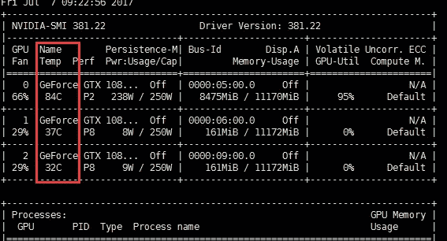
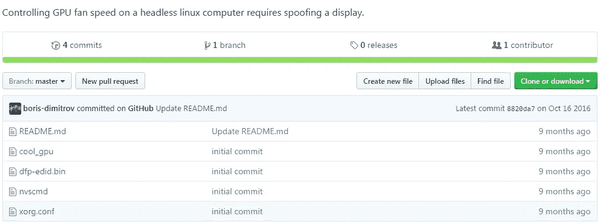
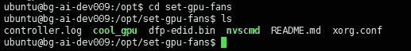
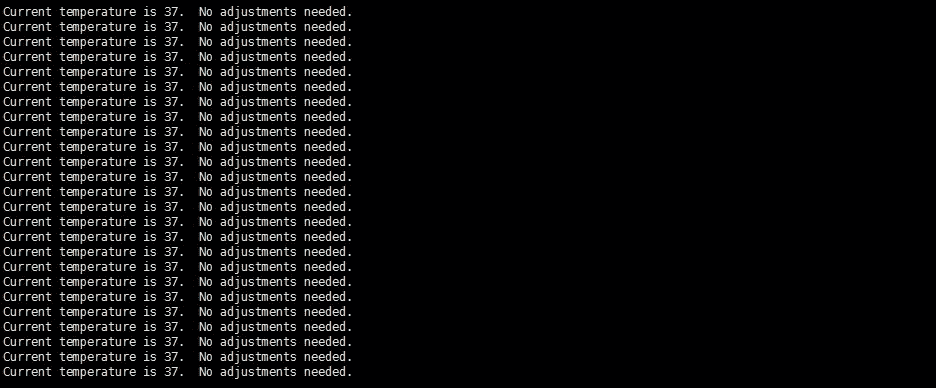
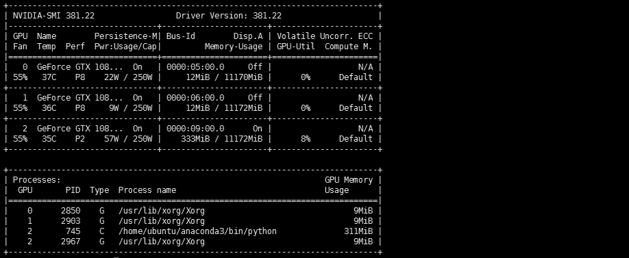
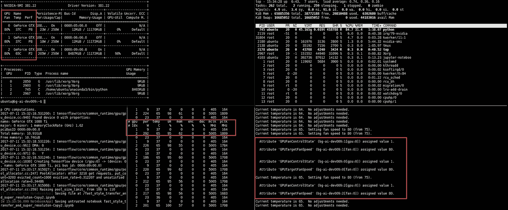

# 一边训练 DL 模型一边烧 GPU？这些命令可以冷却它。

> 原文：<https://towardsdatascience.com/burning-gpu-while-training-dl-model-these-commands-can-cool-it-down-9c658b31c171?source=collection_archive---------3----------------------->


我们经常用 Geforce GPU 做个人研究的深度学习模型训练，但是满载运行时 GPU 温度会高达 84°C！那不仅仅是在烧 GPU，更是在烧我们的心！



受一个来自[](https://zhuanlan.zhihu.com/p/27682206?utm_medium=social&utm_source=wechat_session)**(中文版 Quora)* 的朋友的启发，他修改了 gpu 风扇速度来冷却 gpu，那是因为默认的 nvidia gpu 设置将 GPU 风扇速度限制在 70%或更低，我们必须手动改变 GPU 风扇速度来冷却它。*

***PS:本教程应用了 GTX GPU 的 Ubuntu OS，请注意。***

*中文版本：*

*I also write this article in Chinese, here is Chinese version: [深度学习训练时 GPU 温度过高？几个命令，为你的 GPU 迅速降温。](http://www.jianshu.com/p/ab956df5e40c)*

# *如果您连接了显示器。*

*步骤 1:修改/etc/X11/xorg.conf 文件:*

```
*sudo nano /etc/X11/xorg.conf*
```

*步骤 2:将以下命令放入“设备部分”术语中:*

```
*Section "Device"
     Identifier      "Device0"
     Driver          "nvidia"
     VendorName      "NVIDIA"
     Option          "Coolbits" "4"
EndSection*
```

*第三步:重启你的机器。*

*步骤 4:输入以下命令:*

```
*nvidia-settings -a “[gpu:0]/GPUFanControlState=1” -a “[fan:0]/GPUTargetFanSpeed=100”*
```

> *“gpuFanControlState=1”表示可以手动改变风扇转速，“[fan:0]”表示要设置哪个 GPU 风扇，“GPUTargetFanSpeed=100”表示将转速设置为 100%，但那样会很吵，可以选择 80%。*

# *如果没有连接显示器。*

*我们经常使用 ssh 连接机器，所以机器不会连接显示器。但是上面的方法只有在你有显示器的时候才有效，所以我们必须做些什么来欺骗你的操作系统，让它认为你有显示器。*

*解决方案参考这篇文章:[风扇转速无 X(无头):powermizer 掉卡到 p8](https://devtalk.nvidia.com/default/topic/831440/linux/fan-speed-without-x-headless-powermizer-drops-card-to-p8/) ，作者提供了一个改变风扇转速的脚本。下面是完整的步骤:*

*第一步:将这个 [repo](https://github.com/boris-dimitrov/set_gpu_fans_public) 克隆到这个目录:/opt*

```
*cd /opt
git clone https://github.com/boris-dimitrov/set_gpu_fans_public*
```

**

*这个回购包括这些文件，关键脚本是“cool_gpu”。*

**

*第二步:把文档的名字从“set_gpu_fans_public”改成“set-gpu-fans”，那是作者的小错别字。*

*`sudo mv set_gpu_fans_public set-gpu-fans`*

*步骤 3 : cd 到 set-gpu-fans 目录，并输入以下命令:*

```
*cd /opt/set-gpu-fans
sudo tcsh
./cool_gpu >& controller.log &
tail -f controller.log*
```

*它将启动冷却脚本，您可以看到以下过程:*

**

***测试时间**:*

*在我们测试它是否可以冷却 gpu 之前，我们检查当前的温度。*

**

*现在大概是 37°C，好的，我们来运行一个模型，看看效果如何。*

**

*温度越来越高，当它变得稳定时，你可以看到最终温度:*

**

*哇，我们做到了！我们将 gpu 从 84°C 冷却到 67°C！那真的太牛逼了！*

*有一件事你应该知道，目前的 GPU 功率状态是 P2，这意味着它运行在高性能，最高的是 P0，最低的是 P12。这个冷却脚本工作得非常好，而且没有降低性能。*

# *立正！冷却脚本的原始版本会降低 GPU 性能！*

*我们上面使用的脚本是原始脚本的改进版本，原始脚本在这里:[设置风扇速度，不需要 X 服务器](https://devtalk.nvidia.com/default/topic/789888/set-fan-speed-without-an-x-server-solved-/?offset=)。*

*许多人使用原始脚本会导致性能下降的问题，它会将电源状态从 P2 下降到 P8，甚至 P12，所以我强烈建议不要使用原始的。但我们还是要对原剧本作者付出一定的尊重，没有他的作品我们无法改变粉丝速度。*

*如果你觉得这篇文章能帮到你，请点击心脏，分享给你的朋友！感谢阅读。*