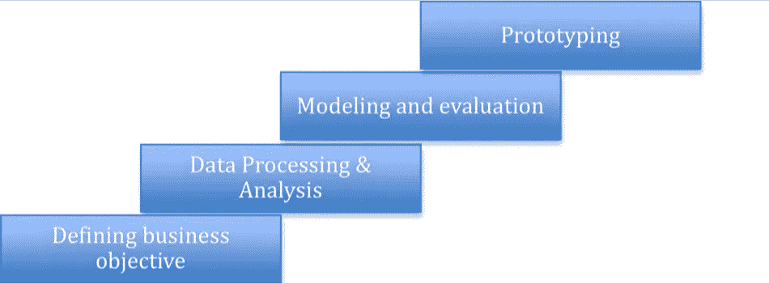
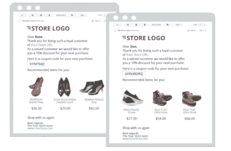
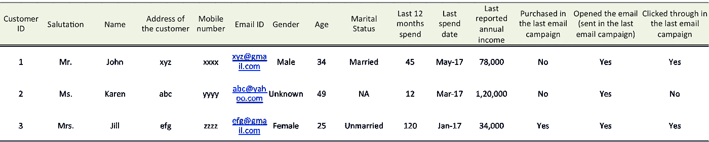
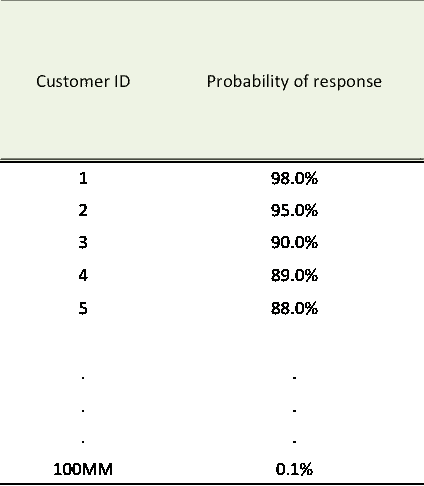
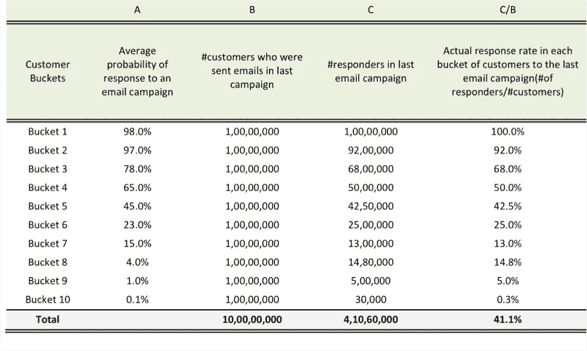
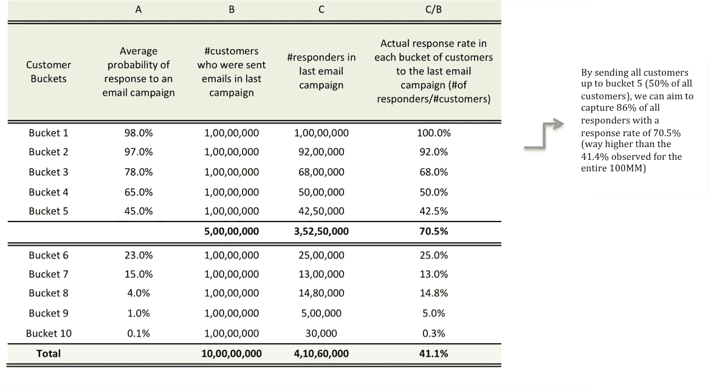
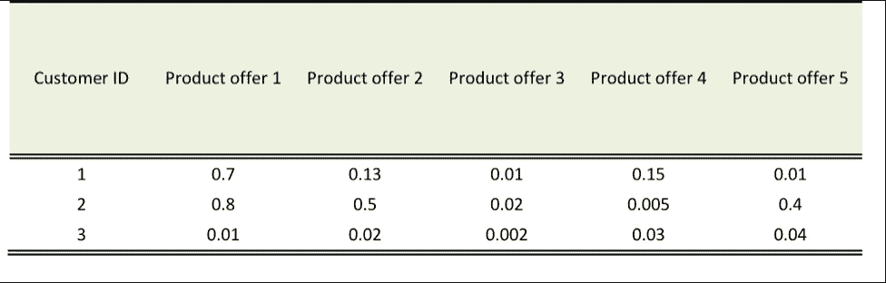

# 数据科学中的商业直觉

> 原文：<https://towardsdatascience.com/business-intuition-in-data-science-2744428d5e97?source=collection_archive---------4----------------------->

通常，当我们想到数据科学作业时，脑海中出现的主要内容是需要应用的算法技术。虽然这一点至关重要，但在典型的数据科学任务中，还有许多其他步骤需要同等关注。

典型的数据科学任务可分为以下几个阶段:

让我用一个简单的案例来解释一下:

有一个在线零售商，他在十一月，就在假期之前，举办一个购物节。它有一个 100 万种产品的目录和一个 1 亿名顾客的数据库，这些顾客过去都曾向它买过东西。

该零售商希望针对其客户群开展促销电子邮件活动。目标是运行一系列“成功的电子邮件活动”。

现在让我们来理解这项特殊任务的不同阶段:

**1。** ***定义业务目标:***

这是一个极其关键的阶段，因为对手头业务问题/目标的错误解释会导致错误的解决方案和不良结果。如果你仔细想想，数据科学的作用是使用数据和从中获得的见解来解决现实世界的问题。从这个角度来看，准确地识别问题和定义目标对于成功的结果至关重要。在本例中，营销人员希望向其每位客户发送定制的电子邮件，显示根据客户的偏好和品味整理的产品报价列表:

Source: [https://www.remarkety.com/customer-segmentation-drives-better-product-recommendations](https://www.remarkety.com/customer-segmentation-drives-better-product-recommendations)

在这种情况下，为了定义业务目标，我们必须问几个问题:

a)我们是向 100 MM 客户的全部名单发送电子邮件，还是向一组精选的客户发送电子邮件？该零售商正在组织购物节，因此向所有 100 MM 客户发送电子邮件可能是有意义的，但仍需要考虑某些要点:

a.通过向所有客户发送大量电子邮件，会不会让一些客户不高兴，比如那些不主动向零售商购物的客户

b.由于我们希望向客户展示精选的产品列表(基于个人偏好)，因此，如果将所有 100 MM 客户都考虑在内，我们可能最终会发现一组客户对任何产品都没有表现出很高的偏好(可能是因为他们没有在零售商那里购买足够多的产品，因此零售商没有足够的信息来了解他们的偏好)

c.有时，数据处理和存储成本也是一个考虑因素。处理 100 万客户及其特征，运行机器学习算法可能是相当时间和资源密集型的。虽然基础设施可以处理这种情况，但除了前两个考虑因素，排除一些客户可能是有意义的，特别是为了加快上市时间。

b)我们如何定义和量化成功指标？这是一个极其重要的决策，并且与业务目标直接相关。在上面的例子中，我们可以有一些可能的成功标准:

*a .活动的购买率(购买数量/发送的电子邮件数量):*该指标将给出活动在说服客户消费方面的效果。因此，如果零售商只关心整个活动带动了多少销售，那么这就是要追求的指标！

b.*活动的电子邮件打开率(打开的电子邮件数量/发送的电子邮件数量):*如果零售商想要了解其他因素，如电子邮件活动内容的有效性，具体来说，在这种情况下，电子邮件主题的“吸引人”程度，这可能很重要。同样，电子邮件点击率(打开电子邮件后，点击电子邮件中提供的网络链接，进入零售商的网站)显示了电子邮件内容的有效性。

c.*活动的盈利能力:*有时，零售商可能会对提高每位顾客的消费感兴趣，而不仅仅是让更多的顾客做出回应(即提高回应率)。请这样想——一项旨在推动越来越多的客户消费的活动，最终可能会吸引那些购买大量低价值产品的客户，而避开那些购买较少但购买高价值产品的客户。

***2。*数据处理与分析:**

这也是另一个非常重要的阶段，在这个阶段，我们详细了解我们可用的数据，以及我们如何使用这些数据来准确地解决手头的问题。

概括地说，这一阶段可以有以下步骤:

1.缺失值处理

2.异常值处理

3.数据分段

4.特征工程

让我们一个接一个地检查它们，以获得为什么需要这个步骤的直觉。在上述案例中，假设您从过去的促销电子邮件活动中获得了如下数据:

上面的数据是三个客户(这家在线零售商拥有 1 亿个客户)及其部分信息的快照。

可以看出，第二个顾客的性别是未知的。性别可能是强有力的信息，因此，如果很大比例的客户是“未知”或“失踪”的性别，那么我们将丢失一条非常重要的信息。有许多方法可以估算性别(通过称呼或姓名)，因此可用于 ***缺失值处理。*** 同样，如果报告的年收入缺失(因为此信息仅由客户提供，他/她可能不愿意提供)，我们可以使用过去 12 个月的支出来估算/预测年收入。

***异常值处理*** 也很重要。例如，我们可以看到“过去 12 个月支出”或“年收入”的一些非常高的值。在支出的情况下，可能是因为某些客户的一次性高美元支出可能不会持续，并且可能会使整个数据产生偏差，因此将支出值限制在某个阈值(例如“过去 12 个月支出”的 99 或 95 百分位值)有助于减少这种偏差。

有时，我们可能会看到数据中有不同的客户群，他们的行为非常不同。例如，如果我们观察最近的客户(最近 6 个月成为在线零售商的会员)，这些客户的行为方式可能与其他客户非常不同(他们可能非常好奇，因此电子邮件打开率可能非常高，但购买率可能很低)。因此，将这些客户与其他客户混合可能会使数据在某些参数上产生偏差，或者这些客户的特征可能会被其他客户所掩盖，从而降低他们在构建的任何预测算法中的代表性。在这种情况下，为这两个 ***【数据段】*** (新客户和剩余客户)构建单独的算法可能是有意义的

***特征工程:*** 特征或变量才是真正赋予算法预测能力的东西。因此，拥有正确的特征集是构建一个健壮算法的关键——因此关注特征工程。特征工程的类型:

1.  特征选择:选择对问题最有用的特征子集。有许多特征选择算法，如基于相关性、信息值或其他特征重要性概念的评分算法。然而，随着越来越多的计算能力和机器学习技术，特征选择越来越多地在算法中处理。
2.  特征构建:从原始数据手动构建新特征，例如，在上面的案例研究中，我们有一个特征“最后消费日期”，它本身可能不提供任何预测能力。但是，我们可以创建一个非常强大的功能“自上次消费后的天数”(最近消费过的客户可能有更高的再次消费意愿，因此可能对电子邮件报价更敏感)
3.  特征提取:像图像、语音、文本这样的一些数据可以有多个特征，因此，通过特征提取，我们可以自动降低这些类型的特征的维数，并从数据中提取隐藏的特征。例如，在图像识别中，如下面的口袋妖怪图像，每个图像可以有数百个特征(像素)。因此，任何图像识别算法都必须处理来自多幅图像的大量特征。因此，该算法必须能够自动提取和减少这些大量的特征，以更小的一组有意义的特征。

***3。建模与评估:***

这是我们必须选择“正确的算法”来为我们的业务问题获得“正确的解决方案集”的步骤。如您所见，这是极其重要的一步，关键是找到最适合给定业务目标的算法。在上面的案例中，无需深入细节，我们有两组目标— (1)从 100 万个客户中找到响应度最高的一组客户—假设是 x (2)对于这 x 个客户列表中的每个客户，显示与他/她的偏好最相关的报价。对于第一个目标，我们需要一个响应预测算法(例如回归技术)，该算法将给出每个客户的响应可能性分数/概率，然后可用于对客户进行排序，并为活动选择响应度最高的客户。对于目标(2)——发现客户的优惠偏好，我们需要能够帮助选择最有可能被客户偏好的产品优惠的算法(例如，推荐算法或分类技术)

一旦我们构建了算法，对它们的评估也是基于它们满足手头目标的程度。让我们通过上面的案例研究来理解这一点。假设我们已经建立了一个响应预测算法，该算法根据 1 亿名客户在看到电子邮件报价后购买产品的概率对他们进行排序:

现在，我们将这些 1 亿客户分成 10 个相等的桶，按照响应概率从高到低的降序排列。对于每一类客户，我们会查看他们对之前发送给所有 100 MM 客户的电子邮件促销活动的实际回复率:

Please note: the response here is product purchase after seeing the email offer

因此，为了实现目标 1，我们只需决定在哪个时段发送电子邮件报价。

现在，在上表中，您可以看到某些时段的“平均响应概率”和“实际响应率”之间存在差异，例如时段 3 和 4。因此，与实际值相比，预测值并不十分“准确”。但是，由于这里的目标是选择一组高响应可能性的客户，我们更关心该模型在响应方面对客户进行排序的情况。看一下实际的回复率，它似乎做得相当不错(过去活动的实际回复率也差不多是按降序排列的)。因此，在这里，模型结果评估更多地是围绕如何根据客户的响应概率而不是预测的准确性对客户进行排序。

然而，当我们评估第二个模型的结果时，预测准确性可能更重要，第二个模型给出了每个客户对每种产品的偏好得分。比方说，在上面的例子中，有 10 个产品报价。因此，我们建立了一个模型，为 10 种产品中的每一种给出每位顾客的偏好得分:

这里，客户 1 对报价 1、2 和 4 有更高的偏好。对于产品 3 和 5，由于偏好得分很低，我们可以假设他对这些产品没有任何偏好。类似地，我们可以说客户 2 没有表现出对任何特定产品的偏好。我们可以创建一个阈值分数，如果客户的分数高于该阈值，我们将考虑该偏好，否则不予考虑。因此，您可以在这里看到，我们正在根据分值进行此类评估，因此，获得反映客户真实偏好的准确分值非常重要。因此，在该模型评估中，预测精度非常重要。

***4。*原型:**

通过构建数据原型，我们的意思是创建必要的基础设施，以便在生产环境中实现解决方案。鉴于实施是一个时间和资源密集型过程，需要给予适当的考虑。在上述情况下，其中一些可能是:

1.  这一电子邮件活动是一次性的营销活动还是更有规律的活动？如果是常规的，那么创建一个生产平台来执行这样的活动是有意义的。
2.  对于这样一个平台，如何将来自不同来源的所有数据放在一起？需要从清理源数据所涉及的工作量和成本、更新频率、内部数据卫生检查和平衡等方面进行评估。
3.  所有这些数据将如何存储和处理？这涉及到需要并行处理(如果数据量巨大)还是实时处理以及存储基础架构等决策。
4.  电子邮件将如何发送？同样，需要做出的决策包括:是否需要第三方电子邮件交付供应商、客户数据隐私检查和平衡、上市速度(包括实时处理需求)等。

这是一些需要考虑的因素，但是根据任务的规模和复杂程度，可能还有许多其他需要评估和评价的事情。

因此，如您所见，数据科学任务是许多阶段的总和，需要领域专业知识、对业务目标的详细理解以及技术专业知识。二者缺一不可！！

***想了解更多？参加由***[***www.deeplearningtrack.com***](http://www.deeplearningtrack.com)提供的为期 8 周的基于案例研究的数据科学课程