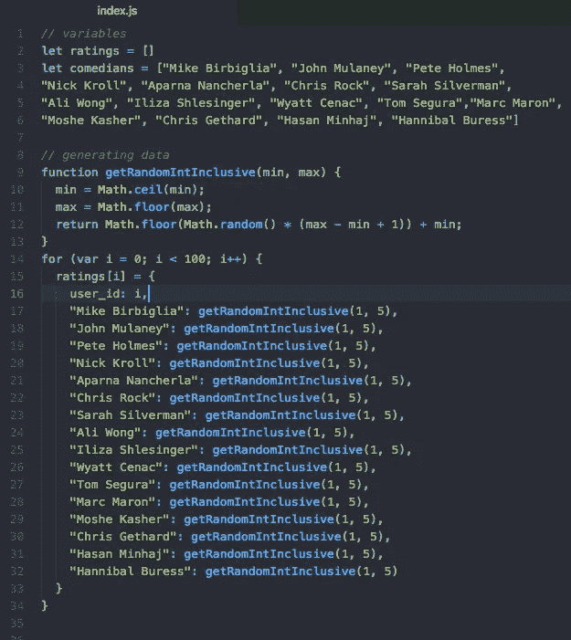
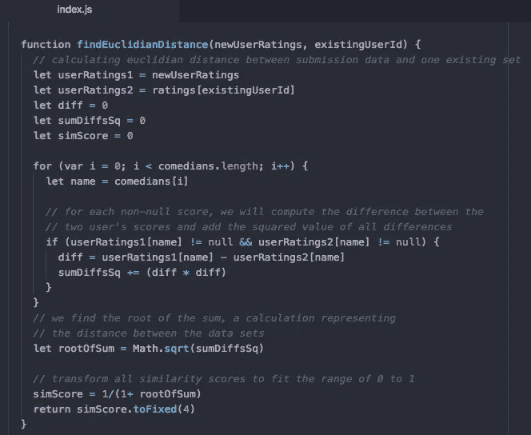
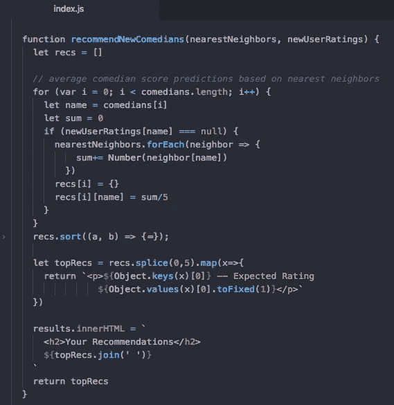

# 但是(k 最近的)邻居会怎么想呢？

> 原文：<https://towardsdatascience.com/but-what-will-the-k-nearest-neighbors-think-a21f3f736898?source=collection_archive---------19----------------------->

## 构建一个 JavaScript 喜剧推荐引擎，探索 k 近邻的概念

我最近共同发表了关于机器学习的基础知识，这对我来说是一个非常新的话题。在研究该领域中使用的一些常见回归和分类算法时，我寻找了每种方法的实际用例。k-最近邻算法是最常见和最容易实现的方法之一，通常用于推荐我们产品的推荐引擎，学习我们的媒体消费习惯，并努力保持我们的点击、消费和购买。我很想了解这是如何工作的，并决定深入研究一下。

好吧，那么什么是推荐引擎呢？可以定义为基于用户过去的行为，用来培养对用户相关的产品或内容的一系列算法。当过去的行为不可用时，引擎可以默认基于整体用户数据或公司的利润考虑的一般化建议。我们都可能对到处跟踪我们的用户跟踪感到有点害怕，这种跟踪与我们的期望和需求有点太合拍了。好的推荐和霸道的用户体验之间只有一线之隔，但拥有一个有效的推荐引擎通常会改善用户体验，并转化为销量的增加。

推荐引擎有几种工作方式。简单的推荐者会跟随总体趋势，让用户了解他们产品的总体需求。更复杂的引擎将使用用户反馈——通过提交反馈或在线跟踪的有机用户行为——来将用户划分到简档中。在将用户基础分割成简档之后，新用户可以相对于现有用户被划分到那些简档之一中。符合相同简档的相似用户将可能享受相似的推荐。

好吧，那么 k 近邻会怎么处理这个呢？井 k-最近邻是一种分类和回归算法，它绘制整个训练数据集并分析数据点之间的距离。我们可以将距离视为相似性得分，它允许我们识别与任何一个标绘点最相似的数据点。生成该距离值的一个简单方法是计算两点之间的欧几里德距离，方法是对每对数据点之间的差求平方，对平方求和，然后求和的平方根。

与任何简单的方法一样，这也有缺点。特别是对于像用户评级这样的反馈，欧几里德距离将忽略用户反馈中的细微差别，例如每个用户的评级的整体范围。如果用户 1 评价很好，用户 2 评价很差，他们的评价不一定不相关。欧几里德距离不能校正这一点，并且会将它们的分数视为非常不同。Pearson correlation score 可以通过将所有用户评级绘制成一条线来寻找相关性而不是相似性来纠正这一点。这允许更细微的相似性得分。

使用 k-最近邻的另一个主要缺点是运行起来计算量很大。该算法利用了完整的训练集，在任何给定时间都可以处理大量数据。抵消这种情况的一种方法是创建预先生成的查找表，以简化计算并提高性能。

有许多技术(和替代方法)可以用来构建推荐引擎。毫不奇怪，Python 在数据科学家中很受欢迎，因为它有许多有用的库，所以是以这种方式处理数据的最常推荐的语言。然而，Java 中的 LibRec 也可以很好地工作。这个问题也可以用图论来解决。对于这种方法，通常推荐使用 GraphQL 和 Neo4j。

但是我们如何使用欧几里德距离和 k-最近邻来构建一个简单的推荐器呢？作为第一次尝试，我用 vanilla JS 构建了一个简单的喜剧推荐器。

首先你需要收集一些数据。出于我的目的，我随机生成了一组喜剧演员的用户评级。(因此，请记住…这些建议只有在随机生成的评级碰巧有效时才有效！)

The more data you have, the better you calculations will be. I kept it pretty simple at 100.

我在 HTML 评级提交表单上设置了一个监听器，收集所有用户提交的评级和相应的喜剧演员。我将数据集合发送到 findNearestNeighbors 函数中。它使用一个辅助函数来查找新用户数据和我的数据集中所有用户数据之间的欧几里德距离。它将生成新数据集的 5 个最近邻居，并将这些邻居的对象(以及新用户的评级)发送到我的 recommendNewComedians 函数。

I have saved a new attribute of simScore into our ratings object and sorted through it to find the ratings data with the highest similarity scores.

This helper method finds the similarity score between the new user and every other user and returns.

最后，我们查看五个最近的邻居，并平均出新用户不熟悉的每个喜剧演员的分数。然后对该数据进行排序，并将五个得分最高的新喜剧演员添加到推荐对象中，该对象将用于向用户呈现结果。

现在，我们可以基于最近邻评级来提供预期评级。为了更彻底，你可能想要做加权平均，权衡最近的邻居作为一个更有意义的反应。对于这个例子，我只是处理了一个简单的平均分数。

根据评分和评论来考虑推荐可能是最简单的，但是同样的过程也可以用于你收到的任何类型的用户反馈。想象一下重视用户交互，这样你就可以用它们来进行计算。如果电子商务平台中的用户多次访问相同的产品，将产品添加到购物车，或进行购买，这表明与该产品有积极的关联。而关闭一条建议则是负面联系的明显表现。这些类型的分数可以以同样的方式进行操作，以基于有机反馈进行推荐。

 [## 从头开始构建推荐引擎的综合指南(Python 语言)

### 引言在当今世界，每个客户都面临着多种选择。例如，如果我在找一本书来…

www.analyticsvidhya.com](https://www.analyticsvidhya.com/blog/2018/06/comprehensive-guide-recommendation-engine-python/)  [## 用图论在 JavaScript 中构建一个简单的推荐引擎

### 利用用户行为推动推荐

medium.com](https://medium.com/@keithwhor/using-graph-theory-to-build-a-simple-recommendation-engine-in-javascript-ec43394b35a3)  [## 推荐引擎是如何工作的？又有什么好处？

### 购物是每个人的必需品，当我们购物时，它肯定是我们喜欢的产品或我们的…

www.marutitech.com](https://www.marutitech.com/recommendation-engine-benefits/)