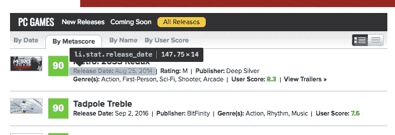
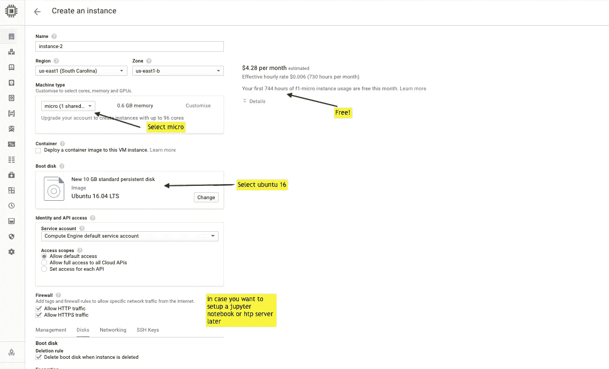
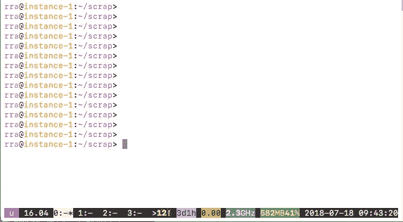
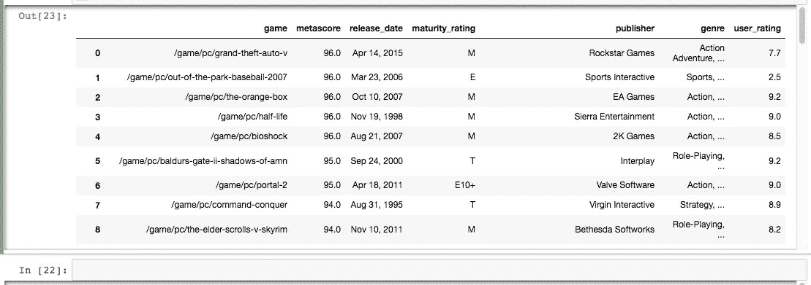

# 自带设备:建立自己的数据集(免费使用网络抓取)

> 原文：<https://towardsdatascience.com/byod-build-your-own-dataset-for-free-67133840dc85?source=collection_archive---------2----------------------->


**十秒外卖:** *了解如何通过简单的网络抓取创建自己的数据集，使用 python 的 beautiful soup 挖掘整个 Metacritic 网站的游戏评论，并免费托管在谷歌云平台(GCP)微(始终免费层)*

有抱负的数据科学家总是对学习理论后的第一步感到困惑。他们能够应用积累的知识的地方很少。当然，有大量的数据集可用，但免费的数据集永远不会给你解决实际问题的务实见解，或者有时它们太小，无法用于深度学习应用程序。

获取强大数据集的一种方式是付费或注册昂贵的课程，另一种方式是网络抓取。在这里，我告诉你如何免费使用 python 抓取大型数据集！

## 为什么我选择了网络抓取和使用谷歌云？

*   **数据变得陈旧:**当你搜集数据时，你可能会得到任何主题的最新数据。虽然你可以从 Kaggle 获得强大的数据集，但如果你想为你或你的公司创造一些新鲜的东西，比如说，抓取就是一种方法。如果你想为鞋子建立一个价格建议，你会想要来自亚马逊的最新趋势和价格，而不是两年前的数据。
*   **可定制:**你可以定制代码，只从你想要的任何来源获取你需要的数据。
*   **为什么不是本地的？由于云计算市场上有谷歌和亚马逊这样的大公司，出租一台电脑几个小时是非常便宜的。他们也给你一个免费层，这是完美的简单的东西，如网页抓取。GCP 稍微便宜一点，而且一开始会给你 300 美元的积分，所以我选择了 GCP。此外，我不希望我的 IP 被封锁(呵)**
*   有趣:这是我对周五晚上的想法！

在我的例子中，我没有找到一个很新的游戏评论数据集，因为 Metacrtic 拥有最大的游戏库，并且会定期更新，所以我决定使用它。

## **入门**

您所需要做的就是遍历 URL 列表，识别数据容器，提取数据并将其存储在 csv 中。

**1。使用的库**

```
import urllib2
import csv
from bs4 import BeautifulSoup
import pandas as pd
```

*   **urllib2** :我们的用于进行 url 请求的库。
*   csv :以 csv 格式存储数据的库
*   **bs4** :漂亮的汤库，让从网页中提取数据变得非常容易。
*   熊猫:以漂亮的表格格式存储数据。

**2。了解网站的流程**

元符号布局非常简单。所有数据的结构如下

http://www.metacritic.com/browse/**游戏**/发布日期/可用/pc/metascore？view=detailed & page=1

让我们来分解一下:

*   **http://www.metacritic.com/browse/**:是域
*   **游戏:**这给出了子部分，并且可以被其他子部分的电影/音乐替换
*   **可用/pc/** :此部分为 pc 提供数据。对于 ps4 游戏的数据，请将其更改为 ps4。
*   **metascore** :这给出了根据元分数的排名，我们可以将其更改为“**user _ rating”**以根据用户评分获得数据。
*   **view=detailed :** 这给出了我们选择的视图类型 detailed，因为它包含更多的数据，如流派和成熟度等级。
*   **page=x:** 这给出了页码 **x** 。如果页码不存在，站点会返回一个没有数据的空白模板页面，并且不会抛出错误

接下来，我们决定包含数据的 html 元素。为此，我们使用 Chrome 中的**检查**工具。我们选择元素并突出显示子部分，以获得 html 元素及其类。


use the inspect button on the top right (circled) then highlight the area you want the HTML element for



the release data is in the element **li** and has class ***stat release_date***

现在我们知道我们需要提取什么元素，让我们继续提取它们。

**3。发出 URL 请求**

```
metacritic_base = “http://www.metacritic.com/browse/games/release-date/available/pc/metascore?view=detailed&page="hdr= {‘Accept’: ‘text/html,application/xhtml+xml,application/xml;q=0.9,*/*;q=0.8’, ‘User-Agent’ : “Magic Browser”}filepath=’/Users/rra/Downloads/’for i in range(0,54):
    metacritic = metacritic_base+str(i)
    page = urllib2.Request(metacritic, headers=hdr )
    content = urllib2.urlopen(page).read()
```

Metacritic 有一个简单的站点布局，带有一个静态 URL，其中每个页面的页码都是变化的。

我们使用了 **urllib2。请求**请求页面和 **Urllib2** 。 **urlopen** 读取页面数据

提示:有 53 页，所以我把我的计数器的最大值设为 54，但是你可以简单地在一次尝试中包括所有这些，除了遇到错误时退出。

**4。提取数据**

然后我们读取数据

```
soup = BeautifulSoup(content, ‘html.parser’)
right_class=soup.find_all(‘div’, class_=’product_wrap’)
for item in right_class: try:
      link=item.find(‘h3’, class_=”product_title”).find(“a”)
      g=link.get(‘href’)
      except: g=’' try:
        score = item.find(“span”, class_=”metascore_w”)
        s=score.text
      except: s =’’ try:
       dt = item.find("li", class_="release_date").find("span",    class_="data")
       d=dt.text
      except: dt='' try:
       rating=item.find("li",class_="stat  maturity_rating").find("span", class_="data")
       r= rating.text
     except: r="" try:
      pub =item.find("li",class_="stat publisher").find("span", class_="data")
      p= pub.text
    except: p=''

   try:
     genre= item.find("li",class_="stat genre").find("span", class_="data")
     gr = genre.text
   except: gr='' try:
   user_score=item.find("span", class_="textscore")
   u = user_score.text
   except: u=''
```

我们使用 **BeautifulSoup(content，' html.parser')** 来完成解析大量 html 的所有繁重工作。

现在我们在上一节中看到，每个游戏数据都在一个 div 中，其中包含一个名为 **product_wrap** 的类。因此，我们提取所有这样的 div，并迭代每个 div 以获得数据。我们在这里存储以下数据:

*   g:游戏名称
*   学生:metascore
*   发布日期
*   出版商
*   r:安全等级
*   u:用户评级
*   gr:流派

**提示** : HTML 不可靠，所以最好使用 **try:除了**切换每个提取

**5。保存数据**

```
game=[g,s,d,r,p,gr.strip(),u]
df = pd.DataFrame([game])
with open(filepath+'gamenames.csv', 'a') as f:
   df.to_csv(f, header=False, index=False, quoting=csv.QUOTE_NONNUMERIC, sep="|")
```

我们使用 pandas 将 list 的列表转换成表格，然后将数据写入 csv。这里我们使用 **|** 作为分隔符，因为流派列包含**、**(逗号)

**6。在谷歌云上运行代码**

我想你应该知道如何开设一个 GCP 账户。如果现在，请跟随[这篇博文](https://www.datacamp.com/community/tutorials/google-cloud-data-science)学习如何做。您需要创建一个实例，如下所示。



Creating a GCP instance

一旦它运行，您需要在它上面安装 python，并将代码从您的本地机器复制到实例中。这里**球形乌鸦**是项目名称，**实例-2** 是实例名称。你还需要指定谷歌的时区。

**提示**:记得在 ssh 到实例后更新你的 ubuntu。

```
gcloud compute — project “spheric-crow” ssh — zone “us-east1-b” “instance-2”gcloud compute scp scrap.py instance-1:scrap
```

**scp** 将文件从本地机器复制到 GCP 实例。接下来，您需要在您的实例上安装上述库。接下来安装 [**byobu**](http://byobu.co/) 这是一个基于文本的 windows 管理器。这将保持会话完整，即使您的 ssh 连接中断。

```
Sudo apt-get install byobu
byobu
```



byobu interface, you create separate tabs and run multiple code at the same time

最后使用下面的命令运行代码，就完成了。

```
python scrap.py
```

提示:您可以从我的 github 帐户中选择 scp 或简单的 git pull。

**7。检索挖掘的数据**

您可以再次使用 scp 从云中获取挖掘的数据，现在您有了一个非常酷的数据集可以使用了！

```
gcloud compute scp instance-1:scrap/game_review.csv /Users/
```

然后，您可以使用 python 作为

```
import pandas as pd
df= pd.read_csv(“/metacritic_scrap/gamenames.csv”, sep=”|”)
df.columns=[“game”, “metascore”,”release_date”, “maturity_rating”,”publisher”, “genre”, “user_rating”]
```

你的数据集看起来会像



看看这个结构有多好！

**提示**:你也可以自动完成这项工作！

## **提示和技巧**

1.  **礼貌点:**大多数网站会反对你挖掘他们的内容，因为这会给他们的服务器带来很大压力。尽量避免在短时间内提出过多的请求，并阅读 **robots.txt** 文件。这里有一些尽可能减少错误的技巧:

*   **Sleep** :包括 **sleep** ，在下一个请求发出前将代码延迟几秒钟。我更喜欢使用 **sleep (randint(a，b))** 即使用随机整数而不是固定值。

```
from random import randint
from time import sleep
#pause for 20-100 seconds randomly
sleep(randint(20,100))
```

*   **用户代理:**是浏览器或 app 发送给你访问的每个网站的字符串。我们使用一个**用户代理生成器**来欺骗网站，让它认为请求来自不同的浏览器。由于许多机构使用同一个 IP，我们通常不会冒太多请求错误的风险。 [**这里的**](https://developers.whatismybrowser.com/useragents/explore/) 是你可以使用的热门用户代理列表。

```
from user_agent import generate_user_agent
```

*   VPN 和代理:如果你正在挖掘一个大的数据集，你最终会得到一个太多请求的错误。就我而言，大约每 2000 页。因此，为了应对这种情况，您可以轮换几个代理，并在每次实例运行时获得大约 5k 的页面。你可以在这里获得一些免费代理[。](https://free-proxy-list.net/)

**2。陷入验证码中:**一些网站真的不想让你抓取他们的数据，他们会在适当的地方设置验证码。如果这是一个简单的 4-5 个字母数字的验证码，你可以尝试使用 **Python 宇宙魔方**和[这种技术来破解。](https://medium.com/@ageitgey/how-to-break-a-captcha-system-in-15-minutes-with-machine-learning-dbebb035a710)如果是谷歌重新验证码，你每次都要像这些人一样手动解决。

**3。异常处理:** HTML 非常不可靠，站点可能不会一直遵循严格的模式，所以最佳实践是在 **try:except** 语句中包含每个元素。

4.**定期保存:** Web 抓取是一项有风险的业务，如果您不定期保存数据，您可能会丢失迄今挖掘的整个数据集。一个简单的解决方案是定期将数据保存在 csv 中(像我一样)或使用 SQLite(像聪明人一样)。关于 sqlite 的介绍可以在[这里](http://stackabuse.com/a-sqlite-tutorial-with-python/)找到。

## 下一步是什么？

我们可以使用相同的代码来挖掘其他内容负载的元符号，只需更改基本 url:

*   电影评论/评级
*   电视节目评论/收视率
*   音乐评论/评级

我扩展了我的代码，以挖掘大约 5k 个 PC 游戏的所有大约 100k 个用户评论的数据，并且我已经提到我将把它用于游戏推荐引擎(随后是博客帖子)。如果你想分一杯羹 [**发邮件**](mailto:rra.iitk@gmail.com) 给我，我会给你发一部分数据集！

Metracritic 的网站布局非常容易理解，并且通过一个简单的 for 循环来复制，但对于挖掘更复杂的网站，如亚马逊，我们使用一个名为**木偶师**的浏览器自动化工具，它模拟点击来生成下一页等等。

看看艾玛德·艾山关于如何使用木偶师的博客。

这篇博客的全部代码可以在我的 git 上找到。用户评论抓取的完整代码也可以在这里找到。

在下一篇博客中，我将对这个伟大的数据集进行一些数据辩论和深度学习。敬请期待！

这是我的第一篇帖子，如果你喜欢，请评论并鼓掌:)