# 蛋糕架和纸鸟:Python 中的电子商务群组分析

> 原文：<https://towardsdatascience.com/cakestands-paper-birdies-e-commerce-cohort-analysis-in-python-e33d0cf70dfc?source=collection_archive---------11----------------------->

## 英国在线零售商的数据清理和群组分析

随着电子商务继续快速增长，传统实体企业正专注于在线努力，以跟上亚马逊等领导者的步伐。沃尔玛最近进入和收购 Jet.com 极大地推动了增长，美国电子商务在 2018 年第二季度增长了 40%。

对于电子商务机构，群组分析在了解销售数字和客户方面发挥着重要作用。群组分析是指根据客户的购买日期或首次购买日期将客户分成“群组”。

然后可以跟踪每个群组的后续活动，以更深入地了解关键客户指标，如客户终身价值和保留率。客户终身价值是指在所有未来的互动中，你期望从该客户那里获得的总预期利润。留存率是指每个时间段后，原有客户留存的百分比。

通过这一分析，我希望解决两个关键问题:

1.  你是如何解读和清洗电商数据的？
2.  如何创建一个简单的群组分析来比较不同群组的指标？

这里使用的数据集来自于 [UCI 数据仓库](https://archive.ics.uci.edu/ml/datasets/online+retail#)，包含了一家总部位于英国的销售全日礼品的无店铺零售店的 541，909 笔交易。注意，这个数据集的客户是批发商，而不是个人消费者。因此，超过 1000 件的订单量是合理的。

我们创建了一个新的“tot_order”列来表示订单总额，它只是单价和数量的乘积。

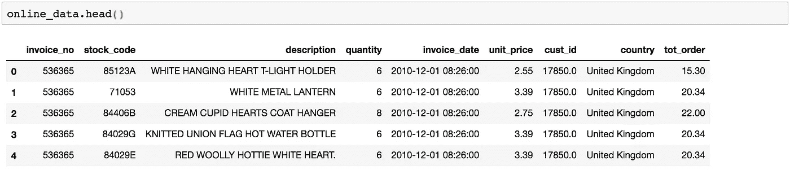

## 缺少值

现在我们已经知道了数据帧的样子，让我们用 missingno 检查丢失的值。

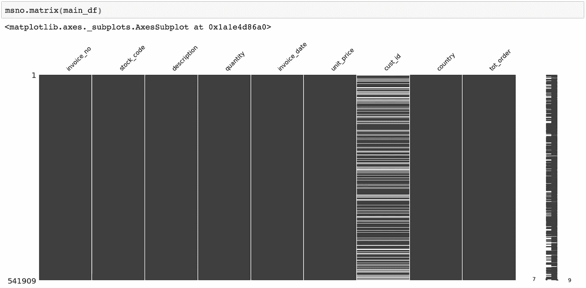

带有 missingno 的快速可视化显示，客户 id 有相当多的缺失字段。因为我们需要识别特定的客户，将他们放入队列中，我们将不得不放弃缺少客户 id 的订单。

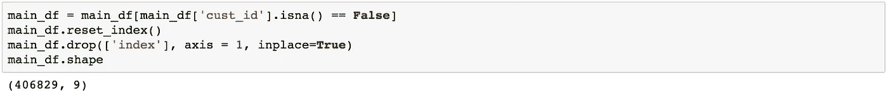

## 负订单

看一下数量值也会发现一些负值。这些都可以解释为退款。让我们借此机会看看这些价值观告诉我们什么。

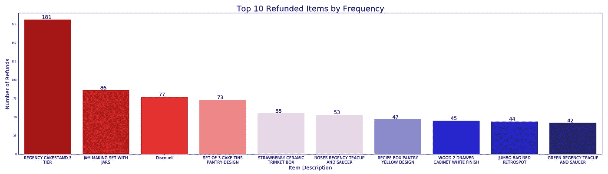

似乎 3 层蛋糕架是最常退款的项目。

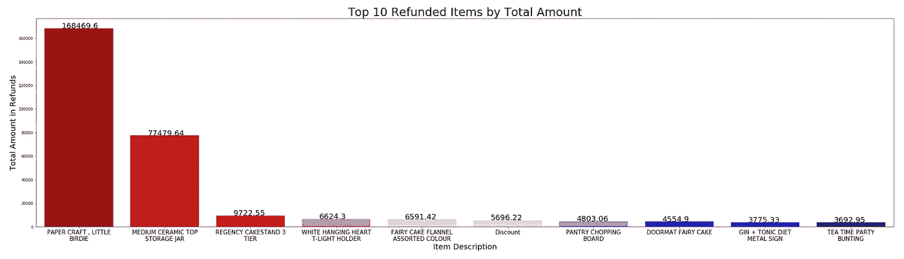

然而，就退还的总货币价值而言，蛋糕架远远落后于纸小鸟和陶瓷储物罐。这个异常值将在下面进一步讨论。

由于在每个退款的原始数据帧中有匹配的购买，每月的总购买和收益不受影响。因此，这些退款不必取消。

## 极端值

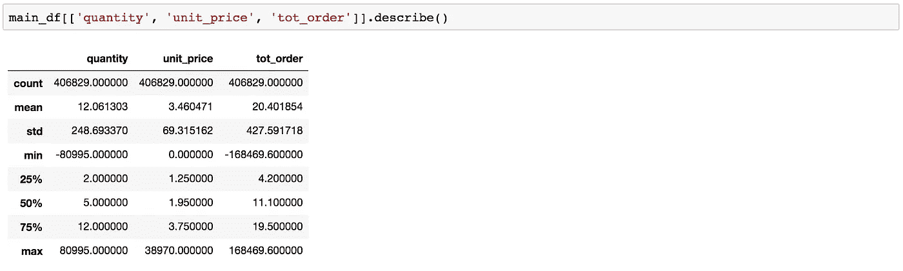

看一下数量和单价的分布，可以发现大多数数值都是个位数。然而，订单数量和单价的异常值似乎分别高达 80，995 和 38，970。

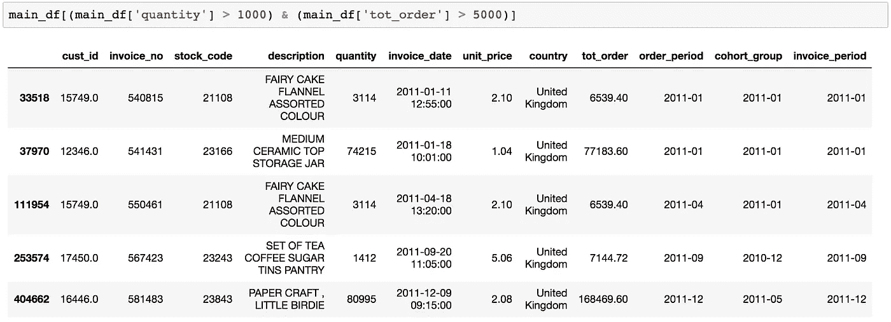

通过快速过滤，我们发现异常值主要存在于每件价格在 1-2 英镑左右的小件商品中。最明显的异常值是发票号 581483。看来有人真的很喜欢精心制作的纸小鸟。

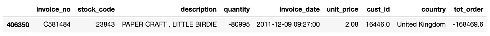

不过，从这个退款订单来看，可能没有那么多…

在离群值中似乎没有任何其他条目来暗示扭曲销售历史，尤其是当一些最大的门票都被取消时。

单价异常值怎么办？查看最高平均值会发现一些可疑的“产品”:

1.  网络邮资
2.  克鲁克委员会
3.  指南
4.  折扣

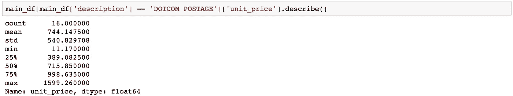

“网络邮费”似乎表明了顾客在邮费上的花费。平均 744，这是所有产品平均单价的 200 多倍。此外，邮费不是销售的直接指标，可能会扭曲不同人群的消费金额。似乎还有一个类似的标签“邮资”，我们也将删除。

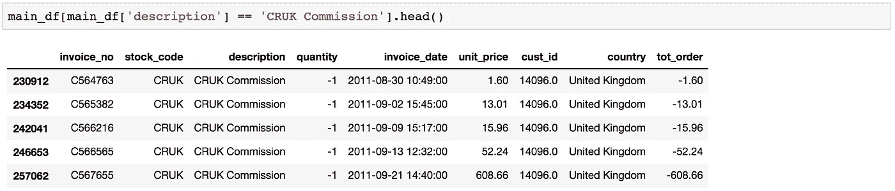

“CRUK Commission”听起来像是支付给外部组织的费用，在谷歌上快速搜索一下，就会发现英国癌症研究所的相关结果。这可能是向癌症研究工作支付一些收益的倡议的一部分。由于这与销售没有直接关系，我们应该删除“CRUK 佣金”行。

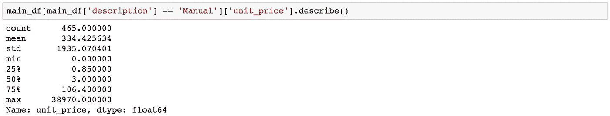

“手册”是一个相当模糊的产品。手动的有 465 条记录，单条记录指挥单价 38970。由于我们没有关于这家在线零售公司运营的具体信息，我猜测‘人工’是指购买其他商品时提供的人工服务。这可能是枝形吊灯或仓库货架的设置。由于这些交易存在与个别产品销售不直接相关的显著异常值，我们也将删除“手动”记录。

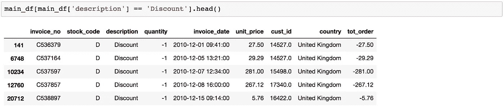

“折扣”似乎是为售出产品提供折扣的一个不言自明的类别。所有这些交易都有负销售量，这一事实进一步证实了这一点。由于折扣与产品价格直接相关，并直接影响销售，我们将把它留在数据框架中。

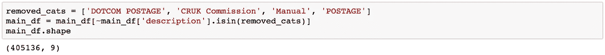

## 销售总结

随着数据的大量清理，让我们来看看销售数字。

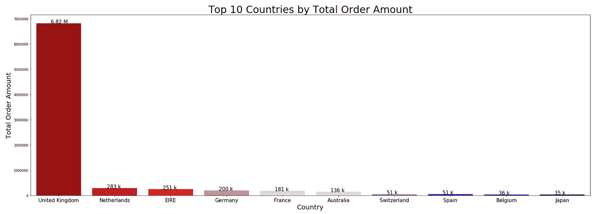

不出所料，英国占了销售额的大部分，因为这是一家位于英国的商店。

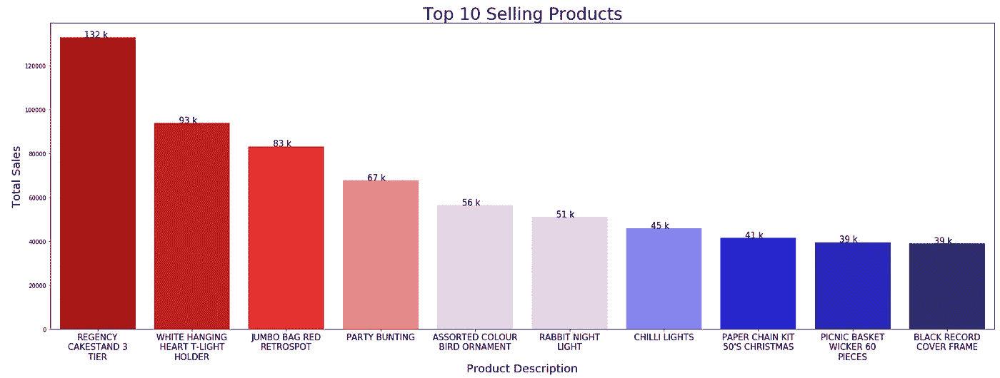

尽管有大量退款，cakestands 仍是总销售额最高的产品。

## 队列分析的准备

格雷格·瑞达(Greg Reda)令人惊讶的简单代码。对于群组分析，我们需要创建一些标签:

1.  发票周期—单个交易/发票的年份和月份的字符串表示。
2.  群组—客户首次购买的年份和月份的字符串表示。该标签在特定客户的所有发票上通用。
3.  群组周期——客户“生命周期”阶段的整数表示。该数字表示自第一次购买以来经过的月数。

**发票期**

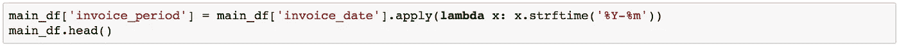

基于发票日期创建新列的简单 strftime 函数就足够了。

**同组**

对于群组标签，我们试图找到顾客第一次购买的日期。我们首先根据客户 id 对数据帧进行重新索引，并根据索引进行分组。

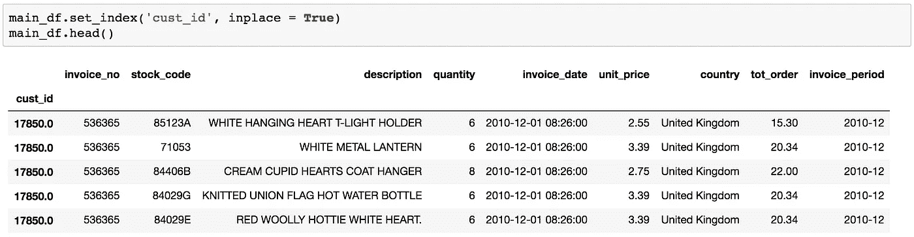

接下来，我们找到最小发票日期，它应该代表第一张记录的发票。应用相同的 strftime 函数，因此客户的所有发票都具有相同的群组标签。

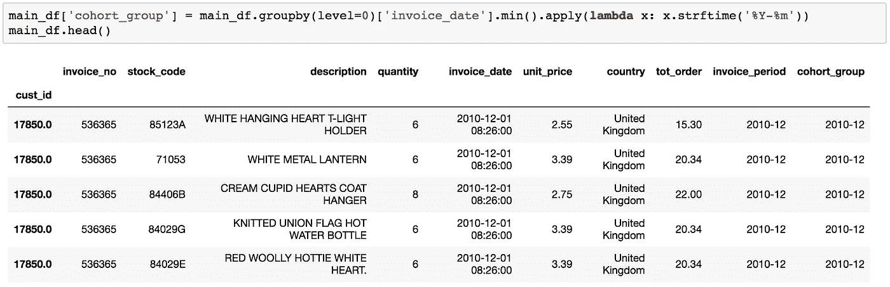

之后别忘了重置索引！

**聚合指标**

在我们创建群组期间之前，让我们根据 invoice_period 和 Groupon _ group 标签对数据帧进行分组。

我们通过客户和产品的唯一 id 和描述来统计一段时间内售出的客户和产品的总数。然后，我们将销售数量和总发票金额相加，得到该期间的总销售额。

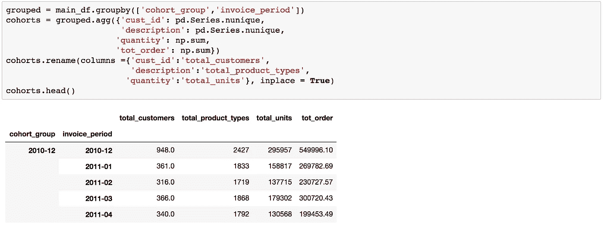

**同期期**

对于群组分析，必须确定该客户一生中的购买行为。例如，如果客户在 5 个月前加入，我们需要从 1 到 5 的标签来识别每个月的指标。

我们首先通过“群组 _ 群组”对先前的群组对象进行分组来创建该标签。然后我们找出每个组的长度，并用 np.arange()创建一个列表来表示这个范围。例如，np.arange(5)返回[0，1，2，3，4]。

因为我们希望这个列表从 1 开始，所以我们给这个范围内的每个数字加 1。

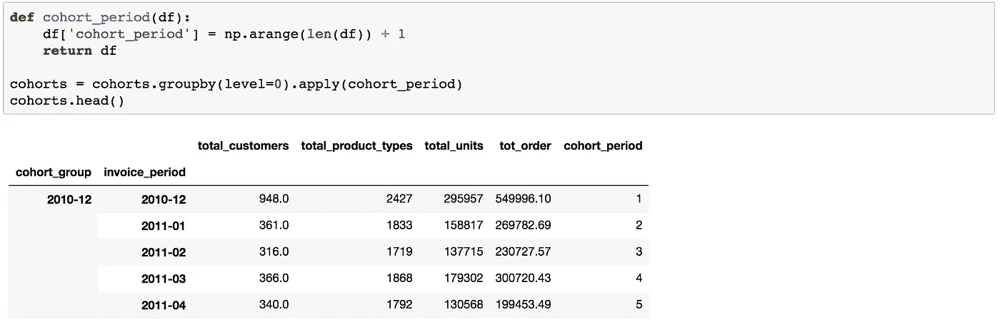

## 跨群组的销售汇总

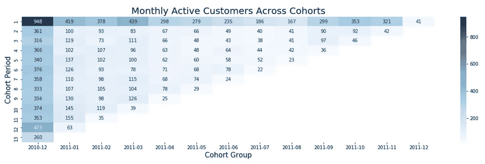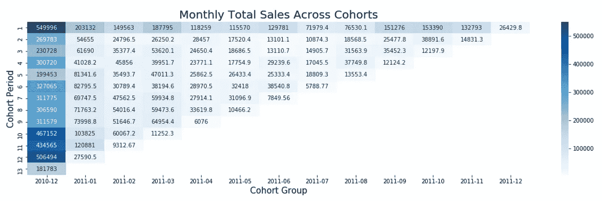

虽然不完全具有代表性，因为这些只是一年的销售数字，但很明显，2010 年至 2012 年第一批的客户数量和销售数字要高得多。理解这一群体的一种更有代表性的方式是，他们是之前与这家商店有过关系的现有顾客。因此，他们自然会表现出更高的客户参与度和活跃度。

这家在线零售商的销售背后似乎还有一个轻微的季节性因素。第一季度和最后一个季度的初始购买量较高。同样，2010 年至 2012 年的采购也表明这两个季度的活动增加。由于大多数产品都是礼品，这种增加的活动可以归因于这些时间段所代表的假日季节。

## 跨群组的保留率

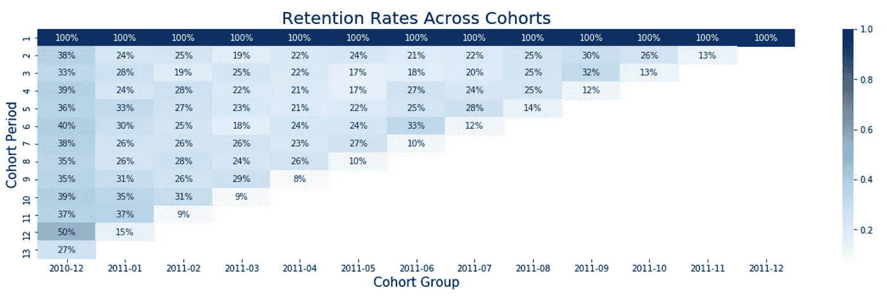

纵观各队列的保留率，可以看出 2010-2012 年队列的持续参与度很高。由于这些都是现有客户，这是很直观的。

在第一次交易后，后续群组的保留率几乎立即下降到 20%左右。季节性的影响对于 2011 年至 2011 年的发票期尤为明显。在本发票期内，所有组别的保留数字都是最强的，回到了 30%左右。假期的积极影响似乎在这里得到了很好的支持。

## 改进和后续行动

1.  如上所述，这是一个相当有限的数据集，因为它只包含一年的交易数据。如果能获得更长时间的数据，队列分析会更有价值。
2.  除了季节性和节假日期间，没有关于可能影响销售和保留率的业务特定事件的进一步信息。如果有广告活动或新产品发布的数据，看看销售是否会受到不同人群的影响，那将会很有意思。
3.  考虑到缺少客户 id，大约四分之一的初始数据集被丢弃。有些包含有趣的变量，如亚马逊费用，可能会影响每月的销售数字。
4.  有一些大客户的账户，他们可以很好地转化为一些帕累托图(即将推出)。
5.  有了更详细的数据集，我愿意尝试一些终生客户价值分析和预测。如果有任何关于数据集的建议，请发送给我！

感谢阅读！代码可以在[这里](https://github.com/finnqiao/cohort_online_retail)找到，也可以在 [LinkedIn](https://www.linkedin.com/in/finn-qiao-6186a8103/) 上自由连接！