# 用张量流计算 D&D 损伤

> 原文：<https://towardsdatascience.com/calculating-d-d-damage-with-tensorflow-88db84604f0a?source=collection_archive---------7----------------------->

在过去的几天里，我一直在头脑风暴关于数据科学技术的博客主题，我没有写太多。然后我想起来，我实际上还没有使用 Tensorflow 的对象检测库做多类模型的帖子。一旦技术想法确定下来，我只需要决定一个应用它的主题。

我在看我最喜欢的每周 D&D 秀《关键角色》的时候想到了一个有趣的点子。《关键角色》是一部由一群书呆子配音演员聚在一起扮演 D & D 的电视剧，自 2015 年开播以来，我一直在关注它。这也启发了我在地下城主屏幕的两边玩几个战役。无论如何，下面是我对这篇文章想法的总结。

> 无论你是一个名叫瓦克斯·伊尔丹的半精灵盗贼，在一次偷袭中对煤渣之王索达造成 118 点伤害，还是在九头蛇吃掉你的队伍之前砍倒它来拯救队伍，D&D 都会在伤害计算中加入大量的骰子。如果你像我一样，实际上不喜欢数它们…为什么不让神经网络来帮你数呢？！？

首先，不，我不想只是使用电子掷骰子机，因为我真的很喜欢掷骰子…这就像用电子掷骰子机玩骰子一样…只是感觉不对…建立一个模型来总结骰子对我来说似乎是一个很好的妥协，正如他们所说的那样，懒惰刺激创新。

这是一个我可以用多种方式解决的问题。我最初想到的方法是以两个阶段的方式构建它，其中第一个模型只提取给定骰子的顶面，而第二个阶段对数字进行分类。然而，这实际上并不涉及我想为帖子构建的多类检测器。因此，我最终做的是测试一个更快的 R-CNN 模型如何处理一个定制的多类问题，我在 6、8、10 和 12 面骰子上跟踪骰子 1-12 的数字。我将在后面讨论当前模型的缺点时谈到这些权衡。大多数问题都是以处理骰子旋转变化的形式出现的。

我没有包括所有重要的 D20 的原因是，你通常只是一次滚动一个 20 面骰子，我没有包括 4 面骰子的原因是，我只有菱角/金字塔形状的 4 面骰子，所以我不能从顶部读取它们。我需要得到一个不同形状的 4 面模具来测试，我不想等待建立模型。

> 链接到完整的 github 回购[这里](https://github.com/sugi-chan/dnd-dice-detector)

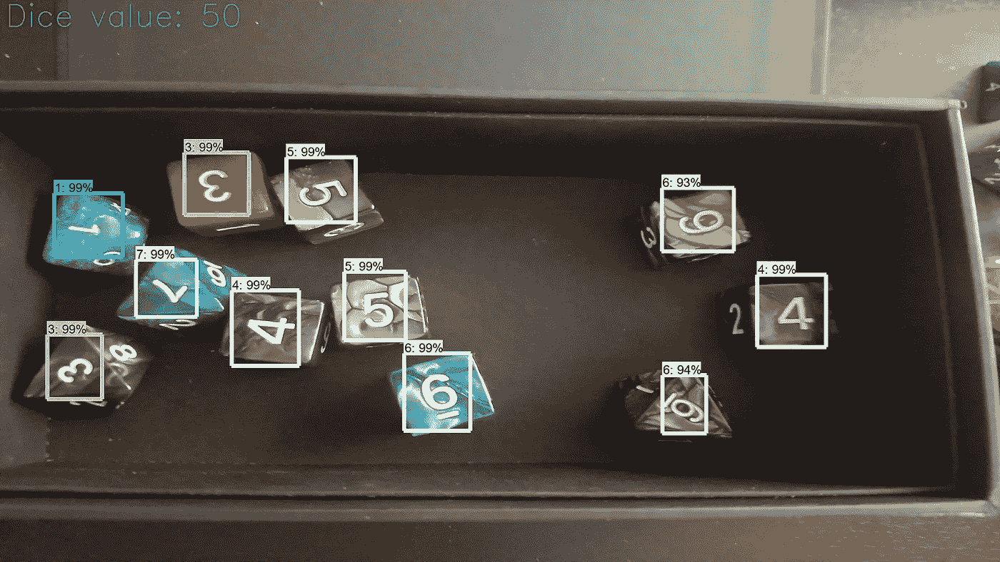

This problem is made a bit trickier for an object detection model because the dice can take on any orientation, with a standard CNN I could probably just train a 12 class model with a lot of data augmentation. For this object detection model I just add more data

# D&D 骰子

这只是对 D&D 中使用的不同骰子的一个快速概述。

左后方的金字塔形骰子是一个四面的骰子，通常形状像金字塔，如果你踩上去会像菱角一样疼。它的右边是一个 12 面骰子，每个面是一个五边形。中间的是 20 面骰子，除了 D&D 中的伤害外，还用于其他掷骰。中间的左边是标准的 6 面骰子。中间的右边是一个 8 面骰子，是两个相互堆叠的金字塔。前面的两个骰子是 10 面骰子的两个版本，一个显示 0-9 的值，另一个以 10 为增量显示 10-90。另一个变化是，模型需要考虑 0 和 10 都是 10。D10 有两种格式，因为它们偶尔用于滚动百分点。所以你可以想象，非标准六面骰子的使用给这个问题增加了一点复杂性，使得分析变得愉快。


Etsy metal dice set. (left to right) back: d4, d12, middle: d6, d20, d8, front: d10, d10

现在，让我们言归正传。

# 数据收集和注释

为此，我需要一个相当大的数据集骰子。我可能只是从互联网上抓取图像，但对于这个用例，我的想法是我可以安装一个网络摄像头或类似的东西来获得骰子的俯视图。因为这个用例，我想我可以在我简单的黑色骰子盒里滚动它们，这样可以提供一致的背景，并用我的相机拍摄滚动的照片。然后，我可以用骰子位置和类别来注释照片，以便在对象检测模型中使用。

我第一次掷骰子时拍了 200 张照片。每个图像将有 6-10 个骰子。一些图片只有一种类型的骰子，而其他图片有混合。在注释了这些图片并训练了第一个模型后，我发现它的表现不如我所希望的那样好。所以我又加了 200 卷并做了注解。这个我会在最后再讲。

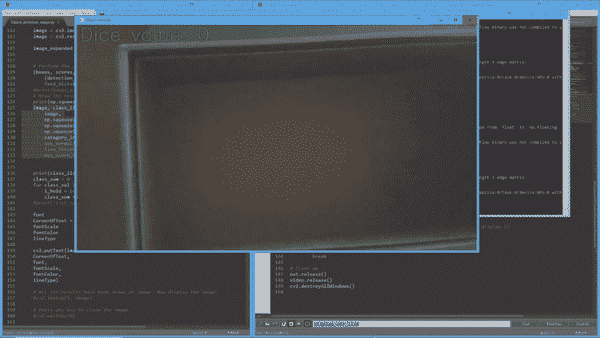

为了给我的 400 张图片添加注释，我使用了 [labelimg](https://github.com/tzutalin/labelImg) ,就像我对其他物体检测管道一样。一旦你习惯了热键系统，它会加速注释过程。此外，注释这些对象检测数据集比图像分割数据集更容易。

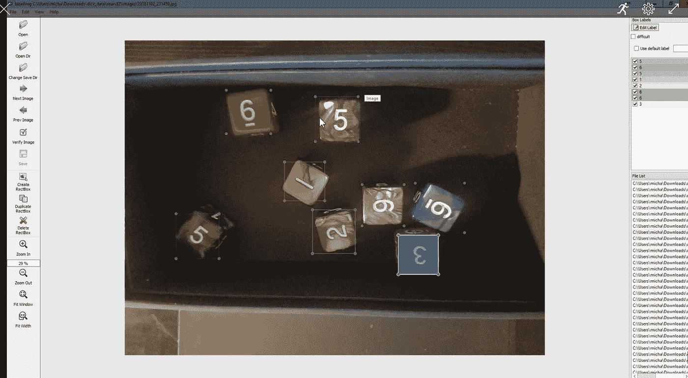

Fair to say I got tired of looking at dice after annotating 2400–3000 of them…

所以一旦 400 张图片和大约 2400 个骰子被标注(大概花了 2 个小时？《夜魔侠》第三季的几集，我就可以开始训练模特了。

# 张量流对象检测配置

不久前，我配置了我的 Tensorflow 对象检测库，但在进行 windows 配置时，使用了由 [EdjeElectronics](https://github.com/EdjeElectronics/TensorFlow-Object-Detection-API-Tutorial-Train-Multiple-Objects-Windows-10) 提供的本教程作为指南。他用一个更快的 R-CNN 模型为纸牌搭建了一个 6 级检测器，你可以[在这里](http://download.tensorflow.org/models/object_detection/faster_rcnn_inception_v2_coco_2018_01_28.tar.gz)下载这个模型。我发现我在其他任务中使用这个模型取得了很好的成功，但是您也可以根据您的用例为其他人检查 T [ensorflow 模型动物园](https://github.com/tensorflow/models/blob/master/research/object_detection/g3doc/detection_model_zoo.md)。

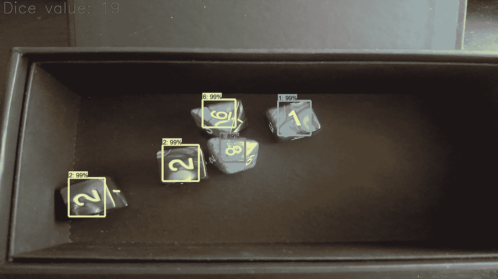

训练 Tensorflow 对象检测模型的基本过程是对一些数据集进行注释，从而得到包含图像注释的图像和 xml 文件。将它分成训练和测试文件夹。使用名为 xml_to_csv.py 的文件将这些注释转换成 CSV 格式，该文件指向包含测试和训练数据的文件夹。然后使用名为 generate_tf_record.py 的脚本为训练和测试拆分生成 TF 记录文件。这个 python 文件是您真正需要修改任何代码的第一个位置。我在注释器中的标签只是数字 1-12，当 python 读取它们时，它们以 int 的形式出现，所以最初我遇到了一个问题。我只需通过转换 generate_tf_record 脚本中的原始 row_labels 来修复它，以便将它们作为字符串读入。

```
def class_text_to_int(row_label):
    row_label = str(row_label) if row_label == '1':
        return 1
    elif row_label == '2':
        return 2
    elif row_label == '3':
        return 3
    elif row_label == '4':
        return 4
    elif row_label == '5':
        return 5
    elif row_label == '6':
        return 6 ... elif row_label == '12':
        return 12
    else:
        return none
```

> 随意查看 tf 记录和 xml 到 csv 脚本[这里](https://github.com/sugi-chan/dnd-dice-detector)

一旦您有了训练和测试分割的 TF 记录文件，您就可以很好地处理数据部分，并且只需要配置模型管道。

通过向 labelmap.pbtxt 文件添加标签映射来配置管道。您可以根据需要继续列出项目，我有一个“…”来显示标签 4-11，因为我不想在这里列出它们。

```
item {
  id: 1
  name: '1'
}

item {
  id: 2
  name: '2'
}

item {
  id: 3
  name: '3'
}...

item {
  id: 12
  name: '12'
}
```

现在剩下的就是使用更快的 R-CNN 配置文件来配置训练管道。

*   第九行。把 num_classes 改成你问题中的类的数量，对我来说是 12。
*   107 号线。将 fine_tune_checkpoint 更改为:您之前下载或从 model zoo 获得的模型中的“model.ckpt”文件。
*   第 123 和 125 行。在 train_input_reader 部分，将 input_path 和 label_map_path 更改为:指向 labelmap.pbtxt 和您生成的 train 记录文件。
*   132 号线。将 num_examples 更改为\images\test 目录中的图像数量。
*   第 137 和 139 行。在 eval_input_reader 部分，将 input_path 和 label_map_path 更改为:之前生成的 labelmap.pbtxt 和 test.record 文件的位置。

> 随意查看配置和 labelmap.pbtxt 文件[这里](https://github.com/sugi-chan/dnd-dice-detector/tree/master/training_dice)

与所有对象检测模型进行交互的方式非常相似，您只需调整它指向的文件，就可以开始了。因此，请随意测试您在模型动物园中找到的不同产品。

# 模特培训

现在一切都准备好了，我们可以开始了。您可以使用 train.py 或 model_main.py 文件运行模型。我仍然使用 train.py 文件，并且在 model_main.py 上有问题，暂时没有问题。

下面是我在 cmd 上输入的运行模型的例子。在我的对象检测文件夹中有许多训练管道，所以这个管道被称为“training_dice”。基本上，模型将使用您指向的配置文件运行，并在您标记的训练目录中记录模型检查点。

```
python train.py --logtostderr --train_dir=training_dice/ --pipeline_config_path=training_dice/faster_rcnn_inception_v2_pets.config
```

一旦你进入它，给 Tensorflow 30 秒到 1 分钟开始运行，你会看到它开始输出步骤，他们的损失，以及他们花了多长时间。此时，您可以启动 tensorboard，以便更容易地跟踪模型性能。见下文，但它非常简单，只需将 tensorboard 指向你用来存储检查点的文件夹，并给你一个查看模型性能的 URL。

```
tensorboard --logdir=training_dice
```

因此，我喜欢看的是分类损失及其随时间的趋势，这个训练图看起来很好，从高开始，随着时间的推移越来越好。我让它运行了 6 个小时左右，基本上 2 点睡觉，8 点醒来评估。不是最科学的，但性能始终低于 0.05。我在我做过的其他项目中发现这个截止值对这个模型很好，EdjeElectronics 也注意到了这个模型的优点。虽然它只走了 24K 步，所以我可能跑得更久，但我在早上感觉不耐烦了。

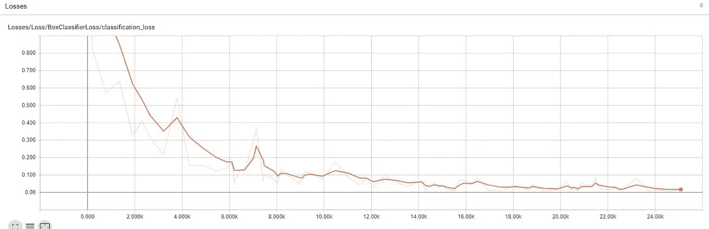

Training graph of the classification loss from the 12 class object detection model. Ran for around 6 hours.

# 调整 Tensorflow 可视化文件:

对于这个问题，我想做的不仅仅是将骰子面识别为某个类/值，还要将所有值相加，以提供屏幕上骰子值的计数。我发现实现这一点的简单方法是修改 Tensorflow 对象检测源库中的可视化函数，不仅输出印有盒子和标签的图像，还输出为盒子生成的原始类标签列表。

我修改了源实用程序可视化脚本中第 640 行附近的 visualize _ boxes _ and _ labels _ on _ image _ array 函数。我所做的只是添加代码来构建并返回一个类字符串列表。

```
class_list = []for box, color in box_to_color_map.items():
    class_list.append(box_to_display_str_map[box]) #added to get class listing
```

它返回的标签列表是一个列表列表，其中每个子列表都包含一个类名和一个以百分比表示的置信水平字符串。然后，我检查并清除列表值，以分离出类名，因为每个类名都是一个数字，我只需将所有类名相加，就可以得到给定帧中屏幕上检测到的所有骰子面的值。

在所有的计算完成后，我只写给定帧的骰子值等于类名的总和。

```
image, class_list = vis_util.visualize_boxes_and_labels_on_image_array(
        image,
        np.squeeze(boxes),
        np.squeeze(classes).astype(np.int32),
        np.squeeze(scores),
        category_index,
        use_normalized_coordinates=True,
        line_thickness=8,
        min_score_thresh=0.80)print(class_list)
    class_sum = 0
    for class_val in class_list:
        i_hold = int(class_val[0].split(":")[0])
        class_sum += i_holdfont                   = cv2.FONT_HERSHEY_SIMPLEX
    CornerOfText = (10,50)
    fontScale              = 2
    fontColor              = (0,255,0)
    lineType               = 2cv2.putText(image,'Dice value: '+str(class_sum), 
    CornerOfText, 
    font, 
    fontScale,
    fontColor,
    lineType)
```

> 请随意检查修改后的[可视化工具文件](https://github.com/sugi-chan/dnd-dice-detector/blob/master/visualization_utils.py)和修改后的[图像](https://github.com/sugi-chan/dnd-dice-detector/blob/master/Object_detection_image.py)或[视频](https://github.com/sugi-chan/dnd-dice-detector/blob/master/Object_detection_video.py)文件，以使用课程列表

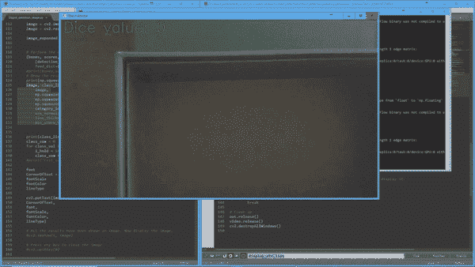

# 评估结果

总的来说，我认为这个模型做得相当好，给出了 12 个类，400 个样本，以及骰子形状和如何读取 8 对 10 对 12 面骰子的变化。然而，它仍然有改进的空间，例如，下面的第一个图像在最右边有一个骰子是 3，而不是检测到的 2。我发现这个相当奇怪，因为它甚至在正确的方向。第二张图片为 3，被归类为 8。这两个问题似乎都可以通过更多的数据扩充来解决。

然而，无论方向如何，检测骰子值的整个问题对于单个对象检测模型来说更加困难，因为它不具有与经典 CNN 中相同的数据扩充，以获得不同方向骰子的额外曝光。当我第一次训练模型时，它在奇怪方向的骰子上表现不佳，所以我将样本量增加了一倍，达到 400，这有助于解释这一点。但是即使这样做了，它仍然不总是得到正确的类。

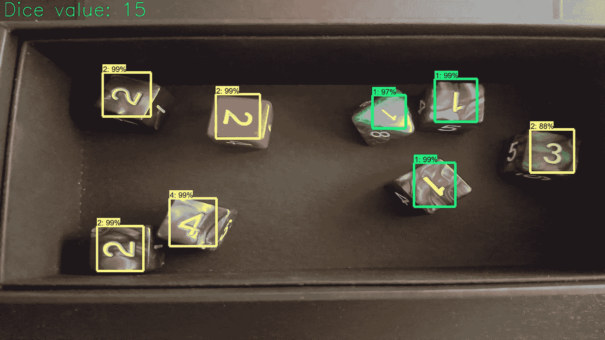

3 gets marked as a 2

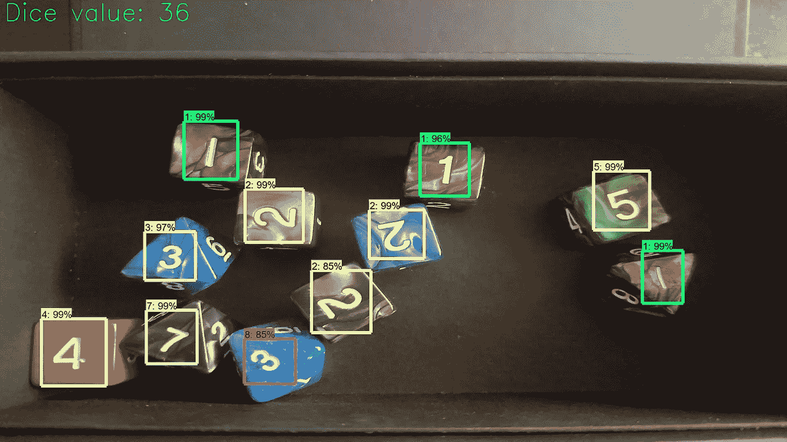

3 on the 8 sided die near the bottom gets marked with an 8 instead of the actual 3

我认为，当你知道图像中会有很多旋转变化时，处理这种情况的方法是建立一个第一阶段的模型，从图像中裁剪出物体，然后用翻转和旋转形式的大量数据增强来训练第二阶段的 CNN。

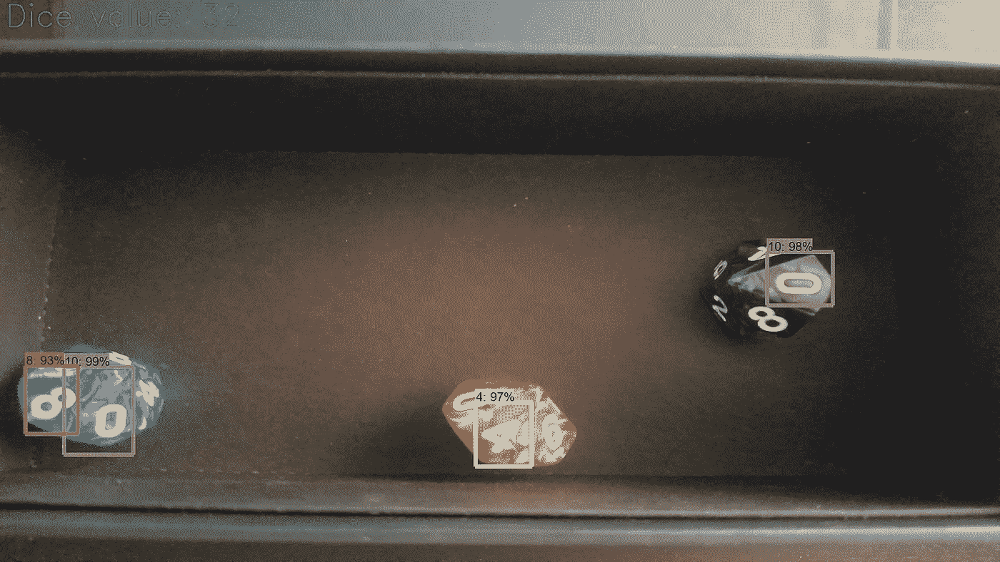

Depending on the orientation it does a good job of reading the 10 sided die. The die at the bottom has 4 or so values showing and I can see how it would be hard to read. The die on the right has a lot of values, but the top most one is reflecting light which probably makes it easier to detect. Another note is that for 10 sided dice, they show the 10 as either a 0 or a 10 depending on the dice.

下面是一个 12 面骰子的例子。在这一个中，它在检测它方面做得不错，但是因为我滚动这些最少的模型在跟踪数字 11 和 12 处有最少的暴露。

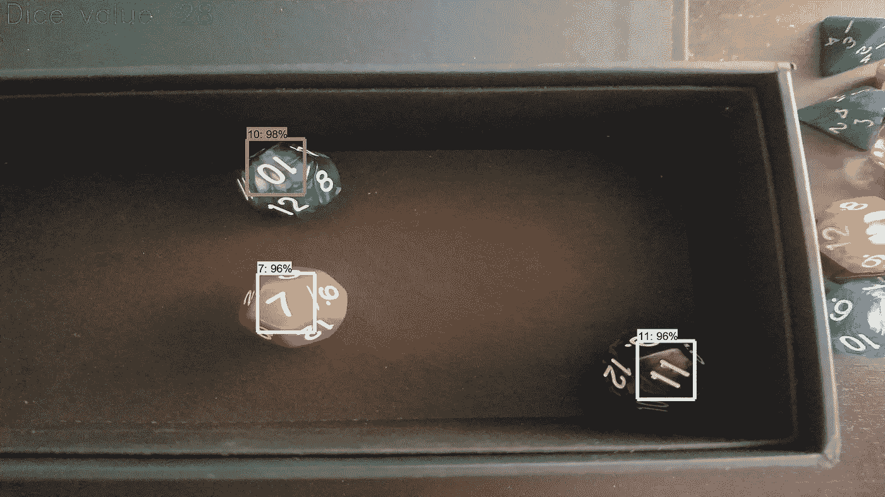

下面的 12 面骰子被归类为 2。如前所述，这可能是一个弱点，因为在我的数据集中滚动的 12 面骰子较少。我在掷骰子时有这种偏差，因为 D&D 使用的主要骰子是 6 面和 8 面骰子。随着 10 面和 12 面骰子越来越多地用于更难击中的法术和武器，但频率较低。


考虑到所有的事情，我认为这个模型对于一个相当小的 12 类分类数据集来说做得还不错。

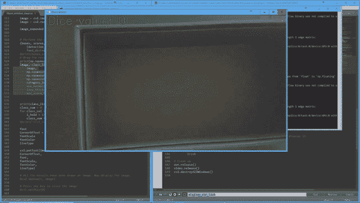

# 结束语

要在我的 D&D 游戏中使用这个功能，安装一个面朝下的摄像头并让它在游戏中运行是相当容易的。由于它是在英伟达 1080 GTX GPU 上运行的单一模型，因此在接近实时的情况下完成这项工作应该没有问题。有趣的事情可能是训练一个较小的模型来制作树莓派或类似的东西。当我把模型放在 raspberry pi 上时，最大的担心是处理能力相当有限，但一个版本的 SSD 移动网络应该可以做到这一点。

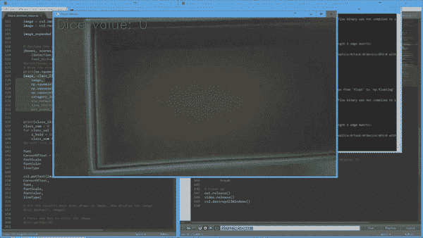

因此，虽然这个对象检测模型相当成功，但如果我对性能更挑剔，我可能会将其构建为两阶段流水线。首先在所有 400 幅图像上运行我的对象检测模型，提取 2400 个骰子面，并使用它来训练 12 路分类器。这是我关于如何构建它的第一个想法，但我想测试一个更大的多类对象检测模型，因为我通常不会在我完成的大多数任务中超过 3 个类。

然后，为了实现该流水线，对象检测器将处理原始图像以检测骰子面，然后后端 CNN 将确定可用于合计面值并返回骰子总值的类。

> 链接到完整的 github 回购[这里](https://github.com/sugi-chan/dnd-dice-detector)