# 手动计算梯度下降

> 原文：<https://towardsdatascience.com/calculating-gradient-descent-manually-6d9bee09aa0b?source=collection_archive---------1----------------------->

## 一步一步:神经网络背后的数学

Title image: [Source](https://c1.staticflickr.com/2/1834/42271822770_6d2a1d533f_b.jpg)

这就是我们的问题。我们有一个只有一层(为了简单起见)和一个损失函数的神经网络。这一层是一个简单的全连接层，只有一个神经元，许多权重 *w₁，w₂，w₃* …，一个偏置 *b* ，以及一个 ReLU 激活。我们的损失函数是常用的均方误差(MSE)。知道了我们的网络和损失函数，我们如何调整权重和偏差来最小化损失？

在[第一部分](/step-by-step-the-math-behind-neural-networks-490dc1f3cfd9)中，我们了解到，我们必须找到损失(或成本)函数的斜率，以便将其最小化。我们发现我们的成本函数是:

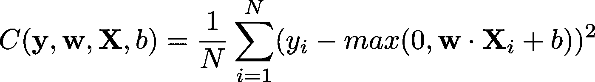

Image 1: Cost function

在第二部分中，我们学习了如何求偏导数。这很重要，因为这个函数中有不止一个参数(变量)可以调整。我们需要找到成本函数相对于权重和偏差的导数，偏导数就起作用了。

在[第三部分](/step-by-step-the-math-behind-neural-networks-d002440227fb)中，我们学习了如何求向量方程的导数。成本函数中的权重和偏差都是向量，因此学习如何计算包含向量的函数的导数是非常重要的。

现在，我们终于有了找到成本函数的导数(斜率)所需的所有工具！

# 神经元的梯度

我们需要逐步解决这个问题。让我们首先找到单个神经元相对于权重和偏差的梯度。

我们神经元的功能(伴随着激活)是:

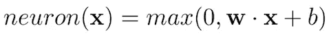

Image 2: Our neuron function

其中它将 **x** 作为输入，将其与权重 **w** 相乘，并添加偏差 *b* 。

这个函数实际上是其他函数的组合。如果我们让*f(***x***)=***w∙x***+b，*， *g(x)=max(0，x)* ，那么我们的函数就是*神经元(***x***)= g(f(***x***)*。我们可以用向量链法则来求这个函数合成的导数！

我们神经元的衍生物很简单:

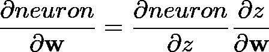

Image 3: Derivative of our neuron function by the vector chain rule

其中*z = f(***x***)=***w∙x***+b*。

这个导数有两个部分:相对于 **w** 的 *z* 的偏导数，以及相对于 *z* 的*神经元(z)* 的偏导数。

## z 相对于 **w** 的偏导数是多少？

*z* 有两部分: **w∙x** 和 *+b* 。先来看 **w∙x** 。

**w∙x** ，或者说点积，实际上就是向量中每个元素的元素乘法的总和。换句话说:

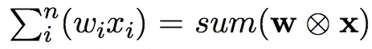

Image 4: Expanded version of **w∙x**, or the dot product

这又是一个函数的组合，所以我们可以写成**v**=**w**⊗**x**和 *u=sum(* **v** *)。*我们试图找出 *u* 相对于 **w** 的导数。在第三部分中，我们已经学习了这两个函数——逐元素的乘法和求和。它们的衍生物是:

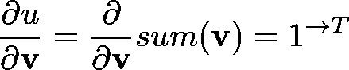

Image 5: Derivative of u with respect to v and derivative of v with respect to w; where u=sum(**w**⊗**x**)

(如果您不记得它们是如何推导出来的，请回头查看)

因此，由矢量链法则可知:

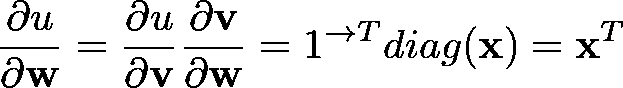

Image 6: Derivative of u with respect to w

就是这样！现在，让我们找出 z= *u+b* 的导数，其中 u= **w∙x** 相对于权重 **w** 和偏差 *b.* 记住，函数相对于不在该函数中的变量的导数为零，因此:

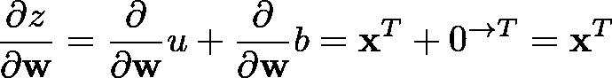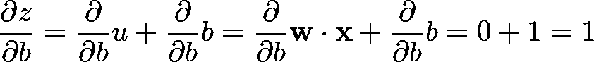

Image 7: Derivative of z with respect to the weights and biases, where z=sum(**w**⊗**x**)+b

就是这样！这两个是 u 关于权重和偏差的导数。

## 神经元(z)对 z 的偏导数是多少？

*神经元(z)=max(0，z)=max(0，sum(***w**⊗**x***)+b)。*

max(0，z)函数只是将所有负值视为 0。因此，该图看起来像这样:

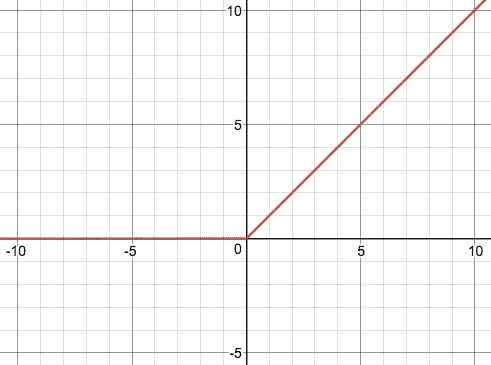

Image 8: Max(0,z) // [Source](https://www.desmos.com/calculator)

查看该图，我们可以立即看到导数是分段函数:对于所有小于或等于 0 的 z 值，导数为 0，对于所有大于 0 的 z 值，导数为 1，或者:

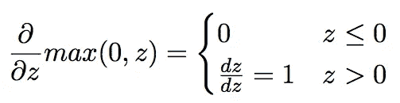

Image 9: Derivative of max(0,z)

现在我们有了这两部分，我们可以将它们相乘，得到神经元的导数:

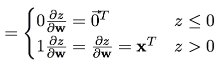

Image 10: Derivative with respect to the weights of our neuron: *max(0, sum(***w**⊗**x***)+b)*

并将 z= **w∙x** *+b* 代入:

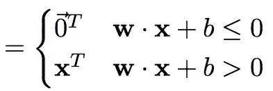

Image 11: Substituting **w∙x***+b for z*

瞧啊。我们得到了神经元相对于其重量的导数！类似地，我们可以对偏差使用相同的步骤:

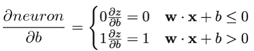

Image 12: Derivative of our neuron with respect to bias

这就对了。我们现在有了神经网络中一个神经元的梯度！

# 损失函数的梯度

在[第 1 部分](https://medium.com/@reina.wang/step-by-step-the-math-behind-neural-networks-490dc1f3cfd9)中定义的我们的损失函数是:

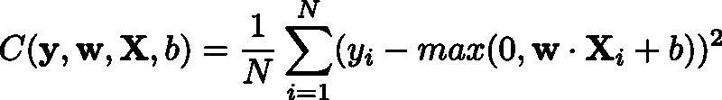

Image 13: Loss Function

我们可以立即确定这是一个函数的组合，它需要链式法则。我们将把中间变量定义为:

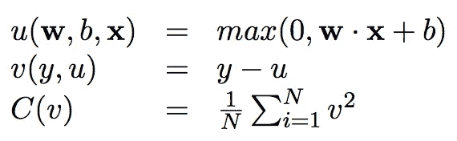

Image 14: Intermediate variables for loss function

*注意，这里的 *u* 和 *v* 与上一节使用的 *u* 和 *v* 不同。

让我们首先计算相对于重量 **w** 的梯度。

## 相对于重量的梯度

*u* 简单来说就是我们的神经元函数，我们之前已经解决了。因此:

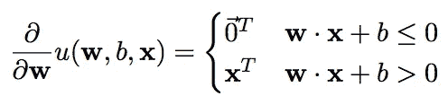

Image 15: Derivative of u=*max(0, sum(***w**⊗**x***)+b) with respect to the weights*

*v(y，u)* 简单来说就是 *y-u* 。因此，我们可以利用分配性质，代入 *u* 的导数，求出它的导数(相对于 **w** ):

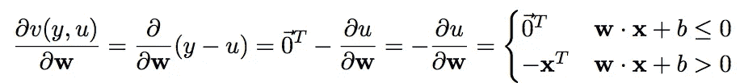

Image 16: Derivative of v=y-u with respect to the weights

最后，我们需要找到整个成本函数相对于 **w** 的导数。利用链式法则，我们知道:

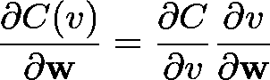

Image 17: Derivative of cost function

让我们先找到等式的第一部分，即 *C(v)* 相对于 *v* 的偏导数:

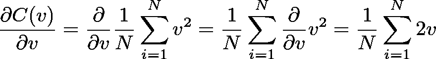

Image 18: Derivative of cost function with respect to v

从上图(图片 **16** ，我们知道 *v* 相对于 **w** 的导数。为了求 C(v)的偏导数，我们将两个导数相乘:

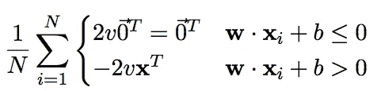

Image 19: Derivative of cost function with respect to **w**

现在用 *y-u* 代替 *v* ，用 *max(0，* **w∙x** + *b)* 代替 *u* :

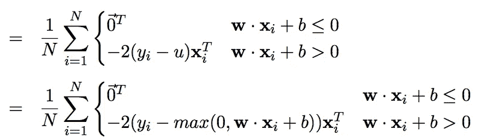

Image 20: Derivative of cost function with respect to **w**

由于 *max* 函数在我们分段函数的第二行，这里 **w∙x** + *b* 大于 0，所以 *max* 函数将总是简单地输出 **w∙x** + *b* 的值:

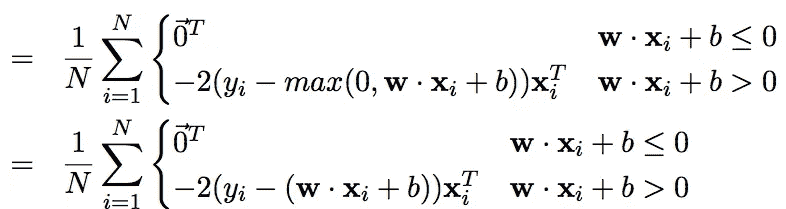

Image 21: Derivative of cost function with respect to **w**

最后，我们可以将求和移到分段函数中，并稍微整理一下:

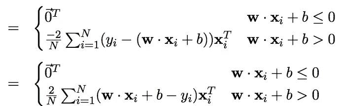

Image 22: Derivative of cost function with respect to **w**

就是这样！我们对重量求导！然而，这意味着什么呢？

**w∙x** + *b-y* 可以解释为误差项——神经网络的预测输出与实际输出之间的差异。如果我们称这个误差项为 ei，我们的最终导数为:

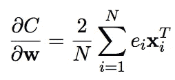

Image 23: Derivative of cost function with respect to **w** represented with an error term

这里，误差越大，导数越高。换句话说，导数代表斜率，或者说，为了使误差最小化，我们必须移动多少重量。如果我们的神经网络刚刚开始训练，并且具有非常低的精度，则误差将会很高，因此导数也将会很大。因此，我们将不得不迈出一大步，以尽量减少我们的错误。

您可能会注意到，这个梯度指向更高的成本，这意味着我们不能将梯度添加到我们当前的权重中，这只会增加误差，并使我们远离局部最小值。因此，我们必须用导数减去当前重量，以便更接近最小化损失函数:

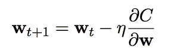

Image 24: Gradient descent function

这里η代表学习率，我们作为程序员可以设定。学习率越大，步幅越大。然而，设置太大的学习率可能会导致采取太大的步骤，并跳出局部最小值。更多信息，请查看[这篇关于梯度下降的文章](/the-beginners-guide-to-gradient-descent-c23534f808fd)和[这篇关于设置学习率的文章](/https-medium-com-reina-wang-tw-stochastic-gradient-descent-with-restarts-5f511975163)。

## 相对于偏差的梯度

同样，我们有中间变量:

Image 25: Intermediate variables for loss function

我们还有 *u* 相对于之前计算的偏差的导数值:

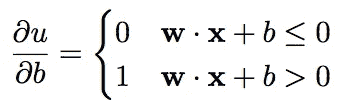

Image 26: Derivative of u with respect to the bias.

同样，我们可以利用分配性质，代入 *u* 的导数，求出 *v* 相对于 *b* 的导数:

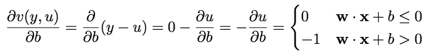

Image 27: Derivative of v with respect to the bias

同样，我们可以使用向量链规则来找到 *C* 的导数:

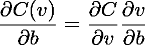

Image 28: Derivative of cost function with respect to the bias

*C* 相对于 *v* 的导数与我们为重量计算的导数相同:

Image 29: Derivative of cost function with respect to v

将两者相乘得到 *C* 相对于 *b* 的导数，用 *y-u* 代替 *v* ，用 *max(0，* **w∙x** + *b)* 代替 *u* ，得到:

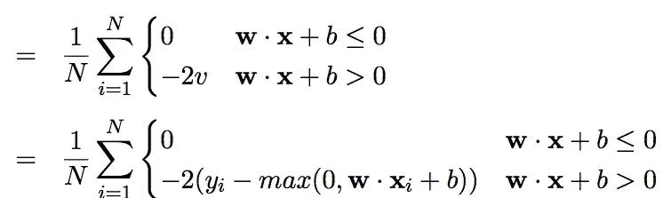

Image 30: Derivative of cost function with respect to the bias

同样，因为第二行明确声明了 **w∙x** + *b* > 0，所以 *max* 函数将始终只是 **w∙x** + *b.* 的值

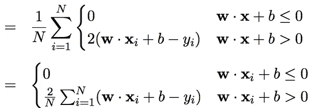

Image 31: Derivative of cost function with respect to the bias

就像之前一样，我们可以代入一个误差项，e = **w∙x** + *b-y* :

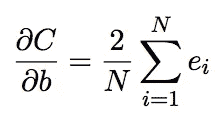

image 32: Derivative of cost function with respect to the bias, represented with an error term

就像关于权重的导数一样，这个梯度的大小也与误差成比例:误差越大，我们向局部最小值前进的步伐就越大。它还指向更高成本的方向，这意味着我们必须从当前值中减去梯度，以更接近局部最小值:

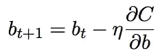

Image 33: Gradient descent function for the bias

恭喜你写完这篇文章！这很可能不是一个容易的阅读，但你一直坚持到最后，并成功地手动梯度下降！

正如我在本系列第 1 部分中所说的，如果不理解每行代码背后的底层数学和计算，我们就无法真正理解“创建神经网络”的真正含义，也无法理解支持我们编写的每个函数的复杂性。

我希望这些方程和我的解释是有意义的，并帮助你更好地理解这些计算。如果你有任何问题或建议，不要犹豫，在下面留下评论！

如果您还没有，请在此阅读第 1、2 和 3 部分:

*   [第一部分:简介](/step-by-step-the-math-behind-neural-networks-490dc1f3cfd9)
*   [第二部分:偏导数](/step-by-step-the-math-behind-neural-networks-ac15e178bbd)
*   [第三部分:向量微积分](/step-by-step-the-math-behind-neural-networks-d002440227fb)

此处下载原论文[。](https://arxiv.org/abs/1802.01528)

如果你喜欢这篇文章，别忘了留下一些掌声！如果您有任何问题或建议，请在下面留下您的评论:)