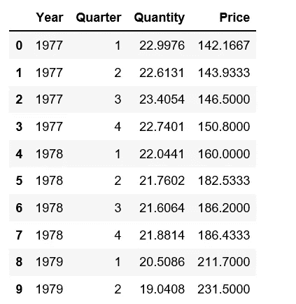
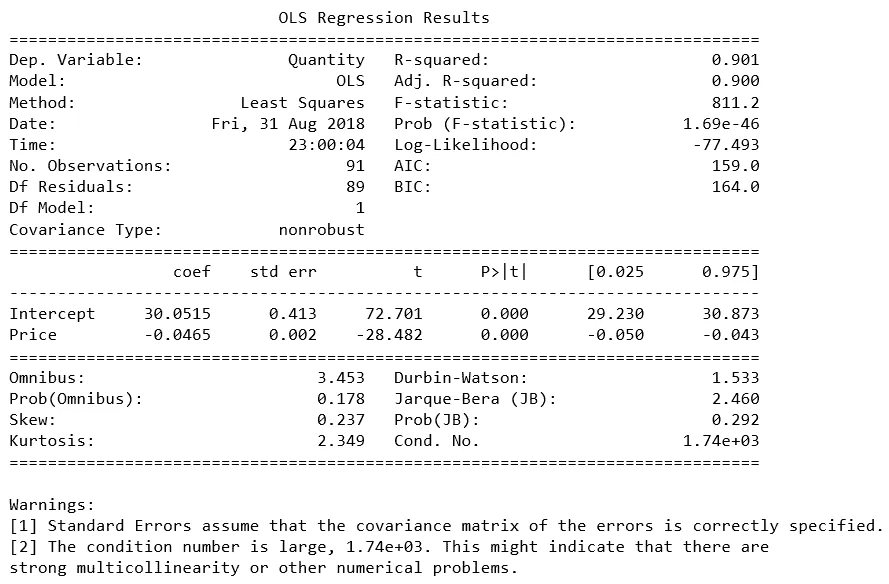
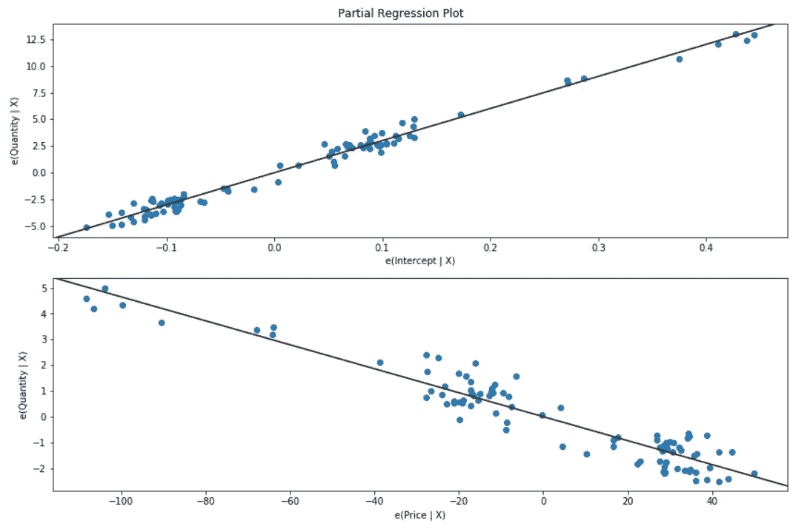
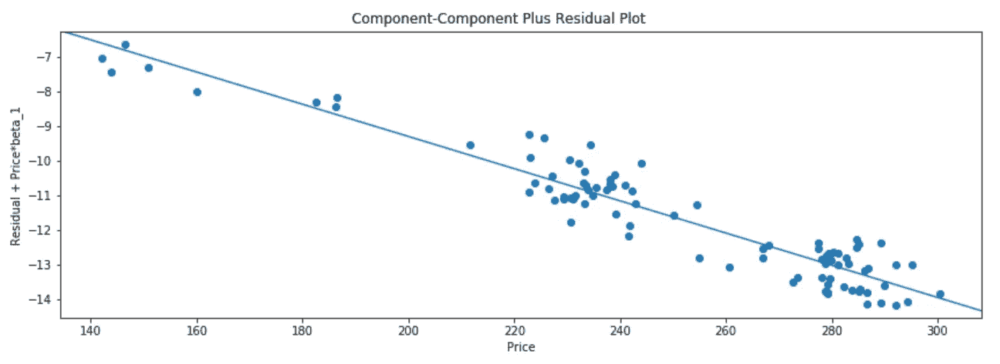
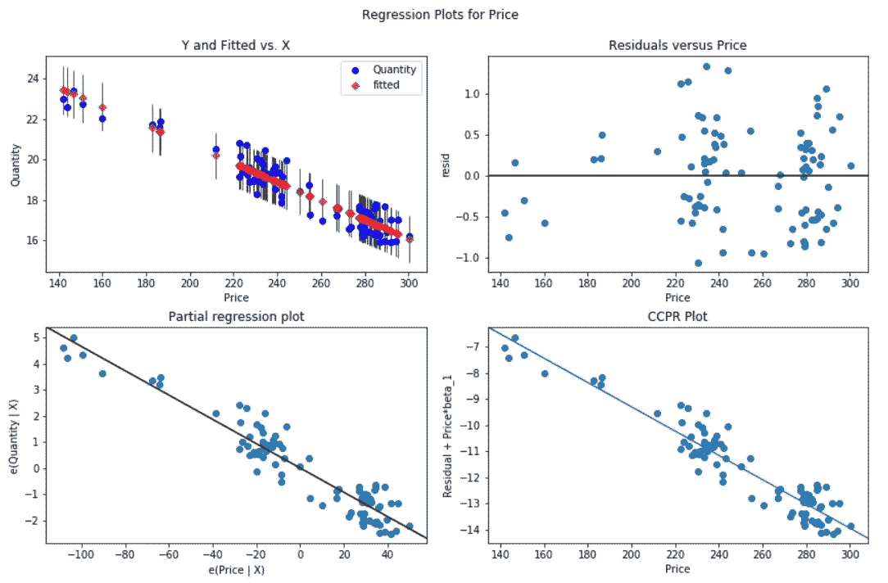
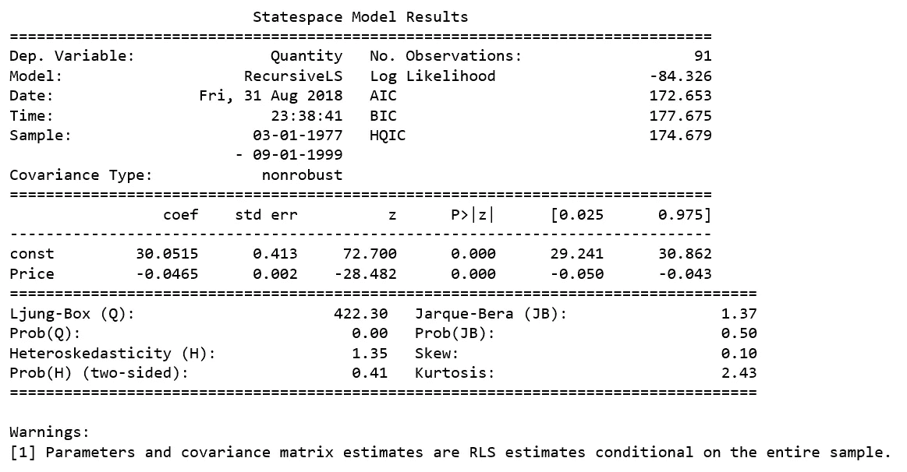
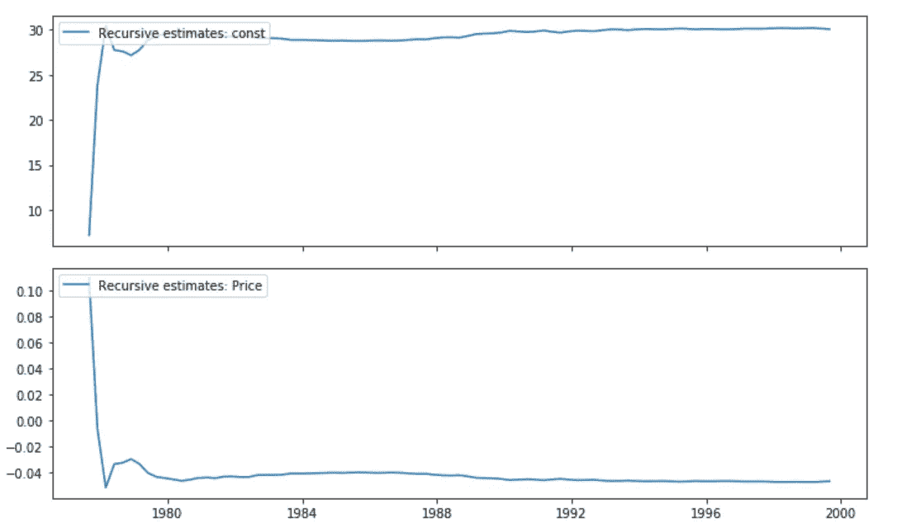
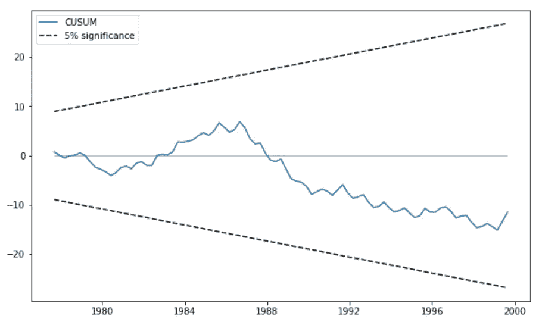

# 需求的价格弹性，用 Python 进行统计建模

> 原文：<https://towardsdatascience.com/calculating-price-elasticity-of-demand-statistical-modeling-with-python-6adb2fa7824d?source=collection_archive---------2----------------------->


Photo credit: Pexels

## 如何实现利润最大化

[**需求价格弹性**(**【PED】**)](https://en.wikipedia.org/wiki/Price_elasticity_of_demand)是经济学中用来表示当只有价格变化时，商品或服务的需求量对其价格变化的反应性，或[弹性](https://en.wikipedia.org/wiki/Elasticity_(economics))。更准确地说，它给出了价格变化 1%时需求量的百分比变化。

在经济学中，弹性是衡量需求或供给对价格的敏感程度。
在营销中，消费者对产品价格变化的敏感程度。

它回答了以下问题:

*   "如果我降低一种产品的价格，销量会增加多少？"
*   “如果我提高一种产品的价格，会如何影响其他产品的销售？”
*   “如果一种产品的市场价格下降，这将在多大程度上影响企业愿意向市场供应的数量？”

我们将构建一个线性回归模型来估计 PED，我们将使用 [Python 的 Statsmodels](https://www.statsmodels.org/dev/about.html#module-statsmodels) 来估计我们的模型，并进行统计测试和数据探索。我们开始吧！

# 数据

我们将研究牛肉价格和需求数据，这些数据可以从[这里](https://raw.githubusercontent.com/susanli2016/Machine-Learning-with-Python/master/beef.csv)下载。

```
%matplotlib inlinefrom __future__ import print_function
from statsmodels.compat import lzip
import numpy as np
import pandas as pd
import matplotlib.pyplot as plt
import statsmodels.api as sm
from statsmodels.formula.api import olsbeef = pd.read_csv('beef.csv')
beef.head(10)
```



Figure 1

# **回归分析**

## **普通最小二乘(OLS)估计**

```
beef_model = ols("Quantity ~ Price", data=beef).fit()
print(beef_model.summary())
```



Figure 2

**观察:**

1.  小 P 值表明我们可以拒绝价格对数量没有影响的零假设。
2.  高 R 平方表明我们的模型解释了很多反应的可变性。
3.  在回归分析中，我们希望我们的回归模型有显著的变量，并产生高的 R 平方值。
4.  我们将展示图表来帮助更直观地解释回归分析结果。

```
fig = plt.figure(figsize=(12,8))
fig = sm.graphics.plot_partregress_grid(beef_model, fig=fig)
```



Figure 3

该趋势表明，预测变量(价格)提供了关于响应(数量)的信息，并且数据点不会进一步偏离回归线，并且给定从大约 29 到 31 的预测区间，预测非常精确。

## **分量-分量加残差(CCPR)图**

CCPR 图通过考虑其他独立变量的影响，提供了一种判断一个回归变量对响应变量的影响的方法。

```
fig = plt.figure(figsize=(12, 8))
fig = sm.graphics.plot_ccpr_grid(beef_model, fig=fig)
```



Figure 4

正如你所看到的，用价格解释的数量变化之间的关系是确定的线性关系。没有太多的观察对关系产生相当大的影响。

## **回归图**

我们使用 plot _ regress _ exog 函数来快速检查关于单个回归变量(在本例中为价格)的模型假设。

```
fig = plt.figure(figsize=(12,8))
fig = sm.graphics.plot_regress_exog(beef_model, 'Price', fig=fig)
```



Figure 5

## **递归最小二乘**

最后我们应用[递归最小二乘(RLS)滤波器](https://en.wikipedia.org/wiki/Recursive_least_squares_filter)来研究参数不稳定性。

在 RLS 估计之前，我们将处理数据并创建一个日期时间索引。

```
beef['Year'] = pd.to_datetime(beef['Year'], format="%Y")from pandas.tseries.offsets import *
beef['Date'] = beef.apply(lambda x:(x['Year'] + BQuarterBegin(x['Quarter'])), axis=1)
beef.drop(['Year', 'Quarter'], axis=1, inplace=True)
beef.set_index('Date', inplace=True)beef.head(10)
```


Figure 6

## RLS 估计

```
endog = beef['Quantity']
exog = sm.add_constant(beef['Price'])mod = sm.RecursiveLS(endog, exog)
res = mod.fit()print(res.summary())
```



Figure 7

RLS 模型递归地计算回归参数，所以有多少数据点就有多少估计值，汇总表只显示对整个样本估计的回归参数；这些估计相当于 OLS 估计。

## **RLS 图**

我们可以生成给定变量的递归估计系数图。

```
res.plot_recursive_coefficient(range(mod.k_exog), alpha=None, figsize=(10,6));
```



Figure 8

为了方便起见，我们使用 plot_cusum 函数直观地检查参数的稳定性。

```
fig = res.plot_cusum(figsize=(10,6));
```



Figure 9

在上面的图中，CUSUM 统计量没有超出 5%的显著性范围，因此我们无法在 5%的水平上拒绝稳定参数的零假设。

源代码可以在 [Github](https://github.com/susanli2016/Machine-Learning-with-Python/blob/master/Price%20Elasticity%20of%20Demand.ipynb) 上找到。祝你周末愉快！

参考资料:

[统计模型](https://www.statsmodels.org/stable/index.html)