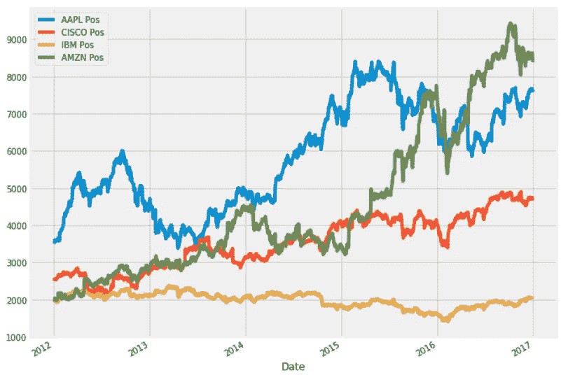
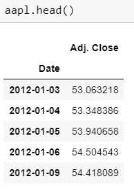
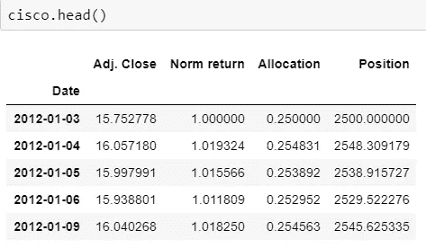
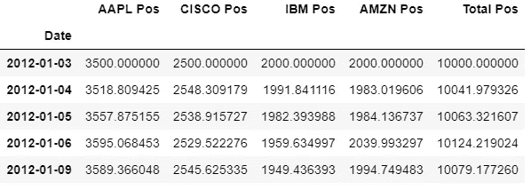
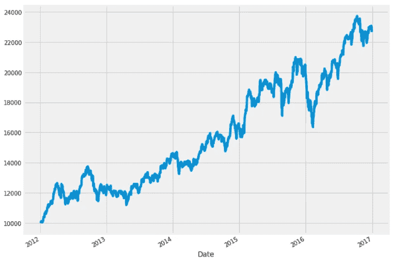
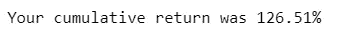
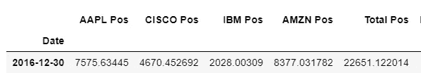
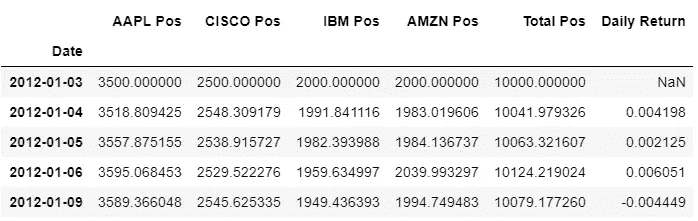
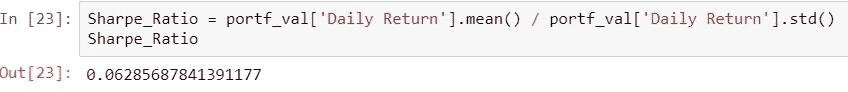
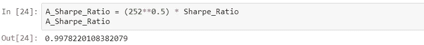

# 使用 Python 计算投资组合的夏普比率

> 原文：<https://towardsdatascience.com/calculating-sharpe-ratio-with-python-755dcb346805?source=collection_archive---------2----------------------->

在本文中，我将向您展示如何使用 Python 来计算包含多只股票的投资组合的夏普比率。**夏普比率是指每单位波动率**(在股票市场中，波动率代表资产的风险)所赚取的超过无风险利率的平均回报。它允许我们使用数学来量化平均日收益率和日收益率的波动性(或标准差)之间的关系。

简单来说，夏普比率越大，风险调整后的回报越有吸引力。

根据我们的风险偏好，这种计算也有助于我们找到投资组合中每只股票的“最佳”配置。

 [## 用 Python 绘制马科维茨有效边界

### 基于历史数据，这个边界将允许你根据你的期望优化你的投资组合配置…

towardsdatascience.com](/python-markowitz-optimization-b5e1623060f5)  [## 可视化你的股票的一些关键财务指标

### 使用 Python 创建一个仪表盘，帮助您对公司做出更明智的投资决策

medium.datadriveninvestor.com](https://medium.datadriveninvestor.com/visualizing-some-key-financial-metrics-for-your-stocks-f987ea37035e) 

> 一旦你准备好创建一个完全定制的仪表板来跟踪你的投资组合，我将通过两个课程教你[！](https://fneves.podia.com/)

首先，我们需要股票价格数据。我将使用四个简单的文件，有两列——日期和收盘价。你可以用自己的数据，或者在 Quandl 里找点东西，这个用途很好。我们有 4 家公司——亚马逊、IBM、思科和苹果。苹果数据的前五行打印如下。

> AAPL = PD . read _ CSV(' AAPL _ 关闭'，索引 _ 列= '日期'，解析 _ 日期=真)

After reading the files, this is what all the dataframes should look like (aapl, amzn, cisco and ibm)

现在我们需要为每个股票数据框架添加几列。通过几个简单的循环的*,我们可以将标准化收益、我们在投资组合中的股票配置以及每只股票每天的头寸价值相加。首先是归一化收益，它只是将每个收盘价除以数据中的最后一个收盘价。*

> 对于 stock_df in (aapl，cisco，ibm，amzn):
> stock _ df[' Norm return ']= stock _ df[' adj . Close ']/stock _ df . iloc[0][' adj . Close ']

我们假设我们的投资组合将包括:苹果 35%，思科 25%，IBM 和亚马逊各 20%。

> 对于 stock_df，在 zip 中的分配((aapl，cisco，ibm，amzn)，[.35，. 25，. 2，. 2]):
> stock _ df[' Allocation ']= stock _ df[' Norm return ']*分配

循环的最后一个*将添加一列位置值。假设我们的投资组合规模在第一天是 10k。我们只需将它与已经调整到标准化回报的分配列相乘。*

> 对于 stock_df in (aapl，cisco，ibm，amzn):
> stock_df['位置'] = stock_df['分配']*10000

这是现在四个数据帧的样子。对于每一天，你都知道你的头寸对四只股票的价值。

为了在一个表中得到我们所有的头寸，我们可以从每只股票中分离出列“Position ”,并将其合并到一个名为“portf_val”的新数据框架中。然后，我们重命名列以匹配每只股票。

> all_pos = [aapl['position']，cisco['Position']，ibm['Position']，AMZN[' Position ']
> portf _ val . columns =[' AAPL Pos '，'思科 Pos '，' IBM Pos '，' AMZN Pos ']
> portf _ val = PD . concat(all _ Pos，axis=1)

我们还可以创建一个列来显示所有头寸的总和，这就是我们的总头寸。

> portf _ val[' Total Pos ']= portf _ val . sum(axis = 1)
> portf _ val . head()

从这里，我们实际上可以绘制一些图表，以了解在我们的数据中的所有日子里，我们的投资组合价值发生了什么。

> 将 matplotlib.pyplot 导入为 PLT
> PLT . style . use(' fivethirtyeight ')
> portf _ val[' Total Pos ']。plot(figsize=(10，8))

它实际上表现得非常好(不要忘记，大约从 2009 年开始，我们一直处于牛市之中！).我们的个股怎么样？他们表现如何？

> portf_val.drop('总位置'，轴=1)。plot(figsize=(10，8))

我们可以看到亚马逊(绿色)表现很好，但另一方面，IBM(黄色)表现不佳。这里有一个很好的例子来说明为什么多样化很重要！

让我们看看我们的累计回报率是多少。

> cumulative _ return = 100 *(portf _ val[' Total Pos '][-1]/portf _ val[' Total Pos '][0]-1)
> print('您的累计回报为{:.2f}% '。format(cumulative_return))

output of the print statement above

我们可以检查 portf_val 的最后一行，看看我们的投资组合值多少钱。

> portf_val.tail(1)

Our portfolio value grew from 10k to more than 22.5k

126.5%是非常体面的回报！我们将向我们的 *portf_val* dataframe 添加另一列。这一次，我们将添加每天的百分比变化，因此在下面的公式中为 1。日回报率对于计算夏普比率很重要。

> portf_val['每日回报'] = portf_val['总头寸']。pct_change(1)

The first daily return is a non-value since there is no day before to calculate a return

现在是时候计算夏普比率了。这个公式非常简单直观:从预期投资组合回报中去掉你从无风险投资中获得的回报率。将结果除以投资组合的标准差。如今，由于利率如此之低，人们普遍认为无风险利率为零，因为如果你把钱存入储蓄账户(无风险资产的一般例子)，你只能得到很少的钱。

所以这个公式就是日收益的平均值，除以日收益的标准差。在 Python 中，它看起来像这样:

> S harpe_Ratio = portf_val['日线回报']。mean() / portf_val['每日回报']。标准()

为了完成这篇文章，我们需要按年计算夏普比率，因为我们是从每天的数值计算出来的。一年有 252 个交易日，所以年化的简单方法是用夏普比率乘以 252 的平方根。

就是这样！我们有年度夏普比率，我们准备在未来的文章中使用它来优化我们的股票配置。

如果你对 Python 的金融分析感兴趣，有两本很棒的书，几乎涵盖了你需要的所有内容:

*   金融 python:[https://amzn.to/3SE6Mu0](https://amzn.to/3SE6Mu0)
*   用 Python 写金融理论:【https://amzn.to/3SC4Vpq 

另外， [Investopedia](https://www.investopedia.com/terms/s/sharperatio.asp) 是定义这些指标的最佳资源之一。

欢迎留下任何问题或评论，或通过 [LinkedIn](https://www.linkedin.com/in/fabioneves) 联系我。披露:上面的一些链接是附属链接。这意味着，对你来说零成本，如果你通过链接完成购买，我将赚取代销商佣金！