# 数据科学中的微积分及其应用

> 原文：<https://towardsdatascience.com/calculus-in-data-science-and-its-uses-3f3e1b5e5b35?source=collection_archive---------2----------------------->

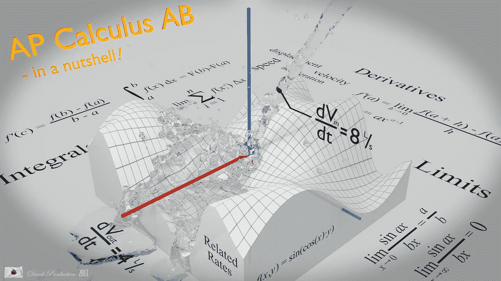

> 微积分是一种以纯粹形式发展起来的抽象理论。

微积分，更确切地说是分析，是数学的一个分支，研究数量的变化率(可以解释为曲线的斜率)以及物体的长度、面积和体积。微积分分为微分和积分。

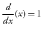

Differentiation

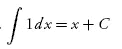

Integration

> 微积分这个词来源于拉丁语，意思是“小石头”，
> 因为它就像通过观察小碎片来理解事物一样。

微积分是数学的一个固有领域，尤其是在许多机器学习算法中，你不可能想到跳过这门课程来学习数据科学的本质。

**微分学**把东西切成小块，看看它是怎么变化的。

**积分学**把小块连在一起(积分)算出有多少。

现在，我再次强烈推荐您观看来自 [3blue1brown 频道](https://www.youtube.com/channel/UCYO_jab_esuFRV4b17AJtAw)的《微积分精粹》视频，该视频教授数据科学中所需的一些微积分重要支柱。

如果你有任何一种过敏或者没有通过视频学习的心情，可以参考这个。它涵盖了微积分的所有基本思想。

 [## 微积分菜单

### 微积分这个词来源于拉丁语，意思是“小石头”，因为它就像通过看东西来理解一样…

www.mathsisfun.com](https://www.mathsisfun.com/calculus/) 

我希望你已经理解了微分和积分的基础知识。数据科学家几乎对每个模型都使用微积分，机器学习中微积分的一个基本但非常优秀的例子是梯度下降。

# 梯度下降

> 梯度衡量的是，如果你稍微改变输入，函数的输出会有多大的变化。

假设你有一个球和一个碗。无论你把球滑到碗里的什么地方，它最终都会落在碗底。

正如你看到的，这个球沿着一条路径，在碗的底部结束。我们也可以说球在碗的底部下降。正如你从图像中看到的，红线是碗的坡度，蓝线是球的路径，随着球的坡度的减小，这被称为梯度下降。

在我们的机器学习模型中，我们的目标是降低输入数据的成本。成本函数用于监控 ML 模型预测中的误差。因此，最小化这一点，基本上意味着尽可能获得最低的误差值，或者提高模型的精度。简而言之，我们在调整模型参数(权重和偏差)的同时，通过迭代训练数据集来提高精确度。

让我们考虑一下，我们有一个用户的数据集，包括他们在某些科目上的分数和他们的职业。我们的目标是通过考虑一个人的分数来预测这个人的职业。

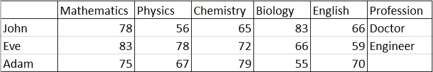

在这个数据集中，我们有约翰和夏娃的数据。有了约翰和夏娃的参考数据，我们不得不预测亚当的职业。

现在把学科里的分数想成一个梯度，把专业想成底层目标。你必须优化你的模型，以便它在底部预测的结果应该是准确的。使用 john 和 Eve 的数据，我们将创建梯度下降并调整我们的模型，这样，如果我们输入 John 的分数，那么它应该预测梯度底部的医生的结果，Eve 也是如此。这是我们训练过的模型。现在，如果我们给模型的主题打分，那么我们就可以很容易地预测这个职业。

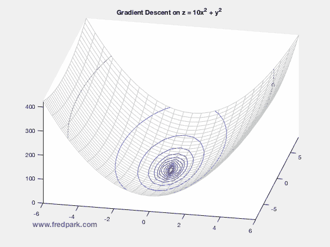

理论上这是梯度下降，但计算和建模，梯度下降需要微积分，现在我们可以看到微积分在机器学习中的重要性。

首先让我们从你现在知道的话题开始。线性代数。让我们首先使用线性代数和它的公式为我们的模型。

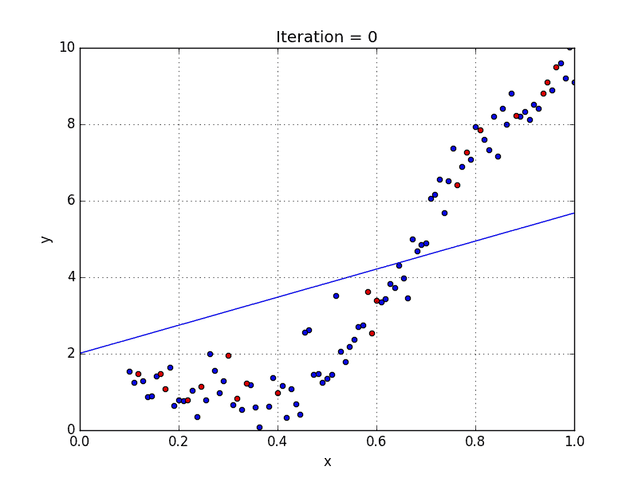

我们可以在这个模型中使用的基本公式是

y = m*x +b

在哪里，

y =预测值，m =斜率，x =输入，b = y-截距。

解决这类问题的标准方法是定义一个误差函数(也称为成本函数),用于衡量给定线的“好”程度。该函数将接受一个`(m,b)`对，并根据直线与数据的吻合程度返回一个错误值。为了计算给定线的误差，我们将遍历数据集中的每个`(x,y)`点，并对每个点的`y`值和候选线的`y`值(在`mx + b`计算)之间的平方距离求和。传统的做法是平方这个距离，以确保它是积极的，并使我们的误差函数可微。

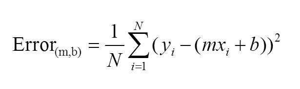

更适合我们的数据的线(其中更好是由我们的误差函数定义的)将产生更低的误差值。如果我们最小化这个函数，我们将得到数据的最佳线。由于我们的误差函数由两个参数(`m`和`b`)组成，我们可以将其视为一个二维表面。这是我们数据集的样子:

这个二维空间中的每个点代表一条线。函数在每一点的高度就是那条线的误差值。您可以看到，有些线产生的误差值比其他线小(例如，更符合我们的数据)。当我们运行梯度下降搜索时，我们将从这个表面上的某个位置开始，向下移动以找到误差最小的线。

在微积分的本质视频中，你已经看到，为了计算斜率，我们使用微分。

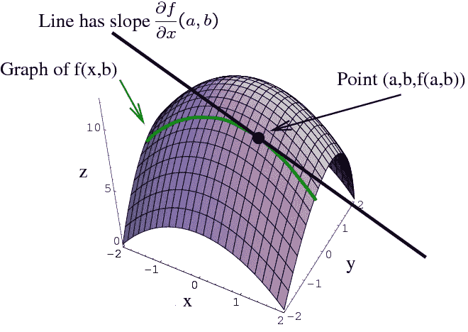

The graph of a function z=f(x,y)z=f(x,y) is a surface, and fixing y=by=b gives a curve (shown in green). The partial derivative ∂f∂x(a,b)∂f∂x(a,b) is the slope of the tangent line to this curve at the point where x=ax=a.

为了对这个误差函数进行梯度下降，我们首先需要计算它的梯度。坡度就像指南针一样，总是指引我们下坡。为了计算它，我们需要对误差函数求导。由于我们的函数是由两个参数定义的(`m`和`b`)，我们需要计算每个参数的偏导数。这些衍生工具的结果是:

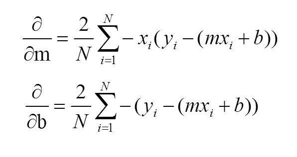

我们现在有了运行梯度下降所需的所有工具。我们可以初始化我们的搜索，从任何一对`m`和`b`值(即任何一条线)开始，让梯度下降算法在我们的误差函数上朝着最佳线向下行进。每一次迭代都会将`m`和`b`更新为一条线，该线产生的误差比前一次迭代稍低。使用上面的两个偏导数计算每次迭代的移动方向。

**学习速率**变量控制着我们在每次迭代中走下坡路的幅度。如果我们迈得太大，我们可能会跳过最小值。然而，如果我们采取小步骤，将需要多次迭代才能达到最小值。

虽然我们能够对学习梯度下降有所了解，但还有几个我们无法讨论的额外概念值得注意。其中一些包括:

*   **凸性**–在我们的线性回归问题中，只有一个最小值。我们的误差表面是凸起的。不管我们从哪里开始，我们最终都会达到绝对最小值。一般来说，情况不必如此。梯度搜索可能会陷入局部极小值。有几种方法可以减轻这种情况(例如，[随机梯度搜索](http://en.wikipedia.org/wiki/Stochastic_gradient_descent))。

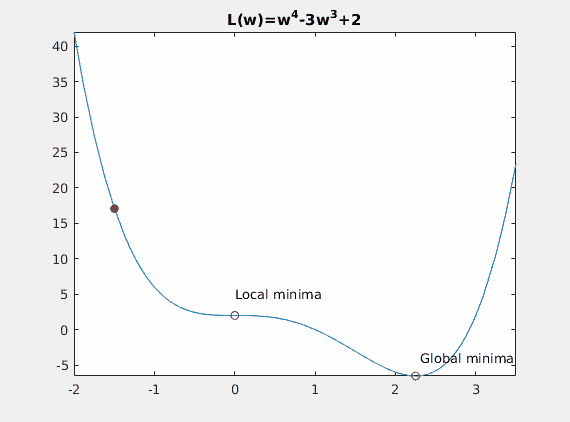

*   **收敛**–我们没有讨论如何确定搜索何时找到解决方案。这通常是通过寻找迭代间误差的微小变化来实现的(例如，梯度接近零的地方)。

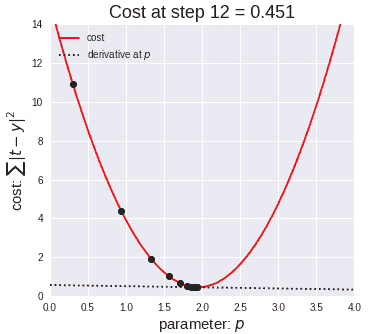

# 多元微积分

现在让我们深入学习多变量微积分，这将在多变量数据中教授微积分，我们最终会在现实生活中得到这些数据。

 [## 多变量微积分|可汗学院

### 免费学习数学、艺术、计算机编程、经济学、物理学、化学、生物学、医学、金融…

www.khanacademy.org](https://www.khanacademy.org/math/multivariable-calculus) 

> 要获得最新的更新、提示和任何你想要的或有问题的东西，只需在评论中发表。

## 在那之前…

## 快乐编码:)

别忘了拍手拍手拍手…

# 参考

 [## 多变量微积分|可汗学院

### 免费学习数学、艺术、计算机编程、经济学、物理学、化学、生物学、医学、金融…

www.khanacademy.org](https://www.khanacademy.org/math/multivariable-calculus)  [## 微积分-维基百科

### 它有两个主要分支，微分学(关于瞬时变化率和曲线斜率)，和…

en.wikipedia.org](https://en.wikipedia.org/wiki/Calculus)  [## 练习微积分|太棒了

### 采取有指导的、基于解决问题的方法来学习微积分。这些汇编提供了独特的视角和…

brilliant.org](https://brilliant.org/calculus/)