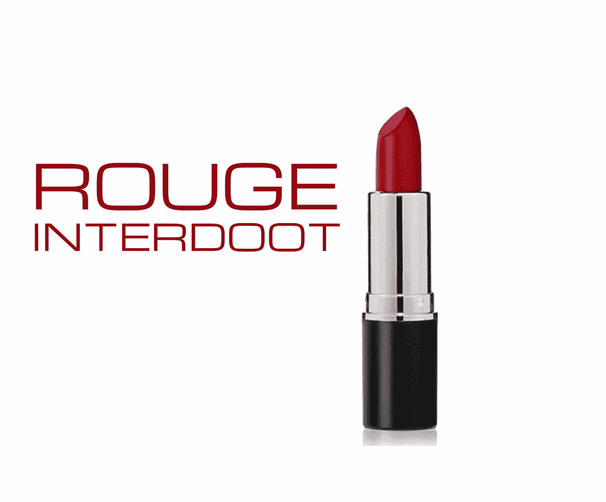
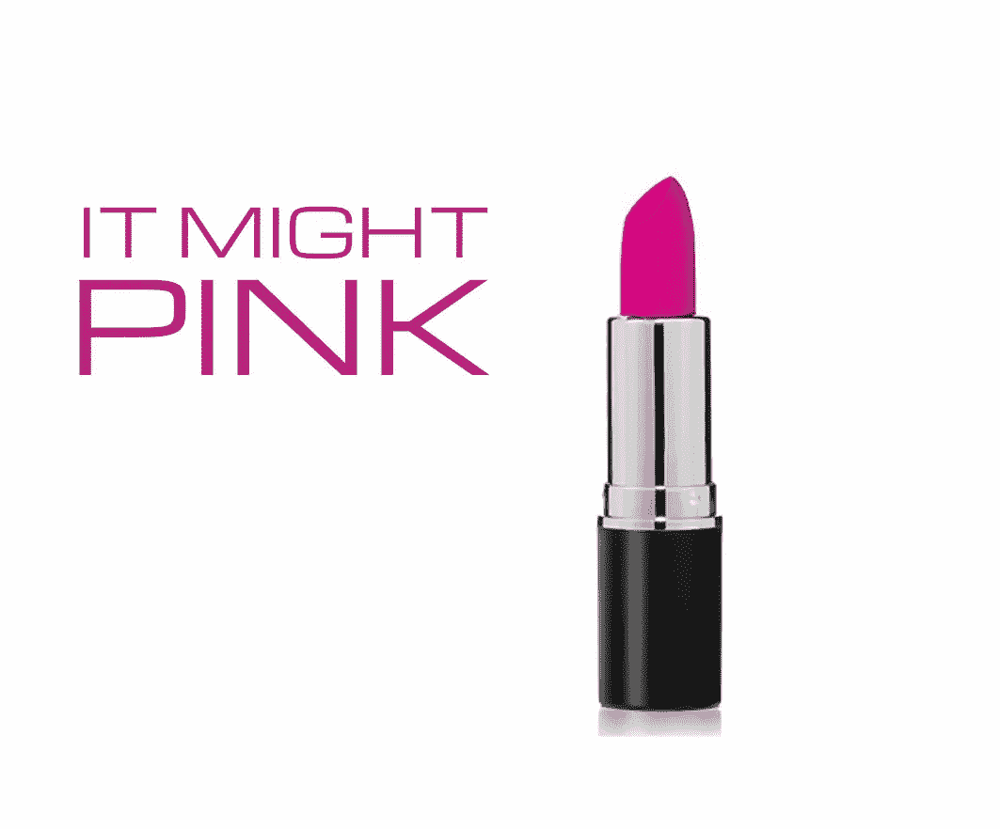
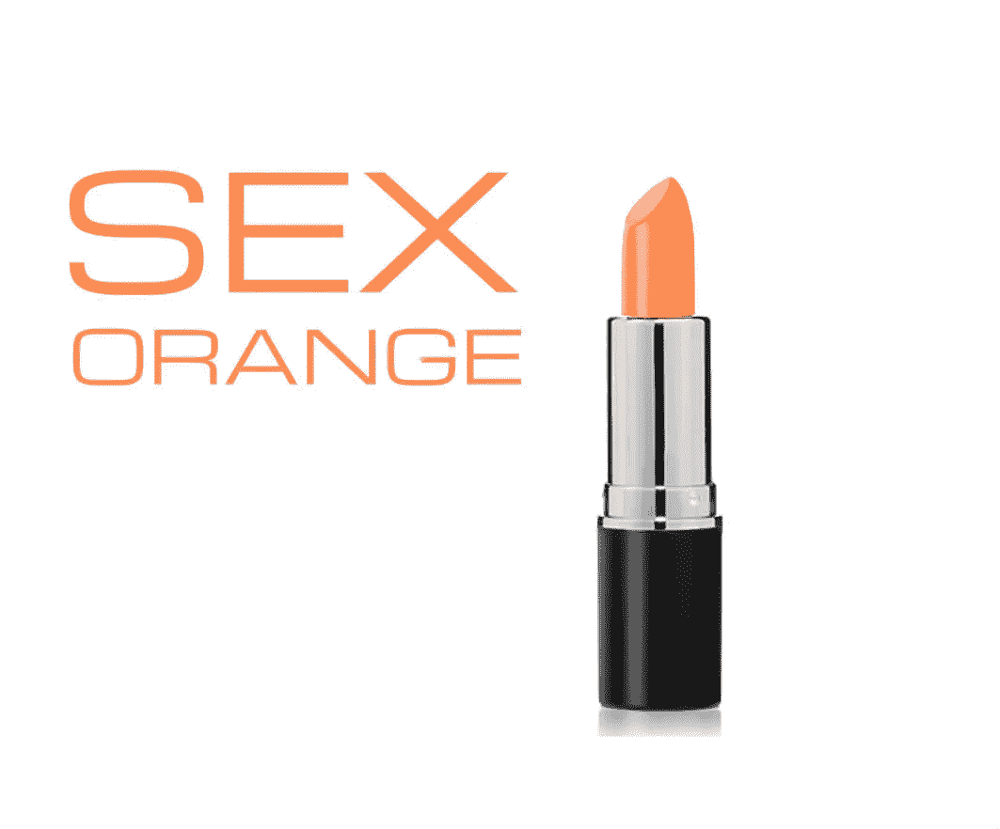
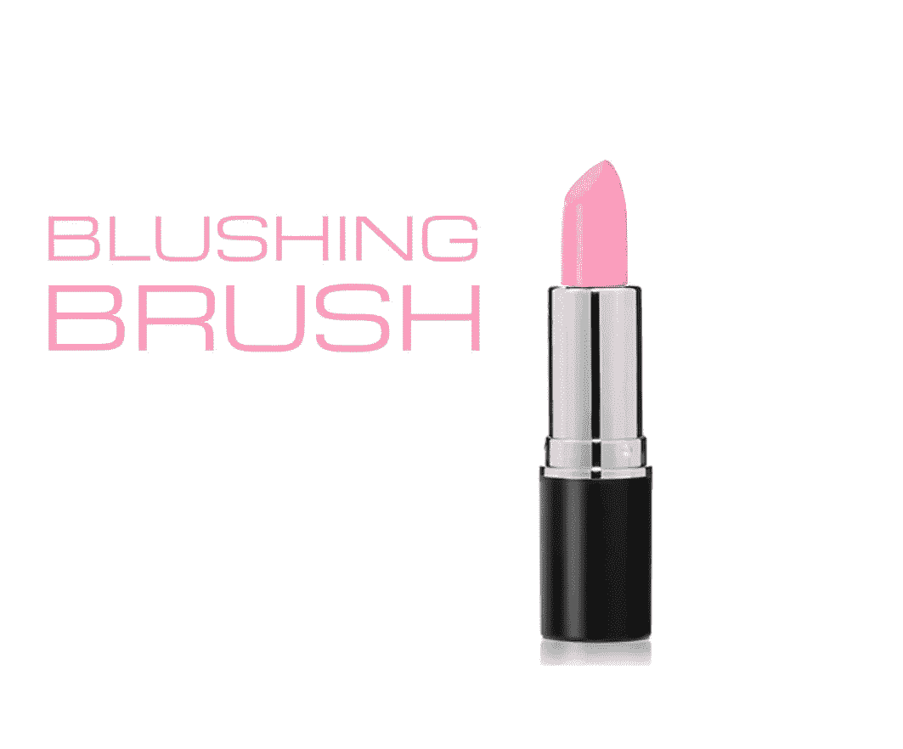

# 电脑能说出口红的颜色吗？

> 原文：<https://towardsdatascience.com/can-a-computer-name-lipstick-colors-1897a8208b17?source=collection_archive---------6----------------------->

我经常想知道是谁给化妆品的颜色命名的。如果你从来没有浏览过当地药店的化妆品通道，你可能不会注意到区分无穷无尽的口红颜色的调情标签。例如，露华浓出售大胆的淡紫色，敢于裸体，富家女红，可亲吻的粉红色和无情的葡萄干。

根据我的直觉，这些口红的名字遵循某种不言而喻的公式，我想知道计算机是否可以学习它们的模式并产生新的模式。我从丝芙兰网站上购买了数百种唇色(包括香膏、唇彩、眼线笔和口红)，还从露华浓等药店购买了其他颜色。我将这个数据集输入到一个神经网络中，这是一个深度学习模型，可以学习文本的结构，并可以对任何经过训练的材料进行自己的再现。你可以在这里得到我自己用的模型[。](https://github.com/jcjohnson/torch-rnn)

这是它想出来的，以自制插图为特色。从我的最爱开始…

还有更多…

> 凉鞋太阳
> 
> 黑暗的扑通声
> 
> 玫瑰犯罪
> 
> 吹玫瑰
> 
> 糖潘趣酒
> 
> 玫瑰上的性爱
> 
> Pop 购物桃
> 
> 把它烤成珊瑚色
> 
> 玫瑰色
> 
> 克朗布罗斯
> 
> 性感
> 
> 曼·布朗
> 
> 朱岳鹏·皮卡特
> 
> 我的虱子
> 
> 波普空心珍珠
> 
> 爱情 Snop
> 
> 棒棒糖
> 
> 胭脂人民
> 
> 卡洛
> 
> 热红色米色
> 
> 淡紫色的血
> 
> 赤裸裸的不友好

**方法说明**

虽然我能够收集到数百个口红颜色的名称，但就神经网络可用的原始文本而言，这实际上是一个非常小的数据集，因为这些名称很少超过 2-3 个单词。当神经网络拥有大量训练数据时，它们往往表现最佳。我用来获得更好的训练的一个廉价而肮脏的技巧是简单地通过重复几次唯一名称的列表来扩大训练集。我担心这将导致过度拟合和简单地重复训练集名称，但在这种情况下没有。我训练了一个 3 层 256 节点的网络，在温度刻度盘上找到了一个“最佳点”。太低了，而网络大多一次又一次地产生了“粉红”这样的常用词。太高了，它吐出胡言乱语。但是在 0.45-0.6 左右，我得到了一些非常好的新口红名字，这些名字几乎是可信的。