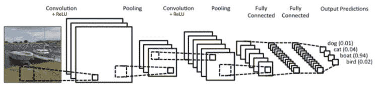
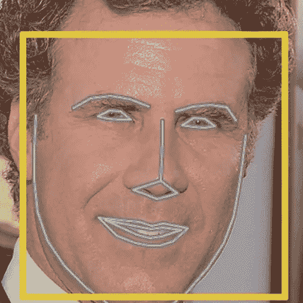

# 一个简单的 CNN 能像面部识别一样区分红发人吗？

> 原文：<https://towardsdatascience.com/can-a-simple-cnn-work-as-well-as-facial-recognition-for-differentiating-redheads-18596b05fdec?source=collection_archive---------3----------------------->

简单的卷积神经网络(CNN)在区分图像方面工作得非常好，但它在区分人脸方面也能工作得一样好吗？面部识别当然会在算法中使用 CNN，但它们要复杂得多，这使得它们在区分面部方面更有效。

在我的小而有趣的项目中，我想测试一个简单的有 3 层卷积层的 CNN 如何区分我和其他红发男人。我认为这将是一个有趣的项目，因为人们似乎总是把我和其他红发人搞混，所以我想知道人工智能是否也会这样做。

我将讨论的内容:

*   我的假设是什么
*   我如何着手这个项目
*   我的方法的缺陷
*   结果

## 我的假设是什么:

我曾经和简单的 CNN 一起工作，把狗和猫区分开来，效果非常好，所以我也相信一个简单的 CNN 在区分我和其他有 3 个卷积层的红头发的时候有 80%的准确率。

## 我如何着手这个项目:

## 简单 CNN:

CNN 要想做好，需要大量的图片作为参考。我在网上获得了 1300 张其他红发男性的照片，并给自己拍了大约 400 张照片。1300 张其他红发人的照片由 15 名年龄在 20-30 岁之间的不同男子组成，在许多不同的背景下，他们的脸清晰可见。我的照片大多是用不同的背景和服装自拍的。我的脸也出现在每张照片中。

[https://www.clarifai.com/technology](https://www.clarifai.com/technology)

我不想太深入了解 CNN 是如何工作的，但如上所述，它有一个卷积层、池层、全连接层和输出层。这是非常高的水平，因为有不同的激活功能，惩罚和 softmax 功能也涉及。

我决定在我的模型中使用三个卷积层和池层，ReLu 作为激活函数。我本来可以在我的模型中添加更多的卷积层，但我认为即使对于我正在使用的 GPU (AWS)来说，它的计算量也会变得太大。

考虑到只有 400 张我自己的照片和 1300 张其他红发男人的照片的不平衡的阶层，我包括了 50%的退出率来帮助弥补这个差异。

## 亚当·盖特基的人脸识别:

我利用了一个由 [ageitgey](https://github.com/ageitgey/face_recognition) 构建的人脸识别库，其中他们使用 dlib 来构建。据称，“该模型在野生基准中的[标记人脸上的准确率为 99.38%。”](http://vis-www.cs.umass.edu/lfw/)

如果你看了[亚当·盖特基的](https://medium.com/@ageitgey/machine-learning-is-fun-part-4-modern-face-recognition-with-deep-learning-c3cffc121d78) Medium 帖子，就会深入了解这是如何运作的。

> 首先，看一张照片，找出照片中的所有面孔
> 
> 第二，专注于每一张脸，并能够理解即使一张脸转向怪异的方向或在光线不好的情况下，它仍然是同一个人。
> 
> 第三，能够挑选出你可以用来区别于其他人的面部特征——比如眼睛有多大，脸有多长，等等。
> 
> 最后，将这张脸的独特特征与你认识的所有人进行比较，以确定这个人的名字。

Result of locating the 68 landmark features on your face

当用它来区分自己和其他红发人时，效果非常好。只是为了好玩，我试着用在我的狗身上，但是没用。在我 12 岁时的旧照片上使用时，它也不起作用。当然，即使对人眼来说，这也变得更加复杂。

## 我的方法的缺陷:

我的方法最大的缺陷是没有足够的图片和不平衡的数据。

为什么会有这些可能的问题？

*   CNN 需要大量的图片才能正常工作。很多时候 CNN 模型使用数百万张图片，当然这并不总是必要的，但会导致更好的结果。
*   不平衡的数据会导致过度拟合，这是不好的。例如，如果 90%的数据属于第 1 类，10%属于第 2 类，那么模型将会假设所有数据都属于第 1 类。为了帮助这个过程，我引入了退出作为惩罚措施，但是引入合成采样或者只是给自己拍更多的照片可能是有益的。

## 结果

我的 CNN 模型工作得非常好，准确率高达 94%！然而，如前所述，一些陷阱可能会提高这种准确性。当我使用 ageitgey 的人脸检测库时，它每次都能识别我，然而我只尝试了 50 次。鉴于 Adam Geitgey 发现的 99.38%的准确率，在区分人脸时使用人脸识别显然是有意义的。然而，简单的美国有线电视新闻网似乎在区分我和我的红发男同胞方面做得很好。这个小项目产生了有趣的结果，我很高兴人工智能能把我和其他红头发区分开来，而陌生人却不能:)！