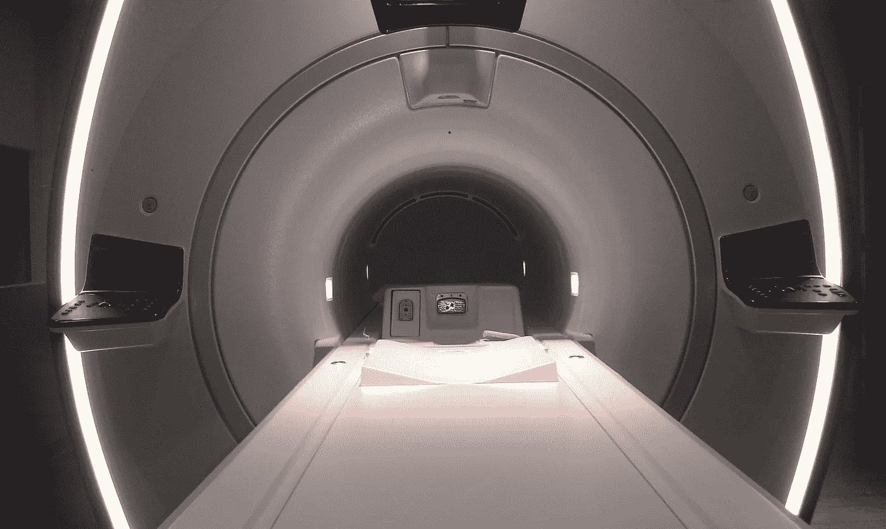
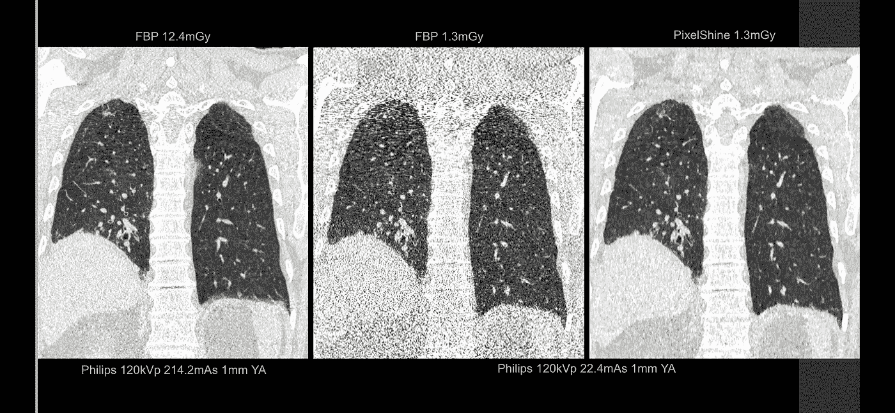
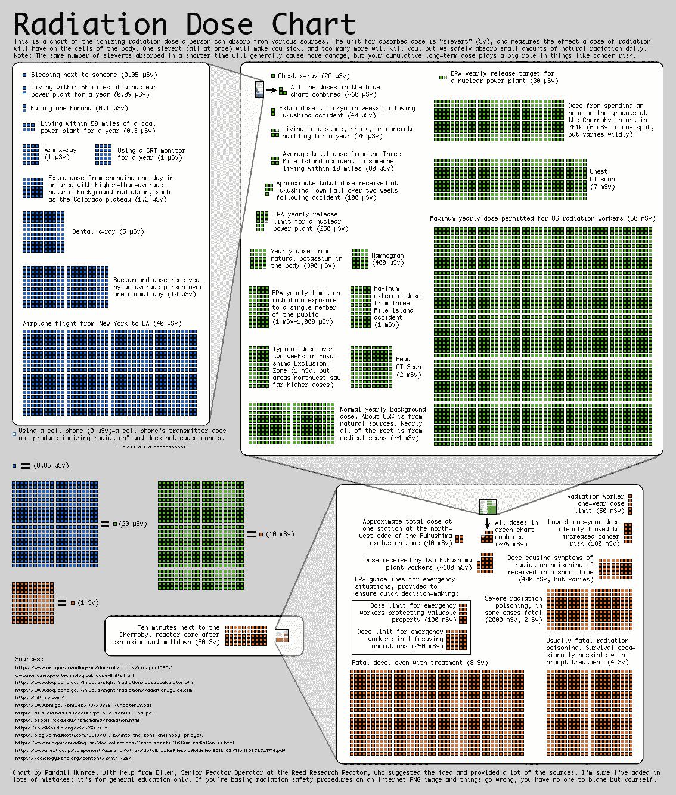

# 人工智能能做 10 分钟的核磁共振吗？

> 原文：<https://towardsdatascience.com/can-ai-enable-a-10-minute-mri-77218f0121fe?source=collection_archive---------4----------------------->

MRI 机器(磁共振成像)是一头笨重的野兽。站在超过 7 英尺高，像一辆家用汽车一样宽，重量超过一吨，不断发出令人不安的滴答“嘶嘶”声，不完全是一件对病人友好的医疗设备。

也可能是致命的。任何近在咫尺的铁磁性物体都会以加速的速度被强大的磁场吸走，消灭其路径上的任何东西。再加上你必须躺在其中的导致幽闭恐惧症的隧道(大约 60-70 厘米宽，平躺时刚好够你的鼻子通过)，它一旦启动就会发出令人震惊的嘈杂混乱的撞击声，加上在整个过程中(长达一个小时)需要绝对静止不动，你就可以开始理解为什么病人对他们的 MRI 扫描有点紧张了。

一位病人向我描述它为“一个活棺材……当死神从另一边大声撞击时，我们有足够的时间去思考人生和来世”。

那么，为什么我们医生要让我们的病人经历这种经历呢？不是残忍，而是善良。核磁共振成像是医学技术的现代奇迹，是英国人引以为豪的发明，它让临床医生可以看到人体内部的精致细节，而没有 X 射线或 CT 扫描带来的任何副作用或辐射风险。人体解剖很大程度上是基于水的(氢和氧原子)，磁共振利用这种生化组成，通过使用强大的磁场梯度来控制体内每个氢原子的方向，在释放它们之前将它们排列在一个统一的方向上，并让它们以只有微调接收器才能检测到的频率旋转。它背后的物理学是复杂而令人震惊的，由此产生的图像是非常简单的惊人。

病人为这种优秀所必须付出的小小代价是长时间呆在被嘈杂噪音包围的静止的禁闭室内。

目前…

在匹兹堡举行的最后一次年度[医学成像信息学学会](http://siim.org/page/SIIM2017) (SIIM)会议 2017 上，学者和医生聚集在一起讨论放射学的最新研究。展出了数百张科学海报和演示文稿，来自医学成像所有子领域的专家们带来了最新的理论和突破。一个评委小组宣布第一名获奖的研究海报来自宾夕法尼亚大学，题为“[优化低剂量计算机断层扫描数据的机器学习算法的诊断质量](http://c.ymcdn.com/sites/siim.org/resource/resmgr/siim2017/abstracts/posters-Cross.pdf)”(Cross 等人，U Penn)。

这张海报简单明了，描述了 CT 成像中的一个巨大突破，这是一种基于 X 射线辐射的成像方式。他们使用获得专利的 [FDA 批准的](https://www.accessdata.fda.gov/cdrh_docs/pdf16/K161625.pdf)算法来评估算法增强的低剂量 CT 图像的诊断质量。实质上，CT 扫描是在超低辐射剂量下进行的，几乎相当于简单的胸部 X 射线，并与正常的高剂量 CT 图像进行比较。他们发现 91%的 AI 增强低剂量图像被放射科医生评估为诊断性的，而只有 28%的未增强图像是诊断性的。

这类似于侦探剧里的场景，剧中人物看着屏幕上模糊的闭路电视镜头或照片，有人大喊“增强！”IT 人员神奇地敲敲键盘，图像立刻变得非常清晰。只不过这是真的，而且对 CT 图像有效。更好的是，它可以处理来自任何供应商的辐射剂量远低于标准技术的 CT 图像。

该算法的开发人员(PixelShine，来自 Sunnyvale 的 pre-Series B 初创公司，名为 [Algomedica](https://algomedica.com/) )声称，原始噪声功率谱(所有频率的噪声纹理)完全保持不变，同时通过降低噪声幅度来提高诊断图像质量，这是典型的剂量减少技术(如迭代重建)无法有效做到的。(事实上，使用的重建迭代次数越多，图像质量就越差。)但他们的算法并非如此——看看下面的例子…

**Left:** Standard high dose CT at 12.4mGy. **Middle:** Ultra-low dose CT at 1.3mGy. **Right:** AI-enhanced ultra-low dose CT at 1.3mGy. Diagnostic image quality between the left and right images was rated as comparable by independent radiologists, despite a significant dose reduction of 11.1mGy. The middle image is noisy and non-diagnostic. Images courtesy of Algomedica.

这种技术的含义可能会改变游戏规则。*如果*被证明能够在不损失临床重要细节的情况下稳定工作，那么就有可能将标准 CT 辐射量降低几个数量级。目前的辐射剂量，取决于被扫描的身体部位和其他因素，大致相当于在切尔诺贝利事故现场呆一个小时所受到的辐射量(见下图)。这不足以构成任何重大风险，但多次扫描将随着时间的推移增加个体风险，如组织损伤和诱发新的癌症。事实上，为了保持放射科医生期望的图像质量，ct 扫描仪的供应商受到一种不正当的激励*而不是*减少太多剂量(尽管他们确实提供一些减少剂量的技术)。然而，通过执行超低剂量 CT，然后使用人工智能对图像进行后处理，这些风险可能会大大降低，特别是对儿童而言，使辐射剂量接近几乎可以忽略不计(例如，相当于长途飞行穿越美国的辐射量)。此外，理论上这可以通过消除对昂贵的高性能组件的需求来降低 CT 扫描仪的成本，这也是大供应商可能不喜欢的。这才是真正的颠覆。

辐射安全领域有一些指导原则，被称为 [ALARP & ALARA](https://en.wikipedia.org/wiki/Radiation_protection#ALARP_&_ALARA) (尽可能低的合理可行/可实现水平)，即医疗程序的辐射暴露必须尽可能低，同时仍能保持诊断效用。深度学习算法在增强超低剂量 CT 方面的新潜力可能会重新定义我们认为实用和可实现的东西。蛋糕上的樱桃是，这些算法可以在任何 CT 供应商生产的任何剂量的图像上工作，这意味着可扩展性和采用是需要克服的低障碍。我期待着[临床试验](https://clinicaltrials.gov/ct2/show/NCT03033615)的结果，以确定这些算法的有效性。

Image courtesy of xkcd.com

## 那么，这如何转化为 10 分钟的核磁共振成像呢？

Algomedica 也在使用深度学习网络进行研究，以增强欠采样的 MRI 图像数据。CT 有辐射的缺点，MRI 有采集时间延长的缺点。*如果能够开发出*算法来增强在缩短的时间帧内产生的噪声、颗粒状欠采样 MRI 图像，那么就有可能将花费在 MRI 扫描仪上的时间减少 2/3。客观地说，腰椎核磁共振成像的标准研究需要[大约 30 分钟](http://www.advancedimagingofmt.com/index.php?page=mri-faq)。深度学习算法可以将这一时间缩短到仅仅 10 分钟。这比花在听死神敲打你的临时棺材上的时间要少得多！

深度学习应用的研究在该领域相对年轻，在[纽卡斯尔](http://iopscience.iop.org/article/10.1088/0031-9155/60/21/R297/pdf)和[国王学院](https://link.springer.com/content/pdf/10.1007%2F978-3-319-10404-1_14.pdf)都有一些活动，但在其他地方与深度学习相关的结果很少发表(来自一个中国小组的【2012 年的这篇论文是该领域最早的论文之一，但没有使用 DL)。使用稀疏图像数据采集来减少 MR 次数是可以实现和可用的，但并没有达到深度学习承诺的结果。例如，就在最近，斯坦福大学的研究人员报告了 PET(正电子发射断层扫描)的一些结果，放射性示踪剂剂量减少了 99%。这与英国尤其相关，英国有可能脱离欧洲原子能共同体，成为英国退出欧盟的一部分，因此无法获得 PET 成像所需的大量放射性同位素。

毫无疑问，PET、MR 和 CT 扫描仪的大供应商也将意识到这一潜在的利基——他们毕竟已经引入了品牌特定的剂量减少技术(如 CT 的迭代重建)——并且很快将开始竞赛，以找出谁能够在最短的时间内提供最佳质量的 MRI 图像，并以最低的辐射剂量提供 PET 和 CT。这项工作当然需要高性能计算基础设施的支持，因为 MRI 数据比其他成像模式大得多。它还需要放射科医生的大量输入，以提供可接受的图像质量水平建议，以确保诊断和临床安全，以及医学物理学家的建议，以调整扫描仪的采集参数，但如果要实现最终目标，这些技术和合作挑战是值得克服的。

## MRI 吞吐量提高了 3 倍

假设该技术被证明是可行的，那么将 MRI 患者吞吐量增加三倍肯定会对成像研究的等待时间产生显著的积极影响，特别是对于肌肉骨骼问题和癌症，这是 MR 成像的主要内容。同样，减少辐射暴露将使 CT 扫描的使用增加和更加自由。在医院里，我们甚至可以看到“平片”标准 X 射线的减少，因为 MR 和 CT 都成为了首选方式。我当然可以想象这样的场景，例如，在一个& E 怀疑手腕骨折直接进行快速核磁共振扫描，呼吸急促的患者避免胸部 x 光检查，直接进行低剂量 CT 胸部检查。PET-CT 可能会成为医院癌症诊断的首选检查手段，而不是现在的附属品。这项技术可能还会增加对某些身体部位的小型专用扫描仪的需求——脚踝/膝盖 MR 机器不需要像它的全身同类产品一样大，而大脑 CT 扫描仪现在可以安装在救护车内，以当前辐射剂量的一小部分提供对威胁生命状况的急性成像。

当然，这种开发和实现必须通过为周围的基础设施提供更多的资源来支持。花在这里的钱将会带来预期的节省。为了以更高的吞吐量操作设备(放射技师)和报告增加的图像量(放射科医生——除非人工智能图像感知算法接管，但这是一个单独的论点!)都需要增加人员。).还需要考虑改进预约安排，以适应增加的吞吐量，我们甚至可能需要更大的病人等候区和更好的设施，以便让病人换上病号服和进出扫描仪！

在我看来，所有这些都是有可能的，但要实现这一目标需要付出艰苦的努力。尽管有争议的算法仍处于临床验证阶段，但这项研究肯定会取得进展。我希望看到更多的医院在早期阶段参与这类工作，进行更多的试验。

在此之前，我们需要时间来节省时间、拯救生命和提高护理水平。

如果你和我一样对放射学人工智能的未来感到兴奋，并想讨论这些想法，请保持联系。我在推特上 [@drhughharvey](http://twitter.com/drhughharvey)

*如果你喜欢这篇文章，点击推荐并分享它会很有帮助。*

*关于作者:*

*Harvey 博士是一名委员会认证的放射科医师和临床学者，在英国国民医疗服务体系和欧洲领先的癌症研究机构 ICR 接受过培训，并两次获得年度科学作家奖。他曾在 Babylon Health 工作，领导监管事务团队，在人工智能支持的分诊服务中获得了世界第一的 CE 标记，现在是顾问放射科医生，皇家放射学家学会信息学委员会成员，以及人工智能初创公司的顾问，包括 Algomedica 和 Kheiron Medical。*