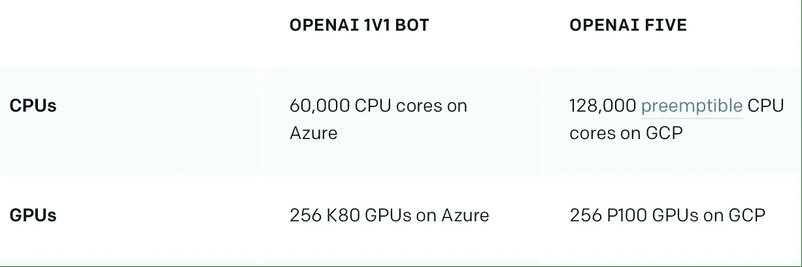
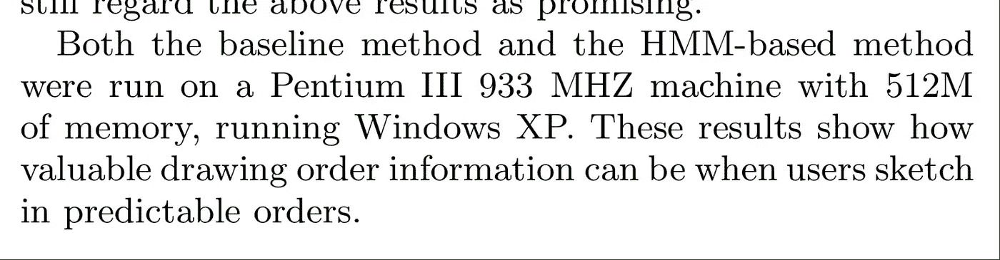

# "我能在你的电脑上训练我的模型吗？"

> 原文：<https://towardsdatascience.com/can-i-train-my-model-on-your-computer-f59329eacd0?source=collection_archive---------6----------------------->

(Photo by Hal Gatewood on Unsplash)

## 对强大计算能力的需求

电脑擅长一件事:速度快。它们的速度足以进行光速计算。足以在瞬间将信息发送到全球各地。然而，它仍然不够快。软件和硬件之间的持续竞争仍在继续。随着硬件速度越来越快，我们的要求也越来越高。如果速度不够快，我们会要求更多的处理器进行并行计算。获得更快的处理器使我们能够推进数据科学的前沿。由于硬件的进步和可用性，人工智能可以在复杂的视频游戏中击败人类([这里是](https://blog.openai.com/openai-five/))，合成音乐，让我们不要忘记在 youtube 视频中检测猫！

(Hardware used in OpenAI Five)

计算能力与人工智能的成功相关。你可以看到，在过去，机器学习的研究受到可用计算能力的限制。即使他们有大量的数据和我们今天使用的现代方法，他们也不能充分发挥他们的潜力。因此，机器学习和数据科学的应用和影响受到了限制。随着研究人员和从业者获得更多的计算能力，该领域随着先进的方法和有趣的应用而蓬勃发展。

(Hardware used in a study in 2006)

## 对极限的挫败感

如果你是机器学习或数据科学的从业者，你很有可能会遇到计算资源匮乏的烦恼。你等了多少次午夜来运行你的实验？你减少了多少次超参数搜索量，以便它能更快结束？这种限制对我来说是一个很大的挫折来源。就在这个月，我不得不放弃一个个人项目，因为它需要大量的资源。我要么为一个实验等待数周，要么在云服务上花费大量金钱。我还记得当我告诉经理该项目的每一次实验将花费 200 美元时，他的面部表情。我也多次看到有人，或者是他们中的一员，请求朋友或同事帮忙在他们不用的机器上运行一些实验。

## 睡眠装置

我被我在学术界时拥有的高性能集群宠坏了，在那里我可以并行运行数千个作业。但是当我离开的时候，我拥有的资源变得稀缺。当我在寻找更多的计算能力时，我意识到到处都有计算机，它们在相当长的时间里无所事事！我的同事每天下班后都会关掉电脑。我所有的设备，只是在晚上睡觉，什么也不做。我们所拥有的设备，每天在相当长的时间里只是“睡眠”而无所事事。

我们不断地浪费我们放在口袋和袋子里的资源。你的手机、电脑、智能电视和基本上任何有处理器的东西都是计算设备。他们会计算，这正是我们所需要的。问问你自己，在一天的循环中，你积极使用设备的时间有多长？最基本的例子就是夜间。每天晚上，我都会把手机连接起来充电，然后把它放在床头柜上，睡上几个小时，我也睡了。

使用“睡眠装置”的想法并不新鲜。欧洲核子研究中心有一个网络，人们可以捐赠他们的电脑给科学家使用。加密货币依赖于人们将其计算机连接到网络才能存活。尽管这个概念并不新颖，而且有一些可行的例子，但是问题还没有解决。当每个人都可以使用计算设备、电力和互联网，将他们的所有设备连接到计算网络，这是一件非常合乎逻辑的事情时，问题就解决了。

## 我们现在需要资源

我们作为数据科学家所需的资源现在已经有了。它们在人们的口袋里，在他们的床头柜上，在办公室上锁的柜子里。然而，我们无法访问它们。我们愿意为资源付费，但是资源是不可访问的。持有计算设备的大部分人并不知道它们的价值。他们可以将这些资源转化为金钱，但是缺少一个环节。

缺少的环节是在供应商和消费者之间。数据科学家希望消耗资源以换取金钱，我相信供应商希望通过在他们不使用设备时出租他们的设备来获得信用。我认为，当供应商和消费者之间的不平衡变得足够大，不可忽视时，双方之间的联系就会建立起来。在那之前，我会继续支付云服务费用，请求帮助使用下班后睡觉的电脑。